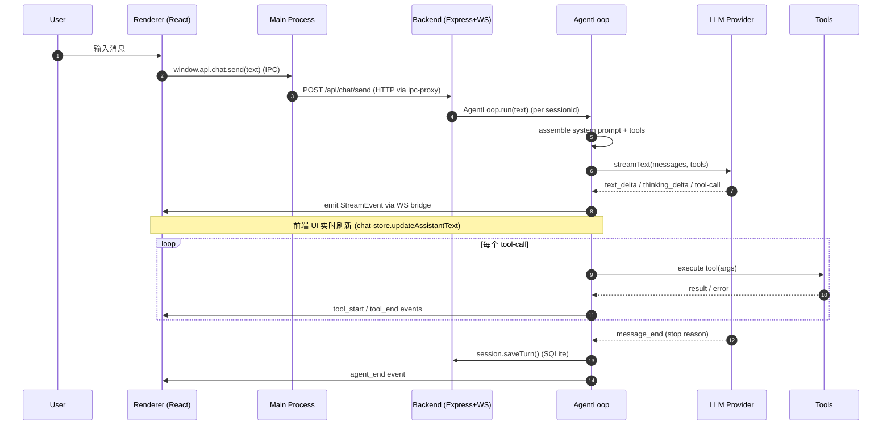
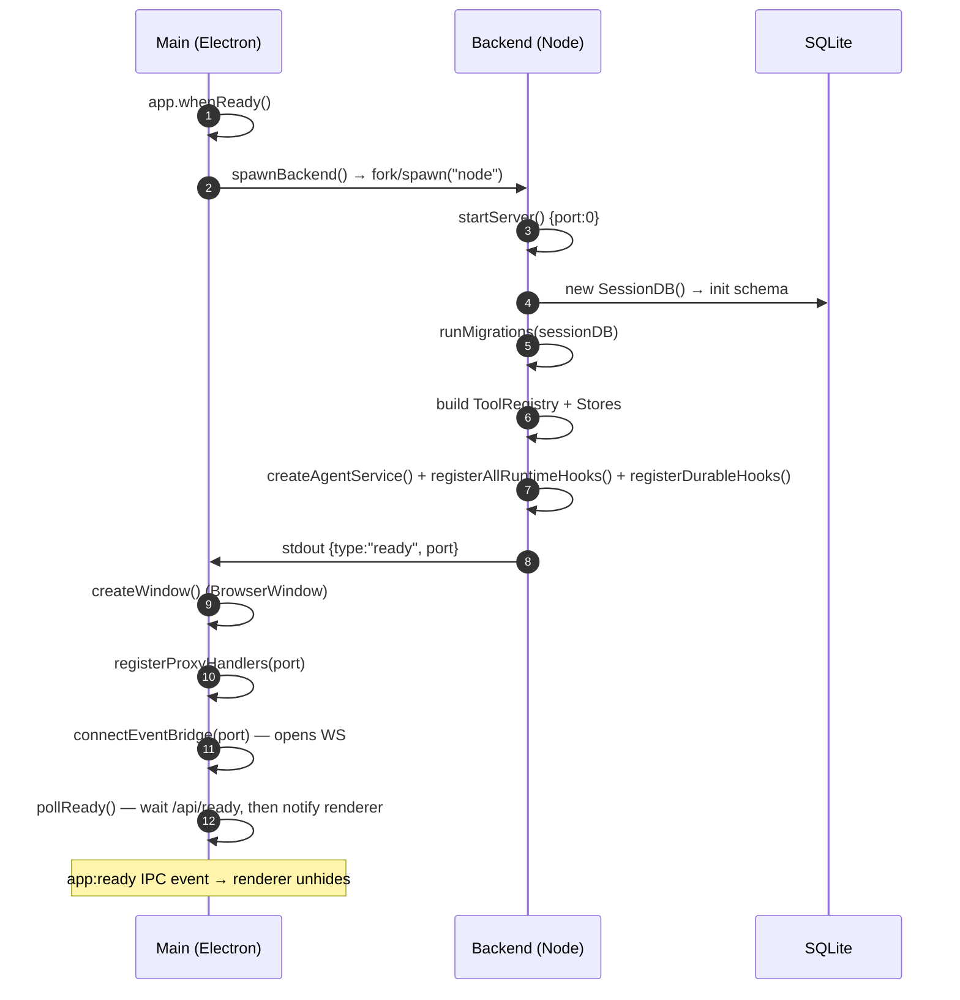

# 01 · 系统全景

> 本文从架构师视角，回答三个问题：系统由哪几个进程组成？进程之间如何对话？数据在系统里如何流动？

## 1. 一句话定义

Zero-Core 是一个 **本地优先的 AI Agent 运行时**，通过 Electron 桌面壳运行：主进程壳 + 子进程 HTTP/WS 后端 + Chromium 渲染进程。后端用 Vercel AI SDK 统一多 LLM Provider，使用 SQLite 持久化全部状态（消息、知识、MCP 配置、Agent 配置）。Agent 通过内置 21 个工具 + MCP 协议接入的外部工具 + Agent-as-a-Tool 委派工具完成任务。

## 2. 进程模型

```
┌─────────────────────────────────────────────────────────────────────────┐
│                          用户桌面 (Electron)                              │
│                                                                         │
│  ┌──────────────────┐   stdio(JSON)   ┌───────────────────────────────┐ │
│  │  Main Process    │────────────────▶│  Backend Process (Node.js)    │ │
│  │  (src/main/*)    │◀───── ready ────│  src/backend.ts → server/     │ │
│  │                  │                 │  Express + WebSocket          │ │
│  │  BrowserWindow   │                 │                               │ │
│  │  IPC 代理         │  HTTP + WS       │  SQLite (better-sqlite3)     │ │
│  │  Electron hooks  │────────────────▶│  ~/.zero-core/db.sqlite       │ │
│  │                  │                 │                               │ │
│  └──────────────────┘                 │  持久化:                      │ │
│          │                            │  - 会话 / 消息 / 轮次          │ │
│          │ contextBridge              │  - Agent / Provider / MCP     │ │
│          │ preload                   │  - KB chunks + embeddings     │ │
│          ▼                            │  - Memory graph + nodes       │ │
│  ┌──────────────────┐                 │  - KV store (settings)        │ │
│  │ Renderer Process │                 │                               │ │
│  │  (src/renderer/*)│                 └───────────────────────────────┘ │
│  │  React 19        │                          │                        │
│  │  Zustand         │                          │ spawn                  │
│  │                  │◀─────────────────────────┘                        │
│  └──────────────────┘   (WebView for MCP login, browser-render)         │
└─────────────────────────────────────────────────────────────────────────┘
```

证据：

- 主进程入口 `src/main/index.ts`（226 行）通过 `spawnBackend()` 启动后端子进程
- 后端入口 `src/backend.ts`（60 行）通过 stdin/stdout JSON 报告 `{type:"ready",port}`
- `src/main/backend-spawn.ts`（128 行）根据 `app.isPackaged` 决定 `fork()` 还是 `spawn("node")`
- 渲染进程入口 `src/renderer/main.tsx` → `App.tsx` → `AppLayout`

## 3. 进程间通信契约

### 3.1 主 ↔ 后端（Electron ↔ Node 子进程）

| 方向 | 通道 | 协议 |
|------|------|------|
| 后端 → 主 | stdout JSON line | `{type:"ready",port,pid}` |
| 后端 → 主 | stderr | 直接透传 |
| 主 → 后端 | stdin JSON line | `{type:"shutdown"}` |
| 主 → 后端 | 信号 | SIGTERM / SIGINT（兜底） |

`backend-spawn.ts` 内有 30 秒启动超时；启动后崩溃会自动递归重启。

### 3.2 主 ↔ 渲染（Electron IPC + contextBridge）

- `preload/index.ts` 通过 `contextBridge.exposeInMainWorld("api", api)` 暴露 `window.api`
- 类型契约见 `src/shared/preload-types.ts`（213 行）的 `WindowApi` 接口
- 通道声明见 `src/shared/ipc-api.ts`（175 行）的 `IPC_API` 表

### 3.3 主 IPC ↔ 后端 HTTP（**这是关键的桥**）

`src/main/ipc-proxy.ts`（262 行）维护一个 49 通道的映射表 `R`，将每个 IPC 调用翻译成对 `http://localhost:<port>/api/...` 的 HTTP 请求。**只有 `dialog:openDirectory` 与 `webfetch:login` 两个通道保留在主进程本地处理**（需要原生对话框 / BrowserWindow）。

WebSocket 反向：`src/main/ipc-proxy.ts` 的 `connectEventBridge()` 维护 `ws://localhost:<port>/ws`，订阅后端推送事件（`text_delta` / `tool_start` / `tool_end` / `session_init` / `lifecycle` 等），并转译为 Electron 的 IPC 事件发到渲染进程。

```
[Renderer]
   │  window.api.sendMessage(text)
   ▼
[Preload] ─── contextBridge ───▶ [Main IPC channel: chat:send]
   │
   ▼
[ipc-proxy.ts: registerProxyHandlers()] ─── fetch ───▶ [http://localhost:PORT/api/chat/send]
   │
   ▼
[server/chat-router.ts → agent-service.sendPrompt()]
   │
   ▼ (流式事件)
[ws://localhost:PORT/ws] ─── connectEventBridge ───▶ [Main IPC event: agent:event]
   │
   ▼
[Renderer: chat-store.handleEvent()]
```

## 4. 进程内架构分层

后端进程（`src/backend.ts` 启动后）内部按以下层次组织：

```
┌──────────────────────────────────────────────────────────────┐
│                  Transport / I/O                              │
│  src/server/*  ←  Express routers + WS server                │
│                ←  IPC-typed channel handlers                  │
├──────────────────────────────────────────────────────────────┤
│                  Service Layer                                │
│  AgentService      ←  multi-agent lifecycle                  │
│  SessionManager    ←  lifecycle state machine                │
│  MCPManager        ←  stdio/SSE MCP connections              │
│  Recovery          ←  startup scan incomplete turns          │
├──────────────────────────────────────────────────────────────┤
│                  Runtime / Domain                             │
│  src/runtime/agent-loop.ts   ←  streamText() driver          │
│  src/runtime/session.ts      ←  message array + pruning      │
│  src/runtime/provider-factory ←  AI SDK model instances      │
│  src/runtime/tools/*         ←  21 tools (file/shell/web/...)│
│  src/runtime/mcp-tools/*     ←  advanced tools               │
│  src/runtime/hooks/*         ←  turn / compression / RAG     │
├──────────────────────────────────────────────────────────────┤
│                  Core / Foundation                            │
│  src/core/config.ts          ←  TypeBox schema + loader      │
│  src/core/tool-registry.ts   ←  tool catalog                 │
│  src/core/hook-registry.ts   ←  30 event lifecycle hooks     │
│  src/core/logger.ts          ←  console + file dual sink     │
│  src/core/persona.ts         ←  role definitions             │
│  src/core/context-manager.ts ←  3 pruning strategies         │
│  src/core/input-handler.ts   ←  /command expansion           │
│  src/core/provider-adapter.ts ← per-provider quirks         │
│  src/core/model-registry.ts  ←  OpenRouter + local fallback  │
│  src/core/constants.ts       ←  shared magic numbers         │
├──────────────────────────────────────────────────────────────┤
│                  Persistence                                  │
│  better-sqlite3  →  server/sqlite-store.ts  (generic CRUD)   │
│                  →  server/session-db.ts   (sessions/messages│
│                                             /turns/tool exec)│
│                  →  server/key-value-store.ts                │
│                  →  server/kb-db.ts        (chunks+embeddings)│
│                  →  server/memory-node-store.ts              │
│                  →  server/memory-store.ts                   │
│  db-migration.ts (启动期迁移 + JSON→SQLite 导入)             │
└──────────────────────────────────────────────────────────────┘
```

**关键约束**：
- `core/` 不依赖 `server/` 或 `runtime/`（除 `test-seed.ts` 有 type-only import 用于测试种子数据）。
- `runtime/` 通过 `core/kv-store-interface.ts` 与 `runtime/session-store-interface.ts` 这两个**抽象接口**间接依赖 `server/` 的实现（实际运行时依赖包括 MemoryNodeStore 等具体 store 类型）。注入发生于 `agent-service.ts` 创建 `AgentLoop` 时。
- `server/` 是顶层入口，不被 `core/` 或 `runtime/` 反向依赖。

依赖图：

```
   shared/types.ts (零依赖)
        ▲
        │ types only
        │
   ┌────┴────────┐
   │             │
core/*      runtime/*  ── 抽象接口 ──▶ server/*  ── HTTP/WS ──▶ main/* ── IPC ──▶ renderer/*
   │             │                                              ▲
   └──────┬──────┘                                              │
          │                                                     │
       renderer/* (类型 import) ─────────────────────────────────┘
```

## 5. 关键数据流：一次完整对话



## 6. 技术栈速览

证据来自 `package.json`（77 行）。

| 层 | 选型 | 备注 |
|----|------|------|
| 壳 | Electron 41.6 | 主/渲染/preload 三进程 |
| 渲染 | React 19.2 + Vite 6.4 | TypeScript TSX |
| 状态 | Zustand 5.0 | 10 个 store 文件 |
| 构建 | electron-vite 5 + electron-builder 26 | Win/Mac 产物 |
| 后端 | Express + ws 8 | HTTP + WebSocket |
| 数据库 | better-sqlite3 12 | 同步驱动，避免回调地狱 |
| AI | Vercel AI SDK (`ai` 6) + `@ai-sdk/openai`/`anthropic`/`google` | streamText() 主入口 |
| MCP | `@modelcontextprotocol/sdk` 1.29 | stdio + SSE/SHTTP |
| Schema | TypeBox + Zod 4 | config schema / 工具入参 |
| Markdown | react-markdown 10 + Shiki 4 + Mermaid 11 | 渲染 + 高亮 + 图 |
| 网络 | undici 8 | ProxyAgent for 全局代理 |
| HTML | turndown 7 + jsdom 29 | fetch 工具的 HTML→Markdown |
| 测试 | vitest 4 + Playwright 1.60 | 85 unit + 8 e2e |

## 7. 启动序列



## 8. 多 Agent 并发模型

`src/server/agent-service.ts` 是核心调度器：

- `loops: Map<sessionId, AgentLoop>`：每个会话一个 Loop 实例
- `runStates: Map<sessionId, AgentRunState>`：运行时状态（busy / streamingText / toolCalls）
- `activeSessions: Map<agentId, sessionId>`：每个 Agent 当前激活的会话
- `concurrencyManager: ProviderConcurrencyManager`：每个 LLM Provider 独立的 FIFO 信号量（`concurrency-queue.ts`，104 行），默认上限 1-10

`AgentService.sendPrompt(text, agent?, sessionId?)` 支持多个并发 turn；不同 Agent 互不阻塞，但同一 Provider 内可串行化以防触发 LLM 服务端的限流。

## 9. 持久化数据全景

存储根目录：`~/.zero-core/`（可通过 `ZERO_CORE_DIR` 覆盖）。关键文件：

| 文件 | 来源 | 内容 |
|------|------|------|
| `db.sqlite` | SessionDB 持有 | sessions / messages / turns / turn_state / tool_executions / kv_store / memory_entities / memory_relations / memory_nodes / memory_subjects / memory_edges |
| `webfetch/` | fetch-tools.ts | 抓取缓存、二进制持久化、cookies.json |
| `logs/<date>.log` | file-log-sink.ts | 按天轮转日志 |
| `messages/<persona>.json` | message-store.ts | 旧版遗留，迁移完成后改名为 `.migrated.bak` |
| `workspace/` | 默认 workspace | 未指定工作区时使用 |

迁移策略：见 `src/server/db-migration.ts`（268 行）。列添加顺序敏感（必须先 `safeAddColumn` 再 `new SqliteStore`），JSON 文件 → SQLite 数据搬运在迁移函数末尾。

## 10. 单图总结

```
Electron Desktop
├─ Main (spawns)
│   ├─ BrowserWindow ── preload ──▶ Renderer (React + Zustand)
│   ├─ ipc-proxy ──────────────────▶ Backend HTTP/WS
│   └─ Native (dialog, login)
│
└─ Backend (Node, better-sqlite3)
    ├─ Express routers ── 14 个 createXxxRouter()
    ├─ WebSocketServer (/ws) ── stream events
    ├─ AgentService ──┬─ AgentLoop[] (per session)
    │                 ├─ SessionManager ── lifecycle state machine
    │                 ├─ MCPManager ── stdio + sse transports
    │                 └─ ProviderConcurrencyManager ── FIFO semaphores
    ├─ HookRegistry (singleton) ── 30 events
    │   ├─ turn-hooks: SQLite turn 持久化
    │   ├─ compression-hooks: L1 摘要 + L2 记忆节点
    │   ├─ memory-hooks: PreLLMCall 召回
    │   ├─ rag-hooks: KB 检索注入
    │   └─ durable-hooks: turn_state 检查点
    └─ SQLite (db.sqlite) ── 11 张业务表 + kv_store
```
