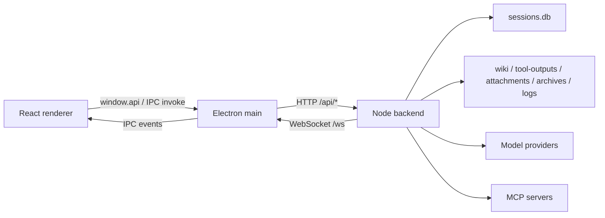
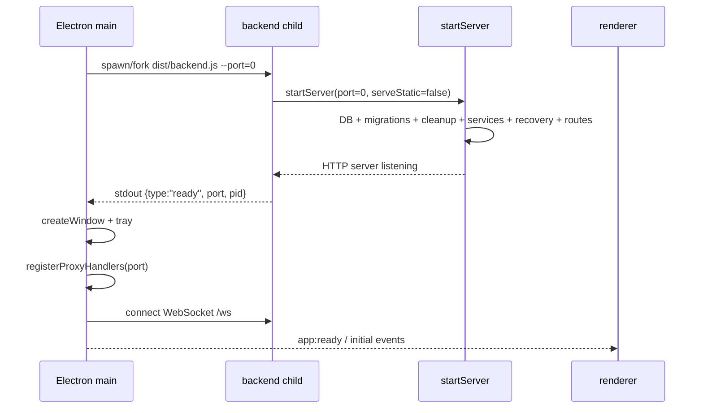
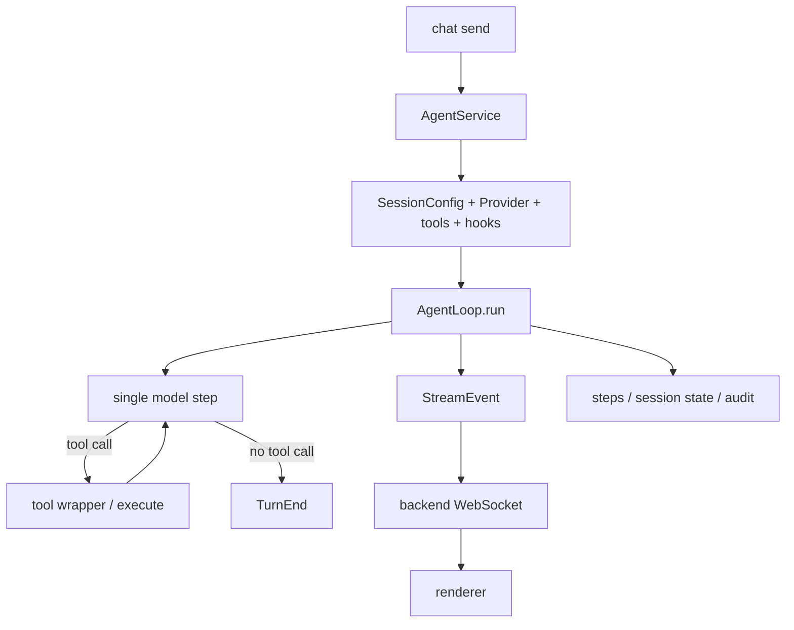

# 01 · 系统全景

> 当前架构基线，按 2026-07-16 的入口代码、运行时与测试核对。未来设计见 `docs/design/` 和 `docs/plan/`，不在本文冒充已实现行为。

## 1. 一句话定义

Zero-Core 是本地单用户 AI Agent 工作台。主要形态是 Electron 桌面应用：React renderer 不直接访问数据库或运行时，而是经 preload 和 Electron main 转发到独立 Node backend；backend 组合 Agent runtime、工具、工作流、MCP 和本地持久化。

## 2. 运行时拓扑



### 2.1 Electron main

`src/main/index.ts` 负责：

- Electron 生命周期、窗口、托盘和少量本地能力。
- 通过 `backend-spawn.ts` 启动、监控并关闭 backend。
- 通过 `ipc-proxy.ts` 把 renderer invoke 翻译为 HTTP。
- 把 backend WebSocket 事件转成 renderer IPC 事件。

main 不创建 SessionDB、AgentService 或领域 Store。窗口控制、目录选择、Web 登录窗口等必须依赖 Electron 的能力保留在 main；普通业务能力应落在 backend。

### 2.2 Node backend

`src/backend.ts` 是桌面模式入口，调用 `startServer({ port: 0, serveStatic: false })`。`src/server/index.ts` 是组合根，负责数据库、迁移、Store、Service、REST、WebSocket、恢复和启动 seed。

开发模式用系统 `node dist/backend.js --port=0`；打包模式用 Electron `fork()`。两者需要不同的 `better-sqlite3` ABI，这也是平台打包命令在 Electron ABI 与 Node ABI 之间重编译的原因。

### 2.3 Renderer 与 preload

`src/preload/index.ts` 通过 `contextBridge` 暴露 `WindowApi`。renderer 只消费 `window.api` 和共享类型，不应直接 import server/runtime 或 Node 数据库实现。

页面路由是 `page-store.ts` 的内存状态，不是 URL router。核心会话事件主要由 `AppLayout` 分发，但领域 store/页面也会订阅数据、任务、Wiki 和指标事件。

## 3. 启动顺序



关键顺序：

1. backend 必须先监听成功并通过 stdout JSON 行报告端口。
2. main 才创建窗口、注册代理和事件桥。
3. backend 30 秒未就绪时，启动失败。
4. backend 意外退出后，main 按指数退避重启；60 秒窗口内超过 5 次则停止并显示错误。
5. 应用退出时，main 先通过 stdin 请求 backend 优雅关闭，再以 SIGTERM/SIGKILL 兜底。

## 4. 请求通道

桌面业务请求走两跳：

```text
renderer store/component
  → preload ipcRenderer.invoke(channel, args)
  → main ipcMain.handle
  → fetch http://localhost:<port>/api/*
  → Express router → service/store
  → JSON/text 沿原路返回
```

`ipc-proxy.ts` 的映射表定义 HTTP method、path、path params、query 和 body。后端非 2xx 响应会在 main 中转换为 rejected IPC Promise；错误包含状态码和经过截断的响应信息。Renderer 调用方必须 `try/catch`，不能把失败当成功响应。

`app:ready` 是 main 直接请求 `/api/ready` 的健康轮询。必须依赖 Electron 的能力由 `registerLocalHandlers()` 处理，不经过 REST。

## 5. 实时事件通道

backend 把两类信息广播到 `/ws`：

- Agent/运行时事件：文本、思考、工具、usage、交互、任务、错误和结束事件。
- 数据/运行态变化：`data:changed` 以及 `runtime:*:changed` ping。

main 的事件桥进行最小分流：

- `data:changed` → renderer 的独立 `data:changed` IPC channel。
- 其他 WebSocket 消息 → `agent:event`。

WebSocket 断开后每 2 秒重连。首次连接不触发 resync；曾经连接成功后重连，会发送 `ws:reconnected`，renderer 应重新拉取当前可见集合，弥补断线期间错过的 best-effort 事件。

直接连接 backend WebSocket 的客户端还可以发送 `{type:"send"}` 和 `{type:"abort"}`。连接时若 AgentService 正忙，server 会返回 `reconnect` 快照。

## 6. Backend 组合与恢复

`startServer()` 的启动工作不只是挂路由。当前还包括：

- 创建 `SessionDB` 并运行迁移。
- 把崩溃前仍为 running/finishing 的 delegated task 标记为 interrupted。
- 恢复中断归档并清理 orphan delegated sessions。
- 清理旧 Memory 磁盘布局中的无归属目录。
- seed 默认 Agent、Wiki skeleton 和内置 Skill。
- 构造 Agent、Provider、MCP、Project、Requirement、Work、Cron、Wiki 等服务。
- 扫描未完成会话并让 AgentService 调度恢复。
- 恢复 requirement/cron 等工作流状态。

这些恢复路径是 best-effort：有些状态会自动继续，有些只会被标记为 interrupted/failed 等待人工决定。

## 7. 一次对话的数据流



AgentService 是会话与 loop 生命周期的 owner；AgentLoop 是 turn/step 的执行器；AgentSession 负责提供 LLM 视图；Hook 和 TurnRecorder 把 step、工具块、checkpoint 与指标落入持久化层。

## 8. 数据驻留

默认数据根是 `~/.zero-core`，可由 `ZERO_CORE_DIR` 覆盖。

| 位置 | 主要内容 |
| --- | --- |
| `sessions.db` | 会话、step、摘要/游标、Agent、Provider、工作流和审计等结构化状态 |
| `wiki/` | Wiki 文档镜像 |
| `tool-outputs/` | 超过阈值的工具完整结果 |
| `attachments/` | 会话附件 |
| `archives/` | 会话归档 JSON |
| `skills/` | zero-core 可写 Skill |
| `projects/` | 工作流 worktree |
| `logs/` | 运行日志 |

只备份 `sessions.db` 不足以恢复完整应用状态；应备份整个数据根，并在复制数据库前确保 backend 已优雅关闭或使用一致的 SQLite 备份方式。

## 9. 其他入口

| 入口 | 特性与限制 |
| --- | --- |
| `src/serve.ts` | 独立 HTTP/WS + 静态 renderer；默认端口 3210/`PORT`，当前没有 npm `serve` script |
| `src/cli.ts` | 终端 Agent；只初始化必要 Store，能力少于完整 server 组合根 |
| `src/index.ts` | 库导出 |

`startServer()` 当前未看到认证/授权中间件，并且调用 `server.listen(port)` 未显式限制 loopback。独立服务模式应只在可信本机/网络使用；随机端口不是安全边界。

## 10. 当前架构不变量

- Renderer 不直接访问 DB、文件系统或 Agent runtime。
- Electron main 不复制 backend 业务逻辑。
- 桌面 backend 端口由操作系统随机分配，通过父子进程握手传递。
- 非 2xx REST 响应必须在 renderer 表现为失败。
- WebSocket 是 best-effort 通知通道；重连后通过 pull 修复状态。
- 开发模式 Node 版本与 native ABI 是运行前置条件。
- 当前是本地单用户信任模型，不具备远程多租户安全边界。
