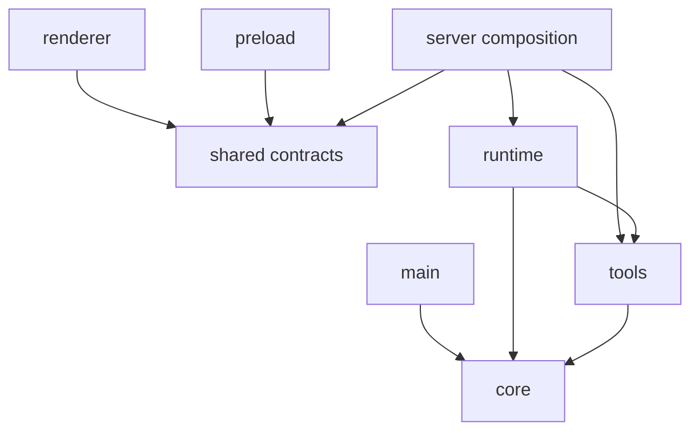
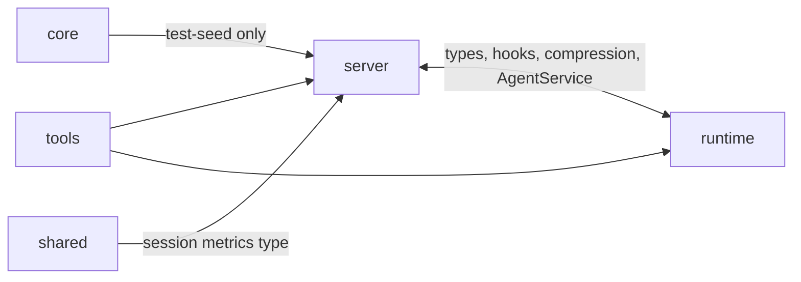

# 02 · 模块结构与真实边界

> 按 2026-07-16 的静态 import 图和组合入口核对。本章区分“职责划分”和“实际依赖”；两者并不完全一致。

## 1. 顶层模块

| 模块 | 主要职责 | 典型 owner |
| --- | --- | --- |
| `src/core/` | 配置、提示词、Hook/工具注册表、日志、模型常量 | 跨运行时核心契约 |
| `src/main/` | Electron 生命周期、窗口、backend 生命周期、IPC bridge | Electron main process |
| `src/preload/` | `window.api` 安全暴露 | preload isolated world |
| `src/renderer/` | React UI、Zustand、领域页面 | renderer process |
| `src/runtime/` | AgentLoop、Session、step、并发、委派、运行时 Hook | 每个 Agent loop |
| `src/server/` | Express/WS、数据库、Store、Service、迁移、恢复 | backend process |
| `src/shared/` | IPC/preload 类型和跨进程 DTO | main/preload/renderer/server |
| `src/tools/` | 内置工具、工具工厂、CallerCtx、MCP 工具适配、Outline | Agent/UI tool hosts |

根入口：`backend.ts`、`serve.ts`、`cli.ts` 和 `index.ts`。

## 2. 概念依赖图

理想化职责可画成：

但当前物理 import 图不是严格单向层次。最重要的事实是：

因此不要把 `runtime` 描述成完全独立于 server 的纯库，也不要把 `tools` 描述成无依赖的纯函数层。

## 3. 真实跨层依赖

### 3.1 `runtime ↔ server`

Server 合理地依赖 runtime 来构造 AgentLoop、Provider 和运行时类型；反方向也存在：

- `agent-loop.ts` 直接引用压缩核心、SessionDB/Wiki 类型。
- runtime Hook 入口直接注册 server 的 durable、tool-execution 和 metrics Hook。
- input queue、compression trigger 和 Wiki anchor 路径直接引用 server 实现。

这形成真实的双向耦合。`ISessionStore` 已抽出一部分持久化契约，但尚未完全切断依赖。

### 3.2 `tools → runtime/server`

工具执行函数统一接收 `CallerCtx`，但不少工具仍直接读取 server 单例或类型：

- Project、Work、AgentRegistry、Cron 依赖 ManagementService。
- Wiki 依赖 WikiStore 和 anchor 解析。
- Platform 读取 AgentService。
- Skill 虚拟路径依赖 server scanner/router。
- 工具工厂依赖 runtime rate limiter 与旧 `ToolExecutionContext`。

所以 `src/tools/` 当前是“共享执行层”，不是严格的叶子模块。

### 3.3 `core/shared` 例外

- `core/test-seed.ts` 为测试 seed 直接依赖多个 server Store；这是测试基础设施例外。
- `core/hook-types.ts` 引用 runtime `TurnSource`。
- `shared/ipc-api.ts` 引用 server 的 session metrics 类型。
- renderer 的 ProviderEditor 直接复用 core constants。

这些引用不会立即破坏运行，但说明 core/shared 的“纯底层”边界还不完全成立。

## 4. 关键组合根与所有权

### 4.1 `server/index.ts`

Backend 的 composition root，拥有：

- SQLite 连接与迁移时序。
- ToolRegistry、MCPManager、AgentService。
- 领域 Store/Service/Router 的构造和互相注入。
- 恢复、seed、实时广播和 HTTP/WS 生命周期。

新增 server 级单例或跨领域依赖时，应在这里显式接线，而不是在任意模块 import 时自动构造。

### 4.2 `AgentService`

拥有每个主 session 的 loop map、运行状态和配置热更新。它把 server Store/Service 转成 `SessionConfig` 闭包或 capability handles，再构造 AgentLoop。

AgentService 还负责 SessionStart/SessionClose 生命周期、Provider/MCP 接线、恢复调度和 StreamEvent 向 WebSocket 层转发。

### 4.3 `AgentLoop`

每个 loop 拥有：

- `AgentSession`
- per-loop `HookRegistry`
- `SubagentDelegator` 与 `TaskRegistry`
- `TurnRecorder`
- `ToolRateLimiter`
- prompt assembler、abort/wait/busy 状态

这些状态不能跨 session 共享。委派的子 loop 由 SubagentDelegator 创建，并注册 delegated 专用 Hook。

### 4.4 工具层

- `ALL_TOOLS`：可执行内置工具定义的权威注册表。
- `ToolRegistry`：UI/配置/发现使用的描述符注册表，也接收动态 MCP 工具描述。
- `buildToolsSet()`：依据当前 Agent policy 构造一次 turn 使用的 AI SDK tool map。
- `CallerCtx`：host 注入身份、scope 和 per-session 访问器。

四者职责不同，不能把 ToolRegistry 当作 AgentLoop 实际执行 map。

## 5. 稳定契约

### 5.1 IPC 契约

`src/shared/ipc-api.ts` 和 `src/shared/preload-types.ts` 描述 channel 参数/结果；`src/preload/index.ts` 是实际暴露；`src/main/ipc-proxy.ts` 和 server router 是执行端。

修改 IPC 需要同时核对这四面和契约测试。类型声明存在不代表 main/backend 已接线。

### 5.2 Session 契约

`ISessionStore` 是 runtime 面向持久化的主要接口，覆盖 step、summary/cursor、session 和 delegated task。部分 server 特有能力仍通过具体 SessionDB 或 SessionConfig 注入，说明抽象尚未完全收敛。

### 5.3 工具契约

`ToolResult` 是工具原始结构化返回；`format()` 把它转换成 LLM 文本；`CallerCtx` 描述调用者。Agent host、UI dispatcher 和 MCP adapter 对结果面的需求不同，不能共用同一层包装逻辑。

### 5.4 Hook 契约

每个 AgentLoop 有自己的 HookRegistry；handler 结果按字段合并，数组拼接、标量后写覆盖，`blocked:true` 立即短路。全局 `triggerHooks()` singleton 仍保留给未迁移的 observability/tool wrapper 路径，形成双 Hook surface。

## 6. 修改路径指南

| 变更 | 首要修改点 | 必须联查 |
| --- | --- | --- |
| 新内置工具 | `src/tools/<tool>.ts`, `src/tools/index.ts` | tool policy、CallerCtx、UI dispatcher、测试 |
| 新 runtime Hook | `src/runtime/hooks/` | `registerHooksForLoop()`、main/delegated 差异、Hook 类型 |
| 新 Store/schema | `src/server/*-store.ts` | migrations、composition root、router、recovery |
| 新 REST/IPC | server router | server mount、ipc-proxy、preload、shared contract、renderer |
| 新 renderer 页面 | components/domain | page-store、sidebar、AppLayout、实时订阅清理 |
| 新 SessionConfig 能力 | AgentService build config | hot update、delegated inheritance、CallerCtx |

## 7. 当前边界债务

1. `runtime ↔ server` 双向 import 使独立测试、库复用和拆包更困难。
2. `tools` 同时承担纯工具、host adapter 和 server singleton consumer，边界较宽。
3. per-loop Hook 与全局 Hook 并存，工具生命周期可能经过两套触发面。
4. AgentService 复制了一份 `buildToolsSet()` 的 tool-enabled 判定，用于 capability 注入；两处必须人工保持一致。
5. shared/core 仍有向上层依赖的少数例外。
6. `server/index.ts` 与 AgentService 是高扇入组合点，新增能力容易继续扩大文件体积。

这些是当前事实，不应通过文档美化成已经解决的分层架构。

## 8. 边界守则

- 不在 renderer 引入 Node/server/runtime 实现。
- 不在 main 创建业务 Store。
- 不通过模块顶层副作用偷偷构造新的 app 单例。
- 新工具优先依赖 CallerCtx/窄接口；若必须依赖 server 单例，要明确记录。
- 新 runtime 持久化能力优先扩展窄接口或 SessionConfig 闭包，避免新增 runtime→server 具体类依赖。
- 不用目录名推断依赖安全；提交前检查真实 import 图和测试。
