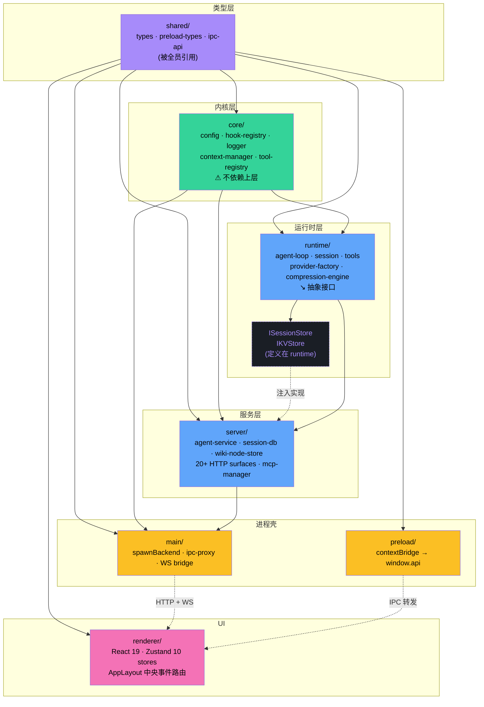
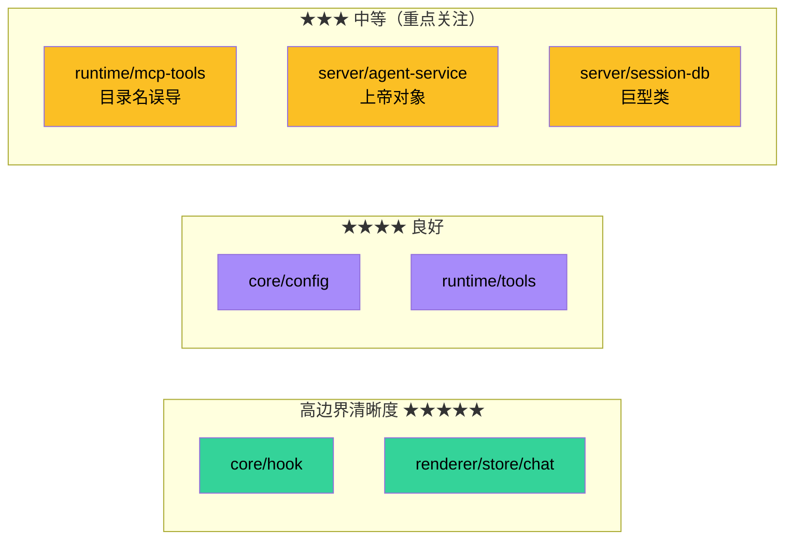

# 02 · 模块结构与边界

> 本文逐一描述 `src/` 每个一级目录的职责、依赖方向、与外界的契约。**架构师关心的是边界，不是每个内部函数的细节**。

## 1. 一级目录地图

```
src/
├── backend.ts              # 后端子进程入口
├── cli.ts                  # CLI 入口 (zero-core 命令)
├── serve.ts                # HTTP 服务入口 (zero-core serve 命令)
├── index.ts                # Library 公共 API (供外部 import)
│
├── core/                   # 基础设施 (零依赖 server/runtime)
├── runtime/                # Agent 执行引擎 + 工具 + Hooks
├── server/                 # Express 服务 + Stores + 业务管理器
├── shared/                 # 跨进程共享类型
│
├── main/                   # Electron 主进程
├── preload/                # Electron 预加载脚本
└── renderer/               # Electron 渲染进程 (React)
```

每个子目录都有明确的"职责 + 输入 + 输出 + 依赖"声明（每文件顶部的中文注释块）。这是项目**自带的统一约定**，我们尊重并沿用。

## 2. 核心层 `src/core/`

| 文件 | 行 | 职责 |
|------|----|------|
| config.ts | 324 | TypeBox schema、加载顺序（KV → 项目文件 → overrides → DEFAULT）、全局配置路径 |
| constants.ts | 53 | 进程缓冲、输出截断、Ollama/SearXNG/OpenAI 默认 URL、DEV_SERVER_URL |
| context-manager.ts | 295 | token 估算 + 三种修剪策略（tail / turn-boundary / smart） |
| system-prompt.ts | 78 | 拼接 deviceContext + base + tool snippets + skills |
| tool-policy.ts | 142 | evaluateToolCall / requiresApproval / transformToolResult |
| tool-registry.ts | 212 | 工具目录：register / unregister / getAll / 配置持久化 |
| hook-registry.ts | 96 | 单例 Hook 注册表，**last-writer-wins merge** + `blocked` 短路（详见 [03-runtime-engine §Hook 系统](./03-runtime-engine.md#hook-系统)）|
| hook-types.ts | 143 | 30 个 HookEventName + 每事件的 context 类型 |
| logger.ts | 121 | 双 sink：console + file（按日期轮转）；DEBUG=1 开启 debug |
| file-log-sink.ts | 133 | 日志文件输出与保留策略 |
| kv-store-interface.ts | 35 | **抽象接口**（get/set/getJson/setJson/delete/list） |
| model-registry.ts | 215 | OpenRouter + 本地 KNOWN_MODELS 正则回填 |
| input-handler.ts | 54 | `/command` 自定义命令扩展 |
| provider-adapter.ts | 47 | 按 Provider 名查兼容项（systemPromptAppend 等） |
| persona.ts | 192 | CommunicationStyle + 6 个 PERSONA_TEMPLATES + buildPersonaPrompt |
| project-context.ts | n/a | 项目级上下文注入 (mini-plan) |
| device-context.ts | n/a | 设备环境信息（OS / shell / 时间） |
| default-prompt.ts | n/a | Agent 默认 system prompt 模板 |
| test-seed.ts | 187 | 测试种子（`ZERO_CORE_TEST_FIXTURE` gated,见 §2.1） |
| custom-tools.ts | n/a | 自定义工具模板 |

### 2.1 边界约束

- **理想边界**:不依赖 `server/`、`runtime/`(它们依赖 `core/`,反向依赖会形成环)。
- **实际例外** —— `test-seed.ts` 是这条边界的**两处轻微泄漏**,但是测试辅助代码:
  - **类型层**:import type 多个 `../server/*-store.js`(`SessionDB`/`AgentStore`/`ProviderStore`/`WikiStore`/`ProjectStore`),编译时擦除,**不产生运行时依赖边**。
  - **值层**:从 `../server/fresh-db-seed.js` 导入 `ensureWikiSkeleton`(值导入)。这是真正的运行时边,但因为 `test-seed.ts` 全文由 `ZERO_CORE_TEST_FIXTURE` 环境变量门控(生产代码路径永不进),且仅在 backend 子进程内执行,所以这条边在**生产拓扑上不可达**。架构上把它视作"测试夹具自带的旁路",而非 `core/` 对 `server/` 的真实依赖。
  - 为什么不挪到 `tests/`:`test-seed.ts` 必须在 backend 子进程内(用 system Node.js / packaged Electron fork 加载 better-sqlite3,确保 ABI 一致),放进 `tests/` 会让测试夹具难以复用 backend 启动路径。
- **依赖** `typebox`、`node:fs`、`node:path`、`./kv-store-interface`(类型 only)、`./hook-types`、`./config`、`./logger`。
- 导出形式：纯函数（`buildSystemPrompt`、`evaluateToolCall`、`shouldPrune`）+ 类（`ToolRegistry`、`HookRegistry`）+ 接口（`IKVStore`）。

### 2.2 反模式警告

`config.ts` 同时承担了三件事：
1. schema 定义（应只在 schema 层）
2. 默认值常量（应抽到 `constants.ts`）
3. 加载逻辑（应是 `loader.ts`）

这是个**轻度耦合**，详见 09 ADR-009。

## 3. 运行时层 `src/runtime/`

| 文件 | 行 | 职责 |
|------|----|------|
| types.ts | 351 | **核心事件 + 会话 + 任务类型**（被全栈引用） |
| agent-loop.ts | 约 700 | 单会话执行循环：`run()` / `resume()` / `executeStream()` / retry / abort |
| session.ts | 391 | `AgentSession`：消息数组、token 估算、pruning、turn 重建 |
| provider-factory.ts | 165 | 按 `RuntimeProviderConfig` 解析 `LanguageModel`，含缓存 |
| provider-concurrency-manager.ts | 78 | 每个 Provider 一个 FIFO 信号量 |
| concurrency-queue.ts | 104 | AbortSignal-aware semaphore |
| session-store-interface.ts | 60 | **抽象接口**（runtime 看不到 SQLite） |
| agent-utils.ts | 107 | 错误分类（8 类）、MAX_RETRIES=3、` unanimouss` 标签解析 |
| system-prompt.ts (proxy) | n/a | 运行时对 core/system-prompt 的再导出 |
| checkpoint-manager.ts | 121 | 检查点（**实际功能已被 hook 替代，但类仍存在**） |
| turn-recorder.ts | 171 | 流式 block 收集 → turn JSON |
| pending-responses.ts | n/a | AskUser 工具的 Promise 双向通道 |
| compression-engine.ts | 309 | L1 摘要 + L2 记忆节点提取 |
| memory-recall.ts | 64 | FTS5 召回，注入 PreLLMCall context |
| terminal-adapter.ts | 232 | CLI 模式 ANSI 渲染 |
| mock-language-model.ts | n/a | 测试用 mock |
| tool-rate-limiter.ts | 122 | 每工具并发 + 最小间隔门控 |
| task-registry.ts | 186 | 异步任务表（agent / bash background）|
| subagent-delegator.ts | 413 | **当前**子 Agent 委派调度器(`SubagentDelegator` 类,`delegateTask`/`delegateTaskBackground`/`getTaskResult`/`listTasks`/`stopTask`/`suspendUntilWake`/`runBackground`)。被 `agent-loop.ts` 在构造期实例化(见 [03 §3.1](./03-runtime-engine.md#31-构造lines-77-118)),`delegateTask` 暴露给 `Agent` action 工具([04-tools-subsystem §5.1](./04-tools-subsystem.md))。v0.8 关键修复:子 Agent `sessionId=undefined` 实现隔离(详见 §subagent 隔离 与 [03](./03-runtime-engine.md#委派模型v08-重构))。 |
| subagent-delegation.ts | 329 | **死代码** —— `createSubagentDelegation()` 工厂(`SubagentDelegationConfig` → 7 个闭包函数)。v0.8 委派重构前的旧 API,**全仓零 importer**(已 grep 确认,仅在 `encoding.ts`/`session-context-router.ts` 的中文注释里作为历史术语被提及)。保留作历史参考,**✅ 删除候选**;真正落地的是 `subagent-delegator.ts`(类形式,状态显式持在实例而非闭包)。 |
| proxy-manager.ts | 59 | undici ProxyAgent 全局 dispatcher |

### 3.1 工具与 MCP 子目录

```
runtime/
├── tools/                  # 9 个 built-in 工具
│   ├── bash.ts (311)       # Shell（含 Git Bash 检测、cmd.exe 翻译）
│   ├── file-read.ts (192)  # Read（多格式：text / image / PDF / ipynb / outline）
│   ├── file-write.ts (120) # Write（含 syntax check）
│   ├── file-edit.ts (135)  # Edit（精确匹配 + 错误诊断）
│   ├── grep.ts             # 文件内容搜索
│   ├── glob.ts             # 文件路径匹配
│   ├── agent.ts (90)       # Agent 委派（阻塞 / 非阻塞）
│   ├── task-list.ts (107)  # 列出后台任务
│   ├── task-status.ts      # 查询单个任务
│   ├── task-stop.ts        # 终止任务
│   ├── wait.ts (59)        # 事件驱动唤醒
│   ├── ask-user.ts (80)    # AskUser（pendingResponses 桥）
│   ├── todo-write.ts (75)  # TodoWrite
│   ├── web-search.ts (364) # 4 个搜索后端
│   ├── tool-factory.ts (275) # buildTool 工厂 + 元数据反射
│   ├── mcp-tool.ts (127)   # MCP tool → AI SDK tool 适配
│   ├── index.ts (239)      # ALL_TOOLS + buildToolsSet + registerRuntimeTools
│   ├── outline/            # 文件大纲提取子模块
│   ├── syntax-check.ts     # JS/TS/Python syntax 校验
│   └── file-read-helpers.ts
│
└── mcp-tools/              # 高级工具（虽然叫 "mcp-tools"，但都是 built-in）
    ├── fetch-tools.ts (654) # WebFetch + Cookie jar + 持久化 + 浏览器渲染
    ├── memory-tools.ts          # ❌ 已删（v0.8 清理僵尸 MemoryStore：memoryReadTool/memoryWriteTool + 类）
    ├── memory-node-tools.ts (140) # 新版 Wiki 风格 memory 工具
    ├── sequential-thinking-tools.ts (76) # 思维链
    ├── assistant-tools.ts (220) # 应用诊断（info / logs / config / source）
    ├── browser-render.ts (66) # SPA 渲染（Electron BrowserWindow）
    └── cookie-jar.ts       # cookie 持久化
```

### 3.2 hooks 子目录

```
runtime/hooks/
├── index.ts (60)                  # registerAllRuntimeHooks(db, extractionDeps?) —— 注册顺序敏感
├── turn-hooks.ts (183)            # SessionStart / PostStep / Stop / StopFailure → turns 表步骤级持久化
├── notification-hooks.ts (68)     # PreLLMCall: 已完成后台任务结果回灌为 user 消息 + 触发 Notification
├── rag-hooks.ts (49)              # PreLLMCall: config.getRagContext() 注入 ragContext
├── provider-options-hooks.ts (40) # PreLLMCall: 按 thinkingLevel 注入 providerOptions
├── compression-hooks.ts (259)     # PostTurnComplete: contextUsage 超阈值时渐进压缩
├── todo-cleanup-hooks.ts (43)     # PostTurnComplete: 清理已完成 todo(UI 自动隐藏)
└── extraction-hooks.ts (297)      # PostTurnComplete(M5): 增量内容/工具遥测抽取 + flush
```

> **v0.8 变更**：`memory-hooks.ts` 已删除(memory 合并进 wiki per-agent 子树,召回改由 wiki-anchor-injection 注入)。注册顺序固定为 `turn → notification → rag → providerOptions → compression → todoCleanup → extraction`,调整顺序前需评估 PreLLMCall 之间对返回值 merge 的影响(`memoryContext` / `ragContext` / `providerOptions` 都是 last-writer-wins)。

### 3.3 边界约束

- `runtime/` 原本通过 `ISessionStore` 与 `IKVStore` **接口**间接依赖 `server/` 的实现；当前 Wiki / Memory / Management / Orchestrate 相关代码已出现直接 `server/` 类型或常量 import，边界正在变薄。
- **不直接** `import better-sqlite3`。
- 通过 `runtime/types.ts` 暴露给渲染进程的 `StreamEvent` 等，是 IPC 契约的事实源头。

### 3.4 反模式警告

`runtime/mcp-tools/` 这个目录名是**误导性的**。里面 6 个文件都不是真正的 MCP 客户端工具，而是 built-in 工具的高级实现（WebFetch、Memory、SequentialThinking、Assistant）。它们与 `runtime/tools/` 的区别仅仅是"需要更复杂的上下文（DB 句柄 / Electron BrowserWindow / Cookie jar）"。建议改名为 `runtime/advanced-tools/`。详见 ADR-011。

## 4. 服务层 `src/server/`

服务层是后端进程的"业务核心"。截至 2026-06-21，最重的文件已经不只两个：

| 文件 | 当前规模 | 角色 |
|------|----------|------|
| wiki-node-store.ts | 约 1,700 行 | 全局 Wiki / Memory tree 的核心 store，包含节点、主体、边、FTS、磁盘文档索引、v0.8 磁盘镜像树布局（`diskPathFor`/`leaf↔folder promote`/`migrateWikiDiskLayout`）等 |
| agent-service.ts | 约 1,200 行 | 多 Agent 生命周期 + 会话循环管理 + provider/runtime 编排 |
| db-migration.ts | 约 1,060 行 | SQLite schema 演进、历史数据清理和兼容迁移（v0.8 后 5 阶段：列补齐 → 9 张工作流域表 DDL → SqliteStore 构造 → JSON→SQLite → KV+Memory，详见 [05 §4.2](./05-persistence.md#42-迁移机制)） |
| index.ts | 约 900 行 | 后端组合根：初始化 DB、hooks、**手动编排 12+ store**（见 §4.1.1）、services、routers、cron、archivist |
| session-db.ts | 约 960 行 | SQLite 连接生命周期 + **会话核心 5 表 + 4 个聚合 store**（2 eager 内核 + 2 v0.8 M5 lazy；MemoryStore 已删除，原 3 eager 内核降为 2）的门面，详见 [05 §4.0.2](./05-persistence.md#402-sessiondb-直接聚合-store) |
| session-manager.ts | 约 350 行 | 会话生命周期状态机 + 指标聚合 + TTL 清理 |
| session-lifecycle.ts | 约 45 行 | 状态枚举 + VALID_TRANSITIONS |
| session-router.ts | 约 120 行 | 会话 CRUD REST API |

> **v0.8 关键更正**：早期文档把 `session-db.ts` 描述成"所有 store 的聚合门面"——**已不准确**。v0.8 后 SessionDB 只聚合 2 个 eager 内核 store（`KeyValueStore`/`MemoryNodeStore`；原 3 个里的 `MemoryStore` 已作为僵尸清理删除）+ 2 个 M5 lazy store（`ExtractionCursorStore`/`TelemetryStore`），共 4 个；而 9 个工作流域 store（`ProjectStore`/`RequirementStore`/`CronStore`/`WikiScanCursorStore`/`TaskStepStore`/`ProjectJobStore`/`CronRunStore`/...）在 `index.ts:151-171` **独立 new**，只把 SessionDB 当 `getDb()` 提供者。详见 [05 §4.0.3](./05-persistence.md#403-关键边界sessiondb-不是聚合根) 与下方 §4.1.1。

**架构判断**：服务层的复杂度正在向**组合根（store 编排）**、Agent 编排、Wiki/Memory 持久化、迁移脚本四个热点集中。后续拆分不应只盯 `AgentService`，也要把 `WikiStore`、`db-migration` 以及 `index.ts` 内 12+ store 的手动编排（应引入 store registry）纳入计划。

### 4.1 Stores

v0.8 后共 **~25 个 store 类、分布在 20 个文件**（不含 `sqlite-store.ts` 抽象基类 / `key-value-store.ts` KV 接口实现 / `message-store.ts` 已废文件存储；v0.8 清理僵尸 MemoryStore 后从 ~26/21 下调）。按归属方式分四类（A/B/C/D）：

> **切分视角说明**：这里的 A/B/C/D 是按**归属方式**（是否挂 SessionDB + v0.8 阶段）切的；[`file-structure.md`](../basic/file-structure.md) 的 server 章节（§"数据存储"）则按**业务域**切（会话核心 / 旧业务实体 / 工作流域，再分路由层 + 服务编排）。两种切分是**正交**的，不强行统一：本节关心"谁持有 store 引用、store 怎么被 new 出来"，`file-structure.md` 关心"store 属于哪个业务域、跟哪些 router/service 配套"。同一 store 在两种视角下归类可能不同（例如 `wiki-node-store.ts` 在本节属 C 类工作流域，但在域视角下跨"会话核心回退 + Wiki 镜像"两个域），这是预期的。

**A. SessionDB 直接聚合 store**（4 个，`session-db.ts:69-105` 持有引用 + getter；原 5 个中的 `MemoryStore` 已作僵尸清理删除）—— 详见 [05 §4.0.2](./05-persistence.md#402-sessiondb-直接聚合-store)：

| Store | 行 | eager/lazy | 表 |
|-------|----|-----------|-----|
| `key-value-store.ts` KeyValueStore | — | eager | kv(key/value) |
| `memory-node-store.ts` MemoryNodeStore | 324 | eager | memory_nodes / memory_subjects / memory_edges + FTS5 |
| `extraction-cursor-store.ts` ExtractionCursorStore | 77 | **lazy**（M5）| extraction_cursors |
| `telemetry-store.ts` TelemetryStore | 97 | **lazy**（M5）| tool_telemetry |

> **删除记录**：原 `memory-store.ts` MemoryStore（266 行，持有 `memory_entities` / `memory_relations` 表）因运行时零写入者、唯一消费者 `memory-tools.ts` 早已取消注册，已于 v0.8 清理僵尸时删除，对应两表由 db-migration DROP。活的兄弟是 `memory-node-store.ts` MemoryNodeStore（仍在 compression 回退路径 + `/api/memory-nodes` REST 被调用），**不要混淆**。

> **lazy 的设计动机**：不碰 M5 抽取路径的代码不付初始化成本；两表也故意**不进** `db-migration.ts` 的 `*_COLUMNS` 数组（独立 DDL，见 [05 §4.0.2](./05-persistence.md#402-sessiondb-直接聚合-store)）。

**B. 旧业务实体 store**（在 `index.ts:151-156` 独立 new，构造时传 SessionDB 当 `getDb()`）：

| Store | 行 | 表 |
|-------|----|----|
| `agent-store.ts` AgentStore | 114 | agents |
| `provider-store.ts` ProviderStore | 186 | providers（含 SYSTEM_PROVIDERS 模板） |
| `template-store.ts` TemplateStore | — | templates（v0.8 模板/角色分离:能力模板画廊,16 条 = 12 通用 + 4 领域专家;工作流角色在 `builtin-role-templates.ts` 独立,不进画廊） |
| `mcp-store.ts` McpStore | — | mcp_servers |
| `kb-store.ts` KbStore | — | kb_entries |
| `persona-store.ts` PersonaStore | — | personas（与 agents 共表） |

**C. v0.8 工作流域 store**（9 个，`index.ts:159-171` 独立 new，**不挂 SessionDB**）—— 详见 [05 §2.2b](./05-persistence.md#22b-v08-多-agent-工作流域表)：

| Store | 行 | 阶段 | 表 |
|-------|----|------|----|
| `project-store.ts` ProjectStore | 78 | M0 | projects |
| `requirement-store.ts` RequirementStore | 85 | M0 | requirements / requirement_history / requirement_messages |
| `requirement-doc-store.ts` RequirementDocStore | — | M0 | requirement_docs |
| `wiki-node-store.ts` WikiStore | 1698 | M0/M2 | project_wiki（详见 [06 §2.5](./06-knowledge-subsystems.md#25-wiki-体的磁盘镜像树布局v08-p1-§101)）|
| `project-wiki-store.ts` ProjectWikiStore | — | M2 | project_wiki 的 legacy 视图（委托给 WikiStore）|
| `wiki-scan-cursor-store.ts` WikiScanCursorStore | 62 | M2 | wiki_scan_cursors |
| `task-step-store.ts` TaskStepStore | 58 | M0 | task_steps |
| `cron-store.ts` CronStore + CronRunStore | 176 | M1 | crons / cron_runs |
| `orchestrate-store.ts` OrchestratePlanStore + OrchestrateManifestStore + ConfirmRegistry | 79 | M3 | orchestrate_plans / orchestrate_manifests |
| `project-job-store.ts` ProjectJobStore | 47 | M2 | project_jobs |
| `tool-usage-store.ts` ToolConfigStore + ToolUsageStore | 129 | P0/P3 | tool_configs（**手写 SQL**，PK=tool_name 非 surrogate id，未用 SqliteStore）/ tool_usage |

> **同名陷阱**：文件名 `tool-usage-store.ts` 内含 **两个** store（`ToolConfigStore` 写 `tool_configs` 表 / `ToolUsageStore` 写 `tool_usage` 表），且 `ToolConfigStore` 走手写 SQL 而非 `SqliteStore<T>`，是唯一一个不基于 `SqliteStore` 的可写 store。

**D. 已废 / 特殊**：
- `message-store.ts`（97）— 文件存储（旧，已被 SQLite 替代，仅遗留代码路径）
- `wiki-node-store.ts` 既是 v0.8 工作流域（C 类），也是全局 memory tree 的实现（跨域 store）

它们大多基于 `sqlite-store.ts`（393）的通用 CRUD。SqliteStore 的三个写原语(`insertRow`/`updateRow`/`delete`)是**唯一写出口**,也是 `data-change-hub.ts` 的唯一 emit 点 —— 所有 store 的写都由此被 renderer 自动感知(UI 同步,见 ADR-021),无需逐 store 加通知。**例外**：`ToolConfigStore` 与 v0.8 M5 的两个 lazy store 用独立 DDL/手写 SQL，绕过 `SqliteStore` 抽象，因此也不进 `db-migration.ts` 的 `*_COLUMNS` 数组。

#### 4.1.1 store 编排：SessionDB 不是聚合根（v0.8 重要边界）

旧文档（含本文早期版本）把 SessionDB 描述为"所有 store 的聚合根 / 聚合门面"——**这是 v0.7 叙事，已不准确**。v0.8 M0~M3 落地工作流域后，store 编排变成两层：

1. **SessionDB 自持 4 个内核 store**（§4.1.A 表，eager 2 + lazy 2；原 eager 3 中的 MemoryStore 已删），其余什么也不聚合。
2. **`index.ts:151-171` 手动 new 15+ store**（§4.1.B + C），全部把 SessionDB 当作 `getDb()` 提供者传入（store 内部读 `sessionDB.db` 直接操作 SQLite），但 SessionDB **不持有这些 store 的引用**。

```ts
// index.ts:115-171 摘录(简化)
const sessionDB = new SessionDB();           // 内部 eager new 2 个内核 store（KV/MemoryNode；MemoryStore 已删）
runMigrations(sessionDB);
const wikiStoreGlobal = new WikiStore(sessionDB);   // C 类,独立 new
// ...
const agentStore        = new AgentStore(sessionDB);        // B 类
const projectStore      = new ProjectStore(sessionDB);     // C 类(v0.8 M0)
const requirementStore  = new RequirementStore(sessionDB); // C 类
const wikiStore         = new ProjectWikiStore(wikiStoreGlobal);  // 视图包装
const wikiScanCursorStore = new WikiScanCursorStore(sessionDB);
const taskStepStore     = new TaskStepStore(sessionDB);
const cronStore         = new CronStore(sessionDB);
const cronRunStore      = new CronRunStore(sessionDB);
const projectJobStore   = new ProjectJobStore(sessionDB);
```

**为什么这么设计**（v0.8 刻意取舍）：
- ✅ 会话核心（5 表）不被工作流域写入拖累 / 不被工作域 schema 变更耦合。
- ✅ 新增工作流域 store **不必改 SessionDB**（SessionDB 已 960 行，再加会撑）。
- ✅ 工作域 store 之间可独立演化（cron 不必知道 wiki 存在）。
- ⚠️ 代价：`index.ts` 手动编排 15+ store，**无 registry / 无自动依赖注入**，加一个 store 要改 `index.ts` 多处（new + 注入 router + 注入 service）。

> 详见 [05 §4.0.3](./05-persistence.md#403-关键边界sessiondb-不是聚合根) 与 [ADR-021](./09-extension-points-and-adrs.md)（data-change-hub）。

### 4.2 Routers（当前约 20+ 个 HTTP router / router-like 模块）

```
server/index.ts 注入主要 HTTP 表面：
  基础配置：/api/config, /api/providers, /api/templates
  Agent/会话：/api/agents, /api/chat, /api/sessions
  工具/执行：/api/mcp, /api/tool-executions, /api/skills, /api/memory-nodes
  文件/日志/知识库：/api/files, /api/logs, /api/kb, /api/wiki, /api/project-wiki
  工作流：/api/projects, /api/requirements, /api/orchestrate, /api/pm, /api/crons, /api/archivist
```

多数 router 都是纯函数 `(deps) => Router`，**没有模块级单例**。这是良好的依赖注入习惯。

### 4.3 Managers

- `mcp-manager.ts`（241）— 维护 MCP 连接池、5 分钟工具缓存、自动注册到 ToolRegistry
- `mcp-scanner.ts`（193）— 从 Claude/Cursor/MarsCode/Fitten/VSCode 配置文件扫描 MCP
- `mcp-presets.ts`（112）— 预设 MCP 服务器（Z.AI WebSearch 等）
- `durable-hooks.ts`（105）— Hook 的"首位持久化消费者"，管理 turn_state 表
- `recovery.ts`（44）— 启动时扫描未完成 turn，清理 >24h 旧记录
- `metrics-events.ts` / `metrics-hooks.ts` / `tool-execution-hooks.ts` — 可观测性扩展

### 4.4 边界约束

- `server/` 是顶层入口，不被 `core/`、`runtime/`、`shared/` 反向依赖。
- 启动顺序（`index.ts:113-150` 实际序列，比早期"SessionDB→runMigrations→...→Stores"线性模型复杂）：
  1. `new SessionDB()` —— 内部 eager new 2 个内核 store（KV/MemoryNode；MemoryStore 已作僵尸删除）
  2. `runMigrations(sessionDB)` —— 5 阶段 schema 演进，详见 [05 §4.2](./05-persistence.md#42-迁移机制)
  3. `new WikiStore(sessionDB)` —— v0.8 M2 全局 memory tree，**早于 hooks 注册**（M5 抽取器要引用它）
  4. `registerDurableHooks(sessionDB)` + `registerToolExecutionHooks(sessionDB)` —— turn 持久化 + 工具执行回写
  5. M5 抽取依赖装配（`ExtractionCursorStore` / `ExtractorA/BService`），首次访问触发 lazy new
  6. `registerAllRuntimeHooks(sessionDB, extractionDeps)` —— 注册 7 个 runtime feature hook
  7. `new ToolRegistry + registerRuntimeTools` —— 25 个内置工具注册
  8. **手动 new 15+ store**（B + C 类，§4.1.1）—— 不挂 SessionDB，只在 `index.ts` 局部变量
  9. 各 `*-router(deps)` 注入 + `app.use(...)` —— 20 个 HTTP router
  10. `startServer()`
  
  **关键约束**：WikiStore 必须在 hooks 注册之前 new（否则 M5 抽取器拿不到 writer）；CronStore/ProjectStore 等工作域 store 之间无顺序依赖（互不引用）。

## 5. 共享层 `src/shared/`

| 文件 | 行 | 角色 |
|------|----|------|
| types.ts | 374 | 数据模型接口（AgentRecord / Provider / McpServerConfig / SessionRecord / ToolExecutionRecord / KbSearchResult ...） |
| preload-types.ts | 213 | `WindowApi` 接口（preload 实现，renderer 消费） |
| ipc-api.ts | 175 | IPC 通道的元类型表（参数 + 返回类型） |
| file-utils.ts | n/a | 文件树构建 + TEXT_EXTS 列表 |
| github-template-utils.ts | n/a | 从 GitHub 仓库解析 markdown frontmatter 模板 |
| preload-types.ts | 213 | preload↔renderer 类型契约 |

### 5.1 边界约束

- 纯类型 + 纯工具函数为主，但 `ipc-api.ts` 有对 `../server/session-metrics.js` 的 import，因此 shared/ 并非纯零依赖。
- 被 `main/`、`preload/`、`renderer/`、`runtime/`、`server/` 同时引用。
- 是 IPC 契约的**唯一权威**。

## 6. 主进程 `src/main/`

| 文件 | 当前规模 | 角色 |
|------|----------|------|
| index.ts | 约 220 行 | Electron 入口：窗口 + 后端 spawn + IPC 代理 + WS bridge + 少量本地 IPC |
| backend-spawn.ts | 约 130 行 | 后端子进程生命周期（dev spawn / packaged fork + 自动重启）|
| ipc-proxy.ts | 约 350 行 | IPC↔HTTP 映射表 `R`（约 140 个代理通道）+ `app:ready` 健康检查 + WebSocket 重连 |
| test-setup.ts | n/a | E2E 测试 fixture |

### 6.1 IPC 现状（P9 后）

当前 `src/main/ipc.ts` 与 `src/main/ipc/` 目录均不存在。生产路径只有两类 IPC handler：

1. `registerProxyHandlers(port)` 在 `ipc-proxy.ts` 中批量注册 `R` 表，把大多数通道转成后端 HTTP 请求。
2. `registerLocalHandlers(win)` 在 `main/index.ts` 中保留 5 个必须在 Electron main 内执行的本地通道：`window:minimize`、`window:maximize`、`window:close`、`dialog:openDirectory`、`webfetch:login`。

`tests/unit/p9-dead-path-removal.test.ts` 已把"无 `src/main/ipc*` 遗留路径"和"`ipc-proxy.ts` 是 main 进程唯一批量 IPC 注册路径"固化为测试契约。旧文档中关于 `main/ipc/*` 未装载死代码的描述已经过时。

### 6.2 当前 IPC 漂移风险

`src/preload/index.ts` 暴露约 150 个 `ipcRenderer.invoke` 通道，`src/main/ipc-proxy.ts` 的 `R` 表约 140 个代理通道。`tests/unit/rest-routers.test.ts` 会检查大多数 preload 通道必须有 proxy/local 映射，但当前显式放行了 4 个例外：

- `templates:github-preview`
- `templates:import-github`
- `search-provider:get`
- `search-provider:set`

其中 GitHub template 后端路由已在 `server/template-router.ts` 中存在，search provider 通道只在 preload 出现。下一步应决定：补齐 `R` 映射 / 实现后端路由 / 从 preload 删除废弃通道。

## 7. 预加载 `src/preload/`

只有一个 `index.ts`（当前约 300+ 行）。它通过 `contextBridge.exposeInMainWorld("api", api)` 暴露 `window.api`，实现 `WindowApi` 接口。**没有 Node.js 业务逻辑**，纯粹做 IPC 转发。

## 8. 渲染层 `src/renderer/`

### 8.1 入口

```
main.tsx (39)         →  useThemeStore.getState().init() + initShiki() + ReactDOM.createRoot
App.tsx (31)          →  <AppLayout />
AppLayout.tsx (184)   →  TitleBar + IconSidebar + ResizableLayout + page overlay
```

### 8.2 布局组件 (`components/layout/`)

- `TitleBar.tsx` — 自绘标题栏（窗口控制）
- `IconSidebar.tsx` — 侧边图标导航
- `ResizableLayout.tsx` — 三栏可拖拽布局
- `ChatPanel.tsx` — 聊天主面板
- `FileTreePanel.tsx` — 文件树（依赖 `/api/files/tree`）
- `DocViewerPanel.tsx` — 文档预览（依赖 `/api/files/content`）

> 注：`AppLayout.tsx` 也放在 `layout/` 下（见 §8.1 入口表），与上面 5 个面板组件同目录，共 6 个文件。

### 8.3 业务页面

`components/` 下共 **13 个子目录**（v0.8 加了 `cron` / `requirements` / `skills` / `wiki` 4 个工作流域目录；早期文档写"11 个"是 v0.7 计数，且误把不存在的 `workspace/` 列了进去 —— 实际 `ls src/renderer/components/` 无 `workspace/` 目录）：

```
components/
├── agents/        AgentsPage + AgentEditor (6 个 section: Basic/Prompt/Permissions/Subagents/Tools/WikiAnchors)
│                  + TemplateGallery/TemplateCard/TemplateDetailModal + GithubImportModal + agent-editor-types.ts
├── chat/          AskUserCard / TodosList
├── common/        CodeBlock (Shiki) / ConfirmModal / LogViewer / MarkdownRenderer (react-markdown + remark-gfm + rehype-raw) / NotificationToast (v0.8 通知)
├── cron/          CronDashboard (v0.8 M1,单文件入口)
├── dashboard/     DashboardPage (v0.8 工作流域总览,不再是"待规划")
├── kb/            KnowledgeBasePage
├── layout/        AppLayout + 5 个面板 (见 §8.2)
├── mcp/           McpSettingsPage + McpServerCard
├── requirements/  KanbanPage + KanbanBoard + RequirementCard/Header + ExecutionDetailPanel + CreateRequirementModal + CoverageJudgementModal + ProjectPage (v0.8 M0,8 个文件,需求/项目两套视图)
├── settings/      SettingsPage + 8 个 Section (Theme/Proxy/Memory/Guidelines/DeviceContext/Workspace + Provider Card/Editor)
├── skills/        SkillsPage
├── tools/         ToolsPage
└── wiki/          WikiPage + WikiTree + WikiDetail (v0.8 M2,详见 06 §2.5-2.6)
```

### 8.4 Zustand stores (`store/`)

v0.8 后共 **14 个 store + 1 个 helper**（`data-sync.ts`，详见下表注），覆盖会话、Agent 管理、模板、v0.8 工作流域、UI 状态五个域：

| Store | 行 | 关注点 |
|-------|----|--------|
| chat-store | 347 | 会话、消息、流式状态、contextInfo（最强逻辑） |
| agent-store | 144 | Agent CRUD + 模型/工具列表缓存 |
| mcp-store | 122 | MCP 服务器状态 |
| kb-store | 95 | KB CRUD |
| provider-store | 92 | Provider 配置 |
| template-store | 96 | 模板库 |
| page-store | 44 | 当前页面 / 活动 Agent / 活动会话 |
| interaction-store | 70 | TodoWrite 临时状态 + AskUser 弹窗 |
| theme-store | 105 | 主题（dark/light + 自定义色） |
| **project-store**（v0.8 M0） | 97 | 项目 CRUD + 当前活动项目 |
| **requirement-store**（v0.8 M0） | 198 | 需求 CRUD + 历史 + 消息流 |
| **wiki-store**（v0.8 M2） | 206 | Wiki 节点树 + 懒加载摘要（详见 [06 §2.5-2.6](./06-knowledge-subsystems.md)） |
| **cron-store**（v0.8 M1） | 134 | Cron 任务 CRUD + 启停 |
| **notification-store**（v0.8 M1） | 84 | requirement/cron/verification 通知队列 |
| data-sync.ts（**helper，不是 store**） | 70 | `subscribeDataChange`/`subscribeListDataChange` —— 连接 `data-change-hub` 推送与各 store 的本地状态，详见 [07 §2.3.1](./07-renderer-and-ipc.md#231-data-change-hub) |

> 注：早期文档写"10 个 store"是 v0.7 计数；v0.8 加了 4 个工作流域 store（project/requirement/wiki/cron）+ 1 个 notification store = 14 个。`data-sync.ts` 命名带 `store` 后缀但**不是 Zustand store**，是订阅 helper。

每个 store 的特点是：
- 模块级副作用（自动 `fetchAgents()` / `fetchProjects()` 一次）
- 通过 `(window as any).api` 调用 IPC，或经 `data-sync` 订阅 `data:changed` 增量更新
- 选择器返回稳定引用，避免 React 重渲染

### 8.5 utils / styles / types

- `utils/shiki-init.ts` — Shiki 异步预热（语言高亮）
- `styles/global.css` — 全局 CSS（无 CSS-in-JS）
- `types/global.d.ts` — `window.api` 类型声明

## 9. 跨层依赖矩阵

| 依赖方 \ 被依赖方 | core | runtime | server | shared | main | preload | renderer |
|-------------------|------|---------|--------|--------|------|---------|----------|
| core              | ✓    | ✗       | ✗      | ✗      | ✗    | ✗       | ✗        |
| runtime           | ✓    | ✓       | ✗¹     | ✓      | ✗    | ✗       | ✗        |
| server            | ✓    | ✓       | ✓      | ✓      | ✗    | ✗       | ✗        |
| shared            | ✗    | ✗       | ✗      | ✓      | ✗    | ✗       | ✗        |
| main              | ✓    | ✗       | ✗      | ✓      | ✓    | ✗       | ✗        |
| preload           | ✗    | ✗       | ✗      | ✓      | ✗    | ✓       | ✗        |
| renderer          | ✗    | ✗       | ✗      | ✓      | ✗    | ✗       | ✗        |

¹ runtime 原本设计为通过 `ISessionStore` / `IKVStore` 接口使用 server 实现；当前代码已出现多处 `runtime -> server` 的类型/常量 import（WikiStore、MemoryNodeInput、ManagementService、orchestrate-store 等）。这是边界侵蚀，不是理想依赖方向。

### 9.1 依赖关系图（graph TB）



**关键观察**：
- `shared/` 被所有层引用，但 `ipc-api.ts` 有对 `server/` 的 import（非纯零依赖）
- `core/` 是"基础内核"，被所有上层引用，自身不依赖任何上层（**单向依赖**）
- `runtime/` 与 `server/` 之间原本通过**接口倒置**隔离，但当前 Wiki / Memory / Management / Orchestrate 相关代码已经出现直接依赖，需要后续把 domain 类型下沉到 `shared/` 或 `core/domain/`
- `renderer/` 是**孤岛**：只通过 `preload/contextBridge` 与外界通信

## 10. 模块边界成熟度评分（架构师主观）

| 模块 | 边界清晰度 | 内聚度 | 备注 |
|------|------------|--------|------|
| core/config | ★★★★ | 高 | 单一职责，但 schema/默认/加载三件套耦合 |
| core/hook | ★★★★★ | 高 | 接口 + 单例 + 触发器，教科书级 |
| runtime/tools | ★★★★ | 高 | buildTool 工厂统一所有工具 |
| runtime/mcp-tools | ★★★ | 中 | 目录名误导 |
| server/agent-service | ★★☆ | 中 | 约 1,010 行，承担了"上帝对象"角色 |
| server/session-db | ★★★ | 中 | 约 850 行，DB 门面偏重 |
| renderer/store/chat | ★★★★★ | 高 | 极致声明式 + 选择器稳定引用 |


| main/ipc-proxy | ★★★★ | 高 | 约 140 个代理通道 + 5 个本地通道，清晰但需生成/校验契约 |
| main/ipc/* | ✅ | 已清理 | P9 后目录不存在，测试已固化 |

## 11. 演进建议（结论先行）

1. 把 `runtime/mcp-tools/` 改名 `runtime/advanced-tools/`，把 `core/`, `runtime/`, `server/` 三层共有的 `tool-policy` / `persona` 等概念挪到 `core/domain/`。
2. `agent-service.ts` 需要拆分：会话循环管理 → `loop-supervisor.ts`，事件广播 → `event-broadcaster.ts`，provider/runtime 配置 → `provider-runtime.ts`，并发控制 → `provider-throttle.ts`。
3. IPC 契约应继续收敛：补齐或删除 `templates:github-preview/import-github` 与 `search-provider:get/set` 这 4 个 preload 例外，并考虑从 `shared/ipc-api.ts` 生成 preload/proxy 校验。
4. `session-db.ts` 应逐步退化为 DB lifecycle + store factory；`db-migration.ts` 和 `wiki-node-store.ts` 也需要拆出更小的 schema/domain/service 单元。

详见 ADR-001 ~ ADR-018。
