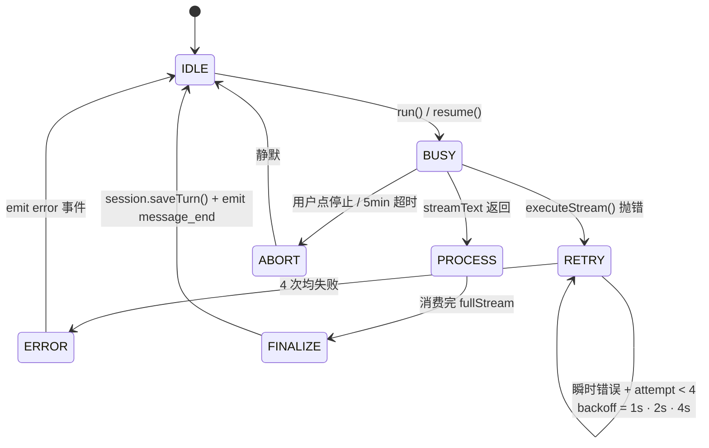
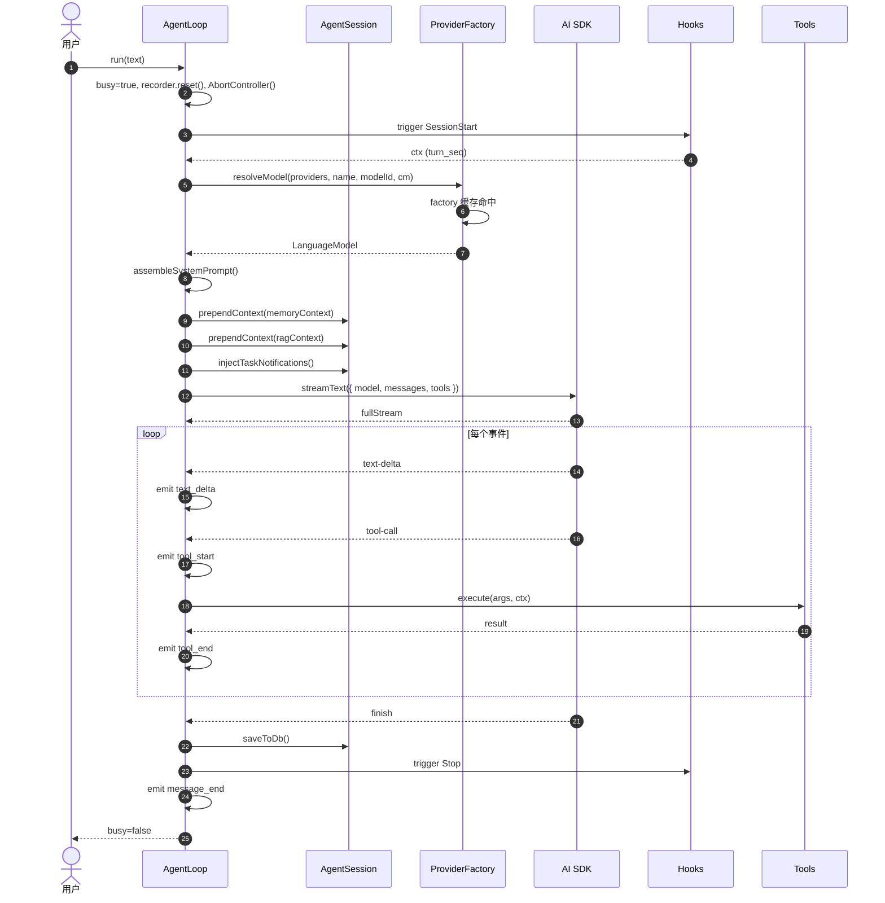
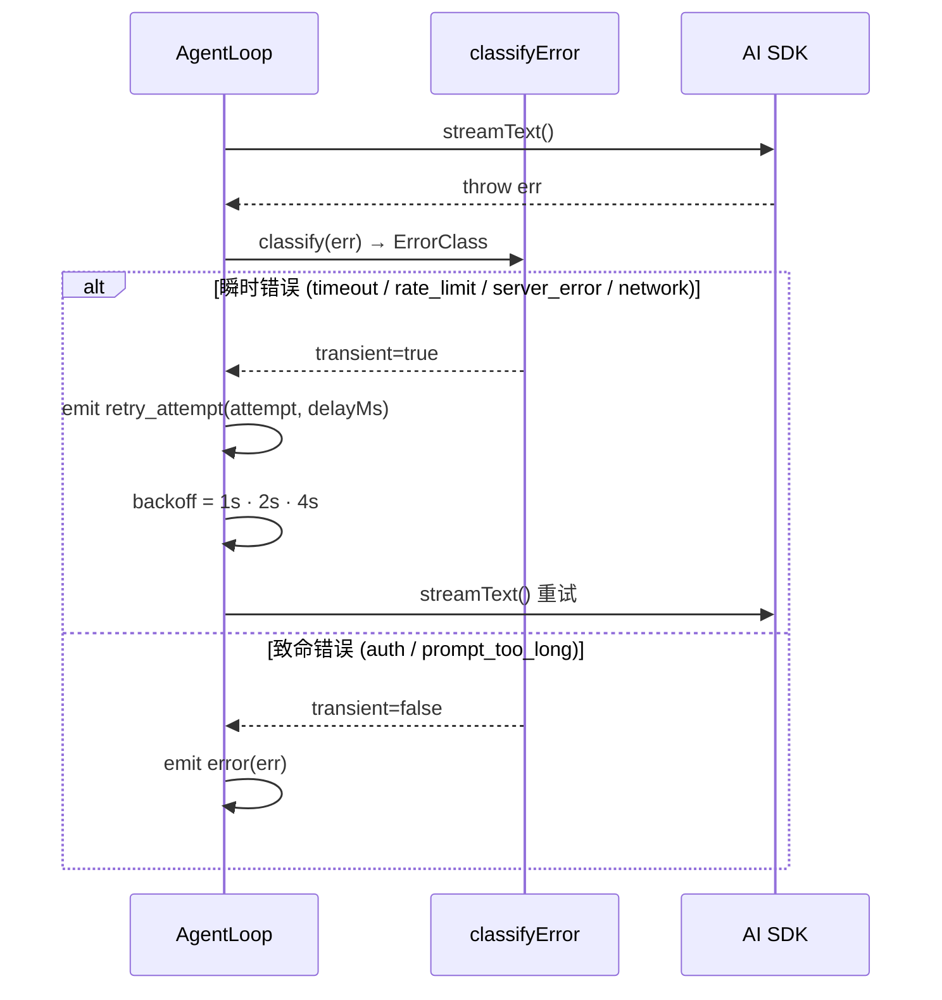
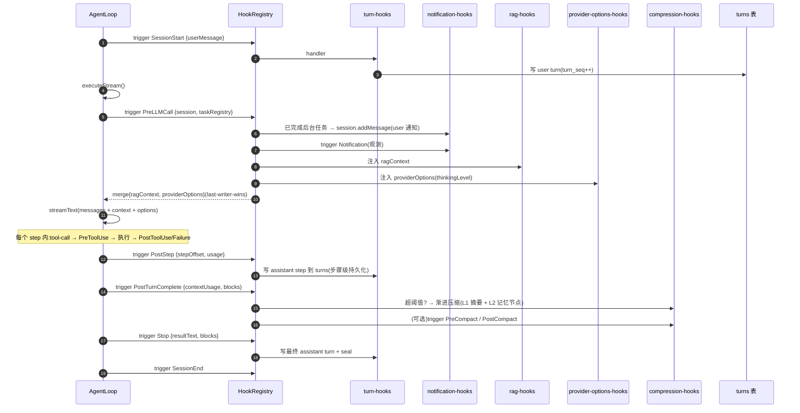

# 03 · 核心执行引擎

> 本文剖析 `AgentLoop`、`AgentSession`、`ProviderFactory` 三大件。这是系统的"心跳"。

## 1. 三件套的角色

| 组件 | 角色 | 行数 |
|------|------|------|
| `AgentLoop` | 单次会话的执行驱动：把 messages + tools + provider 喂给 `streamText()`，处理流式事件，emit StreamEvent | 约 700 |
| `AgentSession` | 该会话的**纯内存**消息数组 + token 估算 + pruning | 391 |
| `ProviderFactory.resolveModel()` | 根据 provider 名 + API key + baseUrl 创建并缓存 AI SDK LanguageModel 实例 | 165 |

辅助：
- `agent-utils.ts`（107）：错误分类（8 类）、MAX_RETRIES=3、`parseThinkingTags()`
- `turn-recorder.ts`（171）：流式 block 收集
- `checkpoint-manager.ts`（121）：检查点（**已被 hook 替代**）
- `compression-engine.ts`（309）：L1 摘要 + L2 记忆提取
- `memory-recall.ts`（64）：FTS5 召回
- `tool-rate-limiter.ts`（122）：单工具并发 + 间隔门控（已装载，在生产路径运行）
- `task-registry.ts`（186）：异步任务表
- `subagent-delegator.ts`（413）：**当前**子 Agent 委派调度器(`SubagentDelegator` 类,见 [02 §3](./02-module-structure.md#3-运行时层-srcruntime) 与下文 §3.1「委派模型」)
- `subagent-delegation.ts`（329）：**死代码** —— 旧的 `createSubagentDelegation()` 闭包工厂,v0.8 委派重构(迁到 `SubagentDelegator` 类)后**全仓零 importer**,保留作历史参考(✅ 删除候选)

## 2. AgentLoop 状态机



## 3. AgentLoop 关键代码剖析

### 3.1 构造（lines 77-118）

`AgentLoop` 构造时接收：

- `sessionConfig: SessionConfig` — 完整会话配置（agentId、systemPrompt、modelId、toolPolicy、providerName、thinkingLevel、sessionId、db、MCP getter、agent tool getter、tool config getter）
- `providers: RuntimeProviderConfig[]` — 全部已配置 provider
- `callbacks: RuntimeCallbacks` — `{ onEvent }` 单回调

构造期会创建：

- `AgentSession` — 内存消息数组，从 DB turn 表**重建**
- `SubagentDelegator` — 子任务委派上下文
- `SystemPromptAssembler` — 用于动态拼装系统提示词
- `TurnRecorder` — 流式 block 累积
- `AbortController = null` — 直到 `run()` 才创建

#### 委派模型(v0.8 重构)

委派统一走**单个 `Agent` action 工具**([tools/agent.ts](../../src/runtime/tools/agent.ts)),取代旧的 per-subagent 工具机制。注意"统一走 Agent 工具"指的是**对外工具接口**;工具内部仍然调用 `SubagentDelegator.delegateTask()`(见上 §1,该类由 `AgentLoop` 在构造期实例化,持自己的 `TaskRegistry`),`SubagentDelegator` 才是真正创建子 loop、跑子任务、收集结果的运行时组件。换句话说:**Agent 工具(协议层)→ SubagentDelegator(运行时层)** 两层分工。

- `{action:"list"}` — 现查 `ctx.resolveAgent(callerId)` 列出 caller 当前可委派的 subagent(name/description/model)。模型靠这个自发现,**不注入 system prompt**。
- `{action:"delegate", task, subagent?, mode?}` — `subagent`(name)→ 在 caller 现查的 subagents 里按名解析 → `resolveAgent(agentId)` **现查**对方身份(systemPrompt/model/toolPolicy)→ `delegateTask`。白名单语义:只能委派给自己 subagents 里的;name 不匹配或目标被删 → 报错(不静默回落 caller)。不传 `subagent` → 临时委派(继承 caller 身份)。`mode` 支持 blocking/non_blocking。
- 工具名恒为 `Agent`(合法、不冲突);身份/列表现查 → 改 agent 配置不用重启 loop。
- **子 Agent 上下文隔离(v0.8 关键修复,见 [04 §5.1](./04-tools-subsystem.md))**:`SubagentDelegator` 构造子 `SessionConfig` 时**显式置 `sessionId: undefined`**,使子 loop 走"无 DB session"路径(所有 DB 操作 gated on `db && sessionId`)→ 不 `rebuildFromTurns()` 父会话历史、不向父 turn 表写,从根上消除旧 internal 模式跨 agent 写竞争。caller 通过 `DelegateTaskOptions.contextOverride` 显式传 projectId / wikiRootNodeId / workspaceDir;身份(systemPrompt/model/toolPolicy)由 `targetAgentId` 驱动。

#### running loop 配置热同步

AgentLoop 的 `config`(systemPrompt/toolPolicy/subagents/wikiAnchors)在会话激活时读一次,但 `AgentStore.onChange(agentId)` 触发时,agentService 会对该 agent 的所有 running loop 调 `loop.applyConfigUpdate(...)`,热抹新配置:systemPrompt 经 `AgentSession.updateSystemPrompt` + invalidate base 缓存(偶发,cache 打破可接受);toolPolicy/subagents 下轮 buildTools 现读;wikiAnchors 重跑 resolveAnchors + invalidate wiki 段。→ 用 AgentRegistry 工具或 UI 改 agent 配置后,正在跑的 session 下一轮即生效,无需重启。

### 3.2 run() 入口（lines 122-173）

```
async run(userMessage):
  1. busy=true
  2. reset recorder / streamText / thinkingText / resultText
  3. abortController = new AbortController()
  4. timeout = setupTimeout()  ← 默认 5 分钟硬上限
  5. try:
       - trigger PreToolUse hook for user message  ← 不，直接走 runWithRetry
     runWithRetry()   ← 核心循环 + 重试
     finalizeStream()
  6. catch AbortError / DOMException → silently ignore
```

### 3.3 executeStream() — 真正的驱动（lines 326-379）

```
executeStream():
  # PreLLMCall hook (per TURN, 一次): 注入 memoryContext / ragContext /
  # providerOptions;notification-hooks 也在此把已完成后台任务结果作为
  # 通知注入。结果拼成 ctx 字符串,prepend 到最后一条 user 消息。
  preResult = triggerHooks("PreLLMCall", ...)
  ctx = buildContextMessage({ ragContext, memoryContext, wikiAnchorsContext,
                              currentTask, todosContext, ... })
  messages = prependContext(session.getMessages(), ctx)

  result = streamText({
    model,
    messages,
    system: assembleSystemPrompt(),
    tools: await buildTools(),        ← ALL_TOOLS ∪ MCP ∪ Agent
    abortSignal: abortController.signal,
    stopWhen: stepCountIs(200),       ← SDK 内部跑最多 200 step
    providerOptions: { anthropic:{thinking:...}, google:{thinkingConfig:...} },
    # prepareStep (per STEP, SDK 每 step 前回调): triggerHooks("PrepareStep"),
    # hook 返回 appendMessages 则并入该 step 发给模型的 messages。
    # 这是 per-step 注入点(控制消息 / 排队输入),与 per-turn 的 PreLLMCall 互补。
    prepareStep: async ({ stepNumber, messages }) => {
        res = triggerHooks("PrepareStep", { stepNumber, messages, ... })
        return res.appendMessages ? { messages: [...messages, ...res.appendMessages] } : {}
    },
  })

  await processStreamEvents(result)  ← 处理 text_delta/thinking/tool-call/result
  await finalizeStream(result)        ← 提取 messages, 持久化, 收尾
```

#### Hook 三层生命周期（session / turn / LLMCall）

一个 AgentLoop 实例 = 一个 session 的运行时。hook 按 три 颗粒度触发:

| 颗粒度 | 事件 | 频率 | 注入? |
|---|---|---|---|
| **Session** | `SessionStart` / `SessionEnd` / `Stop` / `StopFailure` | 每 session(每 run) | 观察/收尾 |
| **Turn**(一次 user 输入 = 一个 executeStream) | `UserPromptSubmit` / `PreLLMCall` / `PostTurnComplete` / `PreCompact` / `PostCompact` | 每 turn | PreLLMCall 注入整轮 context |
| **LLMCall / Step**(turn 内单步) | `PrepareStep` / `PostStep` | 每 step | PrepareStep 注入该 step 的 appendMessages |
| **Tool**(step 内工具调用) | `PreToolUse` / `PostToolUse` / `PostToolUseFailure` | 每工具 | 可 block / 改 args / 改 result |

> ⚠️ HookRegistry 当前是**全局单例**,handler 注册是进程级(启动一次),但 handler 触发**跨所有 loop**(包括子 agent loop)。handler 需自行用 ctx 里的 sessionId / loopKind 判断作用域。task-control-hooks / input-queue-hooks 都靠 sessionId 做 session 级过滤。后续整理方向:context 显式带 `loopKind`,见技术债。

### 3.4 processStreamEvents() — 事件消费（lines 444-540）

逐个事件：

```
text-delta       →  streamText += text; emit text_delta;
reasoning-delta   →  thinkingText += text; emit thinking_delta;
tool-call         →  recorder.blocks.push({type:'tool', name, status:'running', args});
                    emit tool_start; persistBlocksSnapshot();
tool-result       →  找到对应 block → status='done'; result=output;
                    emit tool_end;
finish-step       →  recorder.sealStep(); (no emit)
error             →  throw (让 retry 处理)
```

**重点**：`tool-call` 和 `tool-result` 是 AI SDK 流里的事件，不是 StreamEvent。AgentLoop 把它们翻译成 `tool_start` / `tool_end`，由 ChatPanel 监听。

### 3.5 finalizeStream() — 收尾（lines 544-563）

```
resultText = await result.text
try: deletePartialTurn(sessionId)  ← 清理上次中断的检查点
recorder.sealStep()
response = await result.response
if response.messages: session.messages.push(...response.messages)  ← 把 AI SDK 的"内部"消息融入
session.saveToDb()  ← 全量覆盖 messages 表
emit message_end { text, contextUsage, contextWindow, estimatedTokens }
```

## 4. AgentSession — 消息生命线

### 4.1 三个字段

| 字段 | 含义 |
|------|------|
| `messages: ModelMessage[]` | 喂给 streamText 的数组，AI SDK 格式 |
| `cachedTurns: {seq, role, content, createdAt}[]` | DB turns 表的"原始块"快照，用于 UI 渲染 |
| `lastActualInputTokens: number \| null` | 从最近一次 API 响应校准的 token 数（用于精确上下文估算） |

### 4.2 重建策略（rebuildFromTurns()，lines 159-178）

会话构造时**总是**从 DB turns 表重建 messages。`messages` 表是 write-through 缓存，**不权威**。

```
对每个 turn:
  if role === 'user':
    push { role:'user', content: turn.content }
  elif role === 'assistant':
    blocks = JSON.parse(turn.content)
    appendAssistantMessages(blocks, messages)
      ├─ 收集 tool calls → 生成 tc-N（不沿用旧 ID，避免跨 Provider 格式冲突）
      ├─ 收集 tool results
      ├─ 收集 text
      └─ 输出 assistant message + 一组 tool messages
```

### 4.3 三种 pruning 策略（context-manager.ts）

| 策略 | 触发条件 | 行为 |
|------|----------|------|
| `tail` | `config.context.pruningStrategy === 'tail'` | 保留最后 N tokens |
| `turn-boundary` | 默认 | 按"完整 turn 边界"切除 |
| `smart` | `importanceScoring: true` | 用 `scoreMessage()` 给每条消息打分，保留高分 |

**重要**：三种策略都不会留下"孤立的 tool-call"，`applyPreserveToolResults()` 会把被切的 tool-call 关联的 tool-result 一起切掉或一起留。

### 4.4 自适应 token 估算

`estimateMessageTokens()` 用 `Math.ceil(text.length / 4)` 估算，**校准过**会改用 API 返回的 `lastActualInputTokens`。换言之：

```
校准前: total = Σ(messageTokens(m))
校准后: total = lastActualInputTokens  (API 实际报数)
```

这避免了"加文本超 1MB 错估为 250K tokens"的常见 LLM 应用坑。

## 5. ProviderFactory — 多 Provider 工厂

### 5.1 流程

```
resolveModel(providers, providerName, modelId):
  normalized = lowercase(sanitize(providerName))
  provider = find(providers, normalized)
  if !provider.enabled or !provider.apiKey → throw

  factory = getOrCreateProvider(provider)  ← 缓存 by (type:apiKey:baseUrl)
  model = factory(modelId)

  if concurrencyManager:
    queue = concurrencyManager.getQueue(providerName)
    if queue: await queue.acquire(abortSignal)
    // released in finally block

  return model
```

### 5.2 Provider 适配（getOrCreateProvider，lines 120-160）

```
type: "openai"     → createOpenAI({ apiKey, baseUrl })(modelId)
type: "anthropic"  → createAnthropic({ apiKey, baseURL })(modelId)
type: "gemini"     → createGoogleGenerativeAI({ apiKey, baseURL })(modelId)
type: "ollama"     → createOpenAI(...)  ← 假装 OpenAI（兼容模式）
type: "mock"       → new MockLanguageModelV3(...)
```

Ollama 用 OpenAI 兼容协议是一个常见但值得文档化的决定。

### 5.3 Concurrency 限流

每个 Provider 一个 FIFO semaphore（`ConcurrencyQueue`）。`acquire()` 接受 `AbortSignal` —— 用户点"停止"时排队中的请求会被 `reject(new DOMException('Aborted'))`。

## 6. 流式事件契约

`StreamEvent` 是**渲染层 + 后端层 + 数据持久层共同引用**的契约（定义在 `runtime/types.ts`）。完整列表：

| type | 含义 | payload |
|------|------|---------|
| `text_delta` | 增量文本 | `{ text }` |
| `thinking_delta` | 增量思考 | `{ text }` |
| `tool_start` | 工具调用开始 | `{ toolName, toolCallId, args }` |
| `tool_end` | 工具调用结束 | `{ toolName, toolCallId, isError, result }` |
| `message_end` | 模型一轮结束 | `{ text, contextUsage, contextWindow, estimatedTokens }` |
| `agent_end` | 整个 turn 结束 | — |
| `error` | 错误 | `{ error, errorClass? }` |
| `retry_attempt` | 重试 | `{ attempt, maxAttempts, delayMs, errorClass }` |
| `todos_update` | TodoWrite | `{ todos[] }` |
| `subagent_dispatched` | 子 agent 启动 | `{ taskId, task }` |
| `subagent_progress` | 子 agent 进度 | `{ taskId, step, toolName? }` |
| `subagent_completed` | 子 agent 完成 | `{ taskId, status, result? }` |
| `usage` | Token 累计 | `{ usage: {inputTokens, outputTokens, totalTokens, ...} }` |
| `session_init` | 会话初始化 | `{ messages[], inputTokens, outputTokens, totalTokens }` |
| `ask_user` | AskUser 工具 | `{ requestId, questions[] }` |
| `ask_user_result` | AskUser 回答 | `{ requestId, answers }` |

每个事件都带 `agentId?` 和 `sessionId?`，渲染层用它做 session-scoped 状态更新。

## 7. 错误分类与重试

`agent-utils.ts::classifyError()` 8 类：

```
AbortError, "timeout", "timed out", "abort"  → "timeout"
status 429, "rate limit", "too many"          → "rate_limit"
status 401/403, "unauthorized", "api key"     → "auth"
"context length", "too long", "exceed"       → "prompt_too_long"
status ≥ 500                                   → "server_error"
ECONNREFUSED, ENOTFOUND, ECONNRESET, fetch fail → "network"
otherwise                                     → "unknown"
```

`isTransientError()` 仅 `timeout | rate_limit | server_error | network` 会触发重试。`auth` 和 `prompt_too_long` 视为 fatal。

**重试策略**（`MAX_RETRIES = 3`, `BASE_DELAY_MS = 1000`，agent-utils.ts:29-30）：

```
attempt 0 → 直接调
attempt 1 → 延迟 BASE_DELAY * 2^0 = 1s
attempt 2 → 延迟 BASE_DELAY * 2^1 = 2s
attempt 3 → 延迟 BASE_DELAY * 2^2 = 4s
```

`runWithRetry()` 通过 `retry_attempt` StreamEvent 通知前端。

## 8. 关键时序图



错误时：



## 9. 与持久层的握手

`AgentLoop` 不直接操作 SQLite。它通过：

1. `AgentSession.saveToDb()` → `sessionStore.saveTurn(sessionId, messages)`（依赖注入的 `ISessionStore`）
2. `TurnRecorder.persistBlocksSnapshot()` → `db.upsertAssistantTurn(...)`（用于 UI 实时显示）
3. **Hook 系统**：写入 turn 由 `turn-hooks.ts` 的 `SessionStart`/`Stop`/`StopFailure` 处理；写入 turn_state 由 `durable-hooks.ts` 处理

**好处**：AgentLoop 不需要知道 SQLite 的存在。如果以后想换 MySQL / Postgres，只需要改 `server/session-db.ts`。

## Hook 系统

> "挂在循环上,不写进循环里" —— AgentLoop 的所有**功能代码**(持久化、压缩、通知、抽取、Wiki 记忆注入)都不在 loop 里,而是通过 hook 注册。loop 本身只保留**心跳逻辑**(流式事件翻译、重试、abort)。这是 v0.8 的硬约束(见 `feedback-agent-loop-hooks-only`):**新增功能必须加 hook,不许改 AgentLoop**。

### 核心抽象:HookRegistry([core/hook-registry.ts](../../src/core/hook-registry.ts))

单例注册表,30 个 `HookEventName`(见 [hook-types.ts](../../src/core/hook-types.ts))。两个原语:

- `register(event, handler) → unsubscribe` —— 按注册顺序 append 到 `Map<event, handler[]>`。
- `trigger(event, ctx) → AggregatedHookResult` —— **顺序执行**所有 handler,聚合返回值。

**执行模型(关键,容易记错)**:

1. **顺序执行,非并发**。handler 一个个 `await`,注册顺序就是执行顺序。
2. **last-writer-wins merge**。每个 handler 返回的对象字段被 merge 进总结果,**同 key 后写覆盖前写**(`memoryContext` / `ragContext` / `providerOptions` 都遵循此规则)。⚠ 旧文档曾写成 "first-writer-wins",**错误**,以源码 `hook-registry.ts:78-91` 为准。
3. **`{ blocked: true }` 短路**。任何 handler 返回 `blocked: true`,立即停止后续 handler,返回 `{ blocked: true, reason }`。这是 PreToolUse / UserPromptSubmit 拒绝调用的唯一机制。
4. **错误吞掉不冒泡**。handler 抛错只 `log.error`,不影响后续 handler 或 loop 主流程(`hook-registry.ts:92-94`)。这是**故意**的:hook 是扩展点,一个扩展挂掉不该让 agent 停摆。
5. **ctx 自动加 `timestamp`**。`triggerHooks` wrapper 会 spread ctx 并补 `timestamp: Date.now()`。

### 事件 → 触发点 → 主要 handler 映射

下表把"AgentLoop 在哪一行 trigger"与"谁注册了 handler"对上。**这是 hook 系统的全景图**,改 hook 时先看这里。

| 事件 | 触发点(agent-loop.ts) | handler(注册在 [runtime/hooks/](../../src/runtime/hooks/)) | handler 能改什么 |
|------|------------------------|----------------------------------------------------------|------------------|
| `UserPromptSubmit` | run() 入口 line 228 | (无内置,可被外部拦截) | `modifiedMessage` / `blocked` |
| `SessionStart` | run() line 236 / resume() line 296 | **turn-hooks**: 写 user turn 到 turns 表,自增 turn_seq | 副作用(写 DB) |
| `PreLLMCall` | executeStream() line 497 | **notification-hooks**: 后台任务结果回灌为 user 消息<br/>**rag-hooks**: 注入 `ragContext`<br/>**provider-options-hooks**: 注入 `providerOptions`(thinkingLevel) | `memoryContext` / `ragContext` / `providerOptions` |
| `PreToolUse` | 工具执行前 line 678 | (无内置) | `blocked` / `modifiedArgs` |
| `PostToolUse` | 工具成功后 line 705 | (无内置,可被观测/审计订阅) | `modifiedResult` / `modifiedIsError` |
| `PostToolUseFailure` | 工具失败后 line 726 | (无内置) | `modifiedError` |
| `PostStep` | 每个 step 结束 line 766 / 798 | **turn-hooks**: 写 assistant step 到 turns 表(步骤级持久化) | `inputTokens`(触发 token 校准) |
| `PostTurnComplete` | run() line 251 | **compression-hooks**: contextUsage 超阈值 → L1 摘要 + L2 记忆节点<br/>**todo-cleanup-hooks**: 清理已完成 todo<br/>**extraction-hooks**(M5): 增量内容/工具遥测抽取 | 副作用(压缩/抽取/清理) |
| `Stop` | run() line 268 / resume() line 312 | **turn-hooks**: 写最终 assistant turn + seal | 副作用 |
| `StopFailure` | catch 块 line 466 | **turn-hooks**: 记录失败 turn | 副作用 |
| `SessionEnd` | run() line 269 | (无内置) | — |
| `Notification` | notification-hooks 内部触发 | (UI/日志订阅) | — |

> 其余 18 个事件(`SubagentStart/Stop`、`PreCompact/PostCompact`、`PermissionRequest/Denied`、`TaskCreated/Completed`、`Elicitation*`、`ConfigChange`、`CwdChanged`、`FileChanged`、`WorktreeCreate/Remove`、`InstructionsLoaded`、`TeammateIdle`)目前**没有内置 handler**,是给未来扩展(MCP 桥接、审计、worktree 集成等)预留的接口面。

### 注册:统一入口,顺序敏感

[runtime/hooks/index.ts](../../src/runtime/hooks/index.ts) 的 `registerAllRuntimeHooks(db?, extractionDeps?)` 是**唯一**注册入口,由 `agent-service.ts` 启动时调用。注册顺序固定:

```
turn(db?) → notification → rag → providerOptions → compression → todoCleanup → extraction(deps?)
```

**顺序为什么重要**:PreLLMCall 有 3 个 handler(notification / rag / providerOptions),它们返回的对象被 last-writer-wins merge。若两个都写 `providerOptions`,后注册的覆盖前面的。当前各 handler 写的字段不重叠(notification 写 session 消息、rag 写 `ragContext`、providerOptions 写 `providerOptions`),所以无冲突;但**新增 PreLLMCall handler 时必须检查字段冲突**。

### 时序:一次 turn 里 hook 的穿插点



### PreLLMCall 的"现查 + 注入"模式(易踩坑)

`PreLLMCall` 是**上下文注入的唯一官方入口**。handler 不直接改 messages 数组,而是返回 `{ memoryContext?, ragContext?, providerOptions? }`,AgentLoop 在 `executeStream()`(line 496-540)拿到 merged 结果后,由自己决定怎么 prepend/merge:

```
preResult = await triggerHooks("PreLLMCall", { agentId, sessionId, session, taskRegistry, ... })
if preResult.memoryContext: session.prependContext(preResult.memoryContext)
if preResult.ragContext:    session.prependContext(preResult.ragContext)
if preResult.providerOptions: 合并进 streamText 的 providerOptions
```

**坑**:如果两个 handler 都返回 `memoryContext`,只有**后注册**的那个生效(last-writer-wins)。v0.8 删 `memory-hooks` 就是为了避免与 wiki-anchor-injection 在 `memoryContext` 字段上打架 —— 现在 memory 走完全独立的路径(`buildContextMessage` + `renderContextAnchors`,不经 PreLLMCall)。

### 设计取舍

- **顺序执行而非并发**:hook 之间有隐式依赖(notification 要先于 rag,因为 notification 改了 session 消息)。并发会让 merge 顺序不确定。
- **last-writer-wins 而非 first-writer-wins**:更符合"后注册的扩展覆盖前面的"直觉(类似中间件栈)。代价是字段冲突时要靠注册顺序隐式协调,没有显式优先级。
- **错误吞掉**:hook 是扩展点,挂了不该影响 agent 主流程。代价是 hook bug 静默 —— 需要靠 `log.error` + 日志面板发现。
- **PostStep 步骤级持久化**:`turn-hooks` 在每个 step 而非每个 turn 写 turns 表,让 UI 实时看到 assistant 输出,且中断后能从最近 step 恢复。代价是写放大(一个多 step turn 会写多行 turns)。

## 10. 架构师视角：这块做对了什么 & 可以改进什么

### 10.1 做对了的

- **接口隔离**：`ISessionStore` 让 runtime 完全无感于 SQLite。这是一个教科书般的"dependency inversion"。
- **流式事件即契约**：`StreamEvent` 是单一类型表，前后端都用它，无须定制 IPC envelope。
- **错误分类先于重试**：8 类错误 + 4 类 transient 是精心选的，足够覆盖大多数 LLM Provider 错误模式。
- **Hook 与上下文提取**：`turn-hooks` / `compression-hooks` / `extraction-hooks` / `wiki-anchor-injection` 把持久化、压缩、抽取、Wiki 记忆注入从 loop 主流程中拆出(完整机制见上方 [Hook 系统](#hook-系统) 一节)。`rag-hooks` 仍是 legacy optional hook,默认会话不会生效。

### 10.2 可以改进的

- `agent-loop.ts` 当前约 700 行。`processStreamEvents` 的 switch 可以拆出独立的"事件翻译器"模块（类似 Redux reducer）。
- `runWithRetry` 与 `executeStream` 是耦合的。如果以后想用 `generateText()` 走非流式路径，需要复制逻辑。可抽象成 `interface TurnDriver`。
- `AgentLoop` 直接依赖 `TurnRecorder`、`CheckpointManager`、`CompressionEngine` 五个以上 collaborator。可以做 DI 容器。
- 错误重试时**整个** prompt 重新发送，没有"上次已经成功"的标记。如果 Provider 支持 `idempotency-key`，应当利用。
- Wiki anchors 当前以索引/轮廓为主，节点内容读取依赖 `Wiki` 工具；后续可以增加更明确的节点选择和上下文预算策略。
