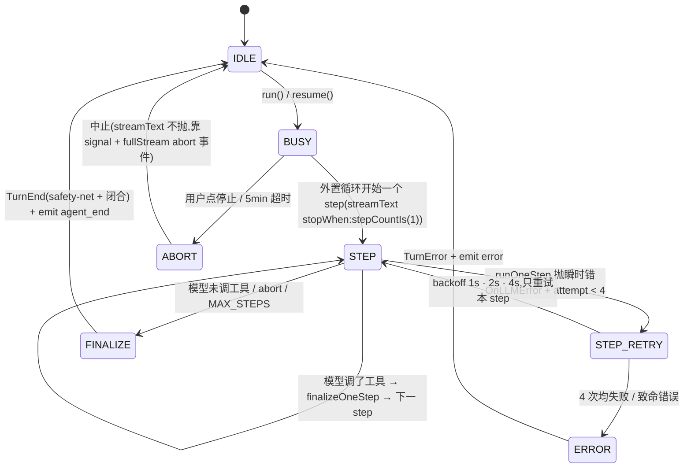
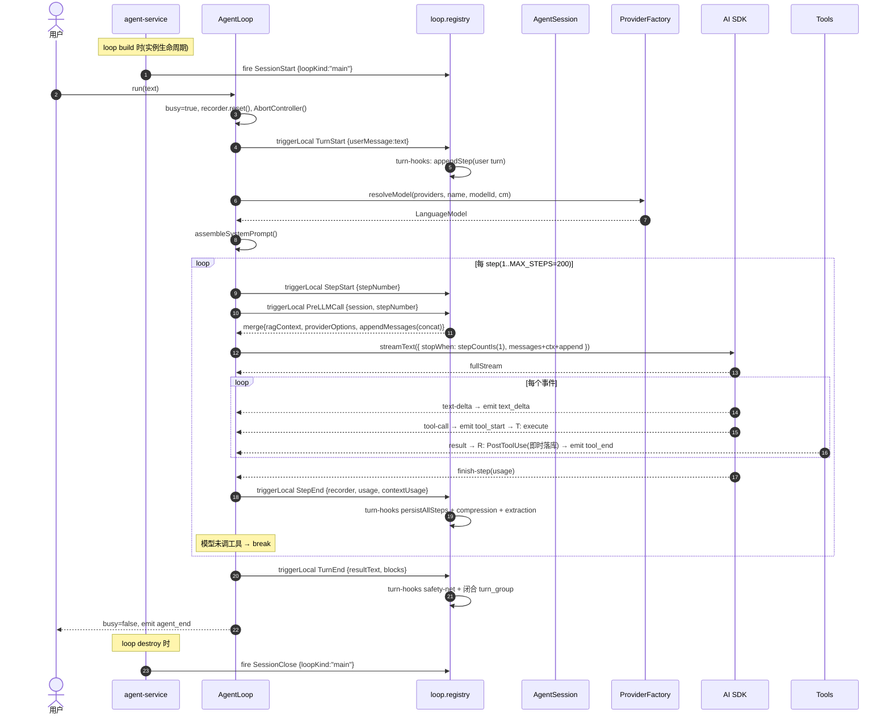

# 03 · 核心执行引擎

> 本文剖析 `AgentLoop`、`AgentSession`、`ProviderFactory` 三大件。这是系统的"心跳"。

## 1. 三件套的角色

| 组件 | 角色 | 行数 |
|------|------|------|
| `AgentLoop` | 单次会话的执行驱动：把 messages + tools + provider 喂给 `streamText()`，处理流式事件，emit StreamEvent | 约 700 |
| `AgentSession` | 该会话的**纯内存**消息数组 + token 估算 + pruning | 391 |
| `ProviderFactory.resolveModel()` | 根据 provider 名 + API key + baseUrl 创建并缓存 AI SDK LanguageModel 实例 | 165 |

辅助：
- `agent-utils.ts`（107）：错误分类（8 类）、MAX_RETRIES=3、`parseThinkingTags()`
- `turn-recorder.ts`（171）：流式 block 收集
- `checkpoint-manager.ts`（121）：检查点（**已被 hook 替代**）
- `compression-engine.ts`（309）：L1 摘要 + L2 记忆提取
- `memory-recall.ts`（64）：FTS5 召回
- `tool-rate-limiter.ts`（122）：单工具并发 + 间隔门控（已装载，在生产路径运行）
- `task-registry.ts`（186）：异步任务表
- `subagent-delegator.ts`（413）：**当前**子 Agent 委派调度器(`SubagentDelegator` 类,见 [02 §3](./02-module-structure.md#3-运行时层-srcruntime) 与下文 §3.1「委派模型」)
- `subagent-delegation.ts`（329）：**死代码** —— 旧的 `createSubagentDelegation()` 闭包工厂,v0.8 委派重构(迁到 `SubagentDelegator` 类)后**全仓零 importer**,保留作历史参考(✅ 删除候选)

## 2. AgentLoop 状态机



## 3. AgentLoop 关键代码剖析

### 3.1 构造（lines 77-118）

`AgentLoop` 构造时接收：

- `sessionConfig: SessionConfig` — 完整会话配置（agentId、systemPrompt、modelId、toolPolicy、providerName、thinkingLevel、sessionId、db、MCP getter、agent tool getter、tool config getter）
- `providers: RuntimeProviderConfig[]` — 全部已配置 provider
- `callbacks: RuntimeCallbacks` — `{ onEvent }` 单回调

构造期会创建：

- `AgentSession` — 内存消息数组，从 DB turn 表**重建**
- `SubagentDelegator` — 子任务委派上下文
- `SystemPromptAssembler` — 用于动态拼装系统提示词
- `TurnRecorder` — 流式 block 累积
- `AbortController = null` — 直到 `run()` 才创建

#### 委派模型(v0.8 重构)

委派统一走**单个 `Agent` action 工具**([tools/agent.ts](../../src/runtime/tools/agent.ts)),取代旧的 per-subagent 工具机制。注意"统一走 Agent 工具"指的是**对外工具接口**;工具内部仍然调用 `SubagentDelegator.delegateTask()`(见上 §1,该类由 `AgentLoop` 在构造期实例化,持自己的 `TaskRegistry`),`SubagentDelegator` 才是真正创建子 loop、跑子任务、收集结果的运行时组件。换句话说:**Agent 工具(协议层)→ SubagentDelegator(运行时层)** 两层分工。

- `{action:"list"}` — 现查 `ctx.resolveAgent(callerId)` 列出 caller 当前可委派的 subagent(name/description/model)。模型靠这个自发现,**不注入 system prompt**。
- `{action:"delegate", task, subagent?, mode?}` — `subagent`(name)→ 在 caller 现查的 subagents 里按名解析 → `resolveAgent(agentId)` **现查**对方身份(systemPrompt/model/toolPolicy)→ `delegateTask`。白名单语义:只能委派给自己 subagents 里的;name 不匹配或目标被删 → 报错(不静默回落 caller)。不传 `subagent` → 临时委派(继承 caller 身份)。`mode` 支持 blocking/non_blocking。
- 工具名恒为 `Agent`(合法、不冲突);身份/列表现查 → 改 agent 配置不用重启 loop。
- **子 Agent 上下文隔离(v0.8 关键修复,见 [04 §5.1](./04-tools-subsystem.md))**:`SubagentDelegator` 构造子 `SessionConfig` 时**显式置 `sessionId: undefined`**,使子 loop 走"无 DB session"路径(所有 DB 操作 gated on `db && sessionId`)→ 不 `rebuildFromTurns()` 父会话历史、不向父 turn 表写,从根上消除旧 internal 模式跨 agent 写竞争。caller 通过 `DelegateTaskOptions.contextOverride` 显式传 projectId / wikiRootNodeId / workspaceDir;身份(systemPrompt/model/toolPolicy)由 `targetAgentId` 驱动。

#### running loop 配置热同步

AgentLoop 的 `config`(systemPrompt/toolPolicy/subagents/wikiAnchors)在会话激活时读一次,但 `AgentStore.onChange(agentId)` 触发时,agentService 会对该 agent 的所有 running loop 调 `loop.applyConfigUpdate(...)`,热抹新配置:systemPrompt 经 `AgentSession.updateSystemPrompt` + invalidate base 缓存(偶发,cache 打破可接受);toolPolicy/subagents 下轮 buildTools 现读;wikiAnchors 重跑 resolveAnchors + invalidate wiki 段。→ 用 AgentRegistry 工具或 UI 改 agent 配置后,正在跑的 session 下一轮即生效,无需重启。

### 3.2 run() 入口

```
async run(userMessage):
  1. busy=true; reset recorder / streamText / thinkingText / resultText
  2. abortController = new AbortController()
  3. timeout = setupTimeout()  ← 默认 5 分钟硬上限
  4. try:
       stepBaseSeq = db.getTurnCount(sessionId)
       triggerLocal TurnStart { userMessage }   ← turn-hooks 写 user turn
       stepBaseSeq = db.getTurnCount(sessionId)  ← TurnStart 后重读(可能 +1)
       recorder.startTurnGroup(userSeq)
       runWithRetry() → executeStream()         ← 外置 step 循环
     finalize turn
  5. finally:
       triggerLocal TurnEnd { resultText, blocks }   ← safety-net + 闭合 turn_group
       emit agent_end
       busy=false
```

`resume(interruptedTurnSeq?, lastCompletedStepSeq?)`(Step 2D)是断点续跑入口:已完成的 step 行已在 turns 表(Step 2B 即时落库 + StepEnd),session 从那些行 `rebuildFromSteps` 重建 messages,然后从下一个 seq 继续跑。`lastCompletedStepSeq` 在本层是信息性的(`getTurnCount` 已返回正确下一个 seq),主要用于恢复决策与 UI 状态。

### 3.3 executeStream() — 真正的驱动(Step 2C:外置 step 循环)

> v0.8 hook-redesign(Phase 1-4 已合入)把 SDK 内部的多 step 循环**外置**到 AgentLoop。
> 旧的 `streamText({ stopWhen: stepCountIs(200) })` + SDK `prepareStep` 回调已被一个
> 显式的 `for (stepNumber = 1..MAX_STEPS=200)` 循环取代,每步一次
> `streamText({ stopWhen: stepCountIs(1) })`。这让 step 级重试 / resume / OnLLMError
> 都成为可能(SDK 拥有循环时做不到)。

```
executeStream():
  # 外置 step 循环(Step 2C)。messages 在循环内被每步的 response.messages 累积。
  messages = prependContext(session.getMessages(), baseCtx)
  for stepNumber in 1..MAX_STEPS(=200):
    if abortController.signal.aborted: break        ← step 边界检 abort

    # ── StepStart → PreLLMCall:per-step 注入缝 ──────────────
    # 两者现在都 per-step fire。StepStart 承载 queued-input / delegated-task
    # 控制消息注入(input-queue-hooks、task-control-hooks);PreLLMCall 承载
    # RAG / providerOptions / notification 注入。任一返回的 appendMessages
    # 被 registry **concat**(不再 last-writer-wins),只并入本 step 的 outgoing。
    stepStartRes = triggerLocal("StepStart", { stepNumber, messages })
    preRes       = triggerLocal("PreLLMCall",  { stepNumber, session, ... })
    stepMessages = [...messages, ...stepStartRes.appendMessages, ...preRes.appendMessages]

    # ── 跑一步 + per-step 重试(Step 2C)────────────────────
    step = runOneStepWithRetry({           ← 内部 OnLLMError hook + 瞬时错误重试
      model, system, messages: stepMessages, tools, providerOptions, stepNumber,
    })
    if step.aborted: break                 ← 中途 abort(fullStream "abort" 事件)

    # ── finalizeOneStep:seal + usage 校准 + StepEnd 持久化 ──
    finalizeOneStep(step.usage, stepNumber)  ← triggerLocal("StepEnd", {recorder, ...})

    # 把本步 response.messages 累积进 messages,只在模型调了工具时继续下一步
    messages.push(...step.response.messages)
    if !step.hadToolCall: break             ← 模型不再调工具 → turn 结束
```

要点(与旧版差异):
- **StepStart / PreLLMCall 都 per-step fire**(旧版 PreLLMCall 是 per-turn,PrepareStep 回调是 per-step)。注入位点的归属与频率对齐了 step 循环外置的事实。
- **appendMessages 是 concat,不是 last-writer-wins**(见下文 [Hook 系统](#hook-系统))。多个 per-step 注入器(控制消息 + 排队输入)的 appendMessages 互不覆盖。
- **per-step 重试**:瞬时错误 / `prompt_too_long` 只重试**失败的 step**(messages 不变),最多 `MAX_RETRIES=3`。致命错误或耗尽 → 抛到 `runWithRetry` 走终态 `TurnError`。
- **OnLLMError hook**(Step 2C 实现):handler 可请求"只重试失败 step"+ 对 `prompt_too_long` 触发激进 prune。
- **abort 双检**:step 边界检 `signal.aborted` + fullStream 的 `"abort"` 事件(2A spike gotcha #2:abort **不抛异常**,必须显式监听)。
- **PostLLCall 当前是空缝**(骨架已就位,Step 2C 未接线;预留给"模型返回与工具执行之间"的观测点)。

#### Step 2A spike 关键 gotcha(已验证)

`streamText({ stopWhen: stepCountIs(1) })` 外置单步循环可行性 spike(2A,GO)确认两个 AI SDK 6 行为:
1. **`response` 是 PromiseLike** —— 必须 `await`,不能当同步值读。
2. **abort 不抛异常** —— abort 走 fullStream 的 `"abort"` 事件 + `signal.aborted` 置位,**不会**让 `streamText` reject。所以 step 循环必须在边界 + 事件两处都检 abort,否则会继续跑下一步。

#### Hook 五层生命周期(session / turn / step / LLMCall / tool)

一个 AgentLoop 实例 = 一个 session 的运行时。hook 按**五个颗粒度**触发,共 **14 个 agent-execution 事件**(见 [hook-types.ts](../../src/core/hook-types.ts))。命名是 step-centric 的(Step 1C 重命名),所有权归位到合适的层:

| 颗粒度 | 事件 | 谁触发 | 频率 | 注入? |
|---|---|---|---|---|
| **Session**(实例生命周期) | `SessionStart` / `SessionClose` | **agent-service**(loop build / destroy) | 每 loop 实例一次 | 观察/收尾(不注入) |
| **Turn**(一次 user 输入) | `TurnStart` / `TurnEnd` / `TurnError` | AgentLoop.run() | 每 turn | TurnEnd 闭合 turn_group;TurnStart 写 user turn |
| **Step**(turn 内单步) | `StepStart` / `StepEnd` | 外置 step 循环 | 每 LLM call | StepStart 注入本 step 的 appendMessages;StepEnd 持久化 step + 压缩/抽取 |
| **LLMCall**(step 内单次模型调用) | `PreLLMCall` / `PostLLCall` / `OnLLMError` | 外置 step 循环 | 每 LLM call | PreLLMCall 注入 RAG/providerOptions/notification;OnLLMError 请求重试/prune;PostLLCall 空缝 |
| **Tool**(step 内工具调用) | `PreToolUse` / `PostToolUse` / `PostToolUseFailure` | tool-factory 包装层 | 每工具 | 可 block / 改 args / 改 result;PostToolUse/Failure **即时落库**(Step 2B) |

> ⚠️ **所有权归位(Step 1B/1C)**:Session 级事件由 **agent-service** 在 loop build/destroy 时 fire(不是 AgentLoop 在 run() 里 fire)。这修正了旧版"per-run SessionStart/Stop"把实例生命周期与 turn 生命周期混在一起的错误。AgentLoop 负责 Turn/Step/LLMCall/Tool 四级。
>
> ⚠️ **per-loop registry(Step 1B)**:`HookRegistry` 现在**可实例化**,每个 AgentLoop 持 `this.registry = new HookRegistry()`。handler 注册到**本 loop 的 registry**,触发**只在本 loop**——不再跨 loop(包括子 agent loop)。`registerHooksForLoop(registry, loopKind, deps)` 按 main / delegated 分组注册。`getInstance()` 保留作过渡默认,新代码不应依赖。`loopKind` 仍作为 ctx 自省字段保留(handler 可按 main/delegated 分支),但**不再是**跨 loop 隔离的承载点。

### 3.4 processStreamEvents() — 事件消费(per-step)

外置 step 循环里每步的 `runOneStep` 消费该步的 fullStream,逐个事件:

```
text-delta        →  streamText += text; emit text_delta;
reasoning-delta   →  thinkingText += text; emit thinking_delta;
tool-call         →  recorder.blocks.push({type:'tool', name, status:'running', args});
                     emit tool_start;
tool-result       →  triggerLocal PostToolUse(即时落库) → 找到 block → status='done';
                     emit tool_end;
tool-error        →  triggerLocal PostToolUseFailure(即时落库) → status='error';
                     emit tool_end(isError);
finish-step       →  只 capture usage(seal + StepEnd 持久化挪到 finalizeOneStep,
                     这样失败的 step —— 仍会 emit finish-step —— 不会被误持久化)
abort             →  设 aborted flag(2A gotcha:abort 不抛异常,必须显式监听)
error             →  抛给 runOneStepWithRetry → OnLLMError hook + per-step 重试
```

**重点**:`tool-call` / `tool-result` / `finish-step` / `abort` 是 AI SDK 流里的事件,不是 StreamEvent。AgentLoop 把 tool 事件翻译成 `tool_start` / `tool_end` 由 ChatPanel 监听,把 `finish-step` 的 usage 交给 `finalizeOneStep`。

### 3.5 finalizeOneStep() — 单步收尾(Step 2C)

外置循环每跑完一个成功 step 调一次:

```
if usage.inputTokens: session.calibrateFromActualUsage(usage.inputTokens)  ← token 校准
emit usage { inputTokens, outputTokens, totalTokens, cacheRead/Write }
recorder.sealStep(usage)
triggerLocal StepEnd { recorder, stepBaseSeq, stepOffset, usage, contextUsage }
  ├─ turn-hooks: persistAllSteps(step 行落库)
  ├─ compression-hooks: contextUsage 超阈值? → L1 摘要 + L2 记忆节点
  └─ extraction-hooks(M5): 增量内容/工具遥测抽取
stepOffset += 1
```

turn 结束(模型不再调工具,或 abort)后,run() 的 finally 再 `triggerLocal TurnEnd`(safety-net 持久化 + 闭合 turn_group),并 emit `message_end` / `agent_end`。

## 4. AgentSession — 消息生命线

### 4.1 三个字段

| 字段 | 含义 |
|------|------|
| `messages: ModelMessage[]` | 喂给 streamText 的数组，AI SDK 格式 |
| `cachedTurns: {seq, role, content, createdAt}[]` | DB turns 表的"原始块"快照，用于 UI 渲染 |
| `lastActualInputTokens: number \| null` | 从最近一次 API 响应校准的 token 数（用于精确上下文估算） |

### 4.2 重建策略（rebuildFromTurns()，lines 159-178）

会话构造时**总是**从 DB turns 表重建 messages。`messages` 表是 write-through 缓存，**不权威**。

```
对每个 turn:
  if role === 'user':
    push { role:'user', content: turn.content }
  elif role === 'assistant':
    blocks = JSON.parse(turn.content)
    appendAssistantMessages(blocks, messages)
      ├─ 收集 tool calls → 生成 tc-N（不沿用旧 ID，避免跨 Provider 格式冲突）
      ├─ 收集 tool results
      ├─ 收集 text
      └─ 输出 assistant message + 一组 tool messages
```

### 4.3 ~~三种 pruning 策略~~（⚠️ 已移除，superseded by compression 管线）

> **此节描述的子系统已整体删除**（compression-archive-simplify 之后）：`core/context-manager.ts`、`config.context.pruningStrategy`（`tail` / `turn-boundary` / `smart`）、`scoreMessage()` / `applyPreserveToolResults()` 均已不在代码中（`grep` 零命中）。上下文超限不再走"原地修剪策略"，改由**压缩管线**处理：`server/compression-core.ts` + `runtime/hooks/compression-trigger-hooks.ts`（摘要 + 记忆写 wiki，详见 `06-knowledge-subsystems.md`）。当前**无显式的 token 预算 / 修剪分配器**——如需重新引入，见 `docs/issues/` 相关方向。

### 4.4 自适应 token 估算

`estimateMessageTokens()` 用 `Math.ceil(text.length / 4)` 估算，**校准过**会改用 API 返回的 `lastActualInputTokens`。换言之：

```
校准前: total = Σ(messageTokens(m))
校准后: total = lastActualInputTokens  (API 实际报数)
```

这避免了"加文本超 1MB 错估为 250K tokens"的常见 LLM 应用坑。

## 5. ProviderFactory — 多 Provider 工厂

### 5.1 流程

```
resolveModel(providers, providerName, modelId):
  normalized = lowercase(sanitize(providerName))
  provider = find(providers, normalized)
  if !provider.enabled or !provider.apiKey → throw

  factory = getOrCreateProvider(provider)  ← 缓存 by (type:apiKey:baseUrl)
  model = factory(modelId)

  if concurrencyManager:
    queue = concurrencyManager.getQueue(providerName)
    if queue: await queue.acquire(abortSignal)
    // released in finally block

  return model
```

### 5.2 Provider 适配（getOrCreateProvider，lines 120-160）

```
type: "openai"     → createOpenAI({ apiKey, baseUrl })(modelId)
type: "anthropic"  → createAnthropic({ apiKey, baseURL })(modelId)
type: "gemini"     → createGoogleGenerativeAI({ apiKey, baseURL })(modelId)
type: "ollama"     → createOpenAI(...)  ← 假装 OpenAI（兼容模式）
type: "mock"       → new MockLanguageModelV3(...)
```

Ollama 用 OpenAI 兼容协议是一个常见但值得文档化的决定。

### 5.3 Concurrency 限流

每个 Provider 一个 FIFO semaphore（`ConcurrencyQueue`）。`acquire()` 接受 `AbortSignal` —— 用户点"停止"时排队中的请求会被 `reject(new DOMException('Aborted'))`。

## 6. 流式事件契约

`StreamEvent` 是**渲染层 + 后端层 + 数据持久层共同引用**的契约（定义在 `runtime/types.ts`）。完整列表：

| type | 含义 | payload |
|------|------|---------|
| `text_delta` | 增量文本 | `{ text }` |
| `thinking_delta` | 增量思考 | `{ text }` |
| `tool_start` | 工具调用开始 | `{ toolName, toolCallId, args }` |
| `tool_end` | 工具调用结束 | `{ toolName, toolCallId, isError, result }` |
| `message_end` | 模型一轮结束 | `{ text, contextUsage, contextWindow, estimatedTokens }` |
| `agent_end` | 整个 turn 结束 | — |
| `error` | 错误 | `{ error, errorClass? }` |
| `retry_attempt` | 重试 | `{ attempt, maxAttempts, delayMs, errorClass }` |
| `todos_update` | TodoWrite | `{ todos[] }` |
| `subagent_dispatched` | 子 agent 启动 | `{ taskId, task }` |
| `subagent_progress` | 子 agent 进度 | `{ taskId, step, toolName? }` |
| `subagent_completed` | 子 agent 完成 | `{ taskId, status, result? }` |
| `usage` | Token 累计 | `{ usage: {inputTokens, outputTokens, totalTokens, ...} }` |
| `session_init` | 会话初始化 | `{ messages[], inputTokens, outputTokens, totalTokens }` |
| `ask_user` | AskUser 工具 | `{ requestId, questions[] }` |
| `ask_user_result` | AskUser 回答 | `{ requestId, answers }` |

每个事件都带 `agentId?` 和 `sessionId?`，渲染层用它做 session-scoped 状态更新。

## 7. 错误分类与重试

`agent-utils.ts::classifyError()` 8 类：

```
AbortError, "timeout", "timed out", "abort"  → "timeout"
status 429, "rate limit", "too many"          → "rate_limit"
status 401/403, "unauthorized", "api key"     → "auth"
"context length", "too long", "exceed"       → "prompt_too_long"
status ≥ 500                                   → "server_error"
ECONNREFUSED, ENOTFOUND, ECONNRESET, fetch fail → "network"
otherwise                                     → "unknown"
```

`isTransientError()` 仅 `timeout | rate_limit | server_error | network` 会触发重试。`auth` 和 `prompt_too_long` 视为 fatal。

**重试策略**（`MAX_RETRIES = 3`, `BASE_DELAY_MS = 1000`，agent-utils.ts:29-30）：

```
attempt 0 → 直接调
attempt 1 → 延迟 BASE_DELAY * 2^0 = 1s
attempt 2 → 延迟 BASE_DELAY * 2^1 = 2s
attempt 3 → 延迟 BASE_DELAY * 2^2 = 4s
```

`runWithRetry()` 通过 `retry_attempt` StreamEvent 通知前端。**Step 2C 后重试粒度是 step**:瞬时错误 / `prompt_too_long` 只重试失败的 step(messages 不变),不重跑整个 turn;致命错误或耗尽 → `TurnError`。`OnLLMError` hook 让 handler 可参与重试决策(请求重试 + 延迟、或对 `prompt_too_long` 触发激进 prune)。

## 8. 关键时序图



错误时(per-step 重试,Step 2C):

```mermaid
sequenceDiagram
    participant L as AgentLoop
    participant R as loop.registry
    participant C as classifyError
    participant AI as AI SDK

    L->>AI: streamText(stopWhen: stepCountIs(1))
    AI-->>L: throw err
    L->>R: triggerLocal OnLLMError {error, errorClass}
    L->>C: classify(err) → ErrorClass
    alt 瞬时错误 (timeout / rate_limit / server_error / network)
        C-->>L: transient=true
        L->>L: emit retry_attempt; backoff = 1s · 2s · 4s
        L->>AI: streamText() 重试(只重试本 step,messages 不变)
    else prompt_too_long
        R-->>L: OnLLMError handler 请求激进 prune
        L->>L: prune + 重试本 step
    else 致命错误 (auth)
        C-->>L: transient=false
        L->>L: 抛到 runWithRetry → triggerLocal TurnError → emit error
    end
```

## 9. 与持久层的握手

`AgentLoop` 不直接操作 SQLite。它通过:

1. **Hook 系统**:`turn-hooks.ts` 在 `TurnStart`(user turn)/ `StepEnd`(assistant step)/ `PostToolUse`/`PostToolUseFailure`(per-tool 即时落库)/ `TurnEnd`(safety-net + 闭合)/ `TurnError`(失败 step)写 **turns 表的 step 行**;`durable-hooks.ts` 写 `turn_state`(phase + `last_completed_step_seq`,step 级检查点)。
2. `AgentSession.rebuildFromSteps()` —— 从 turns 表的 step 行重建 messages(source of truth)。
3. **step 级恢复**:`resume(lastCompletedStepSeq)` 从已持久化的 step 行续跑,已完成 step 不重跑。

**好处**:AgentLoop 不需要知道 SQLite 的存在。如果以后想换 MySQL / Postgres,只需要改 `server/session-db.ts`。

## Hook 系统

> "挂在循环上,不写进循环里" —— AgentLoop 的所有**功能代码**(持久化、压缩、通知、抽取、Wiki 记忆注入)都不在 loop 里,而是通过 hook 注册。loop 本身只保留**心跳逻辑**(流式事件翻译、重试、abort、外置 step 循环)。这是 v0.8 的硬约束(见 `feedback-agent-loop-hooks-only`):**新增功能必须加 hook,不许改 AgentLoop**。

### 核心抽象:HookRegistry([core/hook-registry.ts](../../src/core/hook-registry.ts))

**可实例化**注册表(Step 1B),每个 AgentLoop 持自己的实例。`HookEventName` 共 30 个(14 agent-execution + 16 observability/workflow,见 [hook-types.ts](../../src/core/hook-types.ts))。两个原语:

- `register(event, handler) → unsubscribe` —— 按注册顺序 append 到 `Map<event, handler[]>`。
- `trigger(event, ctx) → AggregatedHookResult` —— **顺序执行**所有 handler,聚合返回值。

**执行模型(关键,容易记错)**:

1. **顺序执行,非并发**。handler 一个个 `await`,注册顺序就是执行顺序。
2. **数组 concat + 标量 last-writer-wins merge**(Step 1A)。每个 handler 返回的对象字段被 merge 进总结果:**数组类型字段跨 handler concat**(`appendMessages` 即如此,让多个 per-step 注入器互不覆盖),**标量字段同 key 后写覆盖前写**(`memoryContext` / `ragContext` / `providerOptions` 遵循此规则)。⚠ 旧文档曾写成 "first-writer-wins" 或一律 "last-writer-wins",**都不准确**,以源码 `hook-registry.ts:101-111` 为准。
3. **`{ blocked: true }` 短路**。任何 handler 返回 `blocked: true`,立即停止后续 handler,返回 `{ blocked: true, reason }`。这是 PreToolUse 拒绝调用的唯一机制。
4. **错误吞掉不冒泡**。handler 抛错只 `log.error`,不影响后续 handler 或 loop 主流程(`hook-registry.ts:112-114`)。这是**故意**的:hook 是扩展点,一个扩展挂掉不该让 agent 停摆。
5. **ctx 自动加 `timestamp`**。`triggerLocal` / `triggerHooks` wrapper 会 spread ctx 并补 `timestamp: Date.now()`,agent-service fire helper 还会补 `loopKind`。

> `HookRegistry.getInstance()` 与 `triggerHooks()` 全局 wrapper **保留作过渡默认**,仅供未迁移的旧调用方/测试使用。新代码应 `new HookRegistry()` + `loop.triggerLocal(...)`。

### 事件 → 触发点 → 主要 handler 映射(step-centric 14 hook)

下表把"谁在哪 trigger"与"谁注册了 handler"对上。**这是 hook 系统的全景图**,改 hook 时先看这里。事件名是 Step 1C 重命名后的 step-centric 集合。

| 事件 | 触发点 | handler(注册在 [runtime/hooks/](../../src/runtime/hooks/) + `server/`) | handler 能改什么 |
|------|--------|----------------------------------------------------------|------------------|
| `SessionStart` | **agent-service** `fireSessionStart`(loop build) | (实例生命周期观察,无强内置) | 副作用(观察) |
| `SessionClose` | **agent-service** `fireSessionClose`(loop destroy / abort / delete) | (实例生命周期收尾) | 副作用(收尾) |
| `TurnStart` | AgentLoop.run() / resume() | **turn-hooks**: 写 user turn 到 turns 表(appendStep,turn_group=自身 seq) | 副作用(写 DB) |
| `TurnEnd` | run() / resume() finally | **turn-hooks**: safety-net 持久化 + 闭合 turn_group(推进 turn_seq) | 副作用 |
| `TurnError` | runWithRetry catch(瞬时重试耗尽 / 致命错误) | **turn-hooks**: 记录失败 step(blocks 原样落库) | 副作用 |
| `StepStart` | 外置 step 循环(每步开头) | **input-queue-hooks**(main): insert_now 排队输入注入下一 step<br/>**task-control-hooks**(delegated): request_finish 控制消息投递 | `appendMessages`(concat) |
| `StepEnd` | 外置 step 循环(每步 finalizeOneStep) | **turn-hooks**: 持久化 step 行(persistAllSteps)<br/>**compression-hooks**: contextUsage 超阈值 → L1 摘要 + L2 记忆节点<br/>**extraction-hooks**(M5): 增量内容/工具遥测抽取<br/>**todo-cleanup-hooks**: 清理已完成 todo | `inputTokens`(触发 token 校准) |
| `PreLLMCall` | 外置 step 循环(每步,StepStart 之后) | **notification-hooks**(main): 后台任务结果回灌为 user 消息<br/>**rag-hooks**: 注入 `ragContext`<br/>**provider-options-hooks**: 注入 `providerOptions`(thinkingLevel)<br/>**workflow-context-hook**(work session): T2 项目上下文注入 | `memoryContext` / `ragContext` / `providerOptions` / `appendMessages`(concat) |
| `PostLLCall` | (骨架已就位,Step 2C **未接线**) | (无,预留观测缝) | — |
| `OnLLMError` | runOneStepWithRetry(LLM call 失败) | (Step 2C 实现位点:handler 可请求只重试失败 step + 对 prompt_too_long 触发激进 prune) | `retry` / `delayMs` |
| `PreToolUse` | tool-factory 包装层(工具执行前) | (无内置,可被外部拦截) | `blocked` / `modifiedArgs` |
| `PostToolUse` | tool-factory 包装层(工具成功后) | **turn-hooks**: per-tool 即时落库(Step 2B,upsertStep 带 result)<br/>**tool-execution-hooks**: 工具执行审计<br/>**durable-hooks**: turn_state 检查点 | `modifiedResult` / `modifiedIsError` |
| `PostToolUseFailure` | tool-factory 包装层(工具失败后) | **turn-hooks**: per-tool 即时落库(失败 result)<br/>**tool-execution-hooks** / **durable-hooks** | `modifiedError` |
| `Notification` | notification-hooks 内部触发 | (UI/日志订阅) | — |

> **退役/改名对照**(Step 1C,详见 ADR-025):`UserPromptSubmit` 删除(无消费者);per-run `SessionStart`→`TurnStart`;`Stop`→`TurnEnd`;`StopFailure`→`TurnError`;`PostStep`→`StepEnd`;`PrepareStep`→`StepStart`;空触发 `SessionEnd` 删除;`PostTurnComplete` 删除(Step 3B,其副作用拆到 StepEnd 压缩/抽取/todo + TurnEnd 闭合);新增 `SessionStart`/`SessionClose`(实例生命周期,agent-service fire)。

> 其余 16 个 observability/workflow 事件(`SubagentStart/Stop`、`PreCompact/PostCompact`、`PermissionRequest/Denied`、`TaskCreated/Completed`、`Elicitation*`、`ConfigChange`、`CwdChanged`、`FileChanged`、`WorktreeCreate/Remove`、`InstructionsLoaded`、`TeammateIdle`)未在 Step 1C 重命名范围内,多数**没有内置 handler**,是给未来扩展(MCP 桥接、审计、worktree 集成等)预留的接口面。

### 注册:per-loop,按 loopKind 分组(registerHooksForLoop)

[runtime/hooks/index.ts](../../src/runtime/hooks/index.ts) 的 `registerHooksForLoop(registry, loopKind, deps)` 是**唯一**注册入口,由 `agent-service`(main loop)与 `subagent-delegator`(delegated loop)在构造完 AgentLoop 后立刻调,把 handler 注册到**本 loop 的 registry**。分组(spec §6):

- **shared(main + delegated)**:turn / tool-execution / durable / provider-options / rag / extraction / compression / workflow-context(work session)
- **main only**:notification / input-queue / metrics
- **delegated only**:task-control(request_finish 控制消息投递)
- **不注册**:`requirement-hooks` 已退役(§5.5,workflow 域,不再 hook)

注册顺序固定:`turn(db?) → tool-execution → durable → rag → providerOptions → compression → todoCleanup → extraction(deps?) → workflow-context(work) → [main] notification → input-queue → metrics → [delegated] task-control`。

**顺序为什么重要**:PreLLMCall 的多个 handler(notification / rag / providerOptions / workflow-context)返回的对象被 merge。标量字段(`providerOptions` 等)后写覆盖前写;数组字段(`appendMessages`)concat。当前各 handler 写的标量字段基本不重叠,但**新增 PreLLMCall handler 时必须检查字段冲突**。

### 时序:一次 turn 里 hook 的穿插点(外置 step 循环)

```mermaid
sequenceDiagram
    autonumber
    participant AS as agent-service
    participant L as AgentLoop
    participant R as loop.registry
    participant TH as turn-hooks
    participant NH as notification-hooks
    participant RH as rag-hooks
    participant CH as compression-hooks
    participant DB as turns 表(step 行)

    Note over AS: loop build 时(一次)
    AS->>R: fire SessionStart {loopKind:"main"}
    Note over L,R: 每 turn(run/resume)
    L->>R: triggerLocal TurnStart {userMessage}
    R->>TH: handler
    TH->>DB: appendStep(user turn,turn_group=seq)
    L->>L: executeStream() 外置 step 循环
    loop 每 step(1..MAX_STEPS=200)
        L->>R: triggerLocal StepStart {stepNumber, messages}
        Note over R: input-queue/task-control 注入 appendMessages
        L->>R: triggerLocal PreLLMCall {session, taskRegistry, stepNumber}
        R->>NH: 已完成后台任务 → session.addMessage(user 通知)
        R->>NH: trigger Notification(观测)
        R->>RH: 注入 ragContext
        R-->>L: merge{ragContext, providerOptions, appendMessages(concat)}
        L->>L: runOneStepWithRetry(streamText stopWhen:stepCountIs(1) + OnLLMError)
        Note over L: step 内:tool-call → PreToolUse → 执行 → PostToolUse/Failure(即时落库)
        L->>L: finalizeOneStep(seal + usage 校准)
        L->>R: triggerLocal StepEnd {recorder, stepBaseSeq, usage, contextUsage}
        R->>TH: persistAllSteps(step 行)
        R->>CH: 超阈值? → 渐进压缩(L1 摘要 + L2 记忆节点)
        R->>CH: (可选)trigger PreCompact / PostCompact
        Note over L: 模型未调工具 → break;否则继续下一步
    end
    L->>R: triggerLocal TurnEnd {resultText, blocks}
    R->>TH: safety-net 持久化 + 闭合 turn_group(推进 turn_seq)
    Note over AS: loop destroy 时(一次)
    AS->>R: fire SessionClose {loopKind:"main"}
```

### PreLLMCall 的"现查 + 注入"模式(易踩坑)

`PreLLMCall` 是**上下文注入的官方入口之一**(另一个是 StepStart,都 per-step fire)。handler 不直接改 messages 数组,而是返回 `{ memoryContext?, ragContext?, providerOptions?, appendMessages? }`,AgentLoop 在外置 step 循环里拿到 merged 结果后,由自己决定怎么 prepend/merge:

```
preResult = await triggerLocal("PreLLMCall", { agentId, sessionId, session, taskRegistry, stepNumber, ... })
if preResult.ragContext:    重新 fold 进 baseCtx(step 1 或 ragContext 出现时)
if preResult.providerOptions: 合并进 streamText 的 providerOptions
if preResult.appendMessages:  concat 进本 step 的 outgoing messages
```

**坑**:如果两个 handler 都返回同名**标量**字段(如 `memoryContext`),只有**后注册**的那个生效(last-writer-wins);但如果都返回 `appendMessages`(**数组**字段),它们会被 **concat**(Step 1A 改动),全部生效。StepStart 与 PreLLMCall 的 appendMessages 也是 concat,所以控制消息 + 排队输入 + RAG 注入可同 step 共存。

### §5.5 session-hook 原则

session 级 hook(`SessionStart` / `SessionClose`)**只载 session 实例生命周期**(build / destroy),不承载 turn / step 级注入。per-run 的"会话开始"语义归 `TurnStart`(写 user turn),per-step 的注入归 `StepStart` + `PreLLMCall`。这修正了旧版把"每 run 一次"的 SessionStart 同时当实例生命周期 + per-run 启动点的混淆。`requirement-hooks`(把 workflow 域的需求状态机塞进 agent-execution hook)按此原则退役,workflow 域改走 project-work hook(订阅 data-change-hub,非 agent-execution hook)。

### 设计取舍

- **per-loop registry 而非全局单例**(Step 1B):handler 只在本 loop 触发,不再跨 loop(含子 agent loop)。消除了旧版"靠 sessionId 自行过滤"的隐式契约。代价:每个 AgentLoop 多一个 registry 实例(可忽略)。
- **数组 concat + 标量 last-writer-wins**(Step 1A):让 appendMessages 类注入可叠加(控制消息 + 排队输入 + RAG),标量字段仍按注册顺序隐式协调。代价:字段类型决定 merge 语义,handler 作者需知字段是数组还是标量。
- **顺序执行而非并发**:hook 之间有隐式依赖(notification 要先于 rag,因为 notification 改了 session 消息)。并发会让 merge 顺序不确定。
- **错误吞掉**:hook 是扩展点,挂了不该影响 agent 主流程。代价是 hook bug 静默 —— 需要靠 `log.error` + 日志面板发现。
- **StepEnd 步骤级持久化 + per-tool 即时落库**(Step 2B):`turn-hooks` 在每个 step 写 turns 表(StepEnd),且每个工具完成时即时 upsert 同一 step 行(PostToolUse/Failure)。这让 UI 实时看到 assistant 输出,且中断后能从最近 step/工具恢复(case2:副作用已提交但 StepEnd 未到)。代价是写放大(一个多 step 多工具 turn 会写多次同一 step 行,靠 upsertStep 幂等)。

## 10. 架构师视角：这块做对了什么 & 可以改进什么

### 10.1 做对了的

- **接口隔离**：`ISessionStore` 让 runtime 完全无感于 SQLite。这是一个教科书般的"dependency inversion"。
- **流式事件即契约**：`StreamEvent` 是单一类型表，前后端都用它，无须定制 IPC envelope。
- **错误分类先于重试**：8 类错误 + 4 类 transient 是精心选的，足够覆盖大多数 LLM Provider 错误模式。
- **Hook 与上下文提取**：`turn-hooks` / `compression-hooks` / `extraction-hooks` / `wiki-anchor-injection` 把持久化、压缩、抽取、Wiki 记忆注入从 loop 主流程中拆出(完整机制见上方 [Hook 系统](#hook-系统) 一节)。`rag-hooks` 仍是 legacy optional hook,默认会话不会生效。

### 10.2 可以改进的

- `agent-loop.ts` 因外置 step 循环 + per-step 重试而增长。`processStreamEvents` 的 switch 可以拆出独立的"事件翻译器"模块(类似 Redux reducer)。
- `runOneStepWithRetry` 与外置 step 循环耦合。如果以后想用 `generateText()` 走非流式路径,需要复制逻辑。可抽象成 `interface StepDriver`。
- `PostLLCall` 是预留空缝(模型返回与工具执行之间的观测点),Step 2C 未接线 —— 接与否需明确用例。
- `OnLLMError` 的 handler 协议(`retry` / `delayMs`)目前是约定式,没有类型化结果 schema;多 handler 同时请求重试时的 delay 仲裁未定义。
- tool-call ↔ task 链接(父侧 Agent tool-call ↔ 子侧 delegated task,经 `parentToolCallId`):**父驱动恢复**(by design,非 TODO)—— taskId 在子 agent loop 建立前就分配+落库+返回父,父始终持有 durable handle;崩溃恢复时 `markRunningDelegatedTasksInterrupted` 标 interrupted,父下一轮 TaskStatus 看到 → 自己决定调 `resumeTask` 续跑或接受 interrupted,不做自动 scan-backfill。
- Wiki anchors 当前以索引/轮廓为主,节点内容读取依赖 `Wiki` 工具;后续可以增加更明确的节点选择和上下文预算策略。
