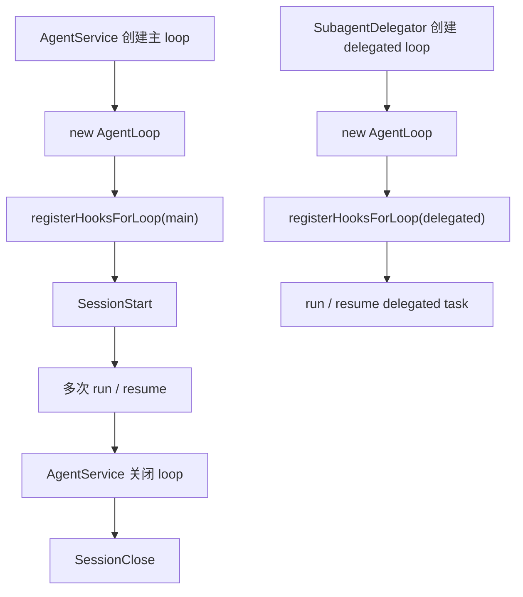
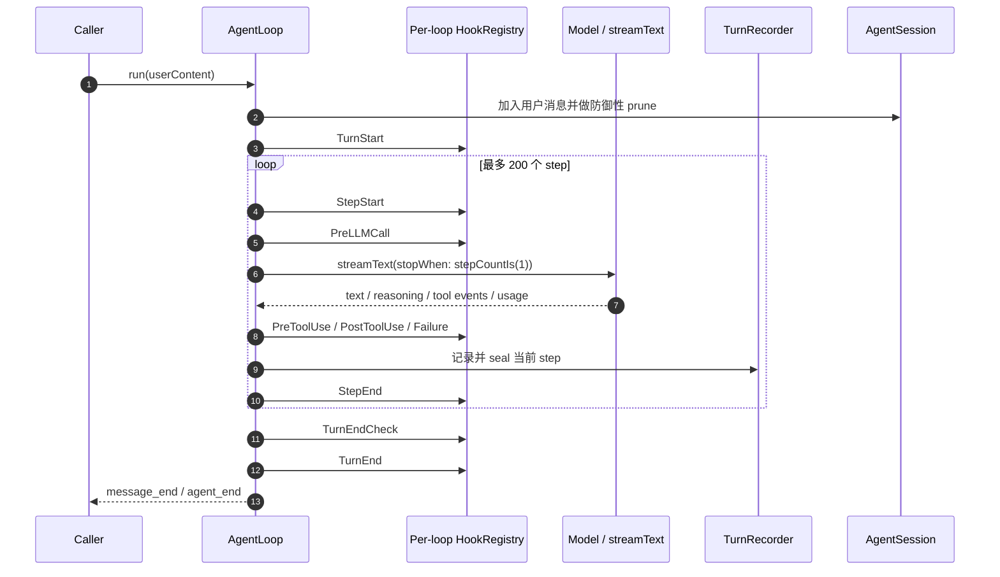
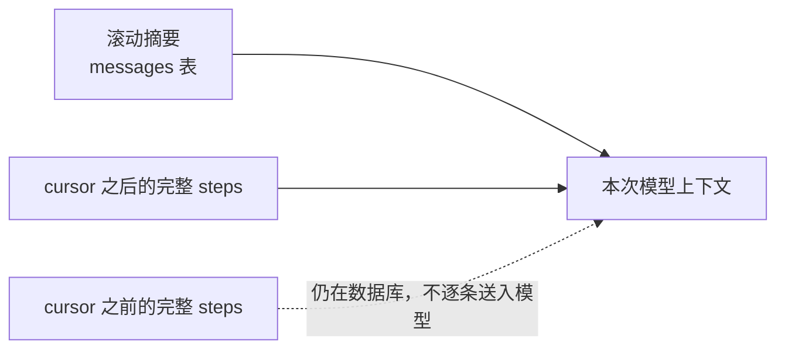

# 03 运行时引擎

> 本文按当前源码与测试重建。若本文与实现冲突，以 `src/runtime/agent-loop.ts`、`src/runtime/session.ts`、`src/server/agent-service.ts` 和相关测试为准。

## 1. 运行时由谁负责什么

| 组件 | 当前职责 | 关键源码 |
|---|---|---|
| `AgentService` | 创建、缓存、恢复和关闭主会话 loop；组装数据库、工具、MCP、项目与 Hook 依赖；把配置更新推给正在运行的 loop | [`agent-service.ts`](../../src/server/agent-service.ts) |
| `AgentLoop` | 驱动一次 turn 内的 step 循环、模型流、工具事件、重试、终止和恢复 | [`agent-loop.ts`](../../src/runtime/agent-loop.ts) |
| `AgentSession` | 从持久化步骤与压缩摘要构造模型消息；维护当前上下文视图和 token 估算 | [`session.ts`](../../src/runtime/session.ts) |
| `TurnRecorder` | 收集文本、思考和工具 block；在 step 边界形成可持久化记录；外置过大的工具结果 | [`turn-recorder.ts`](../../src/runtime/turn-recorder.ts) |
| `SubagentDelegator` | 创建 delegated loop、维护异步任务状态、传递受控上下文并收集结果 | [`subagent-delegator.ts`](../../src/runtime/subagent-delegator.ts) |
| `HookRegistry` | 保存单个 loop 的 Hook handler，合并 handler 结果并隔离 handler 异常 | [`hook-registry.ts`](../../src/core/hook-registry.ts) |

`server/index.ts` 是进程级组合根；`AgentService` 是主会话运行时的组合入口；`AgentLoop` 才是实际执行引擎。不要把这三个层次合并理解成一个类。

## 2. Loop 的创建与生命周期

主会话由 `AgentService` 创建。每个 loop 自带一个 `HookRegistry`，并在创建后通过 `registerHooksForLoop()` 接入对应 Hook：

- 所有 loop：turn 持久化、durable、工具执行记录、provider options、todo 清理、force-wait、压缩触发。
- 仅主 loop：输入队列、metrics。
- 仅 delegated loop：任务控制。

主 loop 的 `SessionStart` 与 `SessionClose` 由 `AgentService` 在实例创建和销毁时触发，不是每次 `run()` 都触发。delegated loop 的源码目前只明确注册了 delegated Hook；不要推断它也经过同一组 session 生命周期触发点。

运行中的 agent 配置可以由 `AgentService` 推送给 loop。`systemPrompt`、`toolPolicy`、subagents 和 wiki anchors 会在后续 turn/step 使用新值，不要求销毁会话重建。

## 3. 一次 turn 怎样运行

`run()` 接收字符串或结构化 `UserContent`，也支持 `ephemeral` turn。正常路径如下：

每个 step 只让 AI SDK 运行一个内部 step：`streamText({ stopWhen: stepCountIs(1) })`。外层 `AgentLoop` 决定是否进入下一步，因此 step 级持久化、重试和恢复都在应用层可见。

step 的核心判断是：

1. `StepStart` 和 `PreLLMCall` 可给本 step 追加控制消息，并提供 provider options。
2. 构建本 step 的工具集合，调用模型并消费流事件。
3. 工具调用会继续推动下一 step；没有工具调用时，先询问 `TurnEndCheck`。
4. `TurnEndCheck` 可以要求再运行一步，否则 turn 结束。
5. 最多运行 200 个 step，防止无限工具循环。

`StepStart`/`PreLLMCall` 的 `appendMessages` 会合并，而不是只保留最后一个 handler 的数组。它们只加入当前发往模型的消息，不会被误当成新的用户历史。

## 4. Hook 的真实触发面

### 4.1 Per-loop Hook

当前 `AgentLoop` 明确触发：

| 粒度 | 已接线事件 |
|---|---|
| Turn | `TurnStart`、`TurnEnd`、`TurnError`、`TurnEndCheck` |
| Step | `StepStart`、`StepEnd` |
| 模型调用 | `PreLLMCall`、`OnLLMError` |
| 工具流事件 | `PreToolUse`、`PostToolUse`、`PostToolUseFailure` |

`PostLLCall` 虽然存在于 Hook 类型中，但当前执行路径没有触发它。它是预留契约，不应在扩展代码里假定会执行。

`HookRegistry` 的结果合并规则不是统一的“最后写入获胜”：

- 数组字段连接起来，例如 `appendMessages`。
- 标量字段由后执行的 handler 覆盖。
- `blocked` 一旦出现就短路后续 handler。
- handler 抛错会被记录并吞掉，避免扩展故障直接击穿主执行循环。

### 4.2 遗留全局 Hook

代码中仍保留全局 `triggerHooks()`。工具工厂包装层以及部分观测、subagent、session 逻辑仍会使用它。因此现在实际是两套并存：

- per-loop registry：负责 loop 隔离和大部分运行时编排。
- global registry：仍承载工具包装层等旧接入点。

这不是两者语义完全相同的“双保险”。新增逻辑应先确认需要在哪个触发面运行，避免一次工具调用被重复处理，或只在某类调用宿主生效。

## 5. 流事件、工具事件与 step 落库

模型流中的主要事件会被转换为 UI/持久化需要的状态：

- `text-delta`、`reasoning-delta`：累计文本并发出增量事件。
- `tool-call`：创建 running 工具 block，触发 per-loop `PreToolUse`，发出 `tool_start`。
- `tool-result`：触发 per-loop `PostToolUse`，完成 block，发出 `tool_end`。
- `tool-error`：触发 per-loop `PostToolUseFailure`，标记失败并发出 `tool_end`。
- step 完成：校准 usage，`TurnRecorder.sealStep()`，随后触发 `StepEnd` 持久化。
- `abort`：显式标记中断；AI SDK 的 abort 流事件不保证以 rejected promise 表现。

成功完成的 step 会即时落库。turn 末尾的 `TurnEnd` 还承担收尾与 turn group 闭合，不能只依赖最终文本一次性保存整个 turn。

工具结果超过 16 KiB UTF-8 时，`TurnRecorder` 会把完整内容写到 `~/.zero-core/tool-outputs/<sha>.txt`，持久化 block 只保存虚拟路径和摘要。它与工具工厂按字符数截断模型返回值是两个不同层次，详见[工具子系统](./04-tools-subsystem.md)。

## 6. 错误、重试、中止与 Wait

单个 step 最多额外重试 3 次，基础退避为 1 秒。当前分类大致是：

- 可重试：timeout、rate limit、server error、network，以及可通过压缩缓解的 prompt-too-long。
- 立即失败：认证错误和无法识别的致命错误。

失败时先触发 `OnLLMError`；重试耗尽后进入 `TurnError` 并发出错误事件。重试针对失败的 step，不会从整个 turn 起点重新执行已经完成的工具调用。

用户中止是正常控制流：停止当前模型流和后续 step，但不伪造成终端故障；清理路径仍会发出 `agent_end`。

`Wait` 是 durable suspend 的一种业务状态。恢复时 `resume()` 从已持久化 step 和 checkpoint 继续，而不是重放完整会话。进程启动时，服务层还会恢复未完成 session/workflow，并清理由崩溃遗留的孤儿任务状态。

## 7. AgentSession 的持久化真值

旧文档把 `messages` 描述成 write-through 历史，这是错误的。当前模型是：

- `steps`：完整、可恢复的对话和工具执行真值。
- `messages` 表：压缩摘要块与 compression cursor。
- `AgentSession.getMessages()`：按摘要与 cursor 后步骤临时构造模型视图。
- `AgentSession.saveToDb()`：当前是兼容性 no-op，不代表消息历史会由它写入。

模型上下文是两区，不是三区：

当前用户 step 如果含图片，只有模型声明支持多模态时才以内联图片形式送入；历史和不支持的附件以元数据形式保留。不要假定所有 provider 都会收到相同的二进制内容。

`prune` 仍存在，主要作为内存预算与 prompt-too-long 的防御路径。它不会删除数据库中的完整 steps，也不是旧版多策略上下文管理器。

## 8. 压缩流程

压缩核心在 [`compression-core.ts`](../../src/server/compression-core.ts)，触发条件在 [`compression-trigger-hooks.ts`](../../src/runtime/hooks/compression-trigger-hooks.ts)。流程是：

1. 在 cursor 之后选取可压缩步骤，并保留新鲜尾部。
2. 基于既有滚动摘要生成新的固定结构摘要。
3. 原子写入摘要并推进 cursor。
4. 不删除原始 steps。

当上下文接近极限时，force compression 可以先运行一个 ephemeral memory turn，再执行压缩。ephemeral 表示这次模型交互用于运行时维护，不应被当成普通用户 turn 展示。

系统提示词中 base、wiki system anchors、work context 与 skills 段当前可以缓存，直到显式失效；“每个 turn 都重新读取全部系统段”的旧注释不是可靠契约。每 step 的输入队列、任务控制和 provider options 仍是动态注入。

## 9. Delegated task 的运行边界

`Subagent` 工具把任务交给 `SubagentDelegator`。delegated loop 使用目标 agent 的身份、模型和工具策略，并显式传入项目、wiki 与工作区上下文。

delegated session 不复用父会话的数据库 session id，因此不会把子任务步骤写进父 session。blocking 模式等待结果；non-blocking 模式通过 `TaskRegistry` 与 `Task`/`Wait` 协作。任务取消、中断和进程恢复都要以持久化任务状态为准，而不是只看内存 Promise。

## 10. 恢复入口

恢复分两层：

- `AgentLoop.resume()`：从某个会话的已完成 step 后继续模型执行。
- server 启动恢复：扫描不完整 session、workflow 与 delegated task，修正中断状态，再决定恢复或清理。

恢复代码依赖 step 即时持久化。如果以后调整 `StepEnd` 或工具结果落库时机，必须同时验证崩溃窗口、重复工具副作用和 Wait 恢复。

## 11. 当前边界与技术债

- runtime 与 server 存在双向依赖，`AgentLoop` 不是可独立发布的纯内核。
- per-loop 与全局 Hook 并存，扩展接入前必须确认调用宿主和去重语义。
- `PostLLCall` 已定义但未接线。
- 主 loop 的 session 生命周期触发点已确认在 `AgentService`；delegated loop 不应凭类型定义推断相同行为。
- `AgentSession.saveToDb()` 仍被保留但不写数据，调用点容易误导维护者。
- 一些源码注释仍描述旧的 turns/messages 或无缓存流程；测试和实际数据访问优先。

## 12. 修改运行时时必须守住的约束

1. 一个已完成 step 只能持久化一次，恢复后不能重放已经产生副作用的工具。
2. 压缩只能改变模型视图和 cursor，不能破坏完整 steps。
3. abort、Wait、错误和正常结束必须产生可区分的终态。
4. Hook handler 的失败不能默认击穿主 loop，但阻断结果必须明确可见。
5. 配置热更新必须在下一次合理边界生效，不能让一个正在消费的 step 混用两套配置。
6. 新增工具执行宿主时，必须说明它是否经过 per-loop Hook、全局工具包装和持久化记录。
