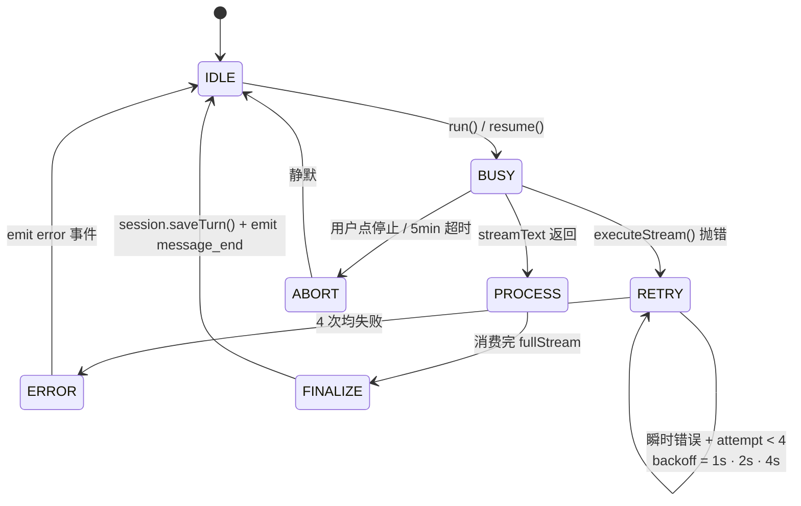
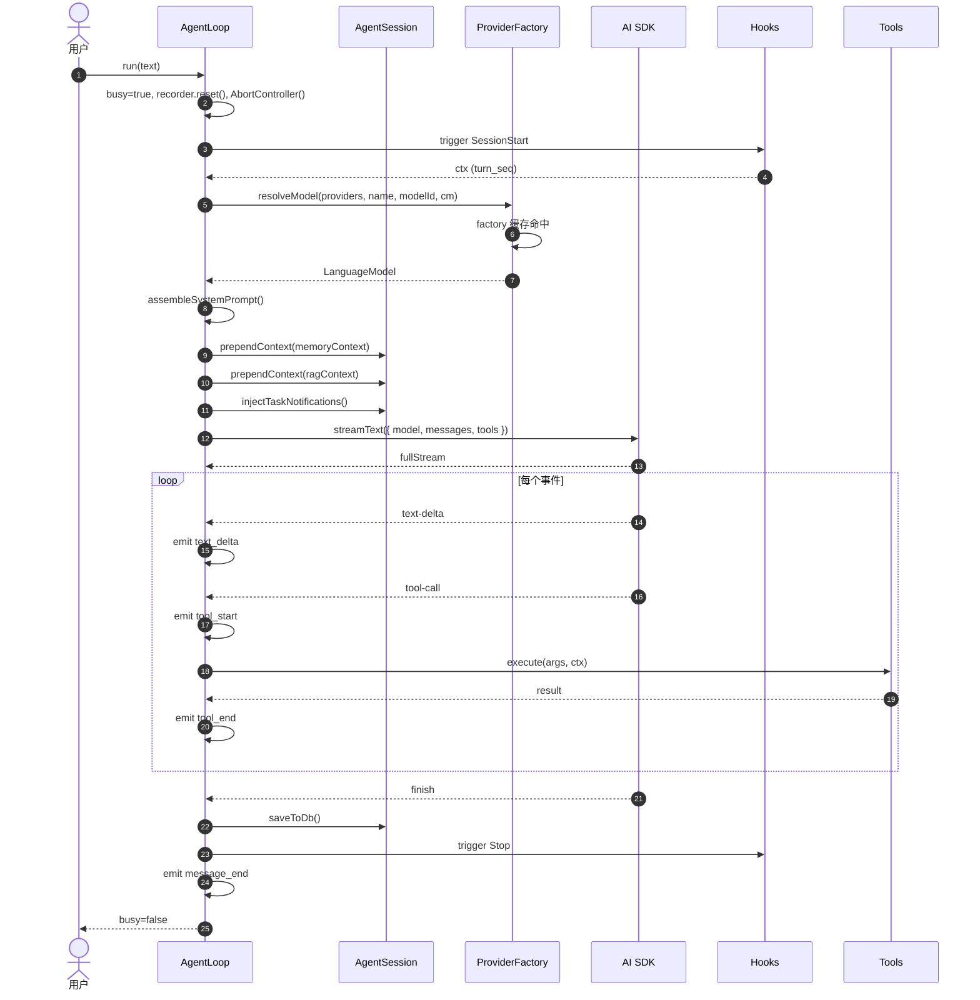
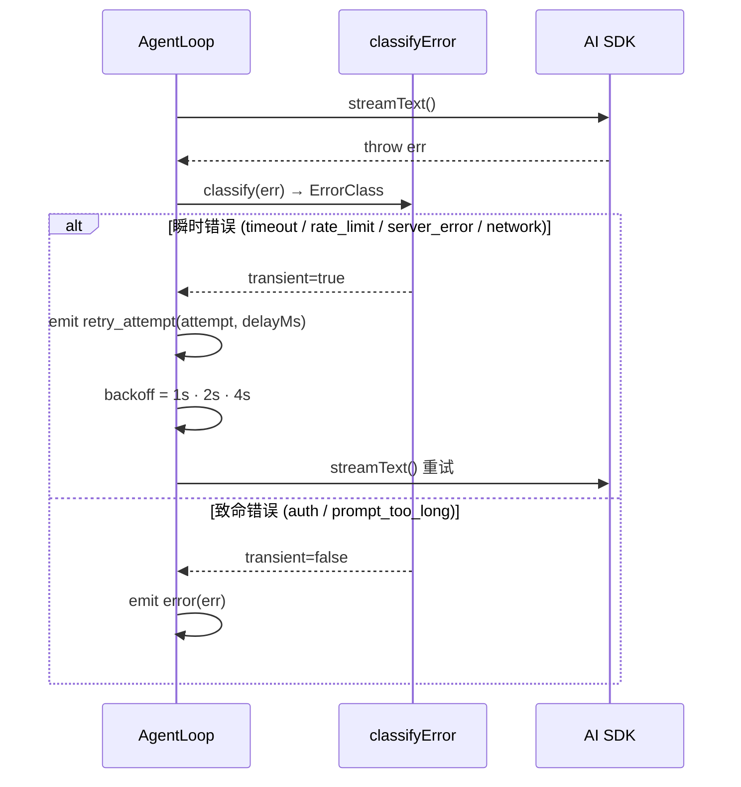

# 03 · 核心执行引擎

> 本文剖析 `AgentLoop`、`AgentSession`、`ProviderFactory` 三大件。这是系统的"心跳"。

## 1. 三件套的角色

| 组件 | 角色 | 行数 |
|------|------|------|
| `AgentLoop` | 单次会话的执行驱动：把 messages + tools + provider 喂给 `streamText()`，处理流式事件，emit StreamEvent | 约 700 |
| `AgentSession` | 该会话的**纯内存**消息数组 + token 估算 + pruning | 391 |
| `ProviderFactory.resolveModel()` | 根据 provider 名 + API key + baseUrl 创建并缓存 AI SDK LanguageModel 实例 | 165 |

辅助：
- `agent-utils.ts`（107）：错误分类（8 类）、MAX_RETRIES=3、`parseThinkingTags()`
- `turn-recorder.ts`（171）：流式 block 收集
- `checkpoint-manager.ts`（121）：检查点（**已被 hook 替代**）
- `compression-engine.ts`（309）：L1 摘要 + L2 记忆提取
- `memory-recall.ts`（64）：FTS5 召回
- `tool-rate-limiter.ts`（122）：单工具并发 + 间隔门控（已装载，在生产路径运行）
- `task-registry.ts`（186）：异步任务表
- `subagent-delegation.ts`（326）：子 Agent 委派工厂

## 2. AgentLoop 状态机



## 3. AgentLoop 关键代码剖析

### 3.1 构造（lines 77-118）

`AgentLoop` 构造时接收：

- `sessionConfig: SessionConfig` — 完整会话配置（agentId、systemPrompt、modelId、toolPolicy、providerName、thinkingLevel、sessionId、db、MCP getter、agent tool getter、tool config getter）
- `providers: RuntimeProviderConfig[]` — 全部已配置 provider
- `callbacks: RuntimeCallbacks` — `{ onEvent }` 单回调

构造期会创建：

- `AgentSession` — 内存消息数组，从 DB turn 表**重建**
- `SubagentDelegator` — 子任务委派上下文
- `SystemPromptAssembler` — 用于动态拼装系统提示词
- `TurnRecorder` — 流式 block 累积
- `AbortController = null` — 直到 `run()` 才创建

### 3.2 run() 入口（lines 122-173）

```
async run(userMessage):
  1. busy=true
  2. reset recorder / streamText / thinkingText / resultText
  3. abortController = new AbortController()
  4. timeout = setupTimeout()  ← 默认 5 分钟硬上限
  5. try:
       - trigger PreToolUse hook for user message  ← 不，直接走 runWithRetry
     runWithRetry()   ← 核心循环 + 重试
     finalizeStream()
  6. catch AbortError / DOMException → silently ignore
```

### 3.3 executeStream() — 真正的驱动（lines 326-379）

```
executeStream():
  messages = session.getMessages()
  if memoryContext: messages = prependContext(messages, memoryContext)
  if ragContext:    messages = prependContext(messages, ragContext)
  if toolNotifications: injectTaskNotifications(messages)

  model = resolveModel(providers, providerName, modelId, concurrencyManager)

  result = streamText({
    model,
    messages,
    system: assembleSystemPrompt(),
    tools: await buildTools(),  ← ALL_TOOLS ∪ MCP ∪ Agent
    abortSignal: abortController.signal,
    stopWhen: stepCountIs(50),
    providerOptions: { anthropic: {thinking:...}, google: {thinkingConfig:...} },
    experimental_transform: ...
  })

  await processStreamEvents(result)  ← 处理 text_delta/thinking/tool-call/result
  await finalizeStream(result)        ← 提取 messages, 持久化, 收尾
```

### 3.4 processStreamEvents() — 事件消费（lines 444-540）

逐个事件：

```
text-delta       →  streamText += text; emit text_delta;
reasoning-delta   →  thinkingText += text; emit thinking_delta;
tool-call         →  recorder.blocks.push({type:'tool', name, status:'running', args});
                    emit tool_start; persistBlocksSnapshot();
tool-result       →  找到对应 block → status='done'; result=output;
                    emit tool_end;
finish-step       →  recorder.sealStep(); (no emit)
error             →  throw (让 retry 处理)
```

**重点**：`tool-call` 和 `tool-result` 是 AI SDK 流里的事件，不是 StreamEvent。AgentLoop 把它们翻译成 `tool_start` / `tool_end`，由 ChatPanel 监听。

### 3.5 finalizeStream() — 收尾（lines 544-563）

```
resultText = await result.text
try: deletePartialTurn(sessionId)  ← 清理上次中断的检查点
recorder.sealStep()
response = await result.response
if response.messages: session.messages.push(...response.messages)  ← 把 AI SDK 的"内部"消息融入
session.saveToDb()  ← 全量覆盖 messages 表
emit message_end { text, contextUsage, contextWindow, estimatedTokens }
```

## 4. AgentSession — 消息生命线

### 4.1 三个字段

| 字段 | 含义 |
|------|------|
| `messages: ModelMessage[]` | 喂给 streamText 的数组，AI SDK 格式 |
| `cachedTurns: {seq, role, content, createdAt}[]` | DB turns 表的"原始块"快照，用于 UI 渲染 |
| `lastActualInputTokens: number \| null` | 从最近一次 API 响应校准的 token 数（用于精确上下文估算） |

### 4.2 重建策略（rebuildFromTurns()，lines 159-178）

会话构造时**总是**从 DB turns 表重建 messages。`messages` 表是 write-through 缓存，**不权威**。

```
对每个 turn:
  if role === 'user':
    push { role:'user', content: turn.content }
  elif role === 'assistant':
    blocks = JSON.parse(turn.content)
    appendAssistantMessages(blocks, messages)
      ├─ 收集 tool calls → 生成 tc-N（不沿用旧 ID，避免跨 Provider 格式冲突）
      ├─ 收集 tool results
      ├─ 收集 text
      └─ 输出 assistant message + 一组 tool messages
```

### 4.3 三种 pruning 策略（context-manager.ts）

| 策略 | 触发条件 | 行为 |
|------|----------|------|
| `tail` | `config.context.pruningStrategy === 'tail'` | 保留最后 N tokens |
| `turn-boundary` | 默认 | 按"完整 turn 边界"切除 |
| `smart` | `importanceScoring: true` | 用 `scoreMessage()` 给每条消息打分，保留高分 |

**重要**：三种策略都不会留下"孤立的 tool-call"，`applyPreserveToolResults()` 会把被切的 tool-call 关联的 tool-result 一起切掉或一起留。

### 4.4 自适应 token 估算

`estimateMessageTokens()` 用 `Math.ceil(text.length / 4)` 估算，**校准过**会改用 API 返回的 `lastActualInputTokens`。换言之：

```
校准前: total = Σ(messageTokens(m))
校准后: total = lastActualInputTokens  (API 实际报数)
```

这避免了"加文本超 1MB 错估为 250K tokens"的常见 LLM 应用坑。

## 5. ProviderFactory — 多 Provider 工厂

### 5.1 流程

```
resolveModel(providers, providerName, modelId):
  normalized = lowercase(sanitize(providerName))
  provider = find(providers, normalized)
  if !provider.enabled or !provider.apiKey → throw

  factory = getOrCreateProvider(provider)  ← 缓存 by (type:apiKey:baseUrl)
  model = factory(modelId)

  if concurrencyManager:
    queue = concurrencyManager.getQueue(providerName)
    if queue: await queue.acquire(abortSignal)
    // released in finally block

  return model
```

### 5.2 Provider 适配（getOrCreateProvider，lines 120-160）

```
type: "openai"     → createOpenAI({ apiKey, baseUrl })(modelId)
type: "anthropic"  → createAnthropic({ apiKey, baseURL })(modelId)
type: "gemini"     → createGoogleGenerativeAI({ apiKey, baseURL })(modelId)
type: "ollama"     → createOpenAI(...)  ← 假装 OpenAI（兼容模式）
type: "mock"       → new MockLanguageModelV3(...)
```

Ollama 用 OpenAI 兼容协议是一个常见但值得文档化的决定。

### 5.3 Concurrency 限流

每个 Provider 一个 FIFO semaphore（`ConcurrencyQueue`）。`acquire()` 接受 `AbortSignal` —— 用户点"停止"时排队中的请求会被 `reject(new DOMException('Aborted'))`。

## 6. 流式事件契约

`StreamEvent` 是**渲染层 + 后端层 + 数据持久层共同引用**的契约（定义在 `runtime/types.ts`）。完整列表：

| type | 含义 | payload |
|------|------|---------|
| `text_delta` | 增量文本 | `{ text }` |
| `thinking_delta` | 增量思考 | `{ text }` |
| `tool_start` | 工具调用开始 | `{ toolName, toolCallId, args }` |
| `tool_end` | 工具调用结束 | `{ toolName, toolCallId, isError, result }` |
| `message_end` | 模型一轮结束 | `{ text, contextUsage, contextWindow, estimatedTokens }` |
| `agent_end` | 整个 turn 结束 | — |
| `error` | 错误 | `{ error, errorClass? }` |
| `retry_attempt` | 重试 | `{ attempt, maxAttempts, delayMs, errorClass }` |
| `todos_update` | TodoWrite | `{ todos[] }` |
| `subagent_dispatched` | 子 agent 启动 | `{ taskId, task }` |
| `subagent_progress` | 子 agent 进度 | `{ taskId, step, toolName? }` |
| `subagent_completed` | 子 agent 完成 | `{ taskId, status, result? }` |
| `usage` | Token 累计 | `{ usage: {inputTokens, outputTokens, totalTokens, ...} }` |
| `session_init` | 会话初始化 | `{ messages[], inputTokens, outputTokens, totalTokens }` |
| `ask_user` | AskUser 工具 | `{ requestId, questions[] }` |
| `ask_user_result` | AskUser 回答 | `{ requestId, answers }` |

每个事件都带 `agentId?` 和 `sessionId?`，渲染层用它做 session-scoped 状态更新。

## 7. 错误分类与重试

`agent-utils.ts::classifyError()` 8 类：

```
AbortError, "timeout", "timed out", "abort"  → "timeout"
status 429, "rate limit", "too many"          → "rate_limit"
status 401/403, "unauthorized", "api key"     → "auth"
"context length", "too long", "exceed"       → "prompt_too_long"
status ≥ 500                                   → "server_error"
ECONNREFUSED, ENOTFOUND, ECONNRESET, fetch fail → "network"
otherwise                                     → "unknown"
```

`isTransientError()` 仅 `timeout | rate_limit | server_error | network` 会触发重试。`auth` 和 `prompt_too_long` 视为 fatal。

**重试策略**（`MAX_RETRIES = 3`, `BASE_DELAY_MS = 1000`，agent-utils.ts:29-30）：

```
attempt 0 → 直接调
attempt 1 → 延迟 BASE_DELAY * 2^0 = 1s
attempt 2 → 延迟 BASE_DELAY * 2^1 = 2s
attempt 3 → 延迟 BASE_DELAY * 2^2 = 4s
```

`runWithRetry()` 通过 `retry_attempt` StreamEvent 通知前端。

## 8. 关键时序图



错误时：



## 9. 与持久层的握手

`AgentLoop` 不直接操作 SQLite。它通过：

1. `AgentSession.saveToDb()` → `sessionStore.saveTurn(sessionId, messages)`（依赖注入的 `ISessionStore`）
2. `TurnRecorder.persistBlocksSnapshot()` → `db.upsertAssistantTurn(...)`（用于 UI 实时显示）
3. **Hook 系统**：写入 turn 由 `turn-hooks.ts` 的 `SessionStart`/`Stop`/`StopFailure` 处理；写入 turn_state 由 `durable-hooks.ts` 处理

**好处**：AgentLoop 不需要知道 SQLite 的存在。如果以后想换 MySQL / Postgres，只需要改 `server/session-db.ts`。

## 10. 架构师视角：这块做对了什么 & 可以改进什么

### 10.1 做对了的

- **接口隔离**：`ISessionStore` 让 runtime 完全无感于 SQLite。这是一个教科书般的"dependency inversion"。
- **流式事件即契约**：`StreamEvent` 是单一类型表，前后端都用它，无须定制 IPC envelope。
- **错误分类先于重试**：8 类错误 + 4 类 transient 是精心选的，足够覆盖大多数 LLM Provider 错误模式。
- **Hook 与上下文提取**：`turn-hooks` / `compression-hooks` / `extraction-hooks` / `wiki-anchor-injection` 把持久化、压缩、抽取、Wiki 记忆注入从 loop 主流程中拆出。`rag-hooks` 仍是 legacy optional hook，默认会话不会生效。

### 10.2 可以改进的

- `agent-loop.ts` 当前约 700 行。`processStreamEvents` 的 switch 可以拆出独立的"事件翻译器"模块（类似 Redux reducer）。
- `runWithRetry` 与 `executeStream` 是耦合的。如果以后想用 `generateText()` 走非流式路径，需要复制逻辑。可抽象成 `interface TurnDriver`。
- `AgentLoop` 直接依赖 `TurnRecorder`、`CheckpointManager`、`CompressionEngine` 五个以上 collaborator。可以做 DI 容器。
- 错误重试时**整个** prompt 重新发送，没有"上次已经成功"的标记。如果 Provider 支持 `idempotency-key`，应当利用。
- Wiki anchors 当前以索引/轮廓为主，节点内容读取依赖 `Wiki` 工具；后续可以增加更明确的节点选择和上下文预算策略。
