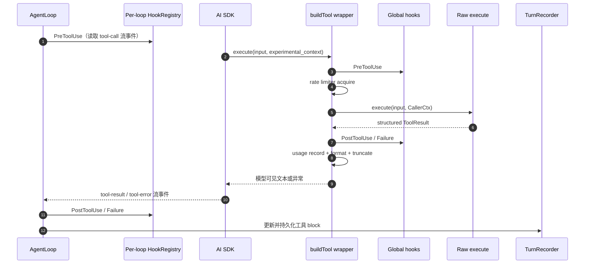
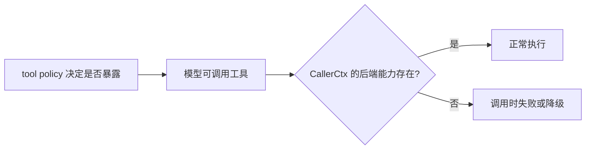

# 04 工具子系统

> 本文按当前 `src/tools`、工具策略、MCP manager 和调用宿主重建。工具名、启用规则与执行包装以源码和测试为准，不以旧截图或旧工具清单为准。

## 1. 三个容易混淆的“工具集合”

工具系统没有单一 registry 同时负责所有事情：

| 组件 | 负责什么 | 不负责什么 |
|---|---|---|
| `ALL_TOOLS` | 当前内置工具的可执行定义 | 不决定某个 agent 是否能看到工具 |
| `ToolRegistry` | descriptor、UI 元数据、配置和动态 MCP descriptor | 不是 AgentLoop 每 step 传给模型的最终工具表 |
| `buildToolsSet()` | 按 agent policy、caller context 与 MCP 状态构造本次模型调用的工具 map | 不保存 UI 配置 |

源码入口分别是 [`src/tools/index.ts`](../../src/tools/index.ts)、[`src/core/tool-registry.ts`](../../src/core/tool-registry.ts) 和 [`src/tools/tool-factory.ts`](../../src/tools/tool-factory.ts)。

## 2. 当前内置工具清单

`ALL_TOOLS` 当前有 22 个名称：

| 领域 | 工具 |
|---|---|
| 文件与命令 | `Shell`、`Read`、`Write`、`Edit`、`Grep`、`Glob` |
| Web 与交互 | `WebSearch`、`WebFetch`、`AskUser` |
| 会话与任务 | `Subagent`、`Task`、`Wait`、`TodoWrite`、`SequentialThinking` |
| 工作编排 | `Orchestrate`、`Project`、`Work`、`Flow` |
| 管理与平台 | `AgentRegistry`、`Cron`、`Wiki`、`Platform` |

这份名称列表是协议面。旧文档中的 `Agent`、`Assistant` 或多个拆分管理工具已经不是当前对模型暴露的主名称；兼容迁移由 `RENAMED_TOOLS` 处理。

## 3. 工具定义与返回契约

内置工具通过 `buildTool()` 声明：

- 名称、描述、输入 Zod schema 和 descriptor metadata。
- 原始 `execute(input, ctx)`。
- 必需的 `format(result)`，把结构化 `ToolResult` 转成给模型看的文本。
- 可选执行配置，例如限流和最大结果字符数。

原始执行返回结构化结果；AI SDK 包装层会把 `{ ok: false }` 转成异常，并只把 `format()` 后的文本交给模型。工具作者不能假设 `execute()` 返回的对象会原样成为 LLM tool result。

`CallerCtx` 携带当前 agent/session/project/workspace 身份、事件发射器和可选能力 accessor。工具应通过它访问宿主能力，不应自行从全局单例猜测调用者。

## 4. 策略的精确启用规则

六个默认工具是：`Shell`、`Read`、`Write`、`Edit`、`Grep`、`Glob`。

内置工具启用逻辑按以下顺序执行：

```text
如果 name 在 blockedTools：禁用
否则如果 policy.tools 存在：
  若 map 中有 name：使用该项 enabled
  若 map 中没有 name：仅默认六工具启用
否则如果 autoApprove 包含 "*"：启用
否则如果 autoApprove 非空：仅启用列表内工具
否则：仅默认六工具启用
```

因此，`policy.tools` 存在时，它优先于 `autoApprove`；但 map 中缺少的名字不是一律禁用，而是回退到默认六工具规则。

`blockedTools` 是最终否决项。旧名称会先通过 `RENAMED_TOOLS` 迁移，以兼容历史配置。

### 4.1 MCP 工具的差异

外部 MCP 工具合并到最终工具 map 时只受 `blockedTools` 过滤，不受内置工具的 `policy.tools`/`autoApprove` 选择规则约束。这是当前实现事实，不要把内置策略的默认安全语义自动推广到 MCP。

`AgentService` 还复制了一份工具 enabled 判断，用来决定是否向上下文注入相应 capability；最终工具集合仍由 `buildToolsSet()` 决定。两处逻辑必须保持同步，这是已知 drift 风险。

## 5. AgentLoop 中的执行链



这里存在两个触发面：

- 工具工厂包装层使用遗留全局 Hook，负责执行前阻断、限流、遥测、格式化和字符截断。
- `AgentLoop` 根据模型流事件触发 per-loop Hook，负责 loop 隔离、block 状态与持久化。

两者触发时机和输入并不完全相同。新增审计或策略 Hook 时必须明确放在哪一层，不能假定注册一次就覆盖所有调用宿主。

工具包装层的主要步骤是：

1. 从 AI SDK `experimental_context` 构造调用上下文。
2. 触发全局 `PreToolUse`；若返回 blocked，则不执行原始工具。
3. 按工具配置获取 rate-limit slot。
4. 调用原始 `execute()`。
5. `{ ok: false }` 转异常；分别触发全局成功或失败 Hook。
6. 记录 usage，并在 `finally` 释放 limiter。
7. `format()` 后按 `meta.maxResultSize` 截断，默认上限约 30,000 字符。

## 6. 两种“过大结果”处理

系统有两个不同限制：

| 层次 | 目的 | 当前行为 |
|---|---|---|
| 工具工厂 | 控制一次 tool result 喂给模型的长度 | 对 `format()` 后文本按字符数截断 |
| `TurnRecorder` | 控制数据库 block 大小并保留完整可追溯内容 | 超过 16 KiB UTF-8 时，完整内容外置为 content-addressed 文件 |

外置文件位于 `~/.zero-core/tool-outputs/<sha>.txt`。持久化内容引用 `[tool-outputs]/...` 虚拟路径，`Read` 工具负责安全解析这一命名空间。

工具配置里的 `resultMaxTokens` 当前没有发现运行时消费点；实际包装层使用的是 descriptor/factory 的最大字符数。不要把 UI 字段当成已生效的 token 限制。

## 7. 不同调用宿主并不等价

### 7.1 AgentLoop / AI SDK

这是完整路径：策略筛选、MCP 合并、全局工具包装、per-loop Hook、流事件、TurnRecorder 与 step 持久化都在场。

### 7.2 UI `/api/tool-run`

[`tool-dispatcher.ts`](../../src/server/tool-dispatcher.ts) 直接取得原始 `execute()`，返回结构化 JSON。它不会自动经过 AgentLoop 的 per-loop Hook、AI SDK 包装层的 `format()`/限流/全局 Hook，也不会生成会话 step。

dispatcher 可找到全部 `ALL_TOOLS`，但依赖 loop/session 能力的工具在缺少对应上下文时可能拒绝或降级。它不是“模拟一次模型工具调用”的调试接口。

### 7.3 MCP caller

MCP 工具经 adapter 转成 AI SDK tool，但失败目前会转换为错误文本，而不是像内置工具 `{ ok: false }` 那样统一抛错。这会影响 `tool-error` 事件和失败 Hook 语义。

## 8. MCP 接入

[`mcp-manager.ts`](../../src/server/mcp-manager.ts) 负责连接配置、列举工具、缓存和 descriptor 注册：

1. 读取启用的 server 配置，并按 `agentIds` 过滤可见性。
2. `stdio` 使用子进程 transport；`sse` 与当前名为 `streamable-http` 的配置都走 SSE client adapter。
3. 连接后调用 `listTools()`。
4. 对外名称限定为 `mcp__<serverName>__<toolName>`，避免不同 server 的原始工具名冲突。
5. 把 JSON Schema 浅层转换为 Zod，并通过 MCP client 执行。

已连接 server 的工具可直接使用；工具列表缓存 TTL 为 5 分钟。当前 schema 转换器只覆盖常见浅层类型，复杂对象和数组会退化为较宽松的 unknown/record 约束。接入要求严格 schema 的 MCP server 时要补针对性测试。

## 9. 条件能力与上下文

当前只有 tool policy 决定工具是否暴露给模型；旧的 `CONDITIONAL_TOOLS` 二次隐藏层已经删除。部分工具执行时仍要求 `CallerCtx` 中存在管理服务、delegation、项目或 wiki 等 capability：



`AgentService` 只为 policy 已启用的相关工具注入 capability，并在 backing service 缺失时告警；工具仍可能被提供给模型，随后在调用时失败。主 agent、delegated loop 和 UI dispatcher 即使面对同名工具也可能有不同结果，文档或测试必须说明调用宿主。

## 10. `AskUser` 与长时间交互

`AskUser` 通过 [`pending-responses.ts`](../../src/runtime/pending-responses.ts) 建立 request id 到 Promise resolver 的映射：工具发出 `ask_user` 事件，renderer 通过 API 回传答案，server 再 resolve 原 Promise。

这是进程内 pending 状态，不等同于 durable `Wait`。进程退出时不能假定未回答的 `AskUser` 会像已落库任务一样恢复。

## 11. 旧名称与配置迁移

历史策略可能保存旧工具键。`RENAMED_TOOLS` 在运行时迁移常见别名，例如旧的 `Agent` 到 `Subagent`、`Assistant` 到 `Platform`，以及部分 task/flow 名称。新增重命名时需要同时验证：

- 已保存 agent policy。
- `ToolRegistry` 配置。
- `blockedTools` 与 `autoApprove`。
- UI 显示名称和能力判断。

不要通过同时注册新旧两个可执行工具来兼容，否则模型可能看到重复能力。

## 12. 新增内置工具的检查表

1. 使用 `buildTool()` 定义 schema、原始结果、`format()` 和 descriptor。
2. 把工具加入 `ALL_TOOLS`，确认名称不会与 MCP 限定名或旧别名冲突。
3. 决定它是否属于默认六工具；通常新工具不应隐式进入默认集合。
4. 如依赖宿主能力，明确 `CallerCtx` 条件和无能力时的错误语义。
5. 分别测试 AgentLoop 路径和需要支持的其他宿主；不要只测 raw `execute()`。
6. 测试 `{ ok: false }`、抛错、超长结果、abort、限流释放和持久化 block。
7. 如涉及 MCP，测试限定名、agent 过滤、重连和复杂 schema。

## 13. 当前边界与技术债

- `executionMode` 与 `resultMaxTokens` 会随配置传递，但当前没有确认到实际运行时消费者。
- 工具 enabled 规则在 `buildToolsSet()` 与 `AgentService` capability 注入处重复。
- per-loop 与全局工具 Hook 并存，存在遗漏或重复执行风险。
- UI dispatcher 暴露全部 raw 工具，但不具备完整 loop 上下文和包装语义。
- MCP 错误返回文本，和内置工具异常路径不一致。
- MCP JSON Schema 转换较浅，复杂输入的运行时校验弱。
- `src/tools` 直接依赖部分 runtime/server 能力，工具层不是纯粹的叶子模块。

## 14. 必须守住的约束

1. `blockedTools` 必须在任何模型可见工具集合里最终生效。
2. 工具副作用失败不能伪装成成功文本；不同宿主的错误差异必须显式记录。
3. limiter slot 在成功、失败和 abort 后都必须释放。
4. 外置工具输出必须保持 content-addressed、可审计且受路径保护。
5. 工具配置、descriptor、实际执行限制三者不能只更新其中一处。
6. 新调用宿主必须说明是否经过 policy、全局包装、per-loop Hook 和持久化。
