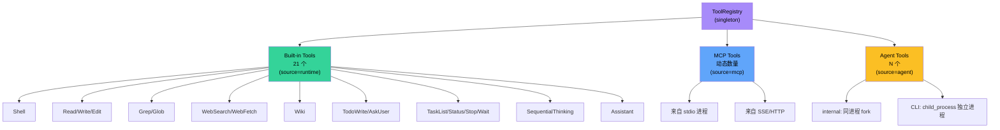
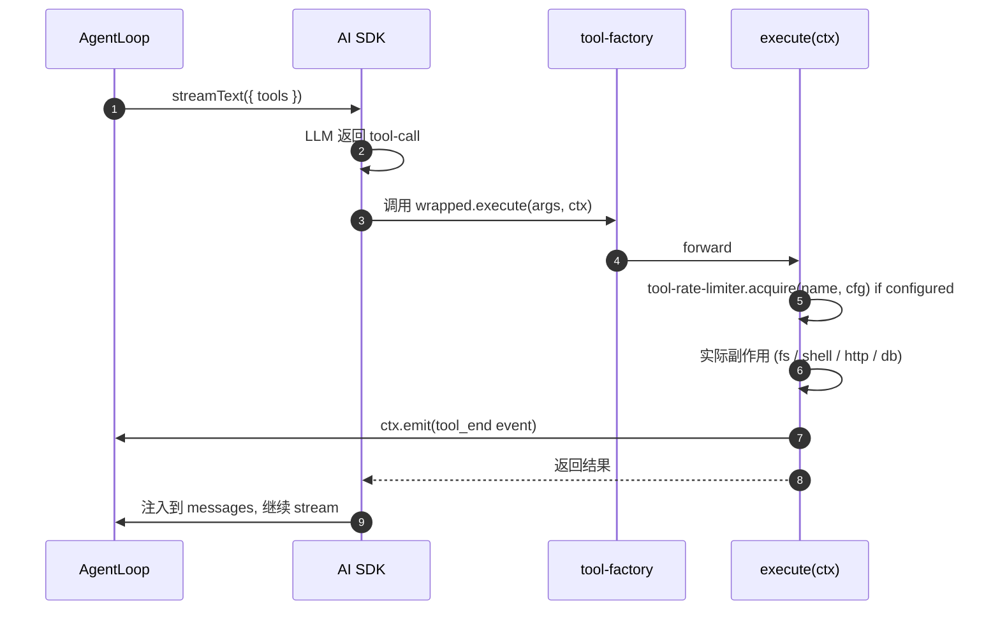

# 04 · 工具子系统

> Zero-Core 的能力完全体现在它的工具集里。本文从架构师视角分析工具的分类、注册、执行、隔离、限流。

## 1. 三层工具分类



证据：
- `core/tool-registry.ts:29-38` `ToolCategory = runtime | task | web | memory | thinking | assistant | interaction | mcp | agent`
- `runtime/tools/index.ts:62-83` `ALL_TOOLS` 字典
- `runtime/tools/index.ts:102-123` `registerRuntimeTools(registry)`
- `runtime/mcp-tool.ts:110-126` `buildMcpTools(mcpTools, callTool)` MCP → AI SDK
- `runtime/tools/agent-tool.ts:77-260` `buildAgentTools()` 把其他 Agent 包装成工具

## 2. buildTool 工厂 — 所有工具的"宪法"

`runtime/tools/tool-factory.ts:92-211` 是工具的统一入口。每个工具都通过它声明：

```
buildTool({
  name:        "Shell",
  description: "Execute a shell command",
  prompt:      "<工具应该何时调用、如何调用的多行提示>",
  meta:        { category, isReadOnly, isDestructive, isConcurrencySafe, requiresConfirmation },
  configSchema: [{key, type, label, default, options, required}],
  inputSchema: z.object({...}),     ← Zod schema，AI SDK 校验
  execute:     async (args, ctx) => {...},
})
```

`buildTool` 在内部封装为 AI SDK 的 `tool(...)`，并把 `meta` / `configSchema` / `prompt` 挂在 `__meta` 等私有符号上，便于 `getToolMeta(def)` / `getToolConfigSchema(def)` 等反射函数读取。

### 2.1 ctx — ToolExecutionContext

工具的 `execute(args, ctx)` 第二个参数携带工具运行所需的一切：

```
ToolExecutionContext {
  agentId, sessionId,
  workspaceDir,                     ← cwd
  toolConfig: Record<name, Record<key, value>>,  ← 用户配置的字段值
  db: ISessionStore,                ← 通过 ctx.db 访问 SQLite
  emit: (StreamEvent) => void,      ← 推送事件给前端
  delegateTask?,                    ← 只有 Agent 工具有效
  getTaskResult?, listTasks?, stopTask?,
  suspendUntilWake?,                ← 只有 Wait 工具使用
  ...
}
```

这是一种 **显式依赖注入**模式，没有"全局状态"。工具的可测试性高（mock ctx 即可单测）。

### 2.2 zod schema 反射

`extractInputFields()`（`tool-factory.ts:249-273`）能解析 Zod schema 成 `{ key, type, description, required, defaultValue }[]`，供前端动态生成表单。**这是关键的"前后端一致"机制**：工具定义在前端（用于 UI）与在后端（用于校验）是同一份。

## 3. 内置 21 个工具的分类矩阵

| 工具 | Category | 副作用 | 危险 | 并发安全 | 关键能力 |
|------|----------|--------|------|----------|----------|
| Shell | runtime | ✅ 写 | ❌ | ✅ | Git Bash 检测 / cmd.exe 翻译 |
| Read | runtime | ❌ | ❌ | ✅ | 文本 / 图片 / PDF / ipynb / outline |
| Write | runtime | ✅ 写 | ⚠️ | ❌ | syntax check 阻断破坏性写入 |
| Edit | runtime | ✅ 写 | ⚠️ | ❌ | 精确匹配 + 错误诊断（空白/换行提示）|
| Grep | runtime | ❌ | ❌ | ✅ | ripgrep 风格搜索 |
| Glob | runtime | ❌ | ❌ | ✅ | 文件路径匹配 |
| Agent | runtime | ✅ 写 | ❌ | ❌ | 子 Agent 委派 |
| TaskStatus | task | ❌ | ❌ | ✅ | 查询后台任务 |
| TaskList | task | ❌ | ❌ | ✅ | 列任务 |
| TaskStop | task | ✅ 写 | ⚠️ | ✅ | 终止任务 |
| Wait | task | ❌ | ❌ | ✅ | 事件驱动等待 |
| WebSearch | web | ❌ | ❌ | ✅ | 4 后端 |
| WebFetch | web | ❌ | ❌ | ✅ | Markdown + Cookie + 浏览器渲染 |
| Wiki | memory | ✅ 写 | ❌ | 视 action 而定 | Wiki tree 读取、搜索、写入、维护 |
| SequentialThinking | thinking | ❌ | ❌ | ✅ | 思维链 |
| TodoWrite | interaction | ✅ 写 | ❌ | ❌ | todo 状态机 |
| AskUser | interaction | ❌ | ❌ | ✅ | 提问双向通道 |
| Assistant | assistant | ❌ | ❌ | ✅ | 应用诊断 |

> 说明：`MemoryRecall` / `MemoryNote` 已从 `ALL_TOOLS` 移除；当前记忆操作统一通过 `Wiki` 工具进入 Wiki tree。`runtime/mcp-tools/memory-tools.ts` 中的旧 `MemoryRead` / `MemoryWrite` 文件仍存在，但不是默认运行工具。

## 4. MCP 工具的接入

### 4.1 连接模型

`server/mcp-manager.ts:55-240` 维护：

```
servers: Map<serverId, ConnectedServer>   ← 活跃连接
toolCache: Map<serverId, {tools, expires}> ← 5 分钟缓存
```

启动时调用 `reconnectEnabled(configs)` 并行连接所有 enabled 服务器。

### 4.2 transport 抽象

```
transport === 'stdio':
  transport = new StdioClientTransport({ command, args, env })
transport === 'sse' | 'streamable-http':
  transport = new SSEClientTransport(new URL(url), { requestInit: { headers } })
```

`connect()` → `client.connect(transport)` → `client.listTools()` → 注册到 `ToolRegistry`（source: "mcp"）。

### 4.3 工具调用桥

`runtime/mcp-tool.ts:34-60` `createMcpTool(qualifiedName, description, inputSchema, serverId, serverName, callTool)` 把 MCP 工具描述转为 AI SDK 工具。`qualifiedName = mcp__<serverName>__<toolName>`。

调用时通过注入的 `callTool(serverId, toolName, args)` 委托给 `MCPManager.callTool()`，由它路由到具体的 `client.callTool({ name, arguments })`。

### 4.4 外部 MCP 扫描

`server/mcp-scanner.ts:128-172` 启动期扫描以下来源：
- Claude Desktop: `~/.claude/claude_desktop_config.json`
- Cursor: `~/.cursor/mcp.json`
- MarsCode: `~/.marscode/vscode.mcp.config.json`
- Fitten: `~/.fitten/mcp_settings.json`
- VSCode 工作区: `<workspace>/.vscode/mcp.json`
- VSCode 全局（Windows）: `~/.vscode/...`

### 4.5 预设服务器

`server/mcp-presets.ts:16-57` 列出 3 个 Z.AI 预设（WebSearch / WebReader / Zread）。`buildPresetConfig()` 把模板展开为 `McpServerConfig`。

## 5. Agent-as-a-Tool — Agent 工具

`runtime/tools/agent-tool.ts:77-260` `buildAgentTools()` 把其他 Agent 暴露为工具：

- **internal 类型**：同进程内 fork AgentLoop 子实例执行（最常见）
- **CLI 类型**：通过 `child_process.execFile()` 启动独立 Node.js 子进程执行（沙箱化）

类型差异决定隔离级别。`internal` 共享同一 `SessionDB`，但有独立 session；`cli` 完全独立的数据库与运行时。

## 6. buildToolsSet — 工具策略层

`runtime/tools/index.ts:125-203` 是**工具策略中枢**，每次循环构造 `streamText()` 的 tools 对象时调用：

```
buildToolsSet(policy, ctx, mcpTools, agentTools):
  1. 迁移旧版 lowercase 工具名到 PascalCase (RENAMED_TOOLS)
  2. blocked = policy.blockedTools ?? []
  3. 对每个 ALL_TOOLS:
       if blocked: skip
       if CONDITIONAL_TOOLS[name] && !condition(ctx): skip  ← Agent 工具需 delegateTask
       if isEnabled(name): 加入 tools
  4. 合并 mcpTools（总是启用，除非 blocked）
  5. 合并 agentTools（按 isEnabled）
```

`isEnabled()` 决策树：
```
if policy.tools[name] !== undefined → 用 tools map
elif autoApprove === ['*']           → true
elif autoApprove.length > 0          → 自动批准列表内
else                                  → DEFAULT_ENABLED（Shell/Read/Write/Edit/Grep/Glob）
```

这是"默认安全"原则：未配置时只暴露 6 个核心 FS 工具。

## 7. 工具配置持久化

`ToolRegistry`（`core/tool-registry.ts:89-211`）的 KV 存储：

```
KV_KEY = "tool_config"
saveToolConfig({ "Shell": { "auto_approve": true }, ... })
  → JSON 写入 kv_store[tool_config]
```

启动时 `loadConfig()` 自动加载。

`buildEffectivePrompt(desc, config)` 把当前配置值附加到工具的 prompt 上，让 LLM "看见"自己的限制：

```
"Shell — Execute a shell command.

Current config: Auto Approve=true, Timeout=30000"
```

这是 **"prompt-as-config"** 模式：不需要修改工具实现就能调整行为。

## 8. 工具执行链路



## 9. 安全边界

| 维度 | 现状 | 评估 |
|------|------|------|
| 文件路径 | `file-read` / `file-write` / `file-edit` 的 `resolvePath()` 检查 workspaceDir 前缀 | ⚠️ 默认 `restrictToWorkspace = false`，需要按 agent 显式开启 |
| 敏感文件 | `assistant-tools.ts:29` `BLOCKED_FILES` 列表（.env / credentials.json / secret） | ⚠️ 仅 Assistant 工具生效，其他工具不挡 |
| Shell 黑名单 | `bash.ts` 有 `CMD_TRANSLATIONS` 和 `UNIX_ONLY_COMMANDS` 提示 | ❌ 不构成黑名单，只是翻译 |
| 工具白名单 | `evaluateToolCall()` 支持 `allowedTools` 和 `blockedTools` | ✅ 配置可强制 |
| 工具确认 | `meta.requiresConfirmation` 字段 | ⚠️ 字段已声明，但 `agent-loop.ts` 未读取（细节未走通） |
| 权限请求 | `PermissionRequest` / `PermissionDenied` hook 已定义 | ⚠️ 当前未注册 handler |
| 重试风暴 | 错误分类 + MAX_RETRIES=3 + 指数退避 | ✅ 良好 |
| 工具限流 | `tool-rate-limiter.ts` 已实现 | ✅ 已在生产路径运行 |

**架构师建议**：补一份"工具安全矩阵"清单，给出每个工具的"默认允许 / 默认拒绝 / 需要确认"决策。

## 10. AskUser — 跨进程双向通道

`runtime/tools/ask-user.ts:35-79` + `runtime/pending-responses.ts` 实现一个**Pending → Resolved Promise 表**：

```
执行时:
  requestId = uuid()
  promise = new Promise((resolve, reject) => map.set(requestId, {resolve, reject}))
  ctx.emit({ type:'ask_user', requestId, questions })
  return await promise

前端回答时:
  api.askUserResponse(requestId, answers) → HTTP → server → pendingResponses.resolveRequest(rid, ans)
  → promise resolves → 工具返回
```

这种模式可以推广到所有"需要人介入"的工具（HITL）。

## 11. SequentialThinking — 思维链工具

`runtime/mcp-tools/sequential-thinking-tools.ts:28-75` 是一个状态机工具：

```
thoughtHistories: Map<agentId, [{thought, thoughtNumber, totalThoughts, status}]>
```

工具调用顺序：
1. 第一轮：创建链头
2. 后续轮：追加思考、修订总步骤数
3. 最终轮：标记 nextThoughtNeeded=false

**亮点**：让 LLM "反悔"——可在过程中修改 `totalThoughts`、插入分支。

## 12. 架构师视角

### 12.1 做对了的

- **统一工具抽象**：`buildTool` 工厂把 21 个工具收口到一种声明形式。前端表单生成、后端校验、UI 提示、配置注入全靠它。
- **三层分类**：built-in / MCP / Agent-as-a-Tool 物理隔离，但行为接口统一。
- **策略与执行分离**：`buildToolsSet` 处理"要不要给 LLM"，`ToolRegistry` 处理"工具元数据"，`buildTool` 处理"如何执行"——三层互不耦合。

### 12.2 可以改进的

- `meta.requiresConfirmation` 当前只是元数据，没有"执行前弹窗确认"机制。
- 21 个工具是**异构**的（fs / shell / web / db / mcp），文档应按 domain 组织而非平铺。
- "阻塞 / 非阻塞 Agent" 工具的语义对 LLM 不显然。`delegateTask` 的参数 schema 可加更多示例。
- `Agent-tool` 的 `internal` 模式会**共享 DB**，可能导致跨 agent 写竞争。需要在 `subagent-delegation.ts` 里加锁或事务。

## 13. 一图总览

```
                    ┌──────────────────────────────────────┐
                    │ ToolRegistry (singleton)             │
                    │  - register/unregister               │
                    │  - getAll/getByCategory/getByName     │
                    │  - getToolConfig/saveToolConfig      │
                    │  - notifyChange() → React refresh    │
                    └──────────────────────────────────────┘
                                  ▲
        ┌─────────────────────────┼─────────────────────────────┐
        │                         │                             │
┌───────┴──────┐         ┌────────┴────────┐           ┌────────┴────────┐
│ ALL_TOOLS    │         │ MCP tools       │           │ Agent tools    │
│ runtime/tools│         │ runtime/mcp-    │           │ runtime/tools/ │
│              │         │ tools + server/ │           │ agent-tool.ts  │
│ 21 entries   │         │ mcp-manager.ts  │           │ buildAgentTools│
└───────┬──────┘         └────────┬────────┘           └────────┬────────┘
        │                         │                             │
        └─────────────────────┬───┴─────────────────────────────┘
                              │
                  ┌───────────▼─────────────┐
                  │ buildToolsSet(policy,   │
                  │   ctx, mcp, agent)     │
                  │  → Record<name, Tool>  │
                  └───────────┬─────────────┘
                              │
                  ┌───────────▼─────────────┐
                  │ streamText({tools})    │
                  │   Vercel AI SDK        │
                  └─────────────────────────┘
```
