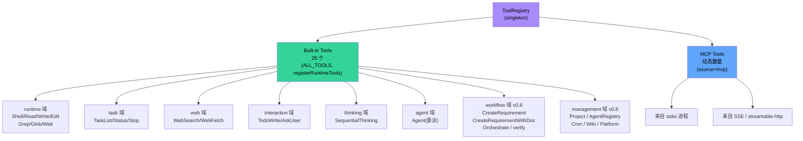
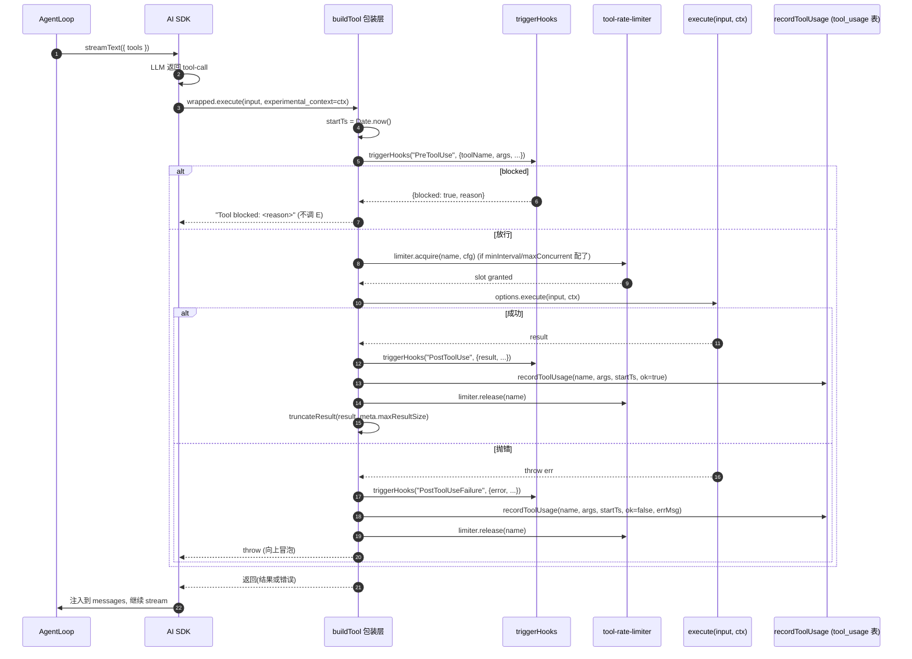

# 04 · 工具子系统

> Zero-Core 的能力完全体现在它的工具集里。本文从架构师视角分析工具的分类、注册、执行、隔离、限流。

## 1. 工具的物理来源与语义分类



> **v0.8 重要变更**：原"Agent Tools(internal/CLI)"第三层已**取消**。子 Agent 委派回归到单一 `Agent` action 工具(`runtime/tools/agent.ts`)，不再 per-subagent 各起一个工具，也不再区分 internal/CLI 两种隔离级别。原 8 个 zero-admin 工具(CreateAgent / InstantiatePreset / SetToolPolicy / …)合并为 4 个 action 工具(`Project` / `AgentRegistry` / `Cron` / `Wiki`)；原 `Assistant` 通用诊断工具改名为 `Platform`(经 `RENAMED_TOOLS` 运行时迁移)。所以现在**只有两层物理来源**：内置 `ALL_TOOLS` + 动态 `MCP`。"三层分类"指**语义分类(category)**——见下文 §3 矩阵。

证据(行号相对当前 src/)：
- `core/tool-registry.ts:65-76` `ToolMeta` 含 `category` 字段；`RENAMED_TOOLS` 同文件 `:76` 起定义(含 `Assistant → Platform` 迁移映射)。
- `runtime/tools/index.ts:70-110` `ALL_TOOLS` 字典(25 个条目)。
- `runtime/tools/index.ts:140-160` `registerRuntimeTools(registry)` —— 注册时把 ToolMeta 一并写入(`:157`)。
- `runtime/tools/index.ts:112-126` `CONDITIONAL_TOOLS` —— 按 ctx 能力(delegateTask / management / wikiStore / pmService / requirementStore)门控的工具白名单。
- `runtime/mcp-tool.ts` `createMcpTool()` + `MCPManager.callTool()` 桥(见 §4)。
- `runtime/tools/agent.ts:46` `delegateTool`(name=`Agent`，子 Agent 委派，action=list/delegate)。
- `runtime/tools/agent-tool.ts:165` `agentTool`(name=`AgentRegistry`，全局 Agent 注册表 CRUD，7 个 action)。**两个工具同名前缀但语义完全不同**——见 §5。

## 2. buildTool 工厂 — 所有工具的"宪法"

`runtime/tools/tool-factory.ts:163-273`(`buildTool` 主体)是工具的统一入口。每个工具都通过它声明：

```
buildTool({
  name:        "Shell",
  description: "Execute a shell command",
  prompt:      "<工具应该何时调用、如何调用的多行提示>",
  meta:        { category, isReadOnly, isDestructive, isConcurrencySafe },
  configSchema: [{key, type, label, default, options, required}],
  inputSchema: z.object({...}),     ← Zod schema，AI SDK 校验
  execute:     async (args, ctx) => {...},
})
```

`buildTool` 在内部封装为 AI SDK 的 `tool(...)`，并把 `meta` / `configSchema` / `prompt` 挂在 `__meta` / `__configSchema` / `__prompt` 等不可枚举属性上，便于 `getToolMeta(def)` / `getToolConfigSchema(def)` 等反射函数读取(同时不影响 AI SDK 序列化)。

### 2.0 buildTool 内置的横切关注点(v0.8 新增)

`buildTool` 的 `execute` 包装层不只是"调用户函数"——它在每次调用前后串起了一组**全工具统一的横切逻辑**(`tool-factory.ts:178-235`)：

1. **`PreToolUse` hook**(可阻断)：在执行前 `triggerHooks("PreToolUse", {toolName, args, ...})`。若 handler 返回 `{blocked: true, reason}`，工具**立即**返回字符串 `"Tool blocked: <reason>"`、不调真正的 `execute`。当前(截至 v0.8)无 handler 注册(见 §9)，但管线已就位。
2. **限流**：若 ctx 携带 `rateLimiter` 且 `toolConfig[toolName]` 配了 `minInterval > 0` 或 `maxConcurrent > 0`，`await limiter.acquire(name, cfg)` 等到拿到 slot 才继续。
3. **真正执行** `options.execute(input, ctx)`。
4. **`PostToolUse` hook** + **`PostToolUseFailure` hook**：分别对应成功路径与异常路径。失败 hook 拿到 `error.message`；成功 hook 拿到 `result`。
5. **`recordToolUsage(name, args, startTs, ctx, ok, errMsg?)`**(v0.8 P3 §7.7 #4)：**每次工具调用都打点**——wall-clock 耗时、成功/失败、参数摘要，写入 `tool_usage` 表(供后续遥测/提取)。`startTs = Date.now()` 在 `execute` 包装最顶层取，确保 hook 时间也算进去。
6. **结果截断**：`truncateResult(result, meta.maxResultSize)`(每个工具可在 meta 里覆写，例如 WebSearch 的 `maxResultSize: 15000`)。

这条链路的存在意味着：**所有工具(包括 MCP 工具，因为它最终也走 buildTool 包装)都自动享受 hook + 限流 + 遥测**，无需工具作者各自实现。

### 2.1 ctx — ToolExecutionContext

工具的 `execute(args, ctx)` 第二个参数携带工具运行所需的一切：

```
ToolExecutionContext {
  agentId, sessionId,
  workspaceDir,                     ← cwd
  toolConfig: Record<name, Record<key, value>>,  ← 用户配置的字段值
  db: ISessionStore,                ← 通过 ctx.db 访问 SQLite
  emit: (StreamEvent) => void,      ← 推送事件给前端
  delegateTask?,                    ← 只有 Agent 工具有效
  getTaskResult?, listTasks?, stopTask?,
  suspendUntilWake?,                ← 只有 Wait 工具使用
  ...
}
```

这是一种 **显式依赖注入**模式，没有"全局状态"。工具的可测试性高（mock ctx 即可单测）。

### 2.2 zod schema 反射

`extractInputFields()`（`tool-factory.ts:324-349`）能解析 Zod schema 成 `{ key, type, description, required, defaultValue, enum? }[]`，供前端动态生成表单。**这是关键的"前后端一致"机制**：工具定义在前端（用于 UI）与在后端（用于校验）是同一份。

## 3. 内置 25 个工具的分类矩阵

| 工具 | Category | 副作用 | 危险 | 并发安全 | CONDITIONAL 门控 | 关键能力 |
|------|----------|--------|------|----------|------------------|----------|
| Shell | runtime | ✅ 写 | ❌ | ❌ | — | Git Bash 检测 / cmd.exe 翻译 / GBK→UTF-8 自动解码 |
| Read | runtime | ❌ | ❌ | ✅(默认) | — | 文本 / 图片 / PDF / ipynb / outline |
| Write | runtime | ✅ 写 | ⚠️ | ❌ | — | syntax check 阻断破坏性写入 |
| Edit | runtime | ✅ 写 | ⚠️ | ❌ | — | 精确匹配 + 错误诊断（空白/换行提示）|
| Grep | runtime | ❌ | ❌ | ✅ | — | ripgrep 风格搜索（v0.8 加 native 降级回退）|
| Glob | runtime | ❌ | ❌ | ✅ | — | 文件路径匹配 |
| Wait | runtime | ❌ | ❌ | ✅ | `ctx.suspendUntilWake` | 事件驱动等待 |
| Agent | agent | ✅ 写 | ❌ | ❌ | `ctx.delegateTask` | 子 Agent 委派（action=list/delegate，blocking/non_blocking）|
| TaskStatus | task | ❌ | ❌ | ✅ | `ctx.getTaskResult` | 查询后台任务 |
| TaskList | task | ❌ | ❌ | ✅ | `ctx.listTasks` | 列任务 |
| TaskStop | task | ✅ 写 | ⚠️ | ❌ | `ctx.stopTask` | 终止任务 |
| WebSearch | web | ❌ | ❌ | ✅ | — | 4 后端 |
| WebFetch | web | ❌ | ❌ | ✅ | — | Markdown + Cookie + 浏览器渲染 |
| SequentialThinking | thinking | ❌ | ❌ | ✅ | — | 思维链状态机（可改 totalThoughts 反悔）|
| TodoWrite | interaction | ✅ 写 | ❌ | ❌ | — | todo 状态机 |
| AskUser | interaction | ❌ | ❌ | ❌ | — | 提问双向通道（Pending→Promise 表，见 §10）|
| **CreateRequirement** | workflow | ✅ 写 | ❌ | ❌ | `ctx.requirementStore` | **v0.8 M4 前**：lead/PM 创建 requirement |
| **CreateRequirementWithDoc** | workflow | ✅ 写 | ❌ | ❌ | `ctx.pmService`(PM-only) | **v0.8 M4**：PM 一键建 requirement + repo doc + discuss landing(PmService.createRequirementWithDoc) |
| **Orchestrate** | workflow | ✅ 写 | ❌ | ❌ | `ctx.delegateTask` | **v0.8**：lead 调度多 Agent 并行执行 + 确认门 |
| **verify** | workflow | ✅ 写 | ❌ | ❌ | `ctx.delegateTask + ctx.requirementStore`(lead-only) | **v0.8 P7**：lead 提交产物阻塞门，激活 PM 跑覆盖判断 → archivist mergeFeatureToMain → closed |
| **Project** | management | ✅ 写 | ❌ | ❌ | `ctx.management`(zero-only) | **v0.8 P3**：action-switched 项目管理(create/list/get/update/delete) |
| **AgentRegistry** | management | ✅ 写 | ❌ | ❌ | `ctx.management`(zero-only) | **v0.8 P3**：全局 Agent 注册表 CRUD(create/update/delete/get/list/listTemplates/getTemplate) |
| **Cron** | management | ✅ 写 | ❌ | ❌ | `ctx.management`(zero-only) | **v0.8 P3**：cron 作业 CRUD + 状态控制 |
| **Wiki** | management | ✅ 写 | ❌ | 视 action 而定 | `ctx.wikiStore`(每 project-role session) | **v0.8 P3**：action-switched(expand/read/upsert/search/maintain) Wiki tree 操作；记忆子树也走这里 |
| **Platform** | management | ❌ | ❌ | ✅ | — | 平台自省(info/logs/config/providers)，读 SQLite 不读 config.json（原 `Assistant`，v0.8 改名）|

> 说明：
> - **`MemoryRecall` / `MemoryNote`** 已从 `ALL_TOOLS` 移除(v0.8 P2 §11.6);记忆统一为 per-agent Wiki 子树,通过 `Wiki` 工具进入。`runtime/mcp-tools/memory-tools.ts`(memoryReadTool/memoryWriteTool)+ `server/memory-store.ts`(MemoryStore) 本批清理僵尸已删;`MemoryNodeStore` 保留(wiki 不可用时压缩流程回退)。
> - **`Assistant`** 已重命名为 **`Platform`**（语义更准——只做平台自省，不做通用助手）。`RENAMED_TOOLS["Assistant"] = "Platform"` 把旧 toolPolicy 的键运行时迁移过来。
> - **8 个旧 zero-admin 工具**(CreateAgent / UpdateAgent / DeleteAgent / InstantiatePreset / ListPresets / SetToolPolicy / SetToolEnabled / CreateProject…)已合并为 4 个 action 工具(`AgentRegistry` / `Project` / `Cron` / `Wiki`)。Capability 在工具里，zero agent 只是 toolPolicy 组合。
> - **CONDITIONAL 门控** = `CONDITIONAL_TOOLS[name](ctx)` 必须返回 true 才会出现在 `buildToolsSet` 的输出里(见 §6)。这是"按角色自动收口工具集"的核心机制：PM session 才有 `pmService`，zero session 才有 `management`，普通 role session 自动看不到这些管理工具。
> - 同名陷阱：`Agent`(委派，`agent.ts`，category=agent) ≠ `AgentRegistry`(注册表 CRUD，`agent-tool.ts`，category=management)。LLM 容易混淆，工具描述里都加了一句澄清。

## 4. MCP 工具的接入

### 4.1 连接模型

`server/mcp-manager.ts:55-240` 维护：

```
servers: Map<serverId, ConnectedServer>   ← 活跃连接
toolCache: Map<serverId, {tools, expires}> ← 5 分钟缓存
```

启动时调用 `reconnectEnabled(configs)` 并行连接所有 enabled 服务器。

### 4.2 transport 抽象

```
transport === 'stdio':
  transport = new StdioClientTransport({ command, args, env })
transport === 'sse' | 'streamable-http':
  transport = new SSEClientTransport(new URL(url), { requestInit: { headers } })
```

`connect()` → `client.connect(transport)` → `client.listTools()` → 注册到 `ToolRegistry`（source: "mcp"）。

### 4.3 工具调用桥

`runtime/mcp-tool.ts:34-60` `createMcpTool(qualifiedName, description, inputSchema, serverId, serverName, callTool)` 把 MCP 工具描述转为 AI SDK 工具。`qualifiedName = mcp__<serverName>__<toolName>`。

调用时通过注入的 `callTool(serverId, toolName, args)` 委托给 `MCPManager.callTool()`，由它路由到具体的 `client.callTool({ name, arguments })`。

### 4.4 外部 MCP 扫描

`server/mcp-scanner.ts:128-172` 启动期扫描以下来源：
- Claude Desktop: `~/.claude/claude_desktop_config.json`
- Cursor: `~/.cursor/mcp.json`
- MarsCode: `~/.marscode/vscode.mcp.config.json`
- Fitten: `~/.fitten/mcp_settings.json`
- VSCode 工作区: `<workspace>/.vscode/mcp.json`
- VSCode 全局（Windows）: `~/.vscode/...`

### 4.5 预设服务器

`server/mcp-presets.ts:16-57` 列出 3 个 Z.AI 预设（WebSearch / WebReader / Zread）。`buildPresetConfig()` 把模板展开为 `McpServerConfig`。

## 5. 两个 "Agent" 工具 — 委派 vs 注册表(v0.8 重构)

历史上(≤ v0.7)有一个 `runtime/tools/agent-tool.ts` 的 `buildAgentTools()` 函数，把"其他 Agent"按 **internal / CLI 两种隔离级别**包装成多个工具。**v0.8 已完全重构**，现在 `agent-tool.ts` 导出的是 `AgentRegistry`(注册表 CRUD)，子 Agent 委派则搬到 `agent.ts`。两个工具名前缀都是 "Agent"，但语义、能力、调用方完全不同：

### 5.1 `Agent` — 子 Agent 委派工具(`runtime/tools/agent.ts:46` `delegateTool`)

- **category**: `agent`，**CONDITIONAL**: `ctx.delegateTask` 必须存在。
- **action-switched(2 个 action)**：
  - `list`：现查 caller(`ctx.resolveAgent(agentId)`)的 `subagents[]`，列出当前可委派的子 Agent(name/description/model)。**自发现**——不靠 system prompt 注入名单。
  - `delegate`：传 `subagent`(name) → 委派给那个已注册 agent，用它的身份(systemPrompt/model/toolPolicy)跑；不传 → 临时委派(继承 caller 身份，或 inline `model`/`systemPrompt` 覆盖)。
- **`mode`**：`blocking`(默认，await 结果) | `non_blocking`(返回 `task_id`，后续用 Wait/TaskStatus 查)。
- **白名单语义**：`subagent` 字段只能填 caller 自己 subagents 列表里的 agent(name 匹配)；匹配不到 → 报错并列出可用名；目标 agentId 查不到 → 报错(不静默回落到 caller)。
- **隔离级别(v0.8 关键改动)**：子 Agent 跑在**独立 session 上下文**里(`sessionId=undefined` 隔离，详见 `MEMORY.md` v0.8 工具加固决策)。caller 把"上下文 bundle"(projectId / requirementId / 关键 wiki anchor)显式传过去；**不再共享 DB session 句柄**，从根本上消除了旧 internal 模式的跨 agent 写竞争问题(见 §12.2 旧评价已失效)。
- **configSchema**：`auto_background` + `auto_background_timeout` —— 阻塞超时自动转后台(避免无限挂起)。

> 取代：(a) 旧通用 Agent 工具(只临时委派)；(b) per-subagent 工具(`buildSubagentTools`，每个 subagent 一个独立工具，名字不安全 + 身份固化)。单工具名 `Agent` 恒定合法；subagent 是参数值；身份/列表现查 `agentStore`，改配置不用重启 loop。

### 5.2 `AgentRegistry` — 全局角色注册表 CRUD(`runtime/tools/agent-tool.ts:165` `agentTool`)

- **category**: `management`，**CONDITIONAL**: `ctx.management` 必须存在(仅 zero session 注入 `ManagementService`)。
- **action-switched(7 个 action)**：`create` / `update` / `delete` / `get` / `list` / `listTemplates` / `getTemplate`。
- **`template` 入参**：`create` 可带 `template`(id 或 case-insensitive name)，从 role preset 拷身份(systemPrompt + toolPolicy)——替代旧 `InstantiatePreset`。可选 `name`/`model`/`provider` 覆盖。
- **`update` 的 toolPolicy 合并语义**：**MERGE 而非 replace**(toggle 一个工具不会清掉其他)。例如 `{toolPolicy:{tools:{WebSearch:{enabled:false}}}}` 只禁 WebSearch。`subagents` / `wikiAnchors` 是 replace-wholesale。
- **`list` / `create` / `update` 返回紧凑 summary**(id/name/model/provider/workspaceDir/thinkingLevel)；要看完整 systemPrompt 用 `get`。这是防 context 泛滥的关键设计。
- **`zero` 保护**：delete 时 zero 管理 Agent 受保护，拒绝删除。
- **错误统一**：任何失败(not found / 缺必填字段)返回 `"Error: …"` 字符串，不抛异常(让 LLM 能自然读错误信息)。

> 取代：CreateAgent / UpdateAgent / DeleteAgent / GetAgent / ListAgents / InstantiatePreset / ListPresets / SetToolPolicy / SetToolEnabled —— 九个旧工具合并到一个 action 工具。

## 6. buildToolsSet — 工具策略层

`runtime/tools/index.ts:163-241` 是**工具策略中枢**，每次循环构造 `streamText()` 的 tools 对象时调用：

```
buildToolsSet(policy, ctx, mcpTools?):
  1. 迁移旧版 lowercase 工具名到 PascalCase / Assistant→Platform (RENAMED_TOOLS)
  2. blocked = new Set(policy.blockedTools ?? [])
  3. DEFAULT_ENABLED = {Shell, Read, Write, Edit, Grep, Glob}   ← 默认安全：未配置时只有 6 个 FS 工具
  4. 对每个 ALL_TOOLS:
       if blocked.has(name): skip
       if CONDITIONAL_TOOLS[name] && !condition(ctx): skip      ← 按角色自动收口(见 §3 门控列)
       if isEnabled(name): 加入 tools
  5. 合并 mcpTools（除非 blocked）
  # v0.8: 不再有 "agentTools" 参数——子 Agent 委派已合并到 ALL_TOOLS 的 Agent action 工具
  #       (见 §5.1)，buildToolsSet 像对待任何内置工具一样门控它(CONDITIONAL: ctx.delegateTask)
```

签名变更(相对 ≤ v0.7)：**4 参数 → 3 参数**。原 `agentTools` 参数已删除(v0.8 委派重构的副产物)。

`isEnabled()` 决策树(`:195-203`)：
```
if policy.tools map 存在:
    name in toolsMap ? toolsMap[name].enabled : DEFAULT_ENABLED.has(name)
elif autoApprove === ['*']    → true
elif autoApprove.size > 0     → autoApprove.has(name)
else                          → DEFAULT_ENABLED.has(name)
```

**注意**：`tools` map 优先于 `autoApprove`。若调用方传了 `tools` map(典型来自 UI 设置)，没在 map 里出现的工具**默认 disabled**(回落 DEFAULT_ENABLED 而非 autoApprove)。这是 v0.8 的隐含契约——`tools` map 是"全量决策面"，没列等于关闭。

**这是"默认安全"原则**：未配置时只暴露 6 个核心 FS 工具；管理类(Project / AgentRegistry / Cron / AgentRegistry / Wiki 管理 action)与工作流(Orchestrate / verify / CreateRequirement*)都默认关闭，由角色(zero / PM / lead)的 toolPolicy 显式打开。

## 7. 工具配置持久化

`ToolRegistry`（`core/tool-registry.ts:89-211`）的 KV 存储：

```
KV_KEY = "tool_config"
saveToolConfig({ "Shell": { "auto_approve": true }, ... })
  → JSON 写入 kv_store[tool_config]
```

启动时 `loadConfig()` 自动加载。

`buildEffectivePrompt(desc, config)` 把当前配置值附加到工具的 prompt 上，让 LLM "看见"自己的限制：

```
"Shell — Execute a shell command.

Current config: Auto Approve=true, Timeout=30000"
```

这是 **"prompt-as-config"** 模式：不需要修改工具实现就能调整行为。

## 8. 工具执行链路



要点(与 ≤ v0.7 的差异)：
- **PreToolUse 可阻断**：handler 返回 `{blocked: true, reason}` 时工具根本不执行，返回字符串让 LLM 看到 "Tool blocked: …"。当前无 handler，但管线就位。
- **限流前置**：`limiter.acquire` 在真正 `execute` 之前，失败也会 `release`(try/finally 语义)。
- **遥测打点贯穿每次调用**：`recordToolUsage` 在成功与失败两条路径都打——这是 v0.8 P3 §7.7 #4 的"工具遥测双提取者"原料。
- **结果截断统一在包装层**：工具作者不必各自处理"超长输出怎么截"。

## 9. 安全边界

| 维度 | 现状 | 评估 |
|------|------|------|
| 文件路径 | `file-read` / `file-write` / `file-edit` 的 `resolvePath()` 检查 workspaceDir 前缀 | ⚠️ 默认 `restrictToWorkspace = false`，需要按 agent 显式开启 |
| 敏感文件读取 | **历史**有过 `BLOCKED_FILES` 列表(.env / credentials.json / secret)挂在 Assistant 工具里；**v0.8 Platform 改名重构后该列表已删除**(原 `assistant-tools.ts` 已不存在)。`Platform` 工具自己用 `redactSensitive()` 在输出 providers / config 时屏蔽 apiKey/secret/password/token 字段 | ⚠️ 仅 Platform 输出层 redact；其他工具(Read/Grep)读敏感文件无统一拦截 |
| Shell 黑名单 | `bash.ts:89` `CMD_TRANSLATIONS` 和 `bash.ts:102` `UNIX_ONLY_COMMANDS` 提示 | ❌ 不构成黑名单，只是翻译/警告 |
| 工具白名单 | `runtime/tools/index.ts` 的 `buildToolsSet`(单一过滤)—— 构建工具集时按 `policy.blockedTools` 过滤,LLM 根本看不到被阻工具;无运行时再检查。`core/tool-policy.ts` 的 `evaluateToolCall` / `requiresApproval` 是死代码(零调用,本批已删) | ✅ 单一过滤真值源,无 drift 风险 |
| 权限请求 | `PermissionRequest` / `PermissionDenied` hook 已在 `core/hook-types.ts:32` 定义 | ⚠️ 当前未注册 handler(见 08-cross-cutting §2 hook 清单) |
| PreToolUse 阻断 | `buildTool` 包装层调 `triggerHooks("PreToolUse", …)`，handler 返回 `{blocked: true, reason}` 即拒 | ⚠️ 管线就位，但当前无 handler 注册(同上，留作扩展点) |
| 重试风暴 | 错误分类 + MAX_RETRIES + 指数退避(AI SDK 层) | ✅ 良好 |
| 工具限流 | `runtime/tool-rate-limiter.ts` 已实现 + buildToolsSet 包装层接入 | ✅ 已在生产路径运行 |
| 子 Agent 委派隔离 | v0.8：子 Agent 跑独立 session 上下文(`sessionId=undefined` 隔离)，caller 显式传 context bundle；不再共享 DB session 句柄 | ✅ 已修复旧 internal 模式的跨 agent 写竞争 |

**架构师建议**：
- 补一份"工具安全矩阵"清单，给出每个工具的"默认允许 / 默认拒绝 / 需要确认"决策。
- 敏感文件读取拦截下沉到 `resolvePath()` 层(所有 FS 工具共用)，而非每个工具各自维护。

## 10. AskUser — 跨进程双向通道

`runtime/tools/ask-user.ts:35-79` + `runtime/pending-responses.ts` 实现一个**Pending → Resolved Promise 表**：

```
执行时:
  requestId = uuid()
  promise = new Promise((resolve, reject) => map.set(requestId, {resolve, reject}))
  ctx.emit({ type:'ask_user', requestId, questions })
  return await promise

前端回答时:
  api.askUserResponse(requestId, answers) → HTTP → server → pendingResponses.resolveRequest(rid, ans)
  → promise resolves → 工具返回
```

这种模式可以推广到所有"需要人介入"的工具（HITL）。

## 11. SequentialThinking — 思维链工具

`runtime/mcp-tools/sequential-thinking-tools.ts:28-75` 是一个状态机工具：

```
thoughtHistories: Map<agentId, [{thought, thoughtNumber, totalThoughts, status}]>
```

工具调用顺序：
1. 第一轮：创建链头
2. 后续轮：追加思考、修订总步骤数
3. 最终轮：标记 nextThoughtNeeded=false

**亮点**：让 LLM "反悔"——可在过程中修改 `totalThoughts`、插入分支。

## 12. 架构师视角

### 12.1 做对了的

- **统一工具抽象**：`buildTool` 工厂把 25 个工具收口到一种声明形式。前端表单生成、后端校验、UI 提示、配置注入全靠它。
- **buildTool 包装层串起横切关注点**(v0.8 新增)：PreToolUse/PostToolUse/PostToolUseFailure hook + 限流 + tool_usage 遥测 + 结果截断全部统一实现，工具作者零成本享受。这是相对 ≤ v0.7 最重要的架构提升。
- **action-switched 合并同类工具**：把 9 个 zero-admin 工具 + 8 个 Agent 工具合并到 5 个 action 工具(Agent / AgentRegistry / Project / Cron / Wiki + 部分 Orchestrate/verify)，LLM 工具列表更稳定(改配置不用改 schema)，名字恒定合法。
- **CONDITIONAL_TOOLS 按角色自动收口**：PM/zero/lead/普通 role 看到的工具集天然不同(靠 ctx 能力字段)，无需在 systemPrompt 里硬编码"你不能用 X"。
- **策略与执行分离**：`buildToolsSet` 处理"要不要给 LLM"，`ToolRegistry` 处理"工具元数据 + 配置持久化"，`buildTool` 处理"如何执行"——三层互不耦合。
- **委派隔离修复**：v0.8 子 Agent 委派独立 session 上下文，解决了旧 internal 模式的跨 agent 写竞争(见 §5.1)。

### 12.2 可以改进的

- 25 个工具按 category 已经分了 9 类，但文档/UI 仍倾向平铺。可考虑把"workflow + management"(15 个 v0.8 新工具)单独分到"工作流域"和"管理域"两栏，与基础工具(runtime/task/web/interaction/thinking)视觉隔离。
- 同名陷阱：`Agent`(委派) vs `AgentRegistry`(注册表) 对 LLM 仍然容易混淆，工具描述里靠一句话提醒。长期看 `AgentRegistry` 改名为 `RoleRegistry` / `ManageAgents` 可能更直观，但要权衡 RENAMED_TOOLS 的迁移成本。
- **Platform 工具的 redactSensitive 是输出层补丁**——只在 Platform 自己返回时屏蔽敏感字段。Read/Grep 读 `.env`/`secret.json` 时无统一拦截(§9)。建议下沉到 `resolvePath()` 层。
- ~~`evaluateToolCall`(tool-policy.ts) 与 `buildToolsSet`(tools/index.ts) 两处独立读 blockedTools,存在 drift 风险~~ —— **已解决(本批清理)**:`evaluateToolCall` / `requiresApproval` 是死代码(导出但零调用),本批已删;实际工具过滤只剩 `buildToolsSet`(构建工具集时按 `blockedTools` 过滤)单一真值源,LLM 看不到被阻工具,无运行时再检查,drift 隐患消除。

## 13. 一图总览

```
                    ┌──────────────────────────────────────┐
                    │ ToolRegistry (singleton)             │
                    │  - register/unregister               │
                    │  - getAll/getByCategory/getByName     │
                    │  - getToolConfig/saveToolConfig      │
                    │  - notifyChange() → React refresh    │
                    │  - RENAMED_TOOLS 运行时迁移旧键       │
                    └──────────────────────────────────────┘
                                  ▲
                ┌─────────────────┴──────────────────┐
                │                                    │
        ┌───────┴──────┐                     ┌────────┴────────┐
        │ ALL_TOOLS    │                     │ MCP tools       │
        │ runtime/tools│                     │ runtime/mcp-    │
        │   +          │                     │ tools + server/ │
        │ mcp-tools/   │                     │ mcp-manager.ts  │
        │ platform     │                     │ (stdio/sse/http)│
        │              │                     └────────┬────────┘
        │ 25 entries   │                              │
        │  9 categories│                              │
        └───────┬──────┘                              │
                │     ┌───────────────────────────────┘
                │     │
                └─────┴─────┬───────────────────┐
                            │                   │
                  ┌─────────▼─────────┐  ┌──────▼──────────────┐
                  │ buildToolsSet     │  │ (v0.8 取消)          │
                  │  (policy, ctx,    │  │ 不再有 agentTools   │
                  │   mcpTools?)      │  │ 参数——Agent 委派    │
                  │ → Record<name,    │  │ 已合并进 ALL_TOOLS  │
                  │   Tool>           │  │ 的 Agent action 工具│
                  └─────────┬─────────┘  └─────────────────────┘
                            │
                  ┌─────────▼─────────┐
                  │ buildTool 包装层   │
                  │  PreToolUse hook  │
                  │  rateLimiter      │
                  │  PostToolUse hook │
                  │  recordToolUsage  │
                  │  truncateResult   │
                  └─────────┬─────────┘
                            │
                  ┌─────────▼─────────┐
                  │ streamText({tools})│
                  │   Vercel AI SDK   │
                  └───────────────────┘
```
