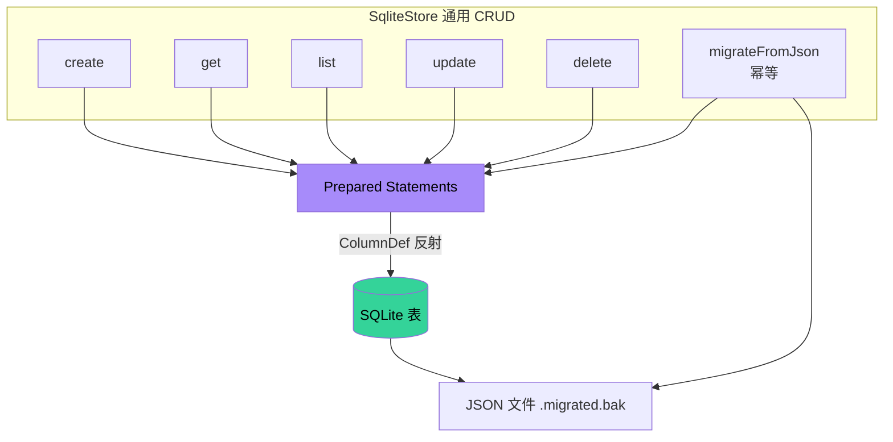
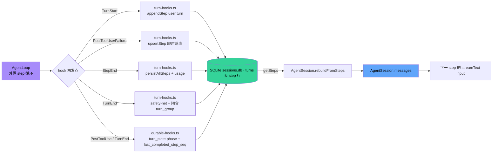

# 05 · 持久化层

> Zero-Core 是"本地优先"系统。用户数据主要落在 `~/.zero-core/` 下的几个文件里:**主库
> `sessions.db`**(`SessionDB` 持有,better-sqlite3 单连接) + **Wiki 磁盘镜像树** `wiki/`
> (v0.8,正文 markdown,见 06 §2.5) + 一组旧版 JSON 文件(迁移后改 `.migrated.bak`)。本文
> 剖析 sessions.db 这张表图谱,并标注哪些表"不在主库 / 不进 db-migration"。
>
> v0.8 后续清理:旧的向量库 `knowledge.db`(`kb_chunks`)、`kb_entries`、以及 Gen1
> `MemoryNodeStore` 的 4 张表(`memory_nodes`/`memory_subjects`/`memory_edges`/
> `memory_nodes_fts`)已整体 DROP(见 §2.2 末)。知识与记忆统一以 `project_wiki` wiki 树
> 承载(06 §2)。`knowledge.db` 不再产生。

## 1. 数据驻留位置

```
~/.zero-core/
├── sessions.db            ← 主数据库 (SessionDB,better-sqlite3,§2 全部表 ≈25 张 = 批 A db-migration 管理 23 张 [5 会话核心 + 4 旧业务实体 + 14 v0.8 工作流域] + 批 B 构造自建 2 张 [kv_store + extraction_cursors + tool_telemetry 中 db-migration 未管的];v0.8 已 DROP memory_entities/memory_relations + memory_nodes/_subjects/_edges/_fts + kb_entries/kb_chunks;§2 顶部"表计数的口径"块有详细切分)
├── webfetch/
│   ├── cache/<hash>.json  ← URL 抓取缓存
│   ├── results/<id>.json ← 大结果/binary 持久化
│   └── cookies.json       ← WebFetch Cookie jar
├── wiki/                  ← v0.8 (P1 §10.1) Wiki 磁盘镜像树根(见 06 §2.5)
│   ├── <area>/<safe-name>.md  ← project_wiki 行的正文(doc_pointer 指向这里)
│   └── ...
├── logs/<YYYY-MM-DD>.log  ← 按天日志
├── workspace/             ← 默认 workspace 目录
├── messages/<persona>.json  ← 旧版消息文件（迁移后改 .migrated.bak）
├── personas.json          ← 旧版（迁移后 .migrated.bak）
├── agents.json            ← 旧版
├── agent-tools.json       ← 旧版
├── providers.json         ← 旧版
├── templates.json         ← 旧版
├── mcp-servers.json       ← 旧版
├── knowledge-bases.json   ← 旧版
├── tool-config.json       ← 旧版 (→ kv_store[tool_config])
├── workspace.json         ← 旧版 (→ kv_store[workspace])
├── theme.json             ← 旧版 (→ kv_store[theme])
├── device-context.json    ← 旧版 (→ kv_store[device_context])
├── github-cache.json      ← 旧版 (→ kv_store[github_cache])
├── zero-core.json         ← 旧版 (→ kv_store[global_config])
└── tool-config.json
```

**v0.8 关键变化**:`wiki/` 目录是 v0.8 (P1 §10.1) 新增的 **Wiki 体磁盘镜像树** —— `project_wiki`
表只存元数据(node_id / parent / path / summary / doc_pointer),正文下沉到磁盘 markdown 文件,
由 `diskPathFor(node)` 推导路径(见 06 §2.5)。这是为了让 wiki 正文可被 git/archivist 直接读、
且避免大段 markdown 把 SQLite 表撑爆。`WIKI_DISK_ROOT` 全局隔离陷阱见 06 §2.5 / v0.8 工具加固决策。

证据：`src/core/config.ts:233` `ZERO_CORE_DIR = process.env.ZERO_CORE_DIR ?? join(homedir(), ".zero-core")`；迁移路径见 `src/server/db-migration.ts:130-218`(旧 JSON 迁移) + `:653-897`(v0.8 工作流域表 DDL)。

## 2. SQLite Schema（sessions.db 实际 ≈31 张表 = 批 A db-migration 管理 24 张 [5 会话核心 + 5 旧业务实体 + 14 v0.8 工作流域] + 批 B 构造自建 7 张 [4 memory_* (MemoryNodeStore) + kv_store + extraction_cursors + tool_telemetry];另有 1 张 kb_chunks 在独立 knowledge.db。v0.8 清理僵尸 MemoryStore 时已 DROP `memory_entities` / `memory_relations` 2 表,见 §2.2 末)

> v0.8 落地后,持久化层从"会话核心 + 配置/记忆"扩展为"会话核心 + 项目/需求/工作流 + cron/wiki
> 副本"。本节按"会话核心 → 旧业务实体 → v0.8 工作流域 → 构造自建(不进 db-migration)"四组分别列出。
>
> **关于表计数的口径**(由 #20 修正,并在 v0.8 清理僵尸 MemoryStore 后再修正一次):
> 此前本文写"30 张表 + memory_* 4 张自建表",但这个数字经 `grep` 全量核对源码后**三处都对不上**:
> ① "11 业务表"把 v0.8 §11.5 已 `DROP TABLE` 的 `agent_tools`(`db-migration.ts:616`)也算了进去,
> 实际存活只有 10;② "9 张 v0.8 工作流域表"漏数了 `wiki_scan_cursors` / `requirement_status_history` /
> `requirement_messages` / `tool_configs` / `tool_usage` 5 张,实际 14 张(见 §2.2b);
> ③ "memory_* 4 张自建表"只数了 `MemoryNodeStore` 的 4 张,漏数了 `MemoryStore.init()` 自建的
> `memory_entities` / `memory_relations` 2 张(§2.2 里其实列出来了,但计数的 callout 把它们排除在外)。
> **v0.8 后续修正**:僵尸 `MemoryStore`(`memory_entities`/`memory_relations`)已被 master 本批
> 清理 —— `src/server/memory-store.ts` + `src/runtime/mcp-tools/memory-tools.ts` 文件已删,
> `db-migration.ts` 加了 `DROP TABLE IF EXISTS memory_entities / memory_relations`(§2.2 末有
> 标注)。**所以 memory_* 现在只剩 `MemoryNodeStore` 的 4 张**(nodes/subjects/edges/fts),
> 总表数从 ≈33 降到 **≈31**(批 B 自建表从 9 张降到 7 张)。本节计数全部按这个新口径更正。
>
> **正确口径**:`sessions.db` 的表分两批管理 ——
> **批 A · db-migration.ts 管理**(对应 §4.2 迁移机制的 5 阶段,共 24 张):
> 阶段 1 SessionDB `initSchema()` 5 张(sessions/messages/turns/turn_state/tool_executions,
> 见 §2.1)+ 阶段 2 显式 `db.exec CREATE TABLE IF NOT EXISTS` 14 张(全部 v0.8 工作流域表,
> 见 §2.2b)+ 阶段 3 通过 `new SqliteStore(...)` 构造时自动 `CREATE TABLE` 5 张(agents /
> providers / templates / mcp_servers / kb_entries,见 §2.2 业务实体表前 5 行)。
>
> **批 B · 构造自建(Store 在自己的 `init()` / 构造函数里 `CREATE TABLE IF NOT EXISTS`,v0.8 清理
> MemoryStore 后**共 7 张**,不进 db-migration,改 schema 要去 store 文件)**:`kv_store`
> (`key-value-store.ts:53`)/ `memory_nodes` + `memory_subjects` + `memory_edges` +
> `memory_nodes_fts`(`memory-node-store.ts:140/154/163/181`,共 4 张 —— **活,保留**)/
> `extraction_cursors`(`extraction-cursor-store.ts:77`,v0.8 M5)/
> `tool_telemetry`(`telemetry-store.ts:97`,v0.8 M5)。
> (~~`memory_entities` + `memory_relations`~~ —— ~~`memory-store.ts:97/104`~~ 已删:见下文 v0.8
> 清理说明。)
>
> 此外 `kb_chunks` 表**根本不在 sessions.db**,而在独立的 `knowledge.db`(§2.3),不要把它
> 算进 sessions.db 的表数。06 §2.7 "三套知识系统对比矩阵"有跨库横向对照。

### 2.1 会话 / 消息核心（SessionDB，src/server/session-db.ts）

#### `sessions`
```sql
id           TEXT PRIMARY KEY
agent_id     TEXT NOT NULL
is_main      INTEGER (bool)
title        TEXT
created_at   TEXT
updated_at   TEXT
input_tokens / output_tokens / total_tokens    INTEGER
cache_read_tokens / cache_write_tokens / reasoning_tokens   INTEGER
estimated_cost_usd                              REAL
# v0.8 context bundle (M0):
context / context_project_id / context_workspace_dir / context_wiki_root_node_id   TEXT
archived   INTEGER (bool)
# 委派任务持久化(Phase C):delegated 会话隔离 + 归属
session_kind        TEXT NOT NULL DEFAULT 'chat'   -- 'chat' | 'delegated'
parent_session_id   TEXT                            -- delegated 会话的父 chat 会话
parent_task_id      TEXT                            -- 对应 delegated_tasks.id
visibility          TEXT NOT NULL DEFAULT 'normal'  -- 'normal' | 'hidden' | 'debug'
```
> `session_kind='delegated'` 的会话(委派子 agent 的隐藏会话)从所有聊天列表查询
> (`getMainSession` / `getMostRecentSession` / `listSessions` / `listAllSessions`)
> 中过滤掉 —— 它们只为 TaskTree 检视 + 重启恢复而存在,不污染聊天列表。

#### `delegated_tasks`(委派任务,Phase C)
```sql
id / parent_task_id / root_task_id      TEXT   -- 委派链(子子 agent)
owner_agent_id / target_agent_id        TEXT   -- 派发者 / 被委派 agent
parent_session_id / session_id          TEXT   -- 父 chat 会话 / 子隐藏会话(FK→sessions ON DELETE SET NULL)
task / status                           TEXT   -- 任务描述 / running|finishing|completed|failed|killed|interrupted
depth / step / turns / tokens           INTEGER -- 委派深度 / 工具步数 / agent-loop 迭代数 / 累计 token
current_tool / result / error           TEXT
control_message / finish_requested_at   TEXT   -- request_finish 的 advisory 控制消息(StepStart hook 投递,Step 1C 前=PrepareStep)
created_at / updated_at / completed_at  TEXT
```
> 一条委派 = 一个全局 agent + 一个隐藏 delegated session + 一个任务记录。`markRunningDelegatedTasksInterrupted()`
> 在启动时把残留 running/finishing 标 `interrupted`(只标记,人工重启,不自动恢复)。

#### `messages`（write-through 缓存）
```sql
id           INTEGER PRIMARY KEY AUTOINCREMENT
session_id   TEXT NOT NULL  → sessions(id)  [FK]
seq          INTEGER
role         TEXT    -- 'user' | 'assistant' | 'tool'
content      TEXT    -- 用户纯文本；assistant 序列化 JSON
msg_json     TEXT    -- 完整结构化消息
created_at   TEXT
```

注意：**`messages` 表非权威**。`turns` 表是 source of truth。`AgentSession` 构造时从 turns 重建 messages。

#### `turns`（**source of truth**,Step 4A:step-only 存储)
```sql
session_id   TEXT
seq          INTEGER   -- 全局单调;user turn 与 assistant step 各占独立行
turn_group   INTEGER NOT NULL DEFAULT -1  -- Step 4A:必填,同一逻辑 turn 的分组键
role         TEXT      -- 'user' | 'assistant'
content      TEXT      -- user: 原始字符串;assistant: JSON.stringify(blocks)
input_tokens / output_tokens / total_tokens   INTEGER  -- step 级 token(每行独立)
created_at   TEXT
-- 索引: idx_turns_session_group(session_id, turn_group)
```

> **Step 4A:legacy 单行 turn API 退役。** 物理表名仍是 `turns`,但**只存 step 行**。一个逻辑 turn = 一个 user 行(turn_group = 自身 seq,开新组)+ N 个 assistant step 行(turn_group = 该 user 行的 seq,seq 递增)。`turn_group` 是 step 聚合的唯一键(`idx_turns_session_group` 索引)。`appendStep` / `upsertStep` / `getSteps` 是当前 API;`appendTurn`(单行写)已退役。`migrateTurnsToSteps` 在迁移期把旧行回填 `turn_group`(user → 自身 seq,assistant → 最近 user 的 seq,见 §4.2 阶段 1)。

`blocks`(assistant step 的 content)形如:
```json
[
  {"type":"text", "text":"..."},
  {"type":"thinking", "text":"..."},
  {"type":"tool", "name":"Shell", "toolCallId":"tc-0", "args":{...}, "status":"done", "result":"..."}
]
```

**写入入口(全在 `turn-hooks.ts`,Step 2B/4A)**:
- `TurnStart` → `appendStep(sessionId, seq, turn_group=seq, "user", userMessage)` —— user turn 开新组。
- `StepEnd` → `recorder.persistAllSteps(db, sessionId, stepBaseSeq)` —— 每个 assistant step 一行,`upsertStep`(幂等)。
- `PostToolUse` / `PostToolUseFailure` → `recorder.persistCurrentStep(...)` —— per-tool **即时落库**(Step 2B),upsert 同一 step 行带 result/failure。case2 恢复的前提:副作用已提交但 StepEnd 未到,工具结果不丢。
- `TurnEnd` → safety-net:若本 turn_group 还无 assistant step 行,补写一行(blocks 原样)。
- `TurnError` → 同 safety-net,记录失败 step。

#### `turn_state`(durable execution 检查点,Step 2D:step 级)
```sql
session_id
turn_seq
phase        TEXT    -- 'pending' | 'tools_executing' | 'completed' | 'failed'
last_tool    TEXT
last_completed_step_seq   INTEGER  -- Step 2D:step 级恢复检查点
checkpoint / error        TEXT
started_at / completed_at
```

由 `durable-hooks.ts` 维护。`last_completed_step_seq` 是 **step 级恢复**的检查点:每完成一个 step 推进(`UPDATE ... WHERE last_completed_step_seq IS NULL OR < ?`)。`recovery.ts:34` 启动时清理 >24h 的。恢复时读它判断 session 是否有 mid-turn 进度(case1:step 重跑 / case2:工具恢复,见 §5.5)。

#### `tool_executions`（工具调用日志）
```sql
session_id, agent_id, tool_name
success      INTEGER (bool)
error_message TEXT
input_preview TEXT (200 char)
output_preview TEXT (200 char)
duration_ms   INTEGER
turn_seq      INTEGER
started_at    TEXT
```

由 `tool-execution-router.ts:14-91` 的 `query/stats/cleanup/analyze` API 消费。

### 2.2 业务实体表(10 张存活 + 3 张已退役)

| 表 | Store | 列数 | 备注 |
|----|-------|------|------|
| `agents` | agent-store | 12 | AgentRecord |
| ~~`agent_tools`~~ | ~~agent-tool-store~~ | ~~18~~ | ⚠️ **v0.8 §11.5 退役**:`agent-tool-store.ts` 文件已删,`db-migration.ts:616` 显式 `DROP TABLE IF EXISTS agent_tools`。tool 配置下沉到 `tool_configs`(§2.2b)+ `agents.tools` JSON 列。详见 [08 §11.5](08-cross-cutting.md)。 |
| `providers` | provider-store | 11 | 含 SYSTEM_PROVIDERS |
| `templates` | template-store | 14 | is_built_in 不可删 |
| `mcp_servers` | mcp-store | 11 | source_app 标记来源 |
| `kb_entries` | kb-store | 8 | 嵌入配置 + 文件列表 |
| ~~`memory_entities`~~ | ~~memory-store~~ | ~~4~~ | ⚠️ **v0.8 清理僵尸 MemoryStore 已删**:`src/server/memory-store.ts` + `src/runtime/mcp-tools/memory-tools.ts` 已删,`db-migration.ts` 加 `DROP TABLE IF EXISTS memory_entities`。原是 MCP memory-tools 知识图谱后端,零运行时写入者。 |
| ~~`memory_relations`~~ | ~~memory-store~~ | ~~4~~ | ⚠️ **v0.8 清理僵尸 MemoryStore 已删**(同上),`db-migration.ts` 加 `DROP TABLE IF EXISTS memory_relations`。 |
| `memory_nodes` | memory-node-store | 9 | Wiki 风格记忆节点 ⚠️ 构造自建,见下(**活,保留**) |
| `memory_subjects` | memory-node-store | 6 | 主题聚合 ⚠️ 构造自建,见下(**活,保留**) |
| `memory_edges` | memory-node-store | 4 | 主题间关系 ⚠️ 构造自建,见下(**活,保留**) |

> ⚠️ **构造自建表不进 db-migration**。上表里**存活**的 4 张 memory_* 表(`memory_nodes` /
> `memory_subjects` / `memory_edges` / `memory_nodes_fts`,全部由 `MemoryNodeStore.init()`
> 自建)在 store 的 `init()` 里 `CREATE TABLE IF NOT EXISTS` 自建。**v0.8 清理僵尸 MemoryStore
> 之后,`MemoryNodeStore` 是唯一的 memory 自建后端** —— 另一套 `MemoryStore`
> (`memory_entities`/`memory_relations`,MCP `memory-tools` 知识图谱后端)是零运行时写入者的
> 僵尸,master 本批已删(`memory-store.ts` + `mcp-tools/memory-tools.ts` 文件已删,`db-migration.ts`
> 加 `DROP TABLE IF EXISTS memory_entities / memory_relations`)。所以现在是单系统,不再是"两个
> 并行 memory 后端"(旧版 §11.3 对比矩阵已随删除而失效)。改 memory_* schema 要去
> `memory-node-store.ts` 的 `init()`,不要去 `db-migration.ts`(那会漏掉 FTS 重建逻辑:`init()`
> 检测到旧 FTS 列结构时会 DROP 重建,db-migration 没这个能力)。详见 06 §2.7 "三套知识系统对比
> 矩阵"的"建表机制"列。
>
> **批 B 构造自建表全清单(v0.8 清理 MemoryStore 后共 7 张,§2 顶部"表计数口径"块已列出)**:
> 4 张 memory_* 表(全属 `MemoryNodeStore`)+ 3 张同类 store 自建、不进 db-migration 的表:
> `kv_store`(`key-value-store.ts:53`)/ `extraction_cursors`(`extraction-cursor-store.ts:77`,
> v0.8 M5 lazy store)/ `tool_telemetry`(`telemetry-store.ts:97`,v0.8 M5 lazy store)。改这
> 些表的 schema 同样要去 store 文件而不是 db-migration.ts。(~~原 9 张里的 `memory_entities` +
> `memory_relations`~~ 已 v0.8 删除,见上。)

### 2.2b v0.8 多 Agent 工作流域表（src/server/db-migration.ts:653-897，共 14 张表）

v0.8 引入"项目 → 需求 → Lead/PM/Analyst 工作流"主线后,新增 **14 张表**(`grep "CREATE TABLE
IF NOT EXISTS" db-migration.ts` 验证,阶段 2 全部 14 个 `db.exec` 都在此区间)。下表每行一一
对应,**全部走 `db-migration.ts` 的 `CREATE TABLE IF NOT EXISTS` + `safeAddColumn` 路径**,
与 §4.2 迁移机制同源;不像旧业务表那样有 JSON → SQLite 迁移(v0.8 实体是 DB-native 的,没有
JSON 前身)。Store 类多数用 `SqliteStore<T>` 反射 CRUD(见 §3),**两个例外**是
`ToolConfigStore` 与 `ToolUsageStore`(同在 `tool-usage-store.ts`)—— 前者手写 SQL 因为 PK 是
`tool_name` 而非 surrogate id(SqliteStore 总是注入 `id/created_at/updated_at` 三件套),后者
手写 SQL 是为避免 SqliteStore 自愈 ALTER 加列动表结构(`tool-usage-store.ts:32` 注释)。

| 表 | Store 类 | 列数 | v0.8 阶段 | 备注 |
|----|----------|------|-----------|------|
| `projects` | `ProjectStore` (project-store.ts:78) | 5 (+legacy 残留) | M0 | 极简元数据:name + workspaceDir(UNIQUE)。M0 之前的列(path / analyst_cron_id / status 等)在升级 DB 上残留但不再读 |
| `project_wiki` | `WikiStore` (wiki-node-store.ts:327) | 15 | M2 / P1 §10.1 | Wiki 磁盘镜像树(见 06 §2.5)。M2 删除 legacy `detail`+`type` 列(内容下沉 ~/.zero-core/wiki/),改用 `doc_pointer` + 磁盘正文。三个索引:`idx_wiki_project` / `idx_wiki_parent` / `idx_wiki_parent_path`(archivist upsert 热路径) |
| `wiki_scan_cursors` | `WikiScanCursorStore` (wiki-scan-cursor-store.ts:62) | 7 | M2 | (archivist_id, project_id) 唯一 → 增量 git cursor。见 06 §2.6 |
| `requirements` | `RequirementStore` (requirement-store.ts:85) | 14 | M1 | 需求实体:status 状态机 / source(analyst/user)/ priority / 影响域。两索引(project / status) |
| `requirement_status_history` | RequirementStore 内部 historyStore (requirement-store.ts:93) | 6 | M1 | 需求状态迁移审计:from→to + triggered_by + comment |
| `task_steps` | `TaskStepStore` (task-step-store.ts:58) | 18 | M1 | 需求分解步骤:stepOrder + role + retry/maxRetries + sessionId(执行时绑定) |
| `requirement_messages` | RequirementStore 内部 messageStore (requirement-store.ts:94) | 6 | M1 | 需求讨论流:sender + messageType(text/system/decision) |
| `crons` | `CronStore` (cron-store.ts:63) | 13 | M1 / P0 §3.4 | 一等公民 cron 实体。`schedule` 是结构化 JSON(CronSchedule union,旧 string 行由 migrateCronScheduleToJson 转换)。`trigger_mode`/`last_run_at`/`last_status`/`next_run_at` 是调度器遥测列 |
| `cron_runs` | `CronRunStore` (cron-store.ts:176) | 13 | P0 §9.3 | 每次触发的审计日志:fired_at(规范时间戳)+ success + tokens/cost + duration |
| `project_jobs` | `ProjectJobStore` (project-job-store.ts:47) | 11 | M3 | 项目级后台任务(wiki 充实等)的生命周期记录:status(running/completed/failed)+ promptSummary |
| `tool_configs` | `ToolConfigStore` (tool-usage-store.ts:51,**手写**) | 3 | P0 §7.7 #4 | per-tool 默认参数配置。PK = tool_name,不走 SqliteStore |
| `tool_usage` | `ToolUsageStore` (tool-usage-store.ts:129,**手写**) | 8 | P0 §7.7 #4 | 工具调用级日志(与 sessions 级 token 核算 RFC §8.5 区分)。两索引(tool_name / session_id)。**手写 SQL**(同 ToolConfigStore),原因见 §2.2b 末 |
| `orchestrate_plans` | `OrchestratePlanStore` (orchestrate-store.ts:79) | 10 | M3 | Lead 提交的 DSL flow + confirm gate 状态(state=pending/approved/rejected)。`lead_session_id` 是 IPC confirm/reject 路径定位活跃 awaiter 的路由键 |
| `orchestrate_manifests` | `OrchestrateManifestStore` (orchestrate-store.ts:131) | 8 | M3 (D34) | 每次执行的 manifest:touchedFiles/tests/review(JSON 数组)+ summary。PM 读它判覆盖度,archivist 读它做可追溯 |

**关键关系(见图 §2.13)**:
- `projects` 是工作流域根(1:N → requirements / project_wiki / project_jobs)。
- `requirements` 是流程枢纽:1:N → task_steps / requirement_status_history / requirement_messages / orchestrate_plans。
- `orchestrate_plans` ↔ `orchestrate_manifests` 是 1:N(plan 可重跑,每次 manifest)。
- `crons` → `cron_runs` 1:N(每次触发一行)。
- `project_wiki` 自引用 `parent_id` + `project_id` 可空(global root / memory 节点 project_id=NULL,
  这是 M2 wiki 全局化的关键约束)。

**与旧业务表的边界**:`agents` 表的 `knowledgeBaseIds` 仍是旧 KB 概念,与 `project_wiki` 是
**两个并行的 wiki 系统** —— 旧 `kb_*` 走嵌入向量检索(RAG),新 `project_wiki` 走磁盘镜像树
+ archivist 摘要(见 06 §2)。两者不互转。

### 2.3 KB chunks —— **独立 SQLite 文件 `knowledge.db`**（⚠️ 已退役）

> **v0.8 后续清理:整条退役**。KB 子系统(向量 RAG)已移除:`kb_chunks` + `kb_entries` 表由
> `runMigrations` `DROP IF EXISTS`,`knowledge.db` 不再产生,`KbDB` / `kb-*` 服务端代码删除。
> 知识/记忆统一以 `project_wiki` wiki 树承载(06 §2)。本节以下为历史描述,保留备查。

> ⚠️ v0.8 更正:旧版本节写"KbDB 也使用同一个 db.sqlite"是**错的**。`KbDB` 在自己的构造函数里
> `new Database(path)` 开了一条**独立连接**,指向 `~/.zero-core/knowledge.db`
> (`src/server/kb-db.ts:46-51`),与 `sessions.db` 物理隔离。这个事实在 06 §2.7 的"三套知识
> 系统对比矩阵"里已系统化讲清,本节同步更正。

**为什么独立成库**:每行 `kb_chunks` 都带一个 `embedding` BLOB(Float32Array 序列化,典型几百到
几千字节),规模大、写入频繁(kb-ingest 流式分块)。如果塞进 `sessions.db`,会拖慢主库的
WAL checkpoint(主库存的是 sessions/turns/messages 这类小行高频读写的会话核心数据),也会让
备份/导出体积膨胀。所以 `kb_chunks` 故意隔离在 `knowledge.db`,主库只留 `kb_entries` 元数据
(`kb-store.ts:51` 的 `SqliteStore` 走 `sessionDB.getDb()` —— 那张表**在** sessions.db,
只是行里不存向量)。

建表机制(关键维护信息):**`kb_chunks` 不进 `db-migration.ts`**(`grep "kb_chunks" db-migration.ts`
零命中),而是由 `KbDB.initSchema()`(`kb-db.ts:56-69`)在构造时 `CREATE TABLE IF NOT EXISTS`
自建 —— 与 `memory_*` 表(§2.2 末"构造自建表"块)是同一类"store 自己管 schema"模式。改它的
schema 要去 `kb-db.ts`,不要去 `db-migration.ts`。

```sql
-- kb-db.ts:56-69,knowledge.db 内
CREATE TABLE IF NOT EXISTS kb_chunks (
  id INTEGER PRIMARY KEY AUTOINCREMENT,
  kb_id TEXT NOT NULL,
  file_path TEXT NOT NULL,
  chunk_index INTEGER NOT NULL,
  content TEXT NOT NULL,
  embedding BLOB,
  token_count INTEGER,
  created_at TEXT NOT NULL
);
CREATE INDEX IF NOT EXISTS idx_kb_chunks_kb ON kb_chunks(kb_id);
CREATE INDEX IF NOT EXISTS idx_kb_chunks_file ON kb_chunks(kb_id, file_path);
```

`embedding` 列是 BLOB —— Float32Array 直接序列化。`getAllChunksForSearch()` 加载所有 chunks 计算 cosine 相似度（纯 JS 循环,见 06 §2.7 检索方式列）。跨库关联:`kb_entries.id`(sessions.db) ↔ `kb_chunks.kb_id`(knowledge.db),应用层 join,SQL 层无法直接联表。

### 2.4 KV store

```sql
CREATE TABLE IF NOT EXISTS kv_store (
  key TEXT PRIMARY KEY,
  value TEXT NOT NULL,        -- JSON
  updated_at TEXT
);
```

**架构师的判断**：KV 表是项目"软状态"的总线。Workspace config、theme、device context、global config、tool config、GitHub cache、log config 都走这里。**没有把它当成"key-value-only"，而是作为 8 张业务表的灵活补丁**。

### 2.5 FTS5 虚拟表

`memory-node-store.ts`(`init()` 的 FTS 块,lines 173-191):

```sql
CREATE VIRTUAL TABLE IF NOT EXISTS memory_nodes_fts USING fts5(
  subject,
  content,
  content='memory_nodes',         -- 外部内容表模式
  content_rowid='rowid',
  tokenize='unicode61'
);
```

> ⚠️ v0.8 更正:旧版本节写"`subject, type, content`"+ "带 INSERT / UPDATE / DELETE trigger"
> 两处都不准。实际 DDL 只有 `subject` + `content` 两列(没有 `type`,旧文档多写了一列),
> 并显式 `tokenize='unicode61'`;`content='memory_nodes'` 声明走外部内容表(contentless)模式。

**同步方式:不是 DB trigger,是 store 方法里的手动 prepared statement**。`memory-node-store.ts`
持三个 FTS 预编译语句(`lines 128/131/134`):SELECT MATCH 查询 / INSERT rowid+subject+content
/ DELETE by rowid。`upsertNode()` 在更新 `memory_nodes` 后**手动**调一次 deleteFtsStmt +
insertFtsStmt(双保险,即使 FTS5 外部内容表本应自动同步),`deleteNode()` 同样手动 deleteFts。
这层"手动同步"是真实存在的代码路径,**不是 DB 层 trigger**(`grep "TRIGGER" memory-node-store.ts`
零命中)。改 FTS schema 时要注意:`init()` 检测到旧 FTS 列结构会 `DROP TABLE` 重建(`lines 175-178`),
这是 FTS5 无法 ALTER 的应对 —— 改字段要复用这个 drop-and-recreate 模式,不要试图 ALTER。

`searchNodes(query, limit)`(`line 128`)用 FTS5 MATCH 查询,返回 `bm25` 排序结果(`ORDER BY rank`)。

### 2.13 表关系图（erDiagram）

> v0.8 后表数从 ≈15 张扩到 ≈31 张(v0.8 清理僵尸 MemoryStore 后口径,详见 §2 顶部块)。下图分两个 mermaid 块:**①会话/旧业务/记忆** +
> **②v0.8 工作流域**(projects→requirements→orchestrate)。两者通过 `agents.id ↔
> crons.agent_id` 与 `sessions.context_project_id`(v0.8 D-B)弱关联。
>
> **读图注意(物理分布)**:图里的节点是逻辑关系,不反映物理库边界。具体地:① `KB_CHUNKS` 节点
> **不在 sessions.db**,而在独立的 `knowledge.db`(§2.3);`KB_ENTRIES ||--o{ KB_CHUNKS` 那条
> 边是**跨库应用层 join**(SQL 层无法直接联表)。② `MEMORY_NODES` / `MEMORY_SUBJECTS` /
> `MEMORY_EDGES` / `MEMORY_NODES_FTS` 节点虽然在 sessions.db 里,但它们**不进 db-migration**,
> 由 `MemoryNodeStore.init()` 构造自建(§2.2 末)。这两类例外都已在对应小节标出,此处不再画
> 物理库边界以免图过载。

#### 2.13a 会话核心 / 旧业务实体 / 记忆系统

```mermaid
erDiagram
    AGENTS ||--o{ AGENT_TOOLS : "has"
    AGENTS ||--o{ SESSIONS : "owns"
    AGENTS }o--o{ KB_ENTRIES : "knowledgeBaseIds"
    SESSIONS ||--o{ MESSAGES : "write-through cache"
    SESSIONS ||--o{ TURNS : "source of truth"
    SESSIONS ||--o{ TURN_STATE : "checkpoint"
    SESSIONS ||--o{ TOOL_EXECUTIONS : "logs"
    KB_ENTRIES ||--o{ KB_CHUNKS : "1 KB → N chunks"
    %% MEMORY_ENTITIES ||--o{ MEMORY_RELATIONS : "old graph"   %% v0.8 清理僵尸 MemoryStore:已 DROP 2 表,本边从图中移除
    MEMORY_NODES ||--o{ MEMORY_NODES : "evolvedFrom (self-ref)"
    MEMORY_NODES ||--o{ MEMORY_SUBJECTS : "grouped by subject"
    MEMORY_NODES }o--o{ MEMORY_EDGES : "subject-to-subject"
    MEMORY_NODES ||--|| MEMORY_NODES_FTS : "FTS5 index"

    AGENTS {
        string id PK
        string name
        string workspace_dir
        string model
        string provider
        json tool_policy
        json system_prompt
    }
    SESSIONS {
        string id PK
        string agent_id FK
        string context_project_id FK_v0.8
        bool is_main
        bool archived "v0.8 soft-delete 过滤"
        int input_tokens
        int output_tokens
    }
    TURNS {
        string session_id FK
        int seq
        int turn_group "v0.8 step grouping"
        string role
        text content
    }
    MESSAGES {
        int id PK
        string session_id FK
        int seq
        string role
        text content
    }
    TURN_STATE {
        string session_id FK
        int turn_seq FK
        string phase
    }
    TOOL_EXECUTIONS {
        int id PK
        string session_id FK
        string tool_name
        bool success
        int duration_ms
    }
    KB_ENTRIES {
        string id PK
        string name
        string embedding_provider
        string embedding_model
        json files
    }
    KB_CHUNKS {
        int id PK
        string kb_id FK
        string file_path
        blob embedding
    }
    MEMORY_NODES {
        string id PK
        string subject
        string type
        text content
        string evolvedFrom
    }
    KV_STORE {
        string key PK
        text value
    }
```

#### 2.13b v0.8 多 Agent 工作流域(projects → requirements → orchestrate)

```mermaid
erDiagram
    PROJECTS ||--o{ REQUIREMENTS : "M1 需求池"
    PROJECTS ||--o{ PROJECT_WIKI : "M2 镜像树 (project_id nullable)"
    PROJECTS ||--o{ PROJECT_JOBS : "M3 后台任务"
    REQUIREMENTS ||--o{ TASK_STEPS : "M1 步骤分解"
    REQUIREMENTS ||--o{ REQUIREMENT_STATUS_HISTORY : "状态机审计"
    REQUIREMENTS ||--o{ REQUIREMENT_MESSAGES : "讨论流"
    REQUIREMENTS ||--o{ ORCHESTRATE_PLANS : "M3 Lead 提交"
    ORCHESTRATE_PLANS ||--o{ ORCHESTRATE_MANIFESTS : "D34 每次执行"
    PROJECT_WIKI ||--o{ PROJECT_WIKI : "parent_id (self-ref, 全局树)"
    WIKI_SCAN_CURSORS }o--|| PROJECTS : "(archivist, project) 唯一"
    AGENTS ||--o{ CRONS : "M1 cron.owner (软 FK)"
    CRONS ||--o{ CRON_RUNS : "P0 每次触发"
    SESSIONS }o..o{ TOOL_USAGE : "P0 工具级日志 (session_id 可空)"

    PROJECTS {
        string id PK
        string name
        string workspace_dir UK
    }
    REQUIREMENTS {
        string id PK
        string project_id FK
        string title
        string status "found→specified→...→closed"
        string source "analyst|user"
        string priority
        string assigned_lead_session_id
    }
    TASK_STEPS {
        string id PK
        string requirement_id FK
        int step_order
        string role "lead|pm|analyst|verify"
        string status "pending|running|done|failed"
        int retry_count
        string session_id "执行时绑定"
    }
    PROJECT_WIKI {
        string id PK
        string project_id "nullable: global root / memory"
        string parent_id FK_self
        string node_type
        string path "relative to scope root"
        string doc_pointer "→ ~/.zero-core/wiki/*.md"
        string source_req_id
    }
    ORCHESTRATE_PLANS {
        string id PK
        string requirement_id FK
        string lead_session_id "IPC confirm 路由键"
        json flow "DSL"
        string state "pending|approved|rejected"
    }
    ORCHESTRATE_MANIFESTS {
        string id PK
        string plan_id FK
        json touched_files
        json tests
        json review
    }
    CRONS {
        string id PK
        string agent_id FK_soft
        json working_scope "SessionContextBundle"
        json schedule "CronSchedule union"
        string trigger_mode
        string last_status
    }
    CRON_RUNS {
        string id PK
        string cron_id FK
        string fired_at "规范时间戳"
        bool success
        int tokens
        real cost
    }
    PROJECT_JOBS {
        string id PK
        string project_id FK
        string job_type "wiki-enrich|..."
        string status "running|completed|failed"
        string session_id
    }
    TOOL_USAGE {
        string id PK
        string tool_name
        string session_id "可空"
        bool success
        int duration_ms
    }
    TOOL_CONFIGS {
        string tool_name PK
        json config "默认参数"
    }
    TOOL_TELEMETRY {
        string id PK
        string session_id FK
        string tool_name
        string kind
        string signature "去重键"
        int occurrence_count
    }
    EXTRACTION_CURSORS {
        string session_id PK
        int last_extracted_seq
        int last_threshold_idx
    }
    WIKI_SCAN_CURSORS {
        string id PK
        string archivist_id
        string project_id
        string last_scanned_ref "git cursor"
    }
```

**关键关系**：
- **`SESSIONS` 是会话域枢纽**：5 张表通过 session_id 与之关联;v0.8 后 `sessions.context_project_id`
  把 session 反向挂到 `projects`(D-B 路由依据,见 02 §3 / 03 §3.1)。`archived` 列(v0.8 软删)
  让"归档当前 session"把行标记 `archived=1` 并从活跃视图移除——`getMainSession`/`listSessions`/
  `listAllSessions`/`getMostRecentSession`/`findSessionByAgentAndProject` 及资源聚合 raw SQL
  均 `WHERE archived = 0`;row 保留,由同 `(agentId, projectId)` 的新 session 接替路由(`POST /api/sessions/:agentId/:sessionId/archive`)。
- **`PROJECTS` 是工作流域枢纽**(v0.8 新增):1:N → requirements / project_wiki / project_jobs。
- **`REQUIREMENTS` 是流程枢纽**:1:N → task_steps / history / messages / orchestrate_plans。
- **`turns` 是 source of truth**，`messages` 是 write-through 缓存（双写）;v0.8 加 `turn_group`
  列把同一逻辑 turn 内的多步 LLM 调用聚合(索引 idx_turns_session_group)。
- **`memory_nodes` 自引用**：`evolvedFrom` 形成演化链。
- **`project_wiki` 自引用 + project_id 可空**:这是 M2 全局化的关键 —— 全局 root / memory 节点
  不属于任何 project(见 06 §2.5)。
- **`kb_chunks` 与 session 无关**:独立 RAG 索引。
- **`tool_usage`(P0) ≠ `tool_executions`(旧)**:前者是 RFC §7.7 #4 的工具级日志(含 params/成功/耗时),
  后者是 §2.1 的会话级日志(input/output_preview);两个表的 `session_id` 不一定一致 ——
  `tool_usage` 在 cron / 后台 job / 子 agent 委派里也会写,这些 session 可能是临时的。

## 3. SqliteStore — 通用 CRUD



`src/server/sqlite-store.ts:43-273` 是 18 个 Store 的"地基"(v0.8 工作流域 14 张表中 12 张复用 SqliteStore,例外见 §2.2b 末尾说明)：

```typescript
new SqliteStore<T>(db, "agents", COLUMNS)
  ├─ create(input)            → uuid + insert
  ├─ get(id)                  → select by id
  ├─ list()                   → all rows
  ├─ update(id, patch)        → update
  ├─ delete(id)               → delete
  ├─ migrateFromJson(jsonPath, key, transform?)
  └─ ensureColumn(name, type) → safe ALTER TABLE
```

每行都自动有 `id` / `created_at` / `updated_at`，由 `create()` 自动注入。

#### 3.0.1 写出口 = UI 同步捕获点

`insertRow` / `updateRow` / `delete` 是 SqliteStore **唯一的写原语**,也是 `data-change-hub` 的唯一 emit 点(见 ADR-021)。所有领域 store(AgentStore/ProjectStore/CronStore/RequirementStore/WikiStore/...)的写都收敛到这里,因此四个突变面(UI REST / agent 工具 / 后台服务 / 启动恢复)改的数据都能被 renderer 自动感知,无需逐 store 加通知:

- `insertRow(record)` → `emitDataChange(table, record.id, "create", record)`
- `updateRow(id, record)` → `emitDataChange(table, id, "update", record)`
- `delete(id)` → `emitDataChange(table, id, "delete")`
- `update()` 做 **no-op 检测**:patch 字段全等于现值 → 跳过写 + 不 emit(标量按数值比,兼容"数字存 TEXT 读回 `'2.0'`"的 round-trip 怪癖)。

非白名单表(`messages`/`turns`/`tool_executions` 等高频表)的 emit 在 hub 层被忽略。

### 3.1 ColumnDef 设计

```typescript
{ key: "name" }
{ key: "workspaceDir", column: "workspace_dir" }   // 字段名映射
{ key: "toolPolicy", json: true }                  // 序列化 JSON
{ key: "enabled", bool: true }                     // INTEGER 0/1 ↔ boolean
```

这是一个**很巧妙的"反射 + 类型映射"**模式，避免了手写 SQL 与字段一一对应。

### 3.2 已知约束

- `insert()` 时 `updated_at` 字段不会自动更新（仅在 `update()` 时更新）。如果未来要做"最后修改时间审计"，需要修补。
- JSON 列没有 schema 校验，存入任意结构。
- 没有"软删除"机制。

## 4. SessionDB — 会话核心(不是业务核心)

`src/server/session-db.ts` 当前约 960 行(v0.8 后从 ~850 长到 960),定位是**会话核心 + DB lifecycle + 内核 store 工厂**,
**不是**全业务 store 的聚合根。它的职责被刻意收窄:

#### 4.0.1 SessionDB 自己持有的表(5 张,全部在 `initSchema()` 里 `CREATE TABLE IF NOT EXISTS`)

| 表 | 角色 | 写入入口 |
|----|------|---------|
| `sessions` | 会话根(含 v0.8 D-B `context_*` 列 + token 核算列) | `createSession` / `updateSessionUsage` / `updateSessionContext` |
| `messages` | write-through 缓存(turns 才是 source of truth) | `saveTurn` |
| `turns` | **source of truth**(Step 4A:step-only 存储,`turn_group` 必填) | `appendStep` / `upsertStep` / `getSteps`(legacy `appendTurn` 退役,见 §2.1) |
| `turn_state` | durable execution 检查点(Step 2D:`last_completed_step_seq` step 级) | `createTurnState` / `updateTurnPhase` / `updateLastCompletedStep` |
| `tool_executions` | 会话级工具调用日志(旧版,见 §2.1 与 §11.2 关于与 `tool_usage` 重叠的讨论) | `recordToolExecution` |

#### 4.0.2 SessionDB 直接聚合的 store(v0.8 清理 MemoryStore 后剩 4 个,分两批)

`SessionDB` 在构造函数里 **eager** 实例化 2 个内核 store(KeyValueStore + MemoryNodeStore;
~~MemoryStore~~ 已随 v0.8 僵尸清理删除),在 v0.8 (M5) 又加了 2 个 **lazy** store:

> ⚠️ **更正**:本文此前写"6 个,分两批 + 1 个全局 wiki store 入口",这是**错的**。`WikiStore`(`wiki-node-store.ts:327` 的 `WikiStore` 类)在 `server/index.ts:122` 以 `wikiStoreGlobal = new WikiStore(sessionDB)` **独立 new** —— SessionDB 只是被当 `getDb()` 提供者传进去,本身**不**持有 `WikiStore` 字段、不暴露 getter(在 `session-db.ts` 里 grep `WikiStore` 零命中)。`WikiStore` 与 §4.0.3 的 9 个工作流域 store 同属"在 server/index.ts 独立 new、不挂 SessionDB"那一类,只是它实例化得更早(必须在 hooks 注册前,以便 M5 抽取器拿到 writer)。详见 §4.0.3 与 [02-module-structure.md §4.1.1](02-module-structure.md)。

| store | 实例化时机 | 用途 | getter |
|-------|-----------|------|--------|
| `KeyValueStore` | eager(构造函数 :69) | 项目"软状态"总线(见 §2.4 / §7) | `getKVStore()` |
| ~~`MemoryStore`~~ | ~~eager(:70)~~ | ~~旧版知识图谱(memory_entities/relations)~~ ⚠️ **v0.8 已删**:`memory-store.ts` + `mcp-tools/memory-tools.ts` 文件已删,`db-migration.ts` DROP 2 表。`getMemoryStore()` getter 已随类移除。 | ~~`getMemoryStore()`~~ |
| `MemoryNodeStore` | eager(:71) | Wiki 风格记忆节点(memory_nodes + FTS5) | `getMemoryNodeStore()` |
| `ExtractionCursorStore` | **lazy**(v0.8 M5,首次 `getExtractionCursorStore()` 才 new) | extractor A 增量游标(见 §2.13b) | `getExtractionCursorStore()` |
| `TelemetryStore` | **lazy**(v0.8 M5) | extractor B 独立遥测写入 | `getTelemetryStore()` |

> lazy 是有意为之 —— 这样不碰 M5 路径的代码(如 compression engine 单测)不必为这两个 store 付初始化成本;它们的两张表(`extraction_cursors` / `tool_telemetry`)由各自构造函数 `CREATE TABLE IF NOT EXISTS` 自建,**故意不进 `db-migration.ts` 的 `*_COLUMNS` 数组**(注释 session-db.ts:37-43 说明)。

#### 4.0.3 SessionDB **不**聚合 v0.8 工作流域 store —— 关键边界

v0.8 (M0~M3) 引入的 **14 张工作流域表**(`projects` / `project_wiki` / `wiki_scan_cursors` /
`requirements` ×3(主表+history+messages)/ `task_steps` / `crons` / `cron_runs` / `project_jobs`
/ `orchestrate_plans` + `orchestrate_manifests` / `tool_usage` / `tool_configs`,见 §2.2b)
对应的 Store **全部在 `src/server/index.ts:148-171` 里独立 `new`**(显式 new 的 Store 实例数
是 9 个,但其中 `RequirementStore` 内部聚合了 historyStore + messageStore 两个内部
`SqliteStore` —— 所以 9 个 store 实例映射到 14 张表),不挂在 `SessionDB` 上:

```typescript
// src/server/index.ts:159-171
const projectStore       = new ProjectStore(sessionDB);       // SqliteStore<project>
const requirementStore   = new RequirementStore(sessionDB);   // SqliteStore<requirements>
const wikiStore          = new ProjectWikiStore(wikiStoreGlobal);
const wikiScanCursorStore= new WikiScanCursorStore(sessionDB);
const taskStepStore      = new TaskStepStore(sessionDB);
const cronStore          = new CronStore(sessionDB);
const cronRunStore       = new CronRunStore(sessionDB);
const projectJobStore    = new ProjectJobStore(sessionDB);
// ToolUsageStore 走 agentService.setToolUsageStore(new ToolUsageStore(sessionDB)) 注入
```

这些 Store 全部继承 `SqliteStore<T>`,构造时只接 `sessionDB` 一个参数 —— `SqliteStore` 的构造函数
(`sqlite-store.ts:43-67`)从 `sessionDB.getDb()` 拿底层 `Database.Database` 句柄,**不依赖 SessionDB 的任何
聚合关系**。换句话说:`SessionDB` 在这里降级为"DB 句柄 + 5 张自持表 + 5 个内核 store"的提供者,
v0.8 工作流域 store(以及 §4.0.2 更正块提到的 `WikiStore`)把它当 **`getDb()` 提供者** 用,而不是当父聚合根。

**这个边界是 v0.8 刻意的取舍**:
- SessionDB 仍是会话核心(sessions/messages/turns/turn_state/tool_executions)的唯一权威,会话域不会
  被工作流域的写入拖累(如 cron 后台写 `cron_runs` 不会撞 session 主路径)。
- v0.8 工作流域 store 各自独立 new,各自管自己的表与索引,新增 store 不必改 SessionDB。
- 代价是 `server/index.ts` 的启动序列手动编排 12+ 个 store —— 没有统一的 store registry(见 §11.2)。

#### 4.0.4 旧叙事更正

此前本文写"SessionDB 持有 KeyValueStore / MemoryStore / MemoryNodeStore **4 个独立的存储后端**"。
两个问题:① 计数已过时(v0.8 M5 加了 2 个 lazy store → 实际 5 个,加上 §4.0.3 提到的 v0.8 工作流域
store 并不被 SessionDB 聚合,所以"4 个后端"既漏了新 store 又误把工作流域 store 算进来);
② 更根本的是它把 SessionDB 描述成"全业务聚合根",而 v0.8 已经把它降级为会话核心 + DB 句柄提供者
(§4.0.3)。**v0.8 后续修正**:僵尸 `MemoryStore` 已被 master 本批删除(见 §4.0.2),
所以当前 SessionDB 直接聚合的 store 实际是 **4 个**(KeyValueStore + MemoryNodeStore + 2 个
v0.8 M5 lazy store),不再是 5 个。本节重写以反映这层架构演变。

### 4.1 关键不变量

- `messages` 表是 `turns` 的 write-through 缓存;删除会话/清空 turns 时**应同时**清理 messages。
- `turns.seq` 全局单调递增;`turn_group` 是逻辑 turn 分组键(user 行的 `turn_group` = 自身 seq,其 assistant step 行的 `turn_group` = 该 user 行 seq)。Step 4A 起 `turn_group` 必填。
- step 行的写入是**幂等 upsert**(by `session_id + seq`);PostToolUse 即时落库与 StepEnd 最终持久化写同一行,不重复。
- `tool_executions.duration_ms` 总是真实测量值,不允许估算。

### 4.2 迁移机制(`db-migration.ts:584` `runMigrations`)

> 行号更正:此前本文写 `db-migration.ts:91-223`,但 v0.8 后 `runMigrations` 已扩到 **584–1004**(420 行),
> 函数体在 `db-migration.ts:584` 定义、`:1004` 结束。整个 `db-migration.ts` 文件本身已 1059 行(见 §11.2 关于
> "DDL 应下沉各 store"的讨论)。下面按实际 5 个阶段重写,并把 v0.8 表 DDL 单独列出来(原叙事只覆盖旧 JSON 迁移,
> 完全漏了 14 张 v0.8 表是怎么被创建的)。

`runMigrations(sessionDB)` 在 `SessionDB` 构造完(`initSchema()` 跑过、内核 5 张表 + 内核 store 就绪)之后、
任何 `SqliteStore` 工作流域 store 构造之前**启动期必跑一次**。它分 5 个阶段:

#### 阶段 1:列补齐(`safeAddColumn`,必须先于 SqliteStore 构造)

为什么必须先:`SqliteStore` 构造函数 `initStatements()` 会 SELECT 所有声明的列,如果列在表里不存在就会
prepare 失败。所以补列永远在第 1 步。涵盖:

- `agents`:`knowledge_base_ids` + v0.8 `role_tag` / `subagents` / `wiki_anchors`(P0 §1.4 / §2.2)
- `project_wiki`:`links`(P0 §3.3)
- `providers`:`enable_concurrency_limit` / `max_concurrency`
- `sessions`:6 个 token 列 + v0.8 D-B `context_*` 列(走 `SESSION_COLUMNS` 循环)+ `idx_sessions_agent_project`
- `turns`:`turn_group`(`NOT NULL DEFAULT -1`,Step 4A 必填)+ 3 个 step 级 token 列 + `idx_turns_session_group`,然后 **`migrateTurnsToSteps`** 把旧行按 session 回填(`turn_group = -1` 的:user → 自身 seq,assistant → 最近前置 user 的 seq)。这是 legacy 单行 turn API → step-only 存储的唯一同步点(详见 §2.1 turns 表)
- `turn_state`:`last_completed_step_seq`(Step 2D,step 级恢复检查点;见 §2.1 turn_state)
- **`DROP TABLE IF EXISTS agent_tools`**(v0.8 §11.5 agent-as-tool 退役,空表无损)

#### 阶段 2:v0.8 工作流域表 DDL(`CREATE TABLE IF NOT EXISTS` + `safeAddIndex`)

14 张表全部在这一阶段内联建表 + 建索引,**严格按依赖顺序**(§2.2b 表逐行对应):

1. `projects`(M0)+ `idx_projects_workspace`(回填 `workspace_dir` from legacy `path`)
2. `project_wiki`(M2)→ 先 `migrateWikiTableSchema`(拆掉 legacy `UNIQUE(project_id, path)` / `project_id NOT NULL`
   约束,否则全局 root 装不进去)→ 再 `migrateWikiDetailToDisk`(把 `detail` 列正文下沉到
   `~/.zero-core/wiki/<area>/<safe-name>.md`,然后 DROP `detail` + `type` 列)→ 建三个索引
   (`idx_wiki_project` / `idx_wiki_parent` / `idx_wiki_parent_path` —— archivist upsert 热路径)
3. `wiki_scan_cursors`(M2)→ `idx_scan_cursor_arch_proj`
4. `requirements` + `requirement_status_history` + `requirement_messages`(M1)→ 各自索引
5. `task_steps`(M1)
6. `crons`(M1 / P0 §3.4)→ 补 5 个 telemetry 列 + `migrateCronScheduleToJson`(旧 string 行转结构化
   `CronSchedule` union)+ `idx_crons_agent` / `idx_crons_enabled`
7. `cron_runs`(P0 §9.3)→ `idx_cron_runs_cron`
8. `project_jobs`(M3)→ `idx_project_jobs_project` / `idx_project_jobs_status`
9. `tool_configs`(P0 §7.7 #4)—— PK 是 `tool_name` 而非 surrogate id,**所以这张表不进 SqliteStore**,
   由专门的 `ToolConfigStore`(手写 SQL,见 §2.2b)管理
10. `tool_usage`(P0 §7.7 #4)→ `idx_tool_usage_tool` / `idx_tool_usage_session`
11. `orchestrate_plans`(M3) / `orchestrate_manifests`(M3 D34)→ 各自索引

> 关键依赖:`project_wiki` 必须在 `migrateWikiDetailToDisk` 之前先 `migrateWikiTableSchema`,因为后者要
> 读 `detail` 列导出到磁盘然后 DROP —— 如果表还带着 legacy NOT NULL 约束,导出+DROP 会丢全局节点。
> 这两步的顺序在源码注释里被反复强调(db-migration.ts:683-698)。

#### 阶段 3:构造 `SqliteStore`(此时所有列都已就位)

`runMigrations` 内部就地 `new SqliteStore<T>(db, table, COLUMNS)` 构造旧业务 store
(`agents` / `providers` / `templates` / `mcp_servers` / `kb_entries`),并 `agents.ensureColumn("role_tag", "TEXT")`
显式补回 v0.8 故意从 `AGENT_COLUMNS` 拿掉的 `role_tag` 物理列(fresh DB 上 `ensureTable` 不会加它,
但 acceptance-P0 要求"roleTag 列还在")。

#### 阶段 4:JSON 文件 → SQLite(`migrateFromJson`,旧版软启动路径)

只对 **6 个 v0.7 时代的 JSON 文件** 跑(每个都先存在性检查 + 已有则跳过,幂等):

- `providers.json` → providers
- `agents.json` → agents(含 `personas.json` 合并,见 `migratePersonas`)
- ~~`agent-tools.json`~~ —— v0.8 §11.5 已删(`agent_tools` 表已 DROP)
- `templates.json` → templates
- `mcp-servers.json` → mcp_servers
- `knowledge-bases.json` → kb_entries

#### 阶段 5:KV 迁移 + Memory 迁移

- **KV**:6 个文件(`workspace` / `tool-config` / `theme` / `device-context` / `github-cache` / `global-config`)
  → `kv_store`,走 `kv.migrateFromJsonFile(key, path)`
- **Memory**:~~`memory.migrateFromJson()` 把旧 `memory.json` → `memory_entities` / `memory_relations`~~
  —— **v0.8 清理僵尸 MemoryStore 后此迁移已失效**:`memory-store.ts` 文件已删,目标表
  `memory_entities`/`memory_relations` 已被 `db-migration.ts` DROP。当前 memory.json 迁移
  路径(若仍存在)不再写入任何表;MemoryNodeStore 是唯一存活的 memory 后端(见 §5)。

> **v0.8 表没有任何 JSON 前身** —— `projects` / `project_wiki` / `requirements` / `crons` / `orchestrate_*`
> / `tool_usage` 等都是 DB-native 的,阶段 4 / 5 完全不涉及它们。这就是 §11.1 评的"v0.8 工作流域表
> 全部 DB-native,省掉一类迁移路径":升级 DB 与 fresh DB 都只走阶段 1 + 阶段 2 的幂等 `CREATE TABLE IF NOT EXISTS`
> + `safeAddColumn`。

每步都做了"源文件存在性检查"+"读取验证",且**重复启动是幂等的**(`migrateFromJson` 内部判断目标表已有则跳过;
`CREATE TABLE IF NOT EXISTS` / `safeAddColumn` / `safeAddIndex` 三件套对已存在对象全部 no-op)。

## 5. MemoryNodeStore — Wiki 风格记忆

`src/server/memory-node-store.ts:43-323` 是**当前唯一存活的 memory 后端**(v0.8 清理僵尸
`MemoryStore` 之后)。下表把已删除的旧版列出供历史对照:

| | ~~旧版 memory-store~~ (已删) | 当前 memory-node-store |
|---|---|---|
| 状态 | ⚠️ **v0.8 已删**:`memory-store.ts` + `mcp-tools/memory-tools.ts` 文件已删,`db-migration.ts` DROP `memory_entities` / `memory_relations` 2 表 | **活**(唯一 memory 后端) |
| 模型 | 实体-关系图谱 | Wiki 节点 + 主题聚合 |
| 表 | ~~memory_entities + memory_relations~~(已 DROP) | memory_nodes + memory_subjects + memory_edges + memory_nodes_fts |
| 检索 | LIKE / 简单匹配 | FTS5 + BM25 |
| 写入 | 全量替换 | 增量 upsert，支持演化 |

### 5.1 node 类型枚举

```typescript
type NodeType = "event" | "decision" | "discovery" | "status_change" | "preference"
```

每条 node 还有 `evolvedFrom: id | null` 字段，记录演化链。

### 5.2 写入冲突策略

`upsertNode()` 按 `(subject, type)` 唯一：已有则覆盖 `content` 并更新 `evolvedFrom`。这是"知识合并"而非"知识追加"的策略。

### 5.3 FTS5 触发器

```sql
CREATE TRIGGER memory_nodes_ai AFTER INSERT ON memory_nodes BEGIN
  INSERT INTO memory_nodes_fts(rowid, subject, type, content)
  VALUES (new.rowid, new.subject, new.type, new.content);
END;
```

（同样有 `_ad` / `_au` 触发器保持 DELETE/UPDATE 同步）

## 6. KbDB — 简单但够用的向量存储

`src/server/kb-db.ts:43-128`：

- 表：`kb_chunks`（id / kb_id / file_path / chunk_index / content / **embedding BLOB** / token_count / created_at）
- 写入：批量 insert in transaction
- 删除：按 `kb_id + file_path` 或按 `kb_id`
- 搜索：`getAllChunksForSearch()` + 客户端 cosine

**架构师评估**：100K+ chunks 时全量加载+计算是性能瓶颈。当前没有 HNSW / IVF 索引。详见 ADR-007。

## 7. KeyValueStore — 灵活补丁

`src/server/key-value-store.ts:32-116`：

```
get(key) / getJson<T>(key) / set(key, value) / setJson(key, value) / delete / list
migrateFromJsonFile(key, jsonPath)  ← 启动期一次性
```

Prepared statements 在构造函数中缓存，热路径 O(1) SQL 解析。

**风险**：如果两个并发 writer 同时 `setJson("theme", ...)`，最后写覆盖前写。无 CAS、无版本号、无乐观锁。但实际场景下，主题/配置变更都是单用户单进程，不构成问题。

## 8. 数据流：一次对话的持久化足迹

```
用户输入 "fix bug"
│
├─ Turn N: user(turn_group = N)
│  ├─ turn-hooks:TurnStart
│  │   └─ turns.appendStep (session, seq=N, turn_group=N, 'user', "fix bug")
│  └─ durable-hooks: turn_state (session, phase='pending', last_completed_step_seq=NULL)
│
├─ 外置 step 循环(step 1..M)
│  ├─ 每步 streamText(stopWhen: stepCountIs(1)) + 事件消费
│  ├─ tool-call "Shell"(step 内)
│  │  ├─ turn-hooks:PostToolUse(Step 2B 即时落库)
│  │  │   └─ turns.upsertStep (session, seq=N+stepOff, turn_group=N, 'assistant', blocks 含 result)
│  │  ├─ durable-hooks:PostToolUse
│  │  │   └─ turn_state.phase = 'tools_executing', last_tool='Shell'
│  │  └─ tool_executions (insert)
│  └─ finish-step → finalizeOneStep
│     ├─ turn-hooks:StepEnd
│     │   └─ turns.persistAllSteps (session, baseSeq=N, 每个 assistant step 一行,带 usage)
│     ├─ durable-hooks: turn_state.last_completed_step_seq = N+stepOff(step 级检查点推进)
│     └─ compression/extraction hooks(超阈值时)
│
└─ TurnEnd(run() finally)
   ├─ turn-hooks:TurnEnd(safety-net:若无 assistant step 行则补写;闭合 turn_group,推进 turn_seq)
   ├─ durable-hooks: turn_state.phase = 'completed'
   └─ sessions.updated_at = now; sessions token 列 += delta
```

### 8.1 step 级恢复(Step 2D/2E)

恢复以 **step** 而非 turn 为粒度,靠 `turn_state.last_completed_step_seq` + per-tool 即时落库(Step 2B)两个机制支撑。重启时 `recovery.ts` 扫描 `phase NOT IN ('completed','failed')` 的 turn_state,按 `finish-step` 分界判两种 case:

| case | 触发条件 | 恢复动作 |
|------|----------|----------|
| **case1(step 重跑)** | `last_completed_step_seq` 指向某 step,但该 step 行不完整 / 模型调用未落地 | `resume(lastCompletedStepSeq)` —— session 从已持久化 step 行 `rebuildFromSteps` 重建 messages,从下一个 seq 续跑。已完成的 step **不重跑**(它们的 step 行已在 turns 表) |
| **case2(工具恢复)** | finish-step 已 fire(assistant step 行已落库),但 step 内某些工具的副作用已提交、result 未记录 | per-tool 即时落库(PostToolUse/Failure 的 upsertStep)保证 result 已在同一 step 行;rebuild 时 dangling tool-call(无配对 result)由 `rebuildFromSteps` 合成 `[interrupted]` result(Step 2E),不丢副作用痕迹 |

**dangling 合成在 rebuild 侧,不在 persist 侧**(Step 2E):持久化写"真相"(中途 abort 时 tool 合法地停在 `running`),重建时才为任何 dangling tool-call 合成 `{result:"[interrupted]", status:"error"}`,保证重建出的 messages 总带配对的 tool-result(provider 要求 call↔result 配对)。

**延迟消费(Step 2E)**:控制消息(`request_finish` 的 advisory controlMessage)与运行中 `insert_now` 输入不在注入时立即消费,而是排队到 **StepEnd** 才消费 —— 避免在 step 中途注入导致模型行为不确定。

**tool-call ↔ task 链接(Step 2E)**:委派任务的 `resumeTask(taskId)` 原语已就位(查行 → 重建子 loop → `subLoop.resume()` 从 `lastCompletedStepSeq` 续 → 回填结果,不重新 invoke)。**恢复策略是父驱动**(by design):taskId 在子 agent loop 建立前就分配+落库(`delegated_tasks.parent_tool_call_id`)+返回父,父始终持有 durable handle;崩溃时 `markRunningDelegatedTasksInterrupted` 标 interrupted,父下一轮 TaskStatus/tree 看到 → 自己决定调 `resumeTask` 续跑或接受 interrupted 结果。**不做自动 scan-backfill**(父会话反向回填)—— by design。

## 9. 备份与一致性

- **没有**自动备份机制。用户数据分散在 `~/.zero-core/sessions.db`(主库)+ `knowledge.db`(向量库)+ `wiki/`(磁盘镜像树)+ 旧 JSON,用户自己备份整个 `~/.zero-core/` 目录最稳妥(只复制 `sessions.db` 会丢 wiki 正文 + kb 向量)。
- **WAL 模式已启用**：`session-db.ts:56` 和 `kb-db.ts:52` 均已设置 `db.pragma("journal_mode = WAL")`。
- **事务粒度**：`saveTurn` 用 transaction 包裹整批 message 写入。`upsertNodes` 同样事务化。其他大多数写入是单条。

### 9.1 持久化写入路径



## 10. 性能特征

| 操作 | 复杂度 | 备注 |
|------|--------|------|
| 读 messages | O(N) | 全表扫描 |
| 读 turns (by session) | O(N) | 无 `idx_turns_session_seq`,仍全扫;**v0.8 加了 `idx_turns_session_group(session_id, turn_group)`**(只优化 step-group 聚合,不优化单 session 全读) |
| 写 turn | O(N) | N = 消息数，全量覆盖 |
| KB 搜索 | O(M×D) | M = chunks, D = embedding dim |
| FTS5 search | O(log N) | 倒排索引 |
| KV get/set | O(1) | 主键 |
| project_wiki getByParentAndPath | O(log N) | **v0.8 加 `idx_wiki_parent_path`**,archivist upsert 热路径(原全表扫,M2 之前是性能墙) |
| tool_usage 查询 | O(log N) | `idx_tool_usage_tool` / `idx_tool_usage_session` |

**架构师建议**：
- 添加 `idx_turns_session_seq(session_id, seq)`(v0.8 只加了 step-group 索引,session+seq 全读路径仍未索引)
- 添加 `idx_messages_session(session_id)`（如果将来想直接读 messages）
- KB 超过 10K chunks 时考虑外部向量数据库（lancedb / sqlite-vss）
- `orchestrate_plans` 三索引齐全;`orchestrate_manifests` 只有 req/plan 索引,若按 project 列表查询可补 `idx_oman_project`

## 11. 架构师视角

### 11.1 做对了的

- **SqliteStore 的 ColumnDef** —— 节省了大量样板代码，且保留类型安全。v0.8 14 张工作流域表中 12 张全部复用 SqliteStore 同一地基(`ToolConfigStore` + `ToolUsageStore` 手写 SQL:前者 PK=tool_name 非 surrogate id,后者为避免 SqliteStore 自愈 ALTER 加列动表结构,见 §2.2b),**零 schema 代码重复**。
- **turns 表作为 source of truth** —— UI 渲染与运行时计算走同一路径。
- **KV store 替代散落的 JSON** —— 配置集中化，事务化。
- **JSON → SQLite 迁移** —— 完整的"软启动"路径，幂等。
- **WAL 模式已启用** —— `session-db.ts:56` 和 `kb-db.ts:52` 均已配置 WAL，崩溃恢复能力良好。
- **v0.8 工作流域表全部 DB-native**(无 JSON 前身),省掉了一类迁移路径,迁移代码集中在 §4.2 的 `CREATE TABLE IF NOT EXISTS` + `safeAddColumn` —— 升级 DB / fresh DB 走同一段代码,只有"补列"是幂等 ALTER。
- **`db-migration.ts` 的 `safeAddIndex`** —— 索引创建与列添加走同一套幂等封装,避免升级 DB 遗漏 v0.8 索引(archivist 热路径 `idx_wiki_parent_path` 在两路 DB 上都有保障)。

### 11.2 可以改进的

- **session-db.ts 太大**(当前约 960 行,v0.8 后从 ~850 长到 960)。可拆为:sessions / messages / turns / turn_state / tool_executions 各一个文件,并让 SessionDB 退化为 DB lifecycle + 内核 store factory。注意 §4.0.3:v0.8 工作流域 store(ProjectStore / RequirementStore / CronStore / ...)已经在 `server/index.ts` 独立 new、**不**挂在 SessionDB 上,所以拆分压力其实只剩会话核心 5 张表 + 5 个内核 store。
- **KB 搜索** 在大库时性能崩塌（O(M×D) 客户端循环）。
- **message-store.ts** 是已迁移完成的历史遗留物，应删除或迁移到 `legacy/`。
- **内存节点** 与 **旧版知识图谱** 同时存在——需要明确"哪个是默认"，否则用户数据写错地方。v0.8 又新增 `project_wiki`(第三套 wiki 系统)—— 目前它走 archivist 摘要 + 磁盘镜像树,**与 kb_*(RAG) / memory_nodes(主题聚合) 三路并存**,需要文档与 UI 明确各自适用场景(见 06 §2)。
- **没有数据导出**。用户无法迁移到新机器。v0.8 把表数翻倍(≈15→≈31 张,v0.8 清理僵尸 MemoryStore 后口径,见 §2 顶部口径块),导出/导入的紧迫性更高。
- **`tool_usage`(P0) 与 `tool_executions`(旧) 并存**:两张表语义高度重叠(都是工具调用日志),只是字段集与归属不同(`tool_usage` 含 params/独立 session_id,`tool_executions` 含 input/output_preview)。长期应合并为一张 + 视图。
- **`db-migration.ts` 已 1059 行**:14 张 v0.8 工作流域表的 DDL 全部内联在这个文件里(没有拆到各 store)。每次新增表都让这个文件更长。可考虑把每张表的 `CREATE TABLE` + 列定义下沉到对应 store 文件顶部(migration 只负责调度顺序)。

详见 ADR-006, ADR-007, ADR-013。
