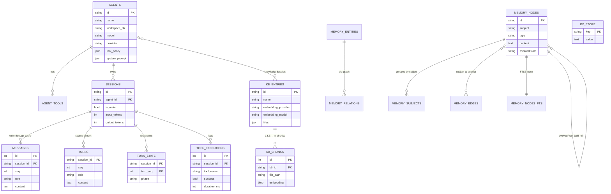
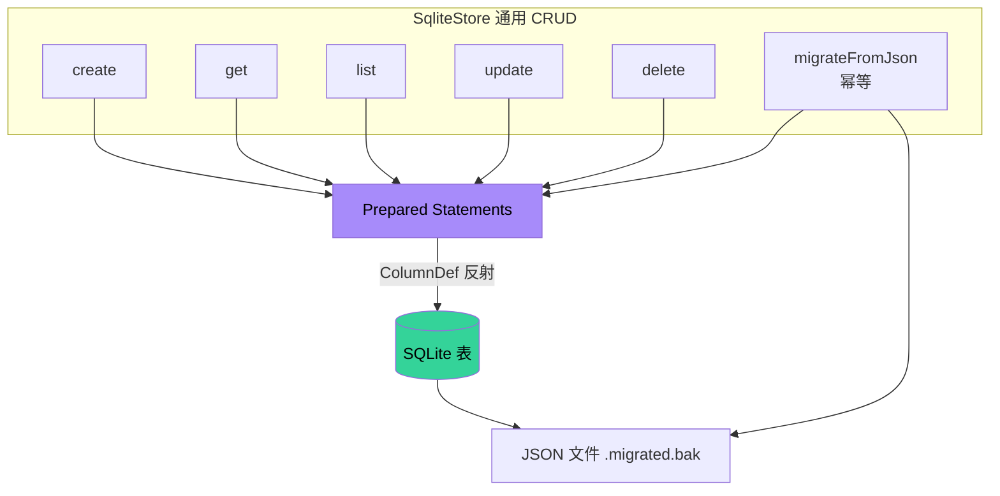
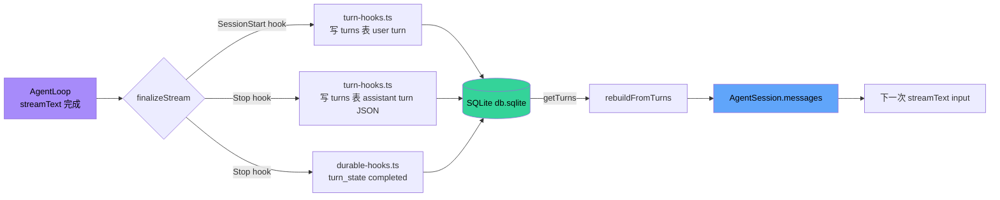

# 05 · 持久化层

> Zero-Core 是"本地优先"系统。所有用户数据都在 `~/.zero-core/db.sqlite` 一个 SQLite 文件里。本文剖析这张表图谱。

## 1. 数据驻留位置

```
~/.zero-core/
├── db.sqlite              ← 主数据库 (better-sqlite3)
├── webfetch/
│   ├── cache/<hash>.json  ← URL 抓取缓存
│   ├── results/<id>.json ← 大结果/binary 持久化
│   └── cookies.json       ← WebFetch Cookie jar
├── logs/<YYYY-MM-DD>.log  ← 按天日志
├── workspace/             ← 默认 workspace 目录
├── messages/<persona>.json  ← 旧版消息文件（迁移后改 .migrated.bak）
├── personas.json          ← 旧版（迁移后 .migrated.bak）
├── agents.json            ← 旧版
├── agent-tools.json       ← 旧版
├── providers.json         ← 旧版
├── templates.json         ← 旧版
├── mcp-servers.json       ← 旧版
├── knowledge-bases.json   ← 旧版
├── tool-config.json       ← 旧版 (→ kv_store[tool_config])
├── workspace.json         ← 旧版 (→ kv_store[workspace])
├── theme.json             ← 旧版 (→ kv_store[theme])
├── device-context.json    ← 旧版 (→ kv_store[device_context])
├── github-cache.json      ← 旧版 (→ kv_store[github_cache])
├── zero-core.json         ← 旧版 (→ kv_store[global_config])
└── tool-config.json
```

证据：`src/core/config.ts:233` `ZERO_CORE_DIR = process.env.ZERO_CORE_DIR ?? join(homedir(), ".zero-core")`；迁移路径见 `src/server/db-migration.ts:130-218`。

## 2. SQLite Schema（11 张业务表 + KV + FTS5）

### 2.1 会话 / 消息核心（SessionDB，src/server/session-db.ts）

#### `sessions`
```sql
id           TEXT PRIMARY KEY
agent_id     TEXT NOT NULL
is_main      INTEGER (bool)
title        TEXT
created_at   TEXT
updated_at   TEXT
input_tokens / output_tokens / total_tokens    INTEGER
cache_read_tokens / cache_write_tokens / reasoning_tokens   INTEGER
estimated_cost_usd                              REAL
```

#### `messages`（write-through 缓存）
```sql
id           INTEGER PRIMARY KEY AUTOINCREMENT
session_id   TEXT NOT NULL  → sessions(id)  [FK]
seq          INTEGER
role         TEXT    -- 'user' | 'assistant' | 'tool'
content      TEXT    -- 用户纯文本；assistant 序列化 JSON
msg_json     TEXT    -- 完整结构化消息
created_at   TEXT
```

注意：**`messages` 表非权威**。`turns` 表是 source of truth。`AgentSession` 构造时从 turns 重建 messages。

#### `turns`（**source of truth**）
```sql
session_id   TEXT
seq          INTEGER   -- 用户消息从 0 开始；assistant 紧跟其后
role         TEXT    -- 'user' | 'assistant'
content      TEXT    -- user: 原始字符串；assistant: JSON.stringify(blocks)
created_at   TEXT
```

`blocks` 形如：
```json
[
  {"type":"text", "text":"..."},
  {"type":"thinking", "text":"..."},
  {"type":"tool", "name":"Shell", "toolCallId":"tc-0", "args":{...}, "status":"done", "result":"..."}
]
```

`appendTurn(sessionId, seq, role, content)` —— `checkpoint-manager.ts:67` / `turn-hooks.ts:59` 是唯一调用点。

#### `turn_state`（durable execution 检查点）
```sql
session_id
turn_seq
phase        TEXT    -- 'started' | 'tools_executing' | 'completed' | 'failed'
last_tool    TEXT
started_at / completed_at
```

由 `durable-hooks.ts` 在 `SessionStart`/`PostToolUse`/`Stop`/`StopFailure` 中维护。`recovery.ts:34` 启动时清理 >24h 的。

#### `tool_executions`（工具调用日志）
```sql
session_id, agent_id, tool_name
success      INTEGER (bool)
error_message TEXT
input_preview TEXT (200 char)
output_preview TEXT (200 char)
duration_ms   INTEGER
turn_seq      INTEGER
started_at    TEXT
```

由 `tool-execution-router.ts:14-91` 的 `query/stats/cleanup/analyze` API 消费。

### 2.2 业务实体表

| 表 | Store | 列数 | 备注 |
|----|-------|------|------|
| `agents` | agent-store | 12 | AgentRecord |
| `agent_tools` | agent-tool-store | 18 | AgentToolEntry |
| `providers` | provider-store | 11 | 含 SYSTEM_PROVIDERS |
| `templates` | template-store | 14 | is_built_in 不可删 |
| `mcp_servers` | mcp-store | 11 | source_app 标记来源 |
| `kb_entries` | kb-store | 8 | 嵌入配置 + 文件列表 |
| `memory_entities` | memory-store | 4 | 知识图谱（旧版） |
| `memory_relations` | memory-store | 4 | 知识图谱（旧版） |
| `memory_nodes` | memory-node-store | 9 | Wiki 风格记忆节点 |
| `memory_subjects` | memory-node-store | 6 | 主题聚合 |
| `memory_edges` | memory-node-store | 4 | 主题间关系 |

### 2.3 KB chunks（独立 SQLite 文件？）

**非也** —— `KbDB` 也使用同一个 `db.sqlite`。`initSchema()`：

```sql
CREATE TABLE IF NOT EXISTS kb_chunks (
  id INTEGER PRIMARY KEY,
  kb_id TEXT, file_path TEXT, chunk_index INTEGER,
  content TEXT, embedding BLOB,        -- Float32Array 序列化
  token_count INTEGER, created_at TEXT
);
```

`embedding` 列是 BLOB —— Float32Array 直接序列化。`getAllChunksForSearch()` 加载所有 chunks 计算 cosine 相似度（纯 JS 循环）。

### 2.4 KV store

```sql
CREATE TABLE IF NOT EXISTS kv_store (
  key TEXT PRIMARY KEY,
  value TEXT NOT NULL,        -- JSON
  updated_at TEXT
);
```

**架构师的判断**：KV 表是项目"软状态"的总线。Workspace config、theme、device context、global config、tool config、GitHub cache、log config 都走这里。**没有把它当成"key-value-only"，而是作为 8 张业务表的灵活补丁**。

### 2.5 FTS5 虚拟表

`memory-node-store.ts`（lines 200-260）：

```sql
CREATE VIRTUAL TABLE memory_nodes_fts USING fts5(
  subject, type, content,
  content='memory_nodes',
  content_rowid='rowid'
);
```

带 INSERT / UPDATE / DELETE trigger 保持 FTS 索引同步。`searchNodes(query, limit)` 用 FTS5 MATCH 查询，返回 `bm25` 排序结果。

### 2.13 表关系图（erDiagram）




**关键关系**：
- **`SESSIONS` 是枢纽**：5 张表通过 session_id 与之关联
- **`turns` 是 source of truth**，`messages` 是 write-through 缓存（双写）
- **`memory_nodes` 自引用**：`evolvedFrom` 形成演化链
- **`kb_chunks` 独立存在**：不与 session 关联

## 3. SqliteStore — 通用 CRUD



`src/server/sqlite-store.ts:43-273` 是 9 个 Store 的"地基"：

```typescript
new SqliteStore<T>(db, "agents", COLUMNS)
  ├─ create(input)            → uuid + insert
  ├─ get(id)                  → select by id
  ├─ list()                   → all rows
  ├─ update(id, patch)        → update
  ├─ delete(id)               → delete
  ├─ migrateFromJson(jsonPath, key, transform?)
  └─ ensureColumn(name, type) → safe ALTER TABLE
```

每行都自动有 `id` / `created_at` / `updated_at`，由 `create()` 自动注入。

### 3.1 ColumnDef 设计

```typescript
{ key: "name" }
{ key: "workspaceDir", column: "workspace_dir" }   // 字段名映射
{ key: "toolPolicy", json: true }                  // 序列化 JSON
{ key: "enabled", bool: true }                     // INTEGER 0/1 ↔ boolean
```

这是一个**很巧妙的"反射 + 类型映射"**模式，避免了手写 SQL 与字段一一对应。

### 3.2 已知约束

- `insert()` 时 `updated_at` 字段不会自动更新（仅在 `update()` 时更新）。如果未来要做"最后修改时间审计"，需要修补。
- JSON 列没有 schema 校验，存入任意结构。
- 没有"软删除"机制。

## 4. SessionDB — 业务核心

`src/server/session-db.ts:43-812` 是最大的 Store（812 行）。除了 sessions / messages / turns / turn_state / tool_executions 之外，还持有：

- `KeyValueStore`
- `MemoryStore`（旧版知识图谱）
- `MemoryNodeStore`（新版 Wiki）

**关注点**：一个类持有 4 个独立的存储后端。这增加了耦合度。详见 ADR-006。

### 4.1 关键不变量

- `messages` 表是 `turns` 的 write-through 缓存；删除会话/清空 turns 时**应同时**清理 messages。
- `turns.seq` 单调递增；用户消息从偶数 seq 开始。
- `tool_executions.duration_ms` 总是真实测量值，不允许估算。

### 4.2 迁移机制

`db-migration.ts:91-223` `runMigrations(sessionDB)` 启动期必跑：

1. **列添加**（必须先于 SqliteStore 构造）：
   - `safeAddColumn("agents", "knowledge_base_ids", "TEXT")`
   - `safeAddColumn("sessions", "input_tokens", ...)` × 6 个 token 列
   - agent_tools 表的 13 个新列

2. **构造 SqliteStore**（此时已包含所有列）

3. **JSON 文件 → SQLite**：
   - providers.json → providers 表
   - agents.json → agents 表（含 personas.json 合并）
   - agent-tools.json → agent_tools 表
   - templates.json → templates 表
   - mcp-servers.json → mcp_servers 表
   - knowledge-bases.json → kb_entries 表

4. **KV 迁移**（6 个文件）：
   - workspace/tool-config/theme/device-context/github-cache/global-config → kv_store

5. **Memory 迁移**：`memory.migrateFromJson()` 把旧的 memory.json → memory_entities/relations

每步都做了"源文件存在性检查"+"读取验证"，且**重复启动是幂等的**（`migrateFromJson` 内部判断目标表已有则跳过）。

## 5. MemoryNodeStore — Wiki 风格记忆

`src/server/memory-node-store.ts:43-323` 是**两个并行记忆系统中的新版**：

| | 旧版 memory-store | 新版 memory-node-store |
|---|---|---|
| 模型 | 实体-关系图谱 | Wiki 节点 + 主题聚合 |
| 表 | memory_entities + memory_relations | memory_nodes + memory_subjects + memory_edges |
| 检索 | LIKE / 简单匹配 | FTS5 + BM25 |
| 写入 | 全量替换 | 增量 upsert，支持演化 |

### 5.1 node 类型枚举

```typescript
type NodeType = "event" | "decision" | "discovery" | "status_change" | "preference"
```

每条 node 还有 `evolvedFrom: id | null` 字段，记录演化链。

### 5.2 写入冲突策略

`upsertNode()` 按 `(subject, type)` 唯一：已有则覆盖 `content` 并更新 `evolvedFrom`。这是"知识合并"而非"知识追加"的策略。

### 5.3 FTS5 触发器

```sql
CREATE TRIGGER memory_nodes_ai AFTER INSERT ON memory_nodes BEGIN
  INSERT INTO memory_nodes_fts(rowid, subject, type, content)
  VALUES (new.rowid, new.subject, new.type, new.content);
END;
```

（同样有 `_ad` / `_au` 触发器保持 DELETE/UPDATE 同步）

## 6. KbDB — 简单但够用的向量存储

`src/server/kb-db.ts:43-128`：

- 表：`kb_chunks`（id / kb_id / file_path / chunk_index / content / **embedding BLOB** / token_count / created_at）
- 写入：批量 insert in transaction
- 删除：按 `kb_id + file_path` 或按 `kb_id`
- 搜索：`getAllChunksForSearch()` + 客户端 cosine

**架构师评估**：100K+ chunks 时全量加载+计算是性能瓶颈。当前没有 HNSW / IVF 索引。详见 ADR-007。

## 7. KeyValueStore — 灵活补丁

`src/server/key-value-store.ts:32-116`：

```
get(key) / getJson<T>(key) / set(key, value) / setJson(key, value) / delete / list
migrateFromJsonFile(key, jsonPath)  ← 启动期一次性
```

Prepared statements 在构造函数中缓存，热路径 O(1) SQL 解析。

**风险**：如果两个并发 writer 同时 `setJson("theme", ...)`，最后写覆盖前写。无 CAS、无版本号、无乐观锁。但实际场景下，主题/配置变更都是单用户单进程，不构成问题。

## 8. 数据流：一次对话的持久化足迹

```
用户输入 "fix bug"
│
├─ Turn 0: user
│  ├─ turn-hooks:SessionStart
│  │   ├─ turn_state (session, 0, phase='started')
│  │   └─ turns (session, 0, 'user', "fix bug")
│  └─ chat-store.messagesBySession[session][0] = {role:'user', text:'fix bug'}
│
├─ LLM stream
│  ├─ 每 5K 字符: persistBlocksSnapshot
│  │   └─ turns (session, 1, 'assistant', JSON.stringify(blocks-so-far))
│  └─ tool-call "Shell"
│     ├─ durable-hooks:PostToolUse
│     │   └─ turn_state.phase = 'tools_executing', last_tool='Shell'
│     └─ tool_executions (insert)
│
├─ tool-result
│  └─ upsertAssistantTurn (session, 1, blocks 含 result)
│
└─ message_end
   ├─ turn-hooks:Stop
   │   └─ turns (session, 1, 'assistant', final blocks JSON)
   ├─ durable-hooks:Stop
   │   └─ turn_state.phase = 'completed'
   └─ sessions.updated_at = now; sessions.total_tokens += delta
```

## 9. 备份与一致性

- **没有**自动备份机制。SQLite 是单文件，用户自己备份 ~/.zero-core/db.sqlite。
- **WAL 模式已启用**：`session-db.ts:56` 和 `kb-db.ts:52` 均已设置 `db.pragma("journal_mode = WAL")`。
- **事务粒度**：`saveTurn` 用 transaction 包裹整批 message 写入。`upsertNodes` 同样事务化。其他大多数写入是单条。

### 9.1 持久化写入路径



## 10. 性能特征

| 操作 | 复杂度 | 备注 |
|------|--------|------|
| 读 messages | O(N) | 全表扫描 |
| 读 turns | O(N) | 无 index by session+seq |
| 写 turn | O(N) | N = 消息数，全量覆盖 |
| KB 搜索 | O(M×D) | M = chunks, D = embedding dim |
| FTS5 search | O(log N) | 倒排索引 |
| KV get/set | O(1) | 主键 |

**架构师建议**：
- 添加 `idx_turns_session_seq(session_id, seq)`
- 添加 `idx_messages_session(session_id)`（如果将来想直接读 messages）
- KB 超过 10K chunks 时考虑外部向量数据库（lancedb / sqlite-vss）

## 11. 架构师视角

### 11.1 做对了的

- **SqliteStore 的 ColumnDef** —— 节省了大量样板代码，且保留类型安全。
- **turns 表作为 source of truth** —— UI 渲染与运行时计算走同一路径。
- **KV store 替代散落的 JSON** —— 配置集中化，事务化。
- **JSON → SQLite 迁移** —— 完整的"软启动"路径，幂等。
- **WAL 模式已启用** —— `session-db.ts:56` 和 `kb-db.ts:52` 均已配置 WAL，崩溃恢复能力良好。

### 11.2 可以改进的

- **session-db.ts 太大**（812 行）。可拆为：sessions / messages / turns / turn_state / tool_executions 各一个文件。
- **KB 搜索** 在大库时性能崩塌（O(M×D) 客户端循环）。
- **message-store.ts** 是已迁移完成的历史遗留物，应删除或迁移到 `legacy/`。
- **内存节点** 与 **旧版知识图谱** 同时存在——需要明确"哪个是默认"，否则用户数据写错地方。
- **没有数据导出**。用户无法迁移到新机器。

详见 ADR-006, ADR-007, ADR-013。
