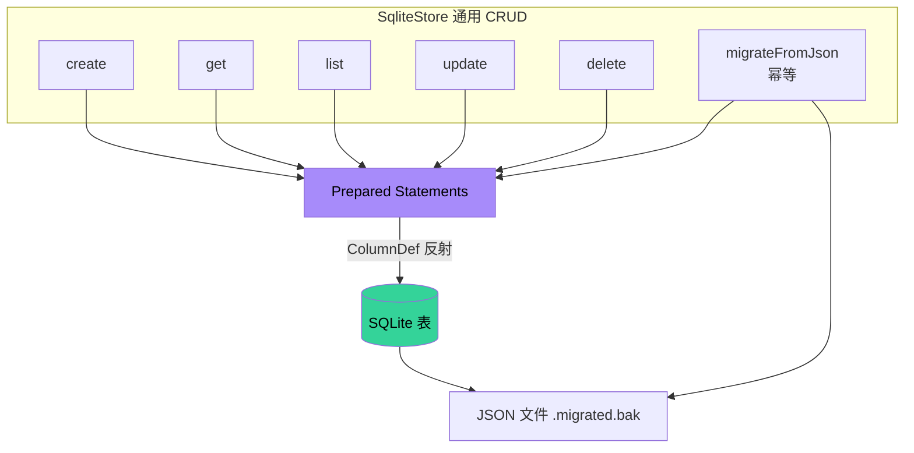
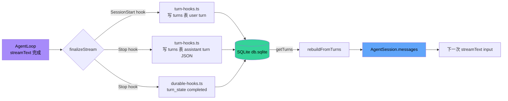

# 05 · 持久化层

> Zero-Core 是"本地优先"系统。所有用户数据都在 `~/.zero-core/db.sqlite` 一个 SQLite 文件里。本文剖析这张表图谱。

## 1. 数据驻留位置

```
~/.zero-core/
├── db.sqlite              ← 主数据库 (better-sqlite3)
├── webfetch/
│   ├── cache/<hash>.json  ← URL 抓取缓存
│   ├── results/<id>.json ← 大结果/binary 持久化
│   └── cookies.json       ← WebFetch Cookie jar
├── wiki/                  ← v0.8 (P1 §10.1) Wiki 磁盘镜像树根(见 06 §2.5)
│   ├── <area>/<safe-name>.md  ← project_wiki 行的正文(doc_pointer 指向这里)
│   └── ...
├── logs/<YYYY-MM-DD>.log  ← 按天日志
├── workspace/             ← 默认 workspace 目录
├── messages/<persona>.json  ← 旧版消息文件（迁移后改 .migrated.bak）
├── personas.json          ← 旧版（迁移后 .migrated.bak）
├── agents.json            ← 旧版
├── agent-tools.json       ← 旧版
├── providers.json         ← 旧版
├── templates.json         ← 旧版
├── mcp-servers.json       ← 旧版
├── knowledge-bases.json   ← 旧版
├── tool-config.json       ← 旧版 (→ kv_store[tool_config])
├── workspace.json         ← 旧版 (→ kv_store[workspace])
├── theme.json             ← 旧版 (→ kv_store[theme])
├── device-context.json    ← 旧版 (→ kv_store[device_context])
├── github-cache.json      ← 旧版 (→ kv_store[github_cache])
├── zero-core.json         ← 旧版 (→ kv_store[global_config])
└── tool-config.json
```

**v0.8 关键变化**:`wiki/` 目录是 v0.8 (P1 §10.1) 新增的 **Wiki 体磁盘镜像树** —— `project_wiki`
表只存元数据(node_id / parent / path / summary / doc_pointer),正文下沉到磁盘 markdown 文件,
由 `diskPathFor(node)` 推导路径(见 06 §2.5)。这是为了让 wiki 正文可被 git/archivist 直接读、
且避免大段 markdown 把 SQLite 表撑爆。`WIKI_DISK_ROOT` 全局隔离陷阱见 06 §2.5 / v0.8 工具加固决策。

证据：`src/core/config.ts:233` `ZERO_CORE_DIR = process.env.ZERO_CORE_DIR ?? join(homedir(), ".zero-core")`；迁移路径见 `src/server/db-migration.ts:130-218`(旧 JSON 迁移) + `:653-897`(v0.8 工作流域表 DDL)。

## 2. SQLite Schema（30 张表：11 业务表 + 9 张 v0.8 工作流域表 + 4 张 SessionDB 内核表 + KV/FTS5/telemetry/cursor）

> v0.8 落地后,持久化层从"会话核心 + 配置/记忆"扩展为"会话核心 + 项目/需求/工作流 + cron/wiki
> 副本"。本节按"会话核心 → 旧业务实体 → v0.8 工作流域 → 内部辅助表"四组分别列出。

### 2.1 会话 / 消息核心（SessionDB，src/server/session-db.ts）

#### `sessions`
```sql
id           TEXT PRIMARY KEY
agent_id     TEXT NOT NULL
is_main      INTEGER (bool)
title        TEXT
created_at   TEXT
updated_at   TEXT
input_tokens / output_tokens / total_tokens    INTEGER
cache_read_tokens / cache_write_tokens / reasoning_tokens   INTEGER
estimated_cost_usd                              REAL
```

#### `messages`（write-through 缓存）
```sql
id           INTEGER PRIMARY KEY AUTOINCREMENT
session_id   TEXT NOT NULL  → sessions(id)  [FK]
seq          INTEGER
role         TEXT    -- 'user' | 'assistant' | 'tool'
content      TEXT    -- 用户纯文本；assistant 序列化 JSON
msg_json     TEXT    -- 完整结构化消息
created_at   TEXT
```

注意：**`messages` 表非权威**。`turns` 表是 source of truth。`AgentSession` 构造时从 turns 重建 messages。

#### `turns`（**source of truth**）
```sql
session_id   TEXT
seq          INTEGER   -- 用户消息从 0 开始；assistant 紧跟其后
role         TEXT    -- 'user' | 'assistant'
content      TEXT    -- user: 原始字符串；assistant: JSON.stringify(blocks)
created_at   TEXT
```

`blocks` 形如：
```json
[
  {"type":"text", "text":"..."},
  {"type":"thinking", "text":"..."},
  {"type":"tool", "name":"Shell", "toolCallId":"tc-0", "args":{...}, "status":"done", "result":"..."}
]
```

`appendTurn(sessionId, seq, role, content)` —— `checkpoint-manager.ts:67` / `turn-hooks.ts:59` 是唯一调用点。

#### `turn_state`（durable execution 检查点）
```sql
session_id
turn_seq
phase        TEXT    -- 'started' | 'tools_executing' | 'completed' | 'failed'
last_tool    TEXT
started_at / completed_at
```

由 `durable-hooks.ts` 在 `SessionStart`/`PostToolUse`/`Stop`/`StopFailure` 中维护。`recovery.ts:34` 启动时清理 >24h 的。

#### `tool_executions`（工具调用日志）
```sql
session_id, agent_id, tool_name
success      INTEGER (bool)
error_message TEXT
input_preview TEXT (200 char)
output_preview TEXT (200 char)
duration_ms   INTEGER
turn_seq      INTEGER
started_at    TEXT
```

由 `tool-execution-router.ts:14-91` 的 `query/stats/cleanup/analyze` API 消费。

### 2.2 业务实体表

| 表 | Store | 列数 | 备注 |
|----|-------|------|------|
| `agents` | agent-store | 12 | AgentRecord |
| `agent_tools` | agent-tool-store | 18 | AgentToolEntry |
| `providers` | provider-store | 11 | 含 SYSTEM_PROVIDERS |
| `templates` | template-store | 14 | is_built_in 不可删 |
| `mcp_servers` | mcp-store | 11 | source_app 标记来源 |
| `kb_entries` | kb-store | 8 | 嵌入配置 + 文件列表 |
| `memory_entities` | memory-store | 4 | 知识图谱（旧版） |
| `memory_relations` | memory-store | 4 | 知识图谱（旧版） |
| `memory_nodes` | memory-node-store | 9 | Wiki 风格记忆节点 |
| `memory_subjects` | memory-node-store | 6 | 主题聚合 |
| `memory_edges` | memory-node-store | 4 | 主题间关系 |

### 2.2b v0.8 多 Agent 工作流域表（src/server/db-migration.ts:653-897）

v0.8 引入"项目 → 需求 → Lead/PM/Analyst 工作流"主线后,新增 9 张表 + 1 张 KB 索引
(`kb_chunks` 已存在,见 §2.3)。**全部走 `db-migration.ts` 的 `CREATE TABLE IF NOT EXISTS`
+ `safeAddColumn` 路径,与 §4.2 迁移机制同源;不像旧业务表那样有 JSON → SQLite 迁移**(v0.8
实体是 DB-native 的,没有 JSON 前身)。Store 类全部用 `SqliteStore<T>` 反射 CRUD(见 §3),
**唯一例外**是 `ToolConfigStore` —— 它手写 SQL 因为 PK 是 `tool_name` 而非 surrogate id
(SqliteStore 总是注入 `id/created_at/updated_at` 三件套)。

| 表 | Store 类 | 列数 | v0.8 阶段 | 备注 |
|----|----------|------|-----------|------|
| `projects` | `ProjectStore` (project-store.ts:78) | 5 (+legacy 残留) | M0 | 极简元数据:name + workspaceDir(UNIQUE)。M0 之前的列(path / analyst_cron_id / status 等)在升级 DB 上残留但不再读 |
| `project_wiki` | `WikiStore` (wiki-node-store.ts:327) | 15 | M2 / P1 §10.1 | Wiki 磁盘镜像树(见 06 §2.5)。M2 删除 legacy `detail`+`type` 列(内容下沉 ~/.zero-core/wiki/),改用 `doc_pointer` + 磁盘正文。三个索引:`idx_wiki_project` / `idx_wiki_parent` / `idx_wiki_parent_path`(archivist upsert 热路径) |
| `wiki_scan_cursors` | `WikiScanCursorStore` (wiki-scan-cursor-store.ts:62) | 7 | M2 | (archivist_id, project_id) 唯一 → 增量 git cursor。见 06 §2.6 |
| `requirements` | `RequirementStore` (requirement-store.ts:85) | 14 | M1 | 需求实体:status 状态机 / source(analyst/user)/ priority / 影响域。两索引(project / status) |
| `requirement_status_history` | RequirementStore 内部 historyStore (requirement-store.ts:93) | 6 | M1 | 需求状态迁移审计:from→to + triggered_by + comment |
| `task_steps` | `TaskStepStore` (task-step-store.ts:58) | 18 | M1 | 需求分解步骤:stepOrder + role + retry/maxRetries + sessionId(执行时绑定) |
| `requirement_messages` | RequirementStore 内部 messageStore (requirement-store.ts:94) | 6 | M1 | 需求讨论流:sender + messageType(text/system/decision) |
| `crons` | `CronStore` (cron-store.ts:63) | 13 | M1 / P0 §3.4 | 一等公民 cron 实体。`schedule` 是结构化 JSON(CronSchedule union,旧 string 行由 migrateCronScheduleToJson 转换)。`trigger_mode`/`last_run_at`/`last_status`/`next_run_at` 是调度器遥测列 |
| `cron_runs` | `CronRunStore` (cron-store.ts:176) | 13 | P0 §9.3 | 每次触发的审计日志:fired_at(规范时间戳)+ success + tokens/cost + duration |
| `project_jobs` | `ProjectJobStore` (project-job-store.ts:47) | 11 | M3 | 项目级后台任务(wiki 充实等)的生命周期记录:status(running/completed/failed)+ promptSummary |
| `tool_configs` | `ToolConfigStore` (tool-usage-store.ts:51,**手写**) | 3 | P0 §7.7 #4 | per-tool 默认参数配置。PK = tool_name,不走 SqliteStore |
| `tool_usage` | `ToolUsageStore` (tool-usage-store.ts:129) | 8 | P0 §7.7 #4 | 工具调用级日志(与 sessions 级 token 核算 RFC §8.5 区分)。两索引(tool_name / session_id) |
| `orchestrate_plans` | `OrchestratePlanStore` (orchestrate-store.ts:79) | 10 | M3 | Lead 提交的 DSL flow + confirm gate 状态(state=pending/approved/rejected)。`lead_session_id` 是 IPC confirm/reject 路径定位活跃 awaiter 的路由键 |
| `orchestrate_manifests` | `OrchestrateManifestStore` (orchestrate-store.ts:131) | 8 | M3 (D34) | 每次执行的 manifest:touchedFiles/tests/review(JSON 数组)+ summary。PM 读它判覆盖度,archivist 读它做可追溯 |

**关键关系(见图 §2.13)**:
- `projects` 是工作流域根(1:N → requirements / project_wiki / project_jobs)。
- `requirements` 是流程枢纽:1:N → task_steps / requirement_status_history / requirement_messages / orchestrate_plans。
- `orchestrate_plans` ↔ `orchestrate_manifests` 是 1:N(plan 可重跑,每次 manifest)。
- `crons` → `cron_runs` 1:N(每次触发一行)。
- `project_wiki` 自引用 `parent_id` + `project_id` 可空(global root / memory 节点 project_id=NULL,
  这是 M2 wiki 全局化的关键约束)。

**与旧业务表的边界**:`agents` 表的 `knowledgeBaseIds` 仍是旧 KB 概念,与 `project_wiki` 是
**两个并行的 wiki 系统** —— 旧 `kb_*` 走嵌入向量检索(RAG),新 `project_wiki` 走磁盘镜像树
+ archivist 摘要(见 06 §2)。两者不互转。

### 2.3 KB chunks（独立 SQLite 文件？）

**非也** —— `KbDB` 也使用同一个 `db.sqlite`。`initSchema()`：

```sql
CREATE TABLE IF NOT EXISTS kb_chunks (
  id INTEGER PRIMARY KEY,
  kb_id TEXT, file_path TEXT, chunk_index INTEGER,
  content TEXT, embedding BLOB,        -- Float32Array 序列化
  token_count INTEGER, created_at TEXT
);
```

`embedding` 列是 BLOB —— Float32Array 直接序列化。`getAllChunksForSearch()` 加载所有 chunks 计算 cosine 相似度（纯 JS 循环）。

### 2.4 KV store

```sql
CREATE TABLE IF NOT EXISTS kv_store (
  key TEXT PRIMARY KEY,
  value TEXT NOT NULL,        -- JSON
  updated_at TEXT
);
```

**架构师的判断**：KV 表是项目"软状态"的总线。Workspace config、theme、device context、global config、tool config、GitHub cache、log config 都走这里。**没有把它当成"key-value-only"，而是作为 8 张业务表的灵活补丁**。

### 2.5 FTS5 虚拟表

`memory-node-store.ts`（lines 200-260）：

```sql
CREATE VIRTUAL TABLE memory_nodes_fts USING fts5(
  subject, type, content,
  content='memory_nodes',
  content_rowid='rowid'
);
```

带 INSERT / UPDATE / DELETE trigger 保持 FTS 索引同步。`searchNodes(query, limit)` 用 FTS5 MATCH 查询，返回 `bm25` 排序结果。

### 2.13 表关系图（erDiagram）

> v0.8 后表数从 15 张扩到 30 张。下图分两个 mermaid 块:**①会话/旧业务/记忆** +
> **②v0.8 工作流域**(projects→requirements→orchestrate)。两者通过 `agents.id ↔
> crons.agent_id` 与 `sessions.context_project_id`(v0.8 D-B)弱关联。

#### 2.13a 会话核心 / 旧业务实体 / 记忆系统

```mermaid
erDiagram
    AGENTS ||--o{ AGENT_TOOLS : "has"
    AGENTS ||--o{ SESSIONS : "owns"
    AGENTS }o--o{ KB_ENTRIES : "knowledgeBaseIds"
    SESSIONS ||--o{ MESSAGES : "write-through cache"
    SESSIONS ||--o{ TURNS : "source of truth"
    SESSIONS ||--o{ TURN_STATE : "checkpoint"
    SESSIONS ||--o{ TOOL_EXECUTIONS : "logs"
    KB_ENTRIES ||--o{ KB_CHUNKS : "1 KB → N chunks"
    MEMORY_ENTITIES ||--o{ MEMORY_RELATIONS : "old graph"
    MEMORY_NODES ||--o{ MEMORY_NODES : "evolvedFrom (self-ref)"
    MEMORY_NODES ||--o{ MEMORY_SUBJECTS : "grouped by subject"
    MEMORY_NODES }o--o{ MEMORY_EDGES : "subject-to-subject"
    MEMORY_NODES ||--|| MEMORY_NODES_FTS : "FTS5 index"

    AGENTS {
        string id PK
        string name
        string workspace_dir
        string model
        string provider
        json tool_policy
        json system_prompt
    }
    SESSIONS {
        string id PK
        string agent_id FK
        string context_project_id FK_v0.8
        bool is_main
        int input_tokens
        int output_tokens
    }
    TURNS {
        string session_id FK
        int seq
        int turn_group "v0.8 step grouping"
        string role
        text content
    }
    MESSAGES {
        int id PK
        string session_id FK
        int seq
        string role
        text content
    }
    TURN_STATE {
        string session_id FK
        int turn_seq FK
        string phase
    }
    TOOL_EXECUTIONS {
        int id PK
        string session_id FK
        string tool_name
        bool success
        int duration_ms
    }
    KB_ENTRIES {
        string id PK
        string name
        string embedding_provider
        string embedding_model
        json files
    }
    KB_CHUNKS {
        int id PK
        string kb_id FK
        string file_path
        blob embedding
    }
    MEMORY_NODES {
        string id PK
        string subject
        string type
        text content
        string evolvedFrom
    }
    KV_STORE {
        string key PK
        text value
    }
```

#### 2.13b v0.8 多 Agent 工作流域(projects → requirements → orchestrate)

```mermaid
erDiagram
    PROJECTS ||--o{ REQUIREMENTS : "M1 需求池"
    PROJECTS ||--o{ PROJECT_WIKI : "M2 镜像树 (project_id nullable)"
    PROJECTS ||--o{ PROJECT_JOBS : "M3 后台任务"
    REQUIREMENTS ||--o{ TASK_STEPS : "M1 步骤分解"
    REQUIREMENTS ||--o{ REQUIREMENT_STATUS_HISTORY : "状态机审计"
    REQUIREMENTS ||--o{ REQUIREMENT_MESSAGES : "讨论流"
    REQUIREMENTS ||--o{ ORCHESTRATE_PLANS : "M3 Lead 提交"
    ORCHESTRATE_PLANS ||--o{ ORCHESTRATE_MANIFESTS : "D34 每次执行"
    PROJECT_WIKI ||--o{ PROJECT_WIKI : "parent_id (self-ref, 全局树)"
    WIKI_SCAN_CURSORS }o--|| PROJECTS : "(archivist, project) 唯一"
    AGENTS ||--o{ CRONS : "M1 cron.owner (软 FK)"
    CRONS ||--o{ CRON_RUNS : "P0 每次触发"
    SESSIONS }o..o{ TOOL_USAGE : "P0 工具级日志 (session_id 可空)"

    PROJECTS {
        string id PK
        string name
        string workspace_dir UK
    }
    REQUIREMENTS {
        string id PK
        string project_id FK
        string title
        string status "found→specified→...→closed"
        string source "analyst|user"
        string priority
        string assigned_lead_session_id
    }
    TASK_STEPS {
        string id PK
        string requirement_id FK
        int step_order
        string role "lead|pm|analyst|verify"
        string status "pending|running|done|failed"
        int retry_count
        string session_id "执行时绑定"
    }
    PROJECT_WIKI {
        string id PK
        string project_id "nullable: global root / memory"
        string parent_id FK_self
        string node_type
        string path "relative to scope root"
        string doc_pointer "→ ~/.zero-core/wiki/*.md"
        string source_req_id
    }
    ORCHESTRATE_PLANS {
        string id PK
        string requirement_id FK
        string lead_session_id "IPC confirm 路由键"
        json flow "DSL"
        string state "pending|approved|rejected"
    }
    ORCHESTRATE_MANIFESTS {
        string id PK
        string plan_id FK
        json touched_files
        json tests
        json review
    }
    CRONS {
        string id PK
        string agent_id FK_soft
        json working_scope "SessionContextBundle"
        json schedule "CronSchedule union"
        string trigger_mode
        string last_status
    }
    CRON_RUNS {
        string id PK
        string cron_id FK
        string fired_at "规范时间戳"
        bool success
        int tokens
        real cost
    }
    PROJECT_JOBS {
        string id PK
        string project_id FK
        string job_type "wiki-enrich|..."
        string status "running|completed|failed"
        string session_id
    }
    TOOL_USAGE {
        string id PK
        string tool_name
        string session_id "可空"
        bool success
        int duration_ms
    }
    TOOL_CONFIGS {
        string tool_name PK
        json config "默认参数"
    }
    TOOL_TELEMETRY {
        string id PK
        string session_id FK
        string tool_name
        string kind
        string signature "去重键"
        int occurrence_count
    }
    EXTRACTION_CURSORS {
        string session_id PK
        int last_extracted_seq
        int last_threshold_idx
    }
    WIKI_SCAN_CURSORS {
        string id PK
        string archivist_id
        string project_id
        string last_scanned_ref "git cursor"
    }
```

**关键关系**：
- **`SESSIONS` 是会话域枢纽**：5 张表通过 session_id 与之关联;v0.8 后 `sessions.context_project_id`
  把 session 反向挂到 `projects`(D-B 路由依据,见 02 §3 / 03 §3.1)。
- **`PROJECTS` 是工作流域枢纽**(v0.8 新增):1:N → requirements / project_wiki / project_jobs。
- **`REQUIREMENTS` 是流程枢纽**:1:N → task_steps / history / messages / orchestrate_plans。
- **`turns` 是 source of truth**，`messages` 是 write-through 缓存（双写）;v0.8 加 `turn_group`
  列把同一逻辑 turn 内的多步 LLM 调用聚合(索引 idx_turns_session_group)。
- **`memory_nodes` 自引用**：`evolvedFrom` 形成演化链。
- **`project_wiki` 自引用 + project_id 可空**:这是 M2 全局化的关键 —— 全局 root / memory 节点
  不属于任何 project(见 06 §2.5)。
- **`kb_chunks` 与 session 无关**:独立 RAG 索引。
- **`tool_usage`(P0) ≠ `tool_executions`(旧)**:前者是 RFC §7.7 #4 的工具级日志(含 params/成功/耗时),
  后者是 §2.1 的会话级日志(input/output_preview);两个表的 `session_id` 不一定一致 ——
  `tool_usage` 在 cron / 后台 job / 子 agent 委派里也会写,这些 session 可能是临时的。

## 3. SqliteStore — 通用 CRUD



`src/server/sqlite-store.ts:43-273` 是 18 个 Store 的"地基"(v0.8 工作流域 9 张表全部复用,见 §2.2b)：

```typescript
new SqliteStore<T>(db, "agents", COLUMNS)
  ├─ create(input)            → uuid + insert
  ├─ get(id)                  → select by id
  ├─ list()                   → all rows
  ├─ update(id, patch)        → update
  ├─ delete(id)               → delete
  ├─ migrateFromJson(jsonPath, key, transform?)
  └─ ensureColumn(name, type) → safe ALTER TABLE
```

每行都自动有 `id` / `created_at` / `updated_at`，由 `create()` 自动注入。

#### 3.0.1 写出口 = UI 同步捕获点

`insertRow` / `updateRow` / `delete` 是 SqliteStore **唯一的写原语**,也是 `data-change-hub` 的唯一 emit 点(见 ADR-021)。所有领域 store(AgentStore/ProjectStore/CronStore/RequirementStore/WikiStore/...)的写都收敛到这里,因此四个突变面(UI REST / agent 工具 / 后台服务 / 启动恢复)改的数据都能被 renderer 自动感知,无需逐 store 加通知:

- `insertRow(record)` → `emitDataChange(table, record.id, "create", record)`
- `updateRow(id, record)` → `emitDataChange(table, id, "update", record)`
- `delete(id)` → `emitDataChange(table, id, "delete")`
- `update()` 做 **no-op 检测**:patch 字段全等于现值 → 跳过写 + 不 emit(标量按数值比,兼容"数字存 TEXT 读回 `'2.0'`"的 round-trip 怪癖)。

非白名单表(`messages`/`turns`/`tool_executions` 等高频表)的 emit 在 hub 层被忽略。

### 3.1 ColumnDef 设计

```typescript
{ key: "name" }
{ key: "workspaceDir", column: "workspace_dir" }   // 字段名映射
{ key: "toolPolicy", json: true }                  // 序列化 JSON
{ key: "enabled", bool: true }                     // INTEGER 0/1 ↔ boolean
```

这是一个**很巧妙的"反射 + 类型映射"**模式，避免了手写 SQL 与字段一一对应。

### 3.2 已知约束

- `insert()` 时 `updated_at` 字段不会自动更新（仅在 `update()` 时更新）。如果未来要做"最后修改时间审计"，需要修补。
- JSON 列没有 schema 校验，存入任意结构。
- 没有"软删除"机制。

## 4. SessionDB — 业务核心

`src/server/session-db.ts` 当前约 850 行，是 DB lifecycle + 多业务表门面的重型文件。除了 sessions / messages / turns / turn_state / tool_executions 之外，还持有：

- `KeyValueStore`
- `MemoryStore`（旧版知识图谱）
- `MemoryNodeStore`（新版 Wiki）

**关注点**：一个类持有 4 个独立的存储后端。这增加了耦合度。详见 ADR-006。

### 4.1 关键不变量

- `messages` 表是 `turns` 的 write-through 缓存；删除会话/清空 turns 时**应同时**清理 messages。
- `turns.seq` 单调递增；用户消息从偶数 seq 开始。
- `tool_executions.duration_ms` 总是真实测量值，不允许估算。

### 4.2 迁移机制

`db-migration.ts:91-223` `runMigrations(sessionDB)` 启动期必跑：

1. **列添加**（必须先于 SqliteStore 构造）：
   - `safeAddColumn("agents", "knowledge_base_ids", "TEXT")`
   - `safeAddColumn("sessions", "input_tokens", ...)` × 6 个 token 列
   - agent_tools 表的 13 个新列

2. **构造 SqliteStore**（此时已包含所有列）

3. **JSON 文件 → SQLite**：
   - providers.json → providers 表
   - agents.json → agents 表（含 personas.json 合并）
   - agent-tools.json → agent_tools 表
   - templates.json → templates 表
   - mcp-servers.json → mcp_servers 表
   - knowledge-bases.json → kb_entries 表

4. **KV 迁移**（6 个文件）：
   - workspace/tool-config/theme/device-context/github-cache/global-config → kv_store

5. **Memory 迁移**：`memory.migrateFromJson()` 把旧的 memory.json → memory_entities/relations

每步都做了"源文件存在性检查"+"读取验证"，且**重复启动是幂等的**（`migrateFromJson` 内部判断目标表已有则跳过）。

## 5. MemoryNodeStore — Wiki 风格记忆

`src/server/memory-node-store.ts:43-323` 是**两个并行记忆系统中的新版**：

| | 旧版 memory-store | 新版 memory-node-store |
|---|---|---|
| 模型 | 实体-关系图谱 | Wiki 节点 + 主题聚合 |
| 表 | memory_entities + memory_relations | memory_nodes + memory_subjects + memory_edges |
| 检索 | LIKE / 简单匹配 | FTS5 + BM25 |
| 写入 | 全量替换 | 增量 upsert，支持演化 |

### 5.1 node 类型枚举

```typescript
type NodeType = "event" | "decision" | "discovery" | "status_change" | "preference"
```

每条 node 还有 `evolvedFrom: id | null` 字段，记录演化链。

### 5.2 写入冲突策略

`upsertNode()` 按 `(subject, type)` 唯一：已有则覆盖 `content` 并更新 `evolvedFrom`。这是"知识合并"而非"知识追加"的策略。

### 5.3 FTS5 触发器

```sql
CREATE TRIGGER memory_nodes_ai AFTER INSERT ON memory_nodes BEGIN
  INSERT INTO memory_nodes_fts(rowid, subject, type, content)
  VALUES (new.rowid, new.subject, new.type, new.content);
END;
```

（同样有 `_ad` / `_au` 触发器保持 DELETE/UPDATE 同步）

## 6. KbDB — 简单但够用的向量存储

`src/server/kb-db.ts:43-128`：

- 表：`kb_chunks`（id / kb_id / file_path / chunk_index / content / **embedding BLOB** / token_count / created_at）
- 写入：批量 insert in transaction
- 删除：按 `kb_id + file_path` 或按 `kb_id`
- 搜索：`getAllChunksForSearch()` + 客户端 cosine

**架构师评估**：100K+ chunks 时全量加载+计算是性能瓶颈。当前没有 HNSW / IVF 索引。详见 ADR-007。

## 7. KeyValueStore — 灵活补丁

`src/server/key-value-store.ts:32-116`：

```
get(key) / getJson<T>(key) / set(key, value) / setJson(key, value) / delete / list
migrateFromJsonFile(key, jsonPath)  ← 启动期一次性
```

Prepared statements 在构造函数中缓存，热路径 O(1) SQL 解析。

**风险**：如果两个并发 writer 同时 `setJson("theme", ...)`，最后写覆盖前写。无 CAS、无版本号、无乐观锁。但实际场景下，主题/配置变更都是单用户单进程，不构成问题。

## 8. 数据流：一次对话的持久化足迹

```
用户输入 "fix bug"
│
├─ Turn 0: user
│  ├─ turn-hooks:SessionStart
│  │   ├─ turn_state (session, 0, phase='started')
│  │   └─ turns (session, 0, 'user', "fix bug")
│  └─ chat-store.messagesBySession[session][0] = {role:'user', text:'fix bug'}
│
├─ LLM stream
│  ├─ 每 5K 字符: persistBlocksSnapshot
│  │   └─ turns (session, 1, 'assistant', JSON.stringify(blocks-so-far))
│  └─ tool-call "Shell"
│     ├─ durable-hooks:PostToolUse
│     │   └─ turn_state.phase = 'tools_executing', last_tool='Shell'
│     └─ tool_executions (insert)
│
├─ tool-result
│  └─ upsertAssistantTurn (session, 1, blocks 含 result)
│
└─ message_end
   ├─ turn-hooks:Stop
   │   └─ turns (session, 1, 'assistant', final blocks JSON)
   ├─ durable-hooks:Stop
   │   └─ turn_state.phase = 'completed'
   └─ sessions.updated_at = now; sessions.total_tokens += delta
```

## 9. 备份与一致性

- **没有**自动备份机制。SQLite 是单文件，用户自己备份 ~/.zero-core/db.sqlite。
- **WAL 模式已启用**：`session-db.ts:56` 和 `kb-db.ts:52` 均已设置 `db.pragma("journal_mode = WAL")`。
- **事务粒度**：`saveTurn` 用 transaction 包裹整批 message 写入。`upsertNodes` 同样事务化。其他大多数写入是单条。

### 9.1 持久化写入路径



## 10. 性能特征

| 操作 | 复杂度 | 备注 |
|------|--------|------|
| 读 messages | O(N) | 全表扫描 |
| 读 turns (by session) | O(N) | 无 `idx_turns_session_seq`,仍全扫;**v0.8 加了 `idx_turns_session_group(session_id, turn_group)`**(只优化 step-group 聚合,不优化单 session 全读) |
| 写 turn | O(N) | N = 消息数，全量覆盖 |
| KB 搜索 | O(M×D) | M = chunks, D = embedding dim |
| FTS5 search | O(log N) | 倒排索引 |
| KV get/set | O(1) | 主键 |
| project_wiki getByParentAndPath | O(log N) | **v0.8 加 `idx_wiki_parent_path`**,archivist upsert 热路径(原全表扫,M2 之前是性能墙) |
| tool_usage 查询 | O(log N) | `idx_tool_usage_tool` / `idx_tool_usage_session` |

**架构师建议**：
- 添加 `idx_turns_session_seq(session_id, seq)`(v0.8 只加了 step-group 索引,session+seq 全读路径仍未索引)
- 添加 `idx_messages_session(session_id)`（如果将来想直接读 messages）
- KB 超过 10K chunks 时考虑外部向量数据库（lancedb / sqlite-vss）
- `orchestrate_plans` 三索引齐全;`orchestrate_manifests` 只有 req/plan 索引,若按 project 列表查询可补 `idx_oman_project`

## 11. 架构师视角

### 11.1 做对了的

- **SqliteStore 的 ColumnDef** —— 节省了大量样板代码，且保留类型安全。v0.8 9 张工作流域表全部复用同一地基,**零 schema 代码重复**。
- **turns 表作为 source of truth** —— UI 渲染与运行时计算走同一路径。
- **KV store 替代散落的 JSON** —— 配置集中化，事务化。
- **JSON → SQLite 迁移** —— 完整的"软启动"路径，幂等。
- **WAL 模式已启用** —— `session-db.ts:56` 和 `kb-db.ts:52` 均已配置 WAL，崩溃恢复能力良好。
- **v0.8 工作流域表全部 DB-native**(无 JSON 前身),省掉了一类迁移路径,迁移代码集中在 §4.2 的 `CREATE TABLE IF NOT EXISTS` + `safeAddColumn` —— 升级 DB / fresh DB 走同一段代码,只有"补列"是幂等 ALTER。
- **`db-migration.ts` 的 `safeAddIndex`** —— 索引创建与列添加走同一套幂等封装,避免升级 DB 遗漏 v0.8 索引(archivist 热路径 `idx_wiki_parent_path` 在两路 DB 上都有保障)。

### 11.2 可以改进的

- **session-db.ts 太大**（当前约 850 行）。可拆为：sessions / messages / turns / turn_state / tool_executions 各一个文件，并让 SessionDB 退化为 DB lifecycle + store factory。
- **KB 搜索** 在大库时性能崩塌（O(M×D) 客户端循环）。
- **message-store.ts** 是已迁移完成的历史遗留物，应删除或迁移到 `legacy/`。
- **内存节点** 与 **旧版知识图谱** 同时存在——需要明确"哪个是默认"，否则用户数据写错地方。v0.8 又新增 `project_wiki`(第三套 wiki 系统)—— 目前它走 archivist 摘要 + 磁盘镜像树,**与 kb_*(RAG) / memory_nodes(主题聚合) 三路并存**,需要文档与 UI 明确各自适用场景(见 06 §2)。
- **没有数据导出**。用户无法迁移到新机器。v0.8 把表数翻倍(15→30),导出/导入的紧迫性更高。
- **`tool_usage`(P0) 与 `tool_executions`(旧) 并存**:两张表语义高度重叠(都是工具调用日志),只是字段集与归属不同(`tool_usage` 含 params/独立 session_id,`tool_executions` 含 input/output_preview)。长期应合并为一张 + 视图。
- **`db-migration.ts` 已 1059 行**:9 张 v0.8 表的 DDL 全部内联在这个文件里(没有拆到各 store)。每次新增表都让这个文件更长。可考虑把每张表的 `CREATE TABLE` + 列定义下沉到对应 store 文件顶部(migration 只负责调度顺序)。

详见 ADR-006, ADR-007, ADR-013。
