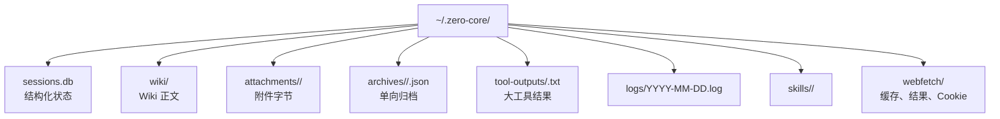
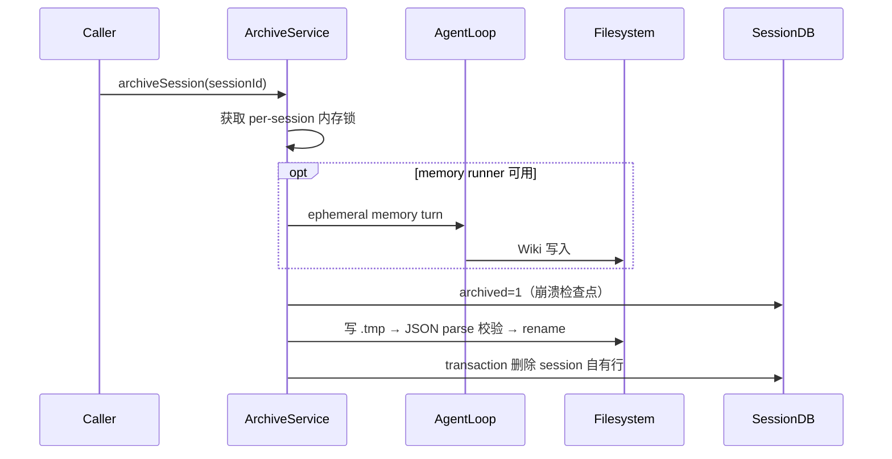

# 05 持久化层

> 本文按当前数据库初始化、迁移、Store 与归档代码重建。表结构的最终事实来源是 [`session-db.ts`](../../src/server/session-db.ts)、[`db-migration.ts`](../../src/server/db-migration.ts) 和各领域 Store，而不是历史表计数。

## 1. 当前持久化边界

Zero-Core 是本地优先应用，但数据并不只在一个 SQLite 文件中：

`ZERO_CORE_DIR` 默认是 `~/.zero-core`，可由环境变量覆盖。例外是 WebFetch 的缓存和 Cookie 实现：它们目前直接使用 `homedir()/.zero-core/webfetch`，不会跟随 `ZERO_CORE_DIR`，见第 10 节。

## 2. SQLite 启动顺序

backend 的持久化初始化顺序是：

1. `new SessionDB()` 打开 `sessions.db`，设置 journal mode 和 foreign keys，创建 SessionDB 自有表。
2. `runMigrations(sessionDB)` 补列、建业务表、迁移旧 JSON、删除退役表。
3. 构造各领域 Store；`SqliteStore` 会再次自检并补齐其声明的列。
4. 创建 Wiki、Agent、Provider、Workflow 等服务。
5. 运行会话、归档和 workflow 恢复。

生产默认 `journal_mode=WAL` 且开启 `foreign_keys=ON`。测试可通过 `ZERO_CORE_DB_NO_WAL=1` 切换成 MEMORY journal，避免 worker 退出时的 WAL I/O。

当前没有 `user_version` 或 migration ledger。迁移函数依靠 `IF NOT EXISTS`、表/列 introspection 和幂等更新，在每次启动全部运行。

## 3. 表的所有权

不要用一张过时的“大 schema 清单”推断修改位置。当前表按所有者分为四组：

| 所有者 | 主要表 | 修改入口 |
|---|---|---|
| `SessionDB` | `sessions`、`messages`、`steps`、`tool_executions`、`delegated_tasks`、`provider_usage` | `session-db.ts` |
| SessionDB 附属 Store | `kv_store`；按需创建的 `extraction_cursors`、`tool_telemetry` | `key-value-store.ts`、对应 Store |
| workflow / domain migration | `projects`、`project_wiki`、`wiki_scan_cursors`、requirements/task、cron、project job/work、tool config/usage、orchestrate plan/manifest 等 | `db-migration.ts` + 领域 Store |
| `SqliteStore` 领域表 | `agents`、`providers`、`templates`、`mcp_servers` 等 | Store 的 `COLUMNS` + migration 中的兼容定义 |

`extraction_cursors` 和 `tool_telemetry` 是 lazy Store：只有调用 accessor 时才保证创建。当前生产启动没有连接 Extractor B，因此不能假定新数据库一定立即包含这两张表。

旧的 `turns`、`turn_state`、`agent_tools`、Memory/FTS 和 KB 表会被删除。独立 `knowledge.db` 已不是当前系统的一部分。

## 4. 会话数据模型

### 4.1 `sessions`

`sessions` 同时保存身份、路由上下文和当前执行检查点：

- agent、主会话标志、标题和时间戳。
- project/workspace/wiki 等 context bundle 及用于查询的展开列。
- `archived`、`session_kind`、parent session/task 和 visibility。
- `phase`、`last_completed_step_seq`、source、error、turn/step count、最近一次 provider usage 快照。

普通列表只返回 `archived=0 AND session_kind='chat'`。delegated session 和 transient archive row 不会进入常规聊天列表。

### 4.2 `steps` 是历史真值

一行代表一个用户开场 step 或一个 assistant step。它保存：

- `seq` 与 `turn_group`。
- role、block JSON/content、token usage。
- 附件元数据 JSON；不保存附件字节。

step 在成功边界即时写入。崩溃恢复依赖 `sessions.last_completed_step_seq`，而不是重新执行所有历史工具。

### 4.3 `messages` 不是聊天消息表

`messages` 当前只保存一条滚动摘要和 `last_compressed_step_seq`。完整 step 内容不重复写入该表。摘要替换与 cursor 推进由 `replaceSummariesAndAdvanceCursor()` 在单个 SQLite transaction 中完成。

模型上下文由摘要加 cursor 后的完整 steps 构造，详见[运行时引擎](./03-runtime-engine.md)。

## 5. 通用 `SqliteStore`

[`sqlite-store.ts`](../../src/server/sqlite-store.ts) 为多数领域表提供：

- camelCase 到 snake_case 映射。
- JSON、boolean 和 number 转换。
- prepared CRUD statements。
- 构造时 `CREATE TABLE IF NOT EXISTS` 和缺列自愈。
- JSON 文件批量迁移。
- create/update/delete 后的 `data:changed` 通知。

update 是全行重写：先读当前记录，把 patch 合并后写回所有已声明列。`undefined` 表示“不修改”，`null` 表示清空。Store 的 `COLUMNS` 如果漏列，该字段既不会 SELECT，也不会 round-trip。

`SqliteStore` 与 `db-migration.ts` 都声明部分 schema，是有意的升级兼容，但也是双重真值风险。新增字段必须同时检查新库创建和旧库升级两条路径。

## 6. 事务与一致性

项目只在需要多语句原子性的局部路径显式使用 transaction，例如：

- 切换主 session。
- 批量迁移旧 JSON。
- 删除 session 自有行。
- 替换摘要并推进压缩 cursor。
- 删除/截断 steps 与调整恢复状态。

SQLite 与文件系统之间没有跨资源 transaction。Wiki metadata 与正文、archive JSON 与数据库删除、附件 metadata 与文件字节都使用“先完成一侧，再补另一侧”的协议。因此相关实现必须有临时文件、路径校验、幂等恢复或孤儿清理。

数据库和 Wiki/附件/归档目录不是单文件可移植备份。只复制 `sessions.db` 会丢正文和字节内容。

## 7. 旧数据迁移

启动迁移会处理：

- agents、providers、templates、MCP server 和旧 persona 数据。
- workspace、tool config、theme、device context、GitHub cache、global config 等 KV JSON。
- Wiki 旧 `detail` 列向磁盘正文的迁移。
- 字段补齐、旧 role/tool 名称改写和退役表删除。

成功迁移的 JSON 通常改名为 `.migrated.bak`；如果目标 KV 已存在则跳过。迁移不是按版本只执行一次，而是靠目标状态判断是否需要动作。

## 8. 归档协议

[`archive-service.ts`](../../src/server/archive-service.ts) 的当前归档是单向 export + delete：

归档文件包含 session、完整 steps、摘要、compression cursor 和 memory turn 状态。只有 final JSON 成功落盘后才删除数据库行；启动时会重试仍处于 `archived=1` 的中断归档。

当前没有 archive restore、轮转或容量上限。archive JSON 只保存附件元数据，不把附件字节复制进 JSON；归档也不清理附件目录，因此归档的完整可读性依赖原附件文件仍存在。

启动时还会导出并删除超过 14 天的非主陈旧候选 session。该清理采用 export-before-delete，但判断仍是启发式；扫描发生时 active-session map 尚为空，主要依靠时间阈值避开正在使用的会话。

## 9. 文件型 payload

| 类型 | 当前协议 | 保护措施 |
|---|---|---|
| Wiki 正文 | `project_wiki.doc_pointer` 指向 `wiki/` 下派生 Markdown | 路径必须落在 Wiki root；节点 metadata 与正文分开 |
| 附件 | `attachments/<sessionId>/<uuid>-<safeName>`；step 只存 metadata | session id、basename、控制字符、最终 containment 双校验 |
| 大工具输出 | `tool-outputs/<sha256>.txt`；step 存虚拟路径 | content-addressed；`[tool-outputs]/` 解析限制在专用目录 |
| Archive | `archives/<safeAgent>/<sessionId>.json` | tmp、parse 校验、rename 后才删 DB |
| Logs | 每日一个文本文件 | 文件名读取校验、按 mtime 清理 |

附件上传允许 50 MB JSON body。由于 base64 会膨胀内存，这个限制是 transport 上限，不是推荐单附件大小。

## 10. 已确认的问题与边界

### 10.1 `messages` 在每次启动被删除

`SessionDB.initSchema()` 当前无条件执行 `DROP TABLE IF EXISTS messages`，随后重建新 schema。该语句最初用于一次性的旧 schema 转换，但现在会删除正常运行产生的滚动摘要和 compression cursor。

后果是重启后摘要丢失，模型视图退回完整 steps；长会话可能重新接近上下文上限。现有测试覆盖单实例中的摘要和 cursor，却没有覆盖“关闭并重新打开同一数据库后仍保留摘要”的契约。本阶段只记录，不修改代码。

### 10.2 迁移没有版本账本

迁移每次启动执行，并含有 destructive DROP。幂等逻辑或旧注释判断错误时，影响会在每次启动重复发生。高风险迁移应增加可验证的版本/完成标记和 restart 测试。

### 10.3 WebFetch 数据根与 Cookie owner 分裂

WebFetch 直接写 `homedir()/.zero-core/webfetch`，忽略 `ZERO_CORE_DIR`。同时 Electron main 的 `cookie-jar.ts` 和 backend 的 `fetch-tools.ts` 各自维护内存 Cookie jar，并写同一个文件；main 登录后写入的 Cookie 不会自动刷新 backend 已加载的内存副本，存在跨进程状态滞后。

### 10.4 其他限制

- provider API key 和 Cookie 以明文落在本地 SQLite/JSON，没有 at-rest encryption。
- better-sqlite3 和多处同步文件 I/O 都运行在 backend 主线程，大数据迁移、Wiki 扫描或 archive export 会阻塞事件循环。
- archive 没有 restore/retention，不能视为完整备份产品。
- 文件型 payload 和数据库没有统一校验清单或全局垃圾回收器。

## 11. 修改持久化层时必须验证

1. 新数据库与历史数据库升级后的 schema 都正确。
2. 重启前后的摘要、cursor、step 和恢复检查点保持一致。
3. 多语句写失败时 transaction 能回滚；跨 DB/FS 写失败时可重试且不会先删真值。
4. session delete、archive、delegated cleanup 对附件、工具输出和 Wiki 的所有权语义明确。
5. 所有磁盘路径在 `ZERO_CORE_DIR` 覆盖下可隔离，或明确记录例外。
6. data-change 只在实际提交后发出，不能让 renderer 看到尚未持久化的状态。
