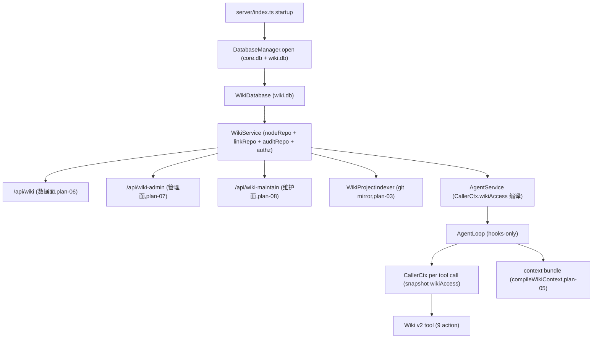
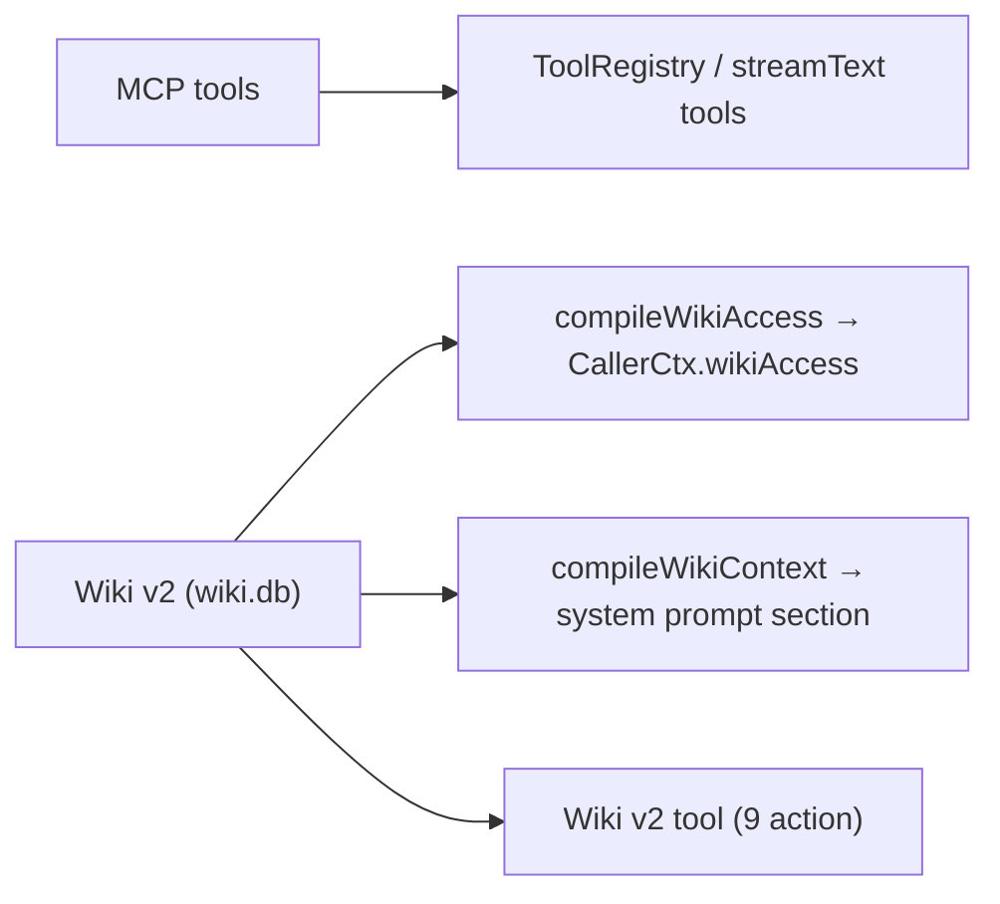

# 06 - 知识子系统

> 本文档描述 **Wiki v2**(plan-01..plan-08 cutover 后的当前实现)。
> v0.8 的 `project_wiki` 表 + 磁盘镜像 markdown 树 + anchor-scope 模型已在
> cutover 中**整体物理删除**(详见本文末「历史参考」与
> [plan-08-cutover-hardening.md](../archive/wiki-system-redesign/plan-08-cutover-hardening.md))。

## 0. Wiki v2(cutover 后的当前模型)

### 0.1 数据存储

- **独立 `db/wiki.db`**(`WikiDatabase` 持有,[`src/server/wiki/wiki-database.ts`](../../src/server/wiki/wiki-database.ts))。
  生命周期与 core.db 解耦:独立 WAL / checkpoint / backup / health / close。
  PRAGMA: `journal_mode=WAL` + `foreign_keys=ON` + `busy_timeout=5000`。
- 7 张核心表 + `wiki_schema_version`:
  - `wiki_nodes(id, parent_id, name, path, kind, summary, content, attributes_json, revision, created_at, updated_at, archived_at)` — INTEGER PRIMARY KEY 自带 INTEGER affinity;`content` TEXT 直接存正文(不再下沉磁盘);active path/sibling 用 partial unique index(`WHERE archived_at IS NULL`),归档后可重建同路径。
  - `wiki_links(source_id, target_id, relation, created_at, created_by)` — 复合主键,一表双向(in/out);source CASCADE、target RESTRICT。
  - `wiki_addresses(address, target_id, resolver, scope, kind, prompt_policy, revision, ...)` — 静态逻辑地址表;动态地址(`memory://` / `project://`)不入此表,运行时解析。
  - `wiki_repositories(repository_id, project_node_id, project_id, source_root, default_branch, indexed_revision, sync_status, ...)` — 项目镜像 git repo 绑定,1:1 与项目根节点。
  - `wiki_source_bindings(node_id, repository_id, source_path, source_kind, indexed_revision, blob_oid)` — 文件/目录节点的源码映射,UNIQUE(repository_id, source_path)。
  - `wiki_nodes_fts(name, summary, content)` — FTS5 external-content(content='wiki_nodes', content_rowid='id'),无 trigger,由 repository 在显式 transaction 内同步。
  - `wiki_audit_log(audit_id, request_id, actor_agent_id, session_id, action, node_path, old_revision, new_revision, detail_json, created_at)` — 公开 opaque 操作 receipt。
- 固定根(`wiki-root` + `wiki-root/knowledge` / `wiki-root/memory` / `wiki-root/projects`)由 `WikiDatabase.open` bootstrap,幂等。
- Schema init/migration 由 [`wiki-schema.ts`](../../src/server/wiki/wiki-schema.ts) 的 `initWikiSchema` + `wiki_schema_version` 表管理,**不在** `db-migration.ts` 的旧 `project_wiki` 段。fresh core.db 不再创建 `project_wiki` 表(已 DROP)。

### 0.2 数据面 / 管理面 / 维护面(三平面分离)

- **数据面**(`/api/wiki`,plan-06):Agent 与 UI 共享的 wiki tree 操作。9 个 Wiki tool action(expand/read/search/create/update/delete/link/unlink/move)走 CallerCtx 编译的 `wikiAccess` 授权。
- **管理面**(`/api/wiki-admin`,plan-07):配置 Wiki policy —— addresses / repositories / grants / context / sessions。20 个 endpoint;authority 由 server host 注入 `WIKI_ADMIN_AUTHORITY`(renderer 不能从 body 自授身份)。
- **维护面**(`/api/wiki-maintain`,plan-08 §3 + §5):backup / restore / integrity / foreign-keys / fts rebuild / optimize / explicit legacy cleanup。不操作活跃 DB 的 checkpoint/VACUUM/migration;只读 PRAGMA(integrity_check/foreign_key_check/optimize)安全。

### 0.3 Grants + Context(scope 与 prompt 编译)

- 每个 Agent 有 `wikiGrants`(显式 scope list:canonical scope + actions + 可选 path constraint)和 `wikiContext`(prompt 注入规则:scope + template + limit + view)。
- 会话启动时 [`compileWikiAccess`](../../src/server/wiki/wiki-access-compiler.ts) 把 grants 编译为 `WikiAccess`(scope 树 + per-scope actions)。每次 tool call 快照到 CallerCtx。
- [`compileWikiContext`](../../src/server/wiki/wiki-context-compiler.ts) 把 context rules 物化为 prompt 段落(**deep** 编译,P0-2:不再只是 anchor 列表,会展开子树摘要/索引提示)。
- Project `activeProjectId` 在 session build 时注入;`project://` 地址按 activeProjectId 解析。
- Agent Editor(`WikiAccessSection.tsx` / `WikiContextSection.tsx`)显式编辑 grants/context;publish 走 CAS + audit + 热同步。

### 0.4 Project git 镜像(structure-sync)

- 项目根节点(`wiki-root/projects/<projectId>` 绑定到 `wiki_repositories`)。
- [`WikiProjectIndexer`](../../src/server/wiki/wiki-project-indexer.ts) 的 `ensureBinding` / `syncToHead` / `fullIndex` 把 git repo 的文件/目录结构镜像到 `wiki_nodes`(kind=`source_file` / `source_directory` 等)+ `wiki_source_bindings`(per-file blob_oid + indexed_revision)。
- 增量扫描用 `git diff <indexed_revision>..<default_branch>`;feature-branch WIP 不进 wiki,只跟 main/master。
- rename 走两阶段 swap(避免 partial UNIQUE 冲突),FTS 在 phase-1 同步改名。
- 状态可观察:`wiki_repositories.sync_status`(pending/indexing/idle/failed)+ `last_indexed_at` + `last_error`;UI/Project mirror card 显示进度。
- 这是 **structure-sync**(只镜像文件树结构,不读源码内容)。**semantic-sync** 由 agent 通过 Wiki tool 的 create/update 写入正文(`wiki_nodes.content`),两者分开。

### 0.5 备份与维护(plan-08 §3)

- [`BackupService`](../../src/server/wiki-backup-service.ts):SQLite Backup API 在线 snapshot Core/Wiki 各自独立,manifest sidecar JSON 记 source/sha256/schema_version/business_revision/sqlite_version/verified。**不复制活跃 DB 文件**。
- `restoreSnapshot` 复制到临时 DB(不覆盖活跃);verify integrity + foreign keys + 业务计数。
- 写 Wiki 不触发 Core checkpoint/mtime/WAL 变化(独立 DB + 独立 connection)。
- readonly 诊断绝不对活跃 DB checkpoint/VACUUM/migration(memory feedback-sessions-db-readonly)。
- 备份是 `BackupService` 的**唯一职责**,没有任何其他路径拷贝活跃 `wiki.db`(过去的 `DatabaseManager.backupCore/backupWiki` 占位已在 P1-4/P1-6 删除)。

### 0.6 FS guard(plan-08 §2)

- `core/protected-paths.ts` 集中列出 db/core.db{,-wal,-shm} + db/wiki.db{,-wal,-shm} + backups/{core,wiki} + wiki/.runtime + wiki/。
- `tools/wiki-path-guard.ts` 重写:Read/Write/Edit/Grep/Glob/Shell 统一断言 `assertNotProtectedPath`。canonicalize 处理相对路径/引号/env var/大小写/symlink/junction/shell 拼接。
- 唯一例外:管理备份服务(不在 Agent shell 内)。

### 0.7 WikiSkeletonService 的当前角色

[`WikiSkeletonService`](../../src/server/wiki-skeleton-service.ts) 在 cutover 后是 **orchestrator facade**,不再持有 readdir/扫描逻辑。它对外保留 `buildSkeleton(projectId)` / `rescanProjectFull(projectId)` 入口(向后兼容),内部委托给 `WikiProjectIndexer.syncToHead` / `fullIndex`。

cutover 中删除的 vestigial API:`ensureSummary(nodeId)` / `detectDivergence(projectId)` / `projectSubtreeRootId(projectId)` / `walkWorkspace(...)`(readdir 时代的 lazy summary 与 drift 概念,plan-03 索引器不实现)。详见源文件顶部注释。

### 0.8 性能基线(plan-08 §4)

可重复 benchmark 脚本 `scripts/wiki-benchmark.ts --nodes=100000` (CI) 或 `--nodes=1000000` (发布前手工):
canonical path read / parent expand+pagination / incoming-outgoing links / FTS top-k / authorized multi-scope search / bounded subtree move。
每场景前 `EXPLAIN QUERY PLAN` 断言用 path/parent/target/FTS 索引(避免硬件 flaky)。
结果记录参考硬件/数据规模/耗时/内存/commit SHA。1M 由人工触发,报告附在 `docs/archive/wiki-system-redesign/bench-1M.json`(若未附则不能宣称百万节点已验证)。

### 0.9 AgentLoop 集成

Wiki 通过 **AgentLoop hooks-only**(memory feedback-agent-loop-hooks-only):所有 wiki 注入走 `PreLLMCall` / `PostTurnComplete` hook,AgentLoop 自身没有内联的 wiki 逻辑。hook 在 `src/runtime/hooks/` 下,把 `compileWikiContext` 的输出注入 system prompt,把 wiki tool 注册到 ToolRegistry。

---

## 1. 当前实际分层

| 子系统 | 当前定位 | 是否在默认 Agent 会话主链路 | 主要入口 |
|------|------|------|------|
| MCP | 外部工具协议接入 | 是,以工具形式暴露 | `MCPManager` + `ToolRegistry` |
| Wiki v2 | 项目知识 + Agent 记忆 + Project 镜像,独立 wiki.db + grants/context | 是,Wiki v2 tool + context bundle 注入 | `WikiService` + Wiki v2 tool(`/api/wiki` 数据面)+ `/api/wiki-admin` 管理面 + `/api/wiki-maintain` 维护面 |

实际运行图(cutover 后):

---

## 2. 三类知识能力的边界

| 维度 | MCP | Wiki v2 |
|------|-----|---------|
| 默认会话可见性 | 作为工具可见 | wikiAccess 编译到 CallerCtx + Wiki v2 tool + system prompt 注入 |
| 写入时机 | 用户配置外部 server | 用户 / Wiki tool / WikiProjectIndexer (structure-sync) |
| 数据形态 | 外部工具协议 | `wiki.db` 节点树 + FTS5 + git 镜像绑定 |
| 寻址 | tool name | canonical path / logical address(`memory://` / `project://` / `runtime://...`) |
| 演进方向 | 增强健康检查与重连 | 已完成 plan-01..08 cutover;后续关注性能基线 + 维护工具 |

---

## 3. 架构建议

- Wiki v2 是**唯一长期记忆/项目知识主线**;不再有并行 KB / 向量 RAG / Gen1 Memory 路径(见「历史参考」)。
- 新增长期知识一律走 Wiki v2:用户经 Wiki tool 写入(`semantic-sync`),Project 文件镜像由 indexer 自动同步(`structure-sync`)。
- 任何「读项目源码再总结」类需求应建立在 `wiki_repositories` + `wiki_source_bindings` 之上,不要再造并行存储。
- 维护操作(backup / integrity / FTS rebuild)统一走 `/api/wiki-maintain`;绝不在 Agent shell 内拷贝或 checkpoint 活跃 DB。

---

## 历史参考(HISTORICAL — 不要据此理解当前实现)

> 以下描述 cutover 前的旧子系统,**仅作历史背景**。代码已物理删除,文档保留
> 是为了解释「为什么 wiki.db 是这样设计的」。当前实现见 §0 / §1 / §2 / §3。

### v0.8 anchor-scope + 磁盘镜像 markdown 模型(已退役)

v0.8 Wiki 用 `project_wiki` 表 + 磁盘 markdown 镜像 + anchor 决定 scope。plan-08 cutover
把它整体替换为 wiki.v2 wiki.db。映射关系:

| v0.8 概念(已删) | Wiki v2 替代 |
|------|------|
| `WikiStore` / `ProjectWikiStore` / `wiki-node-store.ts` | `WikiService` + [`wiki-node-repository.ts`](../../src/server/wiki/wiki-node-repository.ts) |
| `wiki-anchor-injection.ts` + `wikiAnchors` / `wikiAnchorNodeIds` | `wikiGrants` + `wikiContext`(CallerCtx 编译) |
| `project_wiki` 表 + 磁盘镜像 markdown 树 | `wiki_nodes.content` TEXT(直接存,不再下沉磁盘) |
| `diskPathFor` / `writeNodeDetail` / `readNodeDetail` | 直接 SQL 读写 `wiki_nodes.content` |
| `header:` / `intent:` / `structure:` provenance 节点 | `wiki_repositories` + `wiki_source_bindings` 表(per-file blob_oid + indexed_revision) |
| `WikiScanCursorStore` | `wiki_repositories.indexed_revision` + `wiki_source_bindings.indexed_revision` |
| `WikiSkeletonService` 写 header:/intent:(readdir) | [`WikiProjectIndexer`](../../src/server/wiki/wiki-project-indexer.ts)(git diff,只写 wiki_nodes + wiki_source_bindings) |
| 短 id `#xxxxxxxx`(sha1-8) | canonical path / logical address(`memory://` / `project://` / `runtime://...`) |
| `Wiki` v1 tool(expand/search/docRead/docWrite/docEdit + projectId 闸门) | `Wiki` v2 tool(9 action:expand/read/search/create/update/delete/link/unlink/move) |
| `DatabaseManager.backupCore`/`backupWiki` 占位 | [`BackupService`](../../src/server/wiki-backup-service.ts)(SQLite Backup API,plan-08 §3) |

详细历史设计/迁移记录见:

- [plan-01-database-contracts.md](../archive/wiki-system-redesign/plan-01-database-contracts.md)(新 schema)
- [plan-02-core-service-address-auth.md](../archive/wiki-system-redesign/plan-02-core-service-address-auth.md)(地址 + 授权)
- [plan-03-project-git-mirror.md](../archive/wiki-system-redesign/plan-03-project-git-mirror.md)(Project git 镜像)
- [plan-04-wiki-tool-search.md](../archive/wiki-system-redesign/plan-04-wiki-tool-search.md)(Wiki v2 tool)
- [plan-05-agent-runtime-prompt.md](../archive/wiki-system-redesign/plan-05-agent-runtime-prompt.md)(grants/context + Prompt)
- [plan-06-data-api-browser-ui.md](../archive/wiki-system-redesign/plan-06-data-api-browser-ui.md)(数据面 API/UI)
- [plan-07-management-ui.md](../archive/wiki-system-redesign/plan-07-management-ui.md)(管理面 API/UI)
- [plan-08-cutover-hardening.md](../archive/wiki-system-redesign/plan-08-cutover-hardening.md)(cutover + 备份 + 维护)
- [design.md](../archive/wiki-system-redesign/design.md)(完整设计)

### 更早退役的并行知识后端(HISTORICAL)

`db/core.db` 历史上曾并存三套知识/记忆后端。cutover 后 wiki.db 是唯一活跃路径,以下全部 DROP:

| 旧子系统 | 状态 | 处置 |
|------|------|------|
| **Wiki v0.8 tree**(`project_wiki` 表 + 磁盘镜像 + anchor-scope) | ❌ cutover 中移除 | 由 Wiki v2(wiki.db)取代,见上表与 §0 |
| **KB**(`kb_entries` + `kb_chunks`,向量 RAG) | ❌ 早已移除 | 服务端 `kb-*`、`/api/kb`、IPC、KB UI 页、shared 类型全删;`kb_entries`/`kb_chunks` 表由 db-migration DROP。将按 **wiki 格式切文件** 重做,不再走 embedding |
| **Gen1 MemoryNodeStore**(`memory_nodes` / `_subjects` / `_edges` / `_fts`) | ❌ 早已移除 | `memory-node-store.ts` + `memory-node-router.ts` + `/api/memory-nodes` + IPC 全删;表由 db-migration DROP。写入迁到 wiki memory 子树 |
| **旧实体记忆**(`memory_entities` / `memory_relations`,`MemoryStore`) | ❌ 早已移除 | v0.8 清理僵尸时删除 + db-migration DROP |
| **RAG 注入**(`runtime/hooks/rag-hooks.ts` + `ragContext`/`getRagContext`) | ❌ 早已移除 | hook 从未生效(`getRagContext` 从不注入),整条死管道清掉 |
| **旧 memory 工具**(`MemoryRecall` / `MemoryNote` / `memory-tools.ts`) | ❌ 早已移除 | v0.8 P2 §11.6 删除,记忆改走 `Wiki` 工具 |

为什么删 KB / Gen1 Memory:v0.8 M5 已把记忆写入迁到 wiki memory 子树;KB 是从未接
通的死 RAG 路径。统一以 wiki 子树承载后,这两套基础设施整体退役而非保留。详细背景见
v0.8 设计记录与本文 git 历史。
