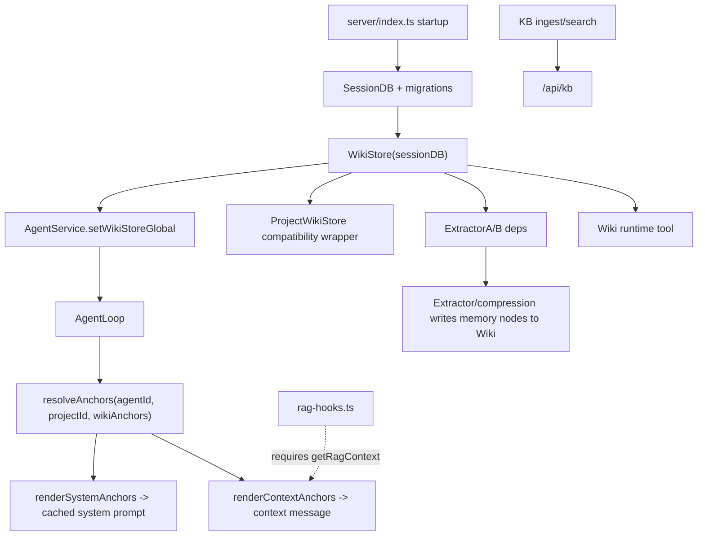
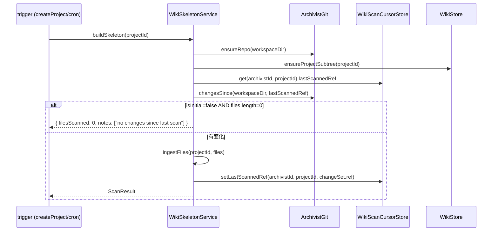
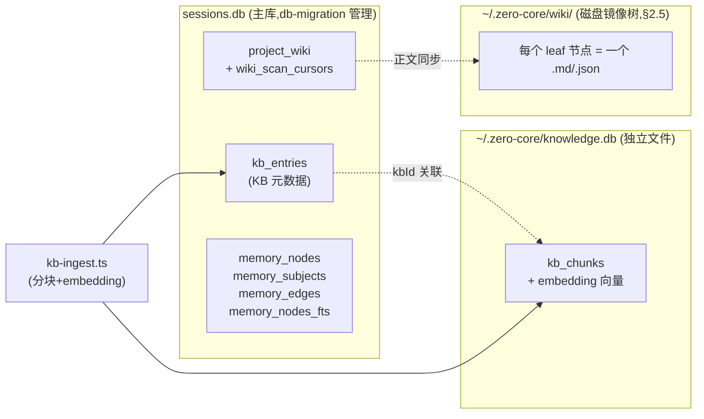
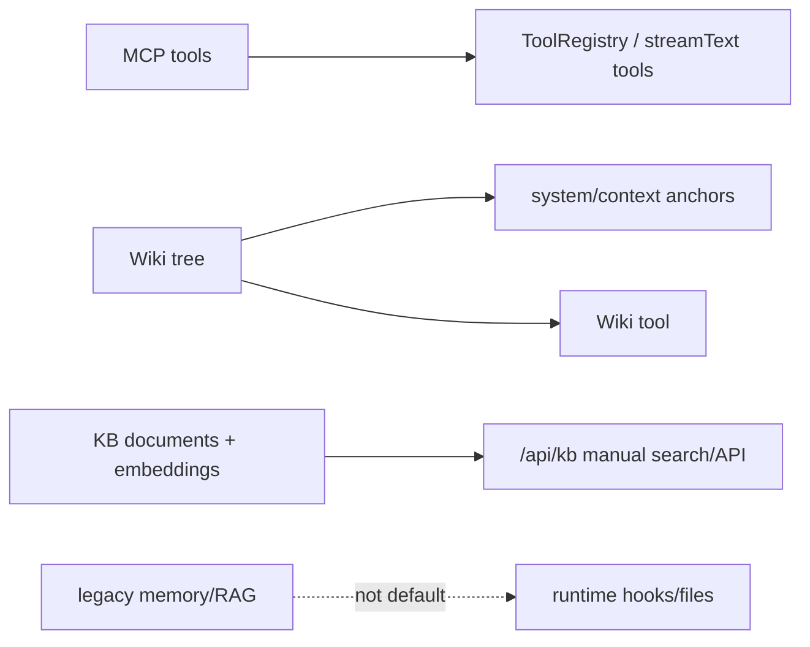

# 06 - 知识子系统

> 本文以当前代码的实际运行路径为准。Zero-Core 现在的记忆主线不是旧的 MemoryRecall/RAG 自动召回，而是全局 Wiki tree：启动时创建 `WikiStore`，AgentLoop 通过 wiki anchors 把项目/Agent 记忆注入 system/context，提取与压缩流程继续向 Wiki 写入长期记忆。

## 1. 当前实际分层

| 子系统 | 当前定位 | 是否在默认 Agent 会话主链路 | 主要入口 |
|------|------|------|------|
| MCP | 外部工具协议接入 | 是，以工具形式暴露 | `MCPManager` + `ToolRegistry` |
| Wiki tree | 项目知识、Agent 记忆、自由锚点 | 是，默认上下文/系统提示注入 | `WikiStore` + `wiki-anchor-injection.ts` + `Wiki` 工具 |
| KB | 本地文档导入、chunk、embedding、检索 | 否，当前主要是手动 API/UI 能力 | `/api/kb` + `kb-search.ts` |
| Legacy memory | 节点记忆存储（`memory-node-store.ts` 仍活）；旧实体记忆 store 已删 | 否，保留兼容/迁移痕迹 | `memory-node-store.ts`（活）；`memory-store.ts` + `runtime/mcp-tools/memory-tools.ts` **v0.8 已删** |
| Legacy RAG hook | 可选的 PreLLMCall RAG 注入点 | 默认不生效 | `runtime/hooks/rag-hooks.ts` |

实际运行图：



## 2. Wiki Tree 是当前记忆主线

### 2.1 启动与依赖注入

`src/server/index.ts` 在启动早期创建全局 `WikiStore`：

```ts
const wikiStoreGlobal = new WikiStore(sessionDB);
```

随后它被注入到三个关键位置：

- `ExtractorAService({ ..., wiki: wikiStoreGlobal })`：后处理提取结果写入 Wiki。
- `new ProjectWikiStore(wikiStoreGlobal)`：保留旧 project-wiki API 的兼容视图。
- `agentService.setWikiStoreGlobal(wikiStoreGlobal)`：每个 AgentLoop 都可以解析 Wiki anchors。

这说明 Wiki 不是附属功能，而是运行时上下文系统的一等依赖。

### 2.2 AgentLoop 中的注入方式

`src/runtime/agent-loop.ts` 构造时从 `config.wikiStoreGlobal ?? config.wikiStore` 解析 Wiki，并调用 `resolveAnchors()` 得到本轮会话的锚点集合。

默认锚点来自 `src/runtime/wiki-anchor-injection.ts`：

| 锚点 | 来源 | 注入位置 | 作用 |
|------|------|------|------|
| Agent memory root | `memoryAgentRootId(agentId)` | context | Agent 私有记忆索引 |
| Project subtree root | `projectSubtreeRootId(projectId)` | system | 项目级知识轮廓 |
| Global root | `WIKI_GLOBAL_ROOT_ID`(无 projectId 时自动) | off(只作 scope,不注入) | zero/全局会话的整树读写授权 |
| Free anchors | `AgentRecord.wikiAnchors` | system/context/tool | 手动绑定的 Wiki 节点或子树 |

`renderSystemAnchors()` 会把 system-channel 的项目/记忆轮廓拼入系统提示词。`renderContextAnchors()` 会在每轮 LLM 调用前生成 `## Wiki Anchors (context)` 段落，再由 `buildContextMessage()` 注入 `<context>`。

#### 权限模型(读写同界 / pure anchor model)

`resolveAnchors()` 解析出的 anchor 节点 id 并集,**既是读边界也是写边界**:

- AgentLoop 把 `anchorNodeIds(wikiAnchors)` 注入 tool context 的 `wikiAnchorNodeIds`。
- `Wiki` 工具([`runtime/tools/wiki-tool.ts`](../../src/runtime/tools/wiki-tool.ts))的 expand/search/docRead 用 `listVisibleFromAnchors` / `getVisibleFromAnchors`;create/update/delete/docWrite/docEdit 用 store 层 `upsertNodeInScope` / `updateNodeInScope` / `deleteNodeInScope` / `writeNodeDetailInScope`,全部经 `assertNodeInAnchorScope` 校验。**能读 = 能写**。
- 项目 Agent 的 anchor 集 = 自己项目子树 + 自己 memory + free,看不到也写不到别项目/全局知识。
- zero / 全局会话(无 projectId)的 anchor 集含全局根 → 整棵树可读可写。
- free wikiAnchors 授予的子树同样可写(不再像旧版「projectId 闸门只读不写」)。
- 旧的 projectId-based 写方法(`upsertProjectNode`/`updateNodeMetadata`/`deleteNode`/`assertNodeInsideProjectScope`)标 `@deprecated`,archivist/extractor 继续用。

权限强制在 store 层([`server/wiki-node-store.ts`](../../src/server/wiki-node-store.ts));工具层只透传 anchor 集。

当前 Agent 记忆默认不是把全文塞入上下文，而是渲染成 MEMORY.md 风格索引：

```md
- title [nodeId]
```

这会给模型一个可导航的记忆目录，具体内容再通过 `Wiki` 工具读取。

### 2.3 写入路径

当前长期记忆写入主要来自两条后台路径：

- `runtime/hooks/extraction-hooks.ts`：PostTurnComplete 后按阈值调度 Extractor A/B，Extractor A 将结构化记忆写入 Wiki。
- `runtime/hooks/compression-hooks.ts`：压缩流程提取的 memory nodes 优先写入 `wikiStoreGlobal`，仅在 Wiki 不可用时回退旧 `MemoryNodeStore`。

这也是为什么“wiki 树作为记忆”不是概念层描述，而是实际写路径。

### 2.4 手动操作路径

运行时工具里当前暴露的是 `Wiki` 工具。`src/runtime/tools/index.ts` 已明确移除 `MemoryRecall` / `MemoryNote`，注释说明记忆现在位于每个 Agent 的 Wiki 子树中，Agent 通过 `Wiki` action 工具读取/搜索/维护。

旧文件 `runtime/mcp-tools/memory-tools.ts`（`memoryReadTool` / `memoryWriteTool`）v0.8 已作为僵尸清理删除（连同其消费者 `server/memory-store.ts` 的 `MemoryStore` 类 + `memory_entities` / `memory_relations` 两表 db-migration DROP）。删前它也早已从 `ALL_TOOLS` 取消注册，普通 Agent 会话从未拿到 `MemoryRead` / `MemoryWrite`。

### 2.5 Wiki 体的磁盘镜像树布局（v0.8 P1 §10.1）

> 这一节是 v0.8 (`bff7821` / `cb0b05a` / `a196338`) 的关键改动，旧文档完全没提。Wiki 节点的 **结构**（id/parent/title/path/...）在数据库 `project_wiki` 表，但节点的 **正文**（detail，可能是几千字的 Markdown）落磁盘。布局规则不再是平铺，而是 **镜像树结构** —— 文件系统目录就是 Wiki 的中间节点，文件就是叶子，肉眼打开 `<repo>/wiki/` 就能直接看到树。

#### 存储根与隔离

[`src/server/wiki-node-store.ts`](../../src/server/wiki-node-store.ts) 顶部定义全局磁盘根：

```ts
export const WIKI_DISK_ROOT = join(ZERO_CORE_DIR, "wiki");
```

所有 Wiki 正文文件都落在这棵目录树里。这是一个 **强隔离根**：

- `readNodeDetail` / `writeNodeDetail` / `deleteNodeDetail` / `diskPathFor` 全部在返回前过一遍 [`isInsideWikiDisk()`](../../src/server/wiki-node-store.ts) —— 如果算出的路径以任何形式逃出 `WIKI_DISK_ROOT`（legacy 行、buggy upsert、外部相对路径如 `src/foo.ts`），直接 throw，绝不写。
- agent 的 FS 工具（Shell / Read / Grep / Glob / Write / Edit）通过 `wiki-path-guard` **反向** 复用同一个根，**拒绝** 任何解析进 `WIKI_DISK_ROOT` 的路径 —— Agent 永远碰不到正文文件，只能通过 nodeId 走 `Wiki` 工具的 `ExpandNode` / `UpdateWikiNode`，由 store 层代为读写。

#### 路径推导：folder = 目录，leaf = 文件

正文路径由节点的 **位置** 推导，不是查表。核心函数 [`WikiStore.diskPathFor(nodeId)`](../../src/server/wiki-node-store.ts)：

```text
节点类型                    磁盘路径
─────────────────────────  ────────────────────────────────────────────────────────
global root (WIKI_GLOBAL)  <ROOT>/global-root__<id8>.md
container root             <ROOT>/<path>/<path>__<id8>.md          （area 级，无自己的 subdir）
  (knowledge/projects/memory)
subtree root (wiki-root:*) <ROOT>/<area>/<seg>/<seg>__<id8>.md     （自带 id-suffix subdir）
regular leaf (无子节点)     <ROOT>/<area>/<...segs>/<slug>__<id8>.md
regular folder (有子节点)   <ROOT>/<area>/<...segs>/<slug>/<slug>__<id8>.md   ← 正文移进同名子目录
```

要点：

- `area` 由位置决定：`projects/<projectId>/` / `memory/_legacy/`（旧）/ `knowledge/`。memory 的 per-agent 子树 root（`wiki-root:memory-agent:<agentId>`）由 `subtreeArea()` 归到 `memory`，`subtreeSeg()` 取 `<agentId>` 作目录段。
- `segs` 由 `resolveAreaAndSegs()` 从节点 **向上走 parent 链** 收集（cycle-guarded，`visited` set 防环），每经过一个普通中间祖先压一个 `nodeSlug(cur)` 段；遇到 container root / subtree root / global root 即停。
- `nodeSlug(node)` = `sanitizeSeg(title)`（`: / \` → `_`，去首尾 `_`，保留中文，`.` / `..` 被 drop 作 path-traversal 防护），空则 fallback 到 `id8(id)`。
- `id8(id)` = id 前 8 字符，作文件名后缀保证 area 目录内唯一。
- **folder ≠ leaf**：当一个普通节点 **有子节点**（`getChildren().length > 0`），它的正文文件被搬进 **同名子目录**，子节点的目录链才接得上。这是 `diskPathFor` 里 `isFolder` 分支的目的。

#### leaf → folder 提升（首次有子节点时）

[`create()`](../../src/server/wiki-node-store.ts) 在 INSERT 前先检查：如果新节点将是它 parent 的 **第一个子节点**，调 `promoteLeafToFolder(parentId)` 把 parent 的正文从 `<chainDir>/<slug>__<id8>.md` `renameSync` 进 `<chainDir>/<slug>/<slug>__<id8>.md` —— **在** 创建 child 的目录之前搬，避免子目录创建撞上还在原位的文件。container / subtree root layout 不随 children 变，跳过。失败 best-effort（`writeNodeDetail` 会按新位置重推导兜底）。

#### 改名 / reparent 时正文跟着搬

[`update()`](../../src/server/wiki-node-store.ts) 改 title 或 parentId 会改变 `diskPathFor` 推导结果（slug 变、segs 变）。流程：先用 **旧行** 算出 `oldDetailFile` → 写新行 → 用 **新行** 算出 `newDetailFile` → 若两者不同，`mkdirSync` + `renameSync` 把正文搬到新位置。**正文永远跟着节点走，不会丢在旧路径成孤儿**（除非 rename 失败，best-effort）。

#### 启动一次性迁移

旧库的正文文件是 **平铺布局**（`legacyDeriveContentFilePath`：`<ROOT>/<area>/<path>__<id8>.md`，全在一个 area 目录里）。[`fresh-db-seed.ts`](../../src/server/fresh-db-seed.ts) 的 `ensureWikiSkeleton()` 在 **每次启动** 末尾调 [`wikiStore.migrateWikiDiskLayout()`](../../src/server/wiki-node-store.ts)：

- 遍历所有节点，算 `legacyDeriveContentFilePath(node)` 和 `diskPathFor(node.id)`，相同跳过；
- 旧文件不存在 → `skipped++`（已迁移过 / 从未有正文）；
- 旧文件存在 → `mkdirSync(newFile/..)` + `renameSync(oldFile, newFile)`，并 `UPDATE doc_pointer` 到新路径，`moved++`；
- 幂等：跑过的库再跑全是 skipped。

这就是为什么 `software-dev` 节点会从 `knowledge/` 自动挪到 `knowledge/workflow/` —— 它在 v0.8 改了 parent，迁移用新位置的 `diskPathFor` 把正文挪过去。

#### 写入 / 读取原语

- [`writeNodeDetail(nodeId, content)`](../../src/server/wiki-node-store.ts)：永远写 **推导路径**，绝不写 `node.docPointer`；写完才把 `docPointer` 盖成推导路径（当 cache，防 legacy/逃逸值）。`mkdirSync(file/..)` 保证父目录存在。**改正文不动 DB 其他列**（acceptance-P1 保证）—— 想改 title/summary 走 `update()`。
- [`readNodeDetail(nodeId)`](../../src/server/wiki-node-store.ts)：永远读 **推导路径**，`docPointer` 只在缓存命中时省一次 `diskPathFor`，**绝不** 直接读它（legacy 行可能指向库外）。

#### 为什么要拆库 + 镜像树（动机）

- **正文大、读得少**：几千字的 Markdown 正文塞 SQLite blob 让 `list()` / `getChildren()` 每次都拉一坨没必要的数据。拆出去后 DB 行只有结构字段，list/expand 才按需读盘。
- **肉眼可读 + git 友好**：`<repo>/wiki/knowledge/workflow/software-dev__abcd1234.md` 这种路径，人开 IDE 就能读，diff 也好看；平铺的 `<area>/<path>__<id8>.md` 没有层级信息。
- **跟结构强一致**：folder = 目录这个不变量让 "树" 不止在 DB 里，文件系统就是它的镜像 —— 删子节点腾出目录、加子节点建子目录、改名移文件，全是对称的。

### 2.6 archivist 增量扫描与摘要懒加载（v0.8 M2）

> Wiki 的 **项目子树结构**（header=代码文件 / intent=需求文档 / structure=模块）不是手写的，是 [`WikiSkeletonService`](../../src/server/wiki-skeleton-service.ts)（v0.8 把原 "archivist" 服务改名澄清 —— "archivist" 名字让给 agent 角色，本服务是无 LLM 的静态扫描器）扫 workspace 建出来、增量维护的。

#### 入口与触发

- `buildSkeleton(projectId)` —— 增量扫描入口。由 `createProject` 在后台触发，cron / requirement-hooks / 项目通知分发也会调。
- `rescanProjectFull(projectId)` —— 周期全量 rescan，作漂移兜底（RFC §2.13），跑完把 cursor 重置到 main 当前 HEAD 并盖 `lastFullScanAt`。

两个入口都先 `git.ensureRepo(workspaceDir)`（非 repo 自动 `git init`），再 `wiki.ensureProjectSubtree(projectId, name)`。

#### 增量：git diff，不是全目录遍历

`buildSkeleton` 的核心是 **按 (archivist, project) 维度的 git 游标**（`WikiScanCursorStore`，游标不挂 agent 上 —— RFC §4.2，agent 可能换人/被删）：



`changesSince` 跑 `git log/diff <last>..main` 给出变化文件清单 —— **只重读变化部分**（决策 19/26）。**Feature-branch WIP 永远不进 wiki**（决策 26），只跟 main。没有变化直接 no-op 返回。

#### 摘要懒加载：扫描时不读源码

扫描时 **不读源码** —— `ingestFiles` 对每个文件 upsert 一个 `header:<relPath>` / `intent:<relPath>` 节点，`summary` 留空字符串（代码注释原话："the rich summary (exports / head / line count) is ... readFileSync every workspace file ... 2800+ files"，扫描期读盘会让大仓库扫一次几分钟）。目录节点扫完盖一个 placeholder summary（`Project root: N file(s).` / `Directory <rel>: N file(s).`）。

真正读源码算 rich summary 推迟到 **第一次 expand**，由 [`ensureSummary(nodeId)`](../../src/server/wiki-skeleton-service.ts) 触发：

1. `summary` 已非空 → 直接返回（已物化，零 IO）；
2. `header:` / `intent:` 节点 → 从 path 切出 relPath，`resolve(workspaceDir, relPath)` 算绝对路径，`existsSync` 校验；
3. `header:` 调 `summarizeCodeFile`：`readFileSync` → 行数 / exports（`extractExports`）/ 头 3 行 head，拼成 `<relPath> — N line(s). Exports: ... Head: ...`；
4. `intent:` 调 `summarizeDocFile`：读文件、抽标题/段；
5. 算出来非空 → `wiki.update(id, { summary })` 写回行（**lazy 物化**：第一次读付钱，以后命中 row summary 零 IO）。

structure / project / memory 节点没有源文件，原样返回现有 summary。

这个设计让 **建骨架**（O(文件数) 的 upsert，但零读盘）和 **看节点**（O(1) per expand，只读被点的那一个）的代价解耦，大仓库扫骨架从分钟级降到秒级。

#### 写入权限护栏

`WikiSkeletonService` 是 `WikiStore.upsertProjectNode` 的 **唯一调用方**。store 层强制：scope = 自己 project 子树、type 只能是 `header` / `intent` / `structure`。archivist agent 角色不直接写库 —— 它经这个服务建骨架（决策 9/18/39），需要深度充实的内容走 `Wiki` 工具的 create/update（带 provenance 标 `confirmed` / `derived`）。

### 2.7 三套数据库知识系统的对比矩阵

§2.1~§2.6 已经把 `project_wiki` 讲透，但它并不是 zero-core 数据库里唯一的"知识表"。当前 `sessions.db` 里**并存三套**面向知识/记忆的存储后端,加上 `kb_*` 还跨了另一个文件。这一节把它们摆在一起对照,避免维护者在三套表之间脑补映射。

> 范围说明:本节只对比**持久化在 SQLite 里的知识系统**(即 §1 表里的 Wiki tree / KB / Legacy memory 三行的存储后端)。MCP 是外部协议不在库内、`rag-hooks.ts` 是注入点不是存储,两者不进本表。

#### 物理位置



三套系统在物理上是**故意分开**的:`project_wiki` 正文在 sessions.db 但**镜像到磁盘**便于 git 友好与人工编辑;`kb_chunks` 因为携带 embedding 向量(每行数 KB blob)**单独开 knowledge.db** 避免拖慢主库的 WAL checkpoint;`memory_*` 是 legacy 但仍在 sessions.db 里占位(因为 MemoryNodeStore 在构造函数里 `init()` 自建表,不走 db-migration,所以 05 §2.2 的"30 张表"清单里看不到它们)。

#### 横向对比矩阵

| 维度 | `project_wiki` (Wiki tree) | `kb_entries` + `kb_chunks` (KB) | `memory_nodes` / `_subjects` / `_edges` (Legacy memory) |
|------|------|------|------|
| **当前定位** | **唯一长期记忆主线** (§1) | 手动文档库,可选 RAG 扩展点 (§3.2) | legacy/compat,压缩流程回退路径 (§4) |
| **表所在文件** | sessions.db | `kb_entries` in sessions.db + `kb_chunks` in **knowledge.db** (独立) | sessions.db |
| **建表机制** | `db-migration.ts:672` `CREATE TABLE IF NOT EXISTS` (db-migration 管理) | `kb_chunks`: `KbDB.initSchema()` 构造时自建 (`kb-db.ts:53-69`);`kb_entries`: SqliteStore 包装 (`kb-store.ts:51`) | `MemoryNodeStore.init()` 构造时自建 (`memory-node-store.ts:138-180`),**不进 db-migration** |
| **行规模量级** | 节点级(每个 wiki 节点 1 行,正文下沉磁盘) | chunk 级(单文档拆数十~数百行,每行带 embedding blob) | 节点级(实体-关系图,每节点 1 行 + FTS 索引) |
| **写入触发器** | ① `fresh-db-seed.ts` 初始骨架;② `project-wiki-router.ts` 用户 REST CRUD;③ `WikiSkeletonService` (archivist 增量扫描,§2.6);④ `Wiki` runtime 工具 (Agent 运行时 create/update);⑤ extractor/compression hooks | **仅** `kb-ingest.ts` (用户显式导入文档 → 分块 → embedding → 写 chunks + entries) | **仅** legacy 压缩流程回退路径(Wiki 不可用时);原 `MemoryWrite` 工具 v0.8 已**整文件删除**(§4) |
| **写入约束** | scope+type 护栏 (`WikiSkeletonService` 单一入口,§2.6 护栏;`Wiki` 工具带 provenance) | 文件分块策略固定,无业务护栏 | 无护栏(legacy 设计) |
| **检索方式** | **树遍历 + 路径定位** (`wiki-anchor-injection.ts` 按 anchor nodeId 取子树;`Wiki` 工具按 path/title 找子节点) | **向量相似度 top-K** (`kb-search.ts` cosine similarity over embeddings) | **FTS5 MATCH** (`memory_nodes_fts`, `memory-node-store.ts:128`) + LIKE 兜底 (`:281`) |
| **谁来读** | `AgentLoop` 构造时 + `updateConfig` 时调 `resolveAnchors` → `renderSystemAnchors` 注入 system prompt (默认链路,§2 顶部 mermaid) | `kb-search.ts` 经 `/api/kb` REST **手动**调用;`rag-hooks.ts` 是 PreLLMCall 注入点但**默认未接通** (§3.2) | `runtime/memory-recall.ts` 是 FTS 召回残留,**未接主链路** (§4) |
| **默认 Agent 会话可见?** | ✅ 是 (anchor 注入 + Wiki 工具) | ❌ 否 (getRagContext 未注入,§3.2) | ❌ 否 (工具未注册,recall 未接) |
| **v0.8 状态** | **核心增强** (磁盘镜像树 §2.5 + archivist 增量扫描 §2.6 + project scope) | **冻结** (代码活跃但无产品化接入) | **退役中** (`memory-hooks.ts` 已删除注册,§4 表) |
| **是否进 05 §2.2 表** | ✅ 进 (db-migration CREATE) | ⚠️ 部分 (`kb_chunks` 不进,因为它不在 sessions.db;`kb_entries` 进) | ❌ 不进 (构造时自建,不在 db-migration) |

#### 三套并存的历史与取舍

这三套不是设计出来的分层,而是**三代演进留下的地层**:

1. **`memory_*` (最老)**:实体-关系图谱式 memory(`memory_entities` / `memory_relations`,即原 `MemoryStore`)+ 节点记忆(`memory_nodes` / `_subjects` / `_edges`,即 `MemoryNodeStore`) + FTS 召回,设计上想模仿 Claude Code 的 memory 机制。问题是写入无业务护栏、检索用 FTS 召回噪声大、与 AgentLoop 注入没有干净接口。v0.8 已清理僵尸一半:**实体-关系图谱 store（`MemoryStore` 类 + 两表）+ 其 tools（`memory-tools.ts`）已删除**；`memory-hooks.ts` 早已从 `registerAllRuntimeHooks` 移除；**仍在的**只有节点记忆 store `MemoryNodeStore`（活的，作为压缩流程回退路径，见 §4）+ `memory-recall.ts`（未接主链路）。
2. **`kb_*` (中间)**:本地文档 RAG,设计上想给 Agent 配私有知识库。技术栈完整(SqliteStore 元数据 + 独立 knowledge.db 存向量 + cosine 检索 + /api/kb),但**产品接入没做完**:`getRagContext` 从未被 `AgentService.createLoopForSession` 注入(§3.2),所以普通 Agent 会话根本不查它。当前是"能用手动 API 检索,但 Agent 不会自动用"的半成品。
3. **`project_wiki` (最新,当前主线)**:把上述两套的教训吸收后重做的结构化记忆 —— 树形结构(支持 path 定位 + scope 隔离)、磁盘镜像(git 友好 + 人工可编辑)、anchor 注入(干净的 AgentLoop 接口)、增量扫描(archivist git diff,不全量重建)、provenance 元数据(区分 confirmed/derived)。v0.8 是核心增强目标(§2.5/§2.6)。

**为什么不一刀切删掉前两套**:`memory_*` 节点侧（`MemoryNodeStore`，活的）的压缩回退路径目前还在用（Wiki 不可用时会写 `memory_nodes`）；而 `memory_*` 实体侧（`MemoryStore` + `memory-tools.ts`）已作为僵尸在 v0.8 清理删除。`kb_*` 是"代码完整但产品没接",如果未来要做显式 RAG 产品化,基础设施已经就绪,不必重写。所以 v0.8 的取舍是:**只把 `project_wiki` 推为主线并继续加固,前两套标 legacy 但不删**（实体侧 MemoryStore 已破例先删）,等 `MemoryNodeStore` 的压缩回退路径迁移完成、`kb_*` 的产品决策(显式 RAG 还是彻底删除)落地后再清理。这也呼应 §6.2 的中期建议。

#### 维护者提示

- **改 `project_wiki` schema** → 改 `db-migration.ts`(`migrateWikiTableSchema` / `migrateWikiDetailToDisk` 子函数,§2.5 启动迁移)。
- **改 `kb_chunks` schema** → 改 `KbDB.initSchema()`(`kb-db.ts:53`),**不要去 db-migration.ts 找**,那里没有;FTS 表不能 ALTER,改 schema 要 DROP 重建。
- **改 `memory_*` schema** → 改 `MemoryNodeStore.init()`(`memory-node-store.ts:138`),同样不进 db-migration。
- **三套之间的数据不互通**:`agents.knowledgeBaseIds` 是 agent 配置里挂的 KB id(对应 `kb_entries`),与 `project_wiki` 是**两套并行的 wiki/知识** —— 不要假设读 wiki 时会带上 KB 内容(那是 `rag-hooks.ts` 的事,默认没接)。

## 3. KB 子系统的当前位置

KB 仍然是有效的本地知识库能力，但它当前不是默认 Agent 自动 RAG 主链路。

### 3.1 仍在使用的代码

| 文件 | 作用 |
|------|------|
| `server/kb-store.ts` | KB 条目 CRUD |
| `server/kb-db.ts` | `kb_chunks` 与 embedding 存储 |
| `server/kb-ingest.ts` | 文件读取、分块、embedding、写入 |
| `server/kb-search.ts` | cosine 相似度检索 |
| `server/kb-router.ts` | `/api/kb` REST API |

`server/index.ts` 仍挂载 `/api/kb`，所以 KB 的导入、检索、管理路径仍是活跃功能。

### 3.2 默认 Agent 会话没有接入自动 RAG

`runtime/hooks/rag-hooks.ts` 仍被 `registerAllRuntimeHooks()` 注册，但 hook 的第一步是：

```ts
if (!config.getRagContext) return;
```

而 `AgentService.createLoopForSession()` 当前构造 `sessionConfig` 时没有注入 `getRagContext`。因此普通 Agent 会话里这个 hook 会直接返回，不会向 `ctx.ragContext` 写入 KB 内容。

旧文档把这里描述成“自动 RAG 查询没有带上当前问题”。从现在的实际代码看，更准确的描述是：**KB 自动 RAG 是保留的 legacy/可选扩展点，但默认生产路径没有接通**。

如果以后要恢复自动 RAG，应该作为显式产品能力重新设计：明确哪些 Agent 绑定哪些 KB、何时检索、query 从哪来、结果如何与 Wiki anchors 去重，而不是简单恢复 `getRagContext(agentId, query)`。

## 4. Legacy Memory 的状态

当前仓库的历史记忆代码已经部分清理：

| 模块 | 状态 | 说明 |
|------|------|------|
| `server/memory-store.ts` | ❌ **已删（v0.8 清理僵尸）** | 旧实体-关系图谱式 memory。运行时零写入者、唯一消费者 memory-tools 早已取消注册，已删除类 + 两表（`memory_entities` / `memory_relations` 由 db-migration DROP）+ `memory.json` 迁移分支 + SessionDB getter |
| `server/memory-node-store.ts` | ✅ 活 / back-compat | 旧节点记忆存储，**仍在运行时被调用**：压缩流程在 Wiki 不可用时回退写它（`compression-hooks.ts:153`）+ `/api/memory-nodes` REST。与已删的 MemoryStore 是兄弟表，**不要混淆** |
| `runtime/mcp-tools/memory-tools.ts` | ❌ **已删（v0.8 清理僵尸）** | `MemoryRead` / `MemoryWrite` 旧工具，随 `memory-store.ts` 一并删除（删前已从 `ALL_TOOLS` 取消注册） |
| `runtime/memory-recall.ts` | legacy 未接主链路 | FTS5 召回逻辑残留（仍在仓库） |
| `runtime/hooks/memory-hooks.ts` | 已退役/不再注册 | `registerMemoryHooks()` 已移除 |

注意：已删的 `memory-store.ts` / `memory-tools.ts` 不应再被文档称为“当前 Memory 子系统主路径”或“保留兼容代码”。**活着的** legacy 路径只剩 `memory-node-store.ts`（compression 回退）+ `memory-recall.ts`（未接主链路）。

## 5. 三类知识能力的边界



| 维度 | MCP | Wiki tree | KB | Legacy memory/RAG |
|------|-----|-----------|----|-------------------|
| 默认会话可见性 | 作为工具可见 | system/context anchors + Wiki 工具 | 不默认注入 | 不默认注入 |
| 写入时机 | 用户配置外部 server | 用户/工具/Extractor/Compression | 用户导入文档 | 历史路径或回退 |
| 数据形态 | 外部工具协议 | 树形节点/子树/锚点 | chunk + embedding | entity/node/FTS |
| 推荐演进 | 增强健康检查与重连 | 强化版本、权限、检索体验 | 保持手动库或显式 RAG 产品化 | 清理或迁移 |

## 6. 架构建议

### 6.1 近期建议

- 把 Wiki tree 明确作为唯一长期记忆主线：文档、UI、工具命名都围绕 Wiki anchors / Wiki memory 组织。
- 将 `rag-hooks.ts` 标注为 legacy optional hook；如果短期没有自动 RAG 计划，可以停止注册或加特性开关，避免误导维护者。
- ~~清点 `memory-store.ts`、`memory-node-store.ts`、`memory-recall.ts`、`memory-tools.ts` 的真实数据依赖，再决定迁移或删除。~~ ✅ **部分完成**：`memory-store.ts` + `memory-tools.ts`（僵尸 MemoryStore）已于 v0.8 清理删除（含两表 DROP）。剩余活着的 `memory-node-store.ts`（compression 回退）+ `memory-recall.ts`（未接主链路）数据依赖仍需在后续迁移到 Wiki 子树后清理。
- 为 `Wiki` 工具补足面向 Agent 的操作说明：什么时候读索引、什么时候读节点详情、什么时候写入新节点。

### 6.2 中期建议

- 给 Wiki 节点建立更清晰的作用域模型：global / project / agent / session，避免所有长期知识最终都堆在同一棵树上。
- 引入 Wiki 节点的版本/来源元数据：由用户写入、Extractor 写入、Compression 写入应能区分，便于回滚和信任判断。
- 如果 KB 要重新进入 Agent 自动上下文，应以“显式 KB binding + query planner + 去重预算”的方式接入，而不是复用旧 `ragContext` 空槽。
- 将旧 memory 表迁移成 Wiki 子树后，删除旧工具和旧 hook，降低维护者误判概率。
