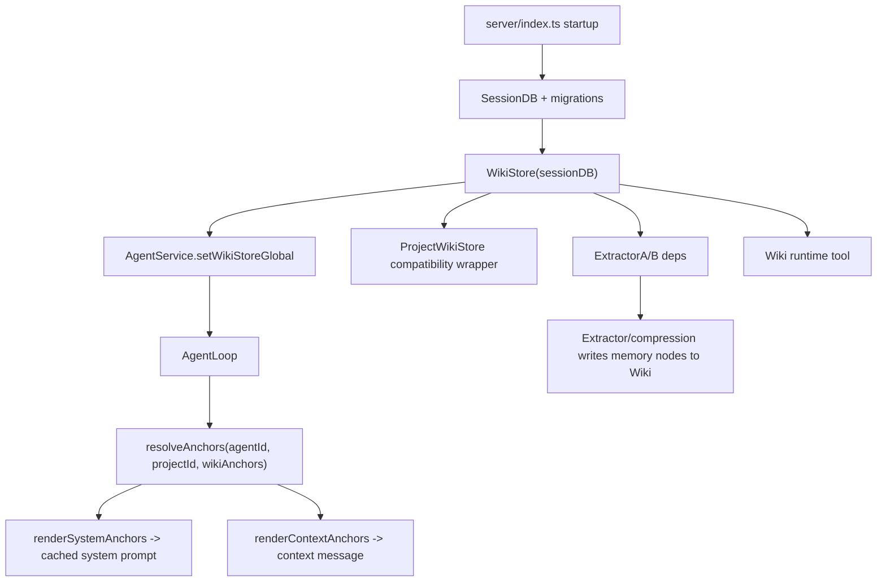
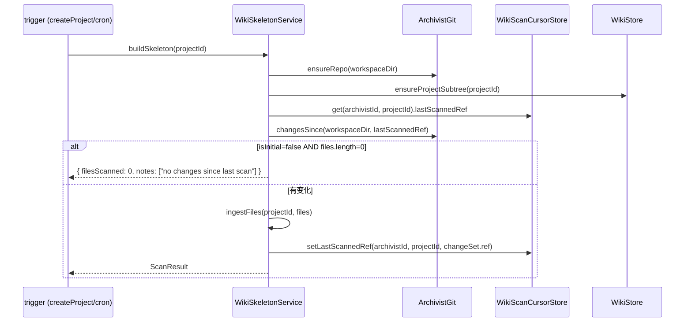
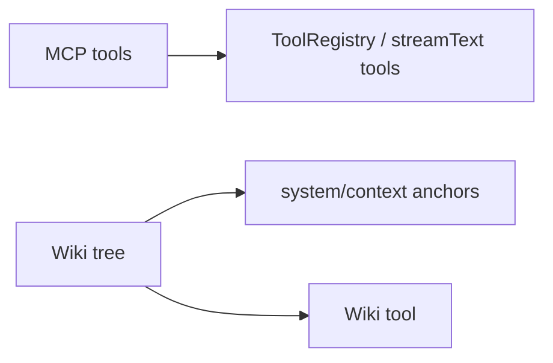

# 06 - 知识子系统

> 本文以当前代码的实际运行路径为准。Zero-Core 的记忆主线是全局 Wiki tree：启动时创建 `WikiStore`，AgentLoop 通过 wiki anchors 把项目/Agent 记忆注入 system/context，提取与压缩流程继续向 Wiki 写入长期记忆。旧的 MemoryRecall/RAG 自动召回、Gen1 `MemoryNodeStore`、以及独立的 KB(向量 RAG)子系统已整体移除 —— 知识与记忆都作为 wiki 子树存在。

## 1. 当前实际分层

| 子系统 | 当前定位 | 是否在默认 Agent 会话主链路 | 主要入口 |
|------|------|------|------|
| MCP | 外部工具协议接入 | 是，以工具形式暴露 | `MCPManager` + `ToolRegistry` |
| Wiki tree | 项目知识、Agent 记忆、自由锚点 | 是，默认上下文/系统提示注入 | `WikiStore` + `wiki-anchor-injection.ts` + `Wiki` 工具 |

> 历史上的 KB 子系统(本地文档 → chunk → embedding → 向量检索)与 Gen1 `MemoryNodeStore`(FTS5 节点记忆)已退役:前者将按 wiki 格式切文件重做,后者被 wiki memory 子树取代。详见 §3。

实际运行图:



## 2. Wiki Tree 是当前记忆主线

### 2.1 启动与依赖注入

`src/server/index.ts` 在启动早期创建全局 `WikiStore`:

```ts
const wikiStoreGlobal = new WikiStore(sessionDB);
```

随后它被注入到三个关键位置:

- `ExtractorAService({ ..., wiki: wikiStoreGlobal })`:后处理提取结果写入 Wiki。
- `new ProjectWikiStore(wikiStoreGlobal)`:保留旧 project-wiki API 的兼容视图。
- `agentService.setWikiStoreGlobal(wikiStoreGlobal)`:每个 AgentLoop 都可以解析 Wiki anchors。

这说明 Wiki 不是附属功能,而是运行时上下文系统的一等依赖。

### 2.2 AgentLoop 中的注入方式

`src/runtime/agent-loop.ts` 构造时从 `config.wikiStoreGlobal ?? config.wikiStore` 解析 Wiki,并调用 `resolveAnchors()` 得到本轮会话的锚点集合。

默认锚点来自 `src/runtime/wiki-anchor-injection.ts`:

| 锚点 | 来源 | 注入位置 | 作用 |
|------|------|------|------|
| Agent memory root | `memoryAgentRootId(agentId)` | context | Agent 私有记忆索引 |
| Project subtree root | `projectSubtreeRootId(projectId)` | system | 项目级知识轮廓 |
| Global root | `WIKI_GLOBAL_ROOT_ID`(无 projectId 时自动) | off(只作 scope,不注入) | zero/全局会话的整树读写授权 |
| Free anchors | `AgentRecord.wikiAnchors` | system/context/tool | 手动绑定的 Wiki 节点或子树 |

`renderSystemAnchors()` 会把 system-channel 的项目/记忆轮廓拼入系统提示词。`renderContextAnchors()` 会在每轮 LLM 调用前生成 `## Wiki Anchors (context)` 段落,再由 `buildContextMessage()` 注入 `<context>`。

#### 权限模型(读写同界 / pure anchor model)

`resolveAnchors()` 解析出的 anchor 节点 id 并集,**既是读边界也是写边界**:

- AgentLoop 把 `anchorNodeIds(wikiAnchors)` 注入 tool context 的 `wikiAnchorNodeIds`。
- `Wiki` 工具([`runtime/tools/wiki-tool.ts`](../../src/runtime/tools/wiki-tool.ts))的 expand/search/docRead 用 `listVisibleFromAnchors` / `getVisibleFromAnchors`;create/update/delete/docWrite/docEdit 用 store 层 `upsertNodeInScope` / `updateNodeInScope` / `deleteNodeInScope` / `writeNodeDetailInScope`,全部经 `assertNodeInAnchorScope` 校验。**能读 = 能写**。
- 项目 Agent 的 anchor 集 = 自己项目子树 + 自己 memory + free,看不到也写不到别项目/全局知识。
- zero / 全局会话(无 projectId)的 anchor 集含全局根 → 整棵树可读可写。
- free wikiAnchors 授予的子树同样可写(不再像旧版「projectId 闸门只读不写」)。
- 旧的 projectId-based 写方法(`upsertProjectNode`/`updateNodeMetadata`/`deleteNode`/`assertNodeInsideProjectScope`)标 `@deprecated`,archivist/extractor 继续用。

##### detail 可见性 + 覆盖保护

agent 列出节点时就能看到正文规模,无需盲目全量读:

- `WikiStore.getNodeDetailSize(nodeId)` 只 `statSync`(不读内容)→ 字节数(无文件 = 0)。
- `formatBodySize(bytes)`(`wiki-anchor-injection.ts`,导出复用)→ `(no body)` / `(123b)` / `(1.2kb)`。
- 凡「以节点形式列出」处都带 size:`Wiki` 工具的 `expand`(根 + 子树行)/`search`,以及 system/context 注入的渲染(`renderProjectSubtreeOutline` 根+子、`renderMemoryIndex` 叶)。
- `docWrite` 覆盖非空正文必须显式带 `overwrite:true`,否则拒绝并回显现有正文大小(提示改用 `docEdit` 精确改)。空节点/`create` 的 `content` 不受影响。

权限强制在 store 层([`server/wiki-node-store.ts`](../../src/server/wiki-node-store.ts));工具层只透传 anchor 集。

当前 Agent 记忆默认不是把全文塞入上下文,而是渲染成 MEMORY.md 风格索引:

```md
- title [nodeId]
```

这会给模型一个可导航的记忆目录,具体内容再通过 `Wiki` 工具读取。

### 2.3 写入路径

当前长期记忆写入主要来自两条后台路径:

- `runtime/hooks/extraction-hooks.ts`:StepEnd 后按阈值调度 Extractor A/B(hook-redesign Step 3A 从 PostTurnComplete 迁来),Extractor A 将结构化记忆写入 Wiki(per-agent memory 子树,`createMemoryNodeForAgent`)。
- `runtime/hooks/compression-hooks.ts`:压缩流程提取的 memory nodes 写入 `wikiStoreGlobal`(`createMemoryNode` under 全局 memory type roots)。

这也是为什么"wiki 树作为记忆"不是概念层描述,而是实际写路径。Wiki 不可用时(如非 agent-service 构建的会话)跳过抽取,不再回退到任何旧 store。

### 2.4 手动操作路径

运行时工具里当前暴露的是 `Wiki` 工具。`src/runtime/tools/index.ts` 已明确移除 `MemoryRecall` / `MemoryNote`,注释说明记忆现在位于每个 Agent 的 Wiki 子树中,Agent 通过 `Wiki` action 工具读取/搜索/维护。

### 2.5 Wiki 体的磁盘镜像树布局(v0.8 P1 §10.1)

> Wiki 节点的 **结构**(id/parent/title/path/...)在数据库 `project_wiki` 表,但节点的 **正文**(detail,可能是几千字的 Markdown)落磁盘。布局规则不再是平铺,而是 **镜像树结构** —— 文件系统目录就是 Wiki 的中间节点,文件就是叶子,肉眼打开 `<repo>/wiki/` 就能直接看到树。

#### 存储根与隔离

[`src/server/wiki-node-store.ts`](../../src/server/wiki-node-store.ts) 顶部定义全局磁盘根:

```ts
export const WIKI_DISK_ROOT = join(ZERO_CORE_DIR, "wiki");
```

所有 Wiki 正文文件都落在这棵目录树里。这是一个 **强隔离根**:

- `readNodeDetail` / `writeNodeDetail` / `deleteNodeDetail` / `diskPathFor` 全部在返回前过一遍 [`isInsideWikiDisk()`](../../src/server/wiki-node-store.ts) —— 如果算出的路径以任何形式逃出 `WIKI_DISK_ROOT`(legacy 行、buggy upsert、外部相对路径如 `src/foo.ts`),直接 throw,绝不写。
- agent 的 FS 工具(Shell / Read / Grep / Glob / Write / Edit)通过 `wiki-path-guard` **反向** 复用同一个根,**拒绝** 任何解析进 `WIKI_DISK_ROOT` 的路径 —— Agent 永远碰不到正文文件,只能通过 nodeId 走 `Wiki` 工具的 `ExpandNode` / `UpdateWikiNode`,由 store 层代为读写。

#### 路径推导:folder = 目录,leaf = 文件

正文路径由节点的 **位置** 推导,不是查表。核心函数 [`WikiStore.diskPathFor(nodeId)`](../../src/server/wiki-node-store.ts):

```text
节点类型                    磁盘路径
─────────────────────────  ────────────────────────────────────────────────────────
global root (WIKI_GLOBAL)  <ROOT>/global-root__<id8>.md
container root             <ROOT>/<path>/<path>__<id8>.md          (area 级,无自己的 subdir)
  (knowledge/projects/memory)
subtree root (wiki-root:*) <ROOT>/<area>/<seg>/<seg>__<id8>.md     (自带 id-suffix subdir)
regular leaf (无子节点)     <ROOT>/<area>/<...segs>/<slug>__<id8>.md
regular folder (有子节点)   <ROOT>/<area>/<...segs>/<slug>/<slug>__<id8>.md   ← 正文移进同名子目录
```

要点:

- `area` 由位置决定:`projects/<projectId>/` / `memory/<agentId>/` / `knowledge/`。memory 的 per-agent 子树 root(`wiki-root:memory-agent:<agentId>`)由 `subtreeArea()` 归到 `memory`,`subtreeSeg()` 取 `<agentId>` 作目录段。
- `segs` 由 `resolveAreaAndSegs()` 从节点 **向上走 parent 链** 收集(cycle-guarded,`visited` set 防环),每经过一个普通中间祖先压一个 `nodeSlug(cur)` 段;遇到 container root / subtree root / global root 即停。
- `nodeSlug(node)` = `sanitizeSeg(title)`(`: / \` → `_`,去首尾 `_`,保留中文,`.` / `..` 被 drop 作 path-traversal 防护),空则 fallback 到 `id8(id)`。
- `id8(id)` = id 前 8 字符,作文件名后缀保证 area 目录内唯一。
- **folder ≠ leaf**:当一个普通节点 **有子节点**(`getChildren().length > 0`),它的正文文件被搬进 **同名子目录**,子节点的目录链才接得上。这是 `diskPathFor` 里 `isFolder` 分支的目的。

#### leaf → folder 提升(首次有子节点时)

[`create()`](../../src/server/wiki-node-store.ts) 在 INSERT 前先检查:如果新节点将是它 parent 的 **第一个子节点**,调 `promoteLeafToFolder(parentId)` 把 parent 的正文从 `<chainDir>/<slug>__<id8>.md` `renameSync` 进 `<chainDir>/<slug>/<slug>__<id8>.md` —— **在** 创建 child 的目录之前搬,避免子目录创建撞上还在原位的文件。container / subtree root layout 不随 children 变,跳过。失败 best-effort(`writeNodeDetail` 会按新位置重推导兜底)。

#### 改名 / reparent 时正文跟着搬

[`update()`](../../src/server/wiki-node-store.ts) 改 title 或 parentId 会改变 `diskPathFor` 推导结果(slug 变、segs 变)。流程:先用 **旧行** 算出 `oldDetailFile` → 写新行 → 用 **新行** 算出 `newDetailFile` → 若两者不同,`mkdirSync` + `renameSync` 把正文搬到新位置。**正文永远跟着节点走,不会丢在旧路径成孤儿**(除非 rename 失败,best-effort)。

#### 启动一次性迁移

旧库的正文文件是 **平铺布局**(`legacyDeriveContentFilePath`:`<ROOT>/<area>/<path>__<id8>.md`,全在一个 area 目录里)。[`fresh-db-seed.ts`](../../src/server/fresh-db-seed.ts) 的 `ensureWikiSkeleton()` 在 **每次启动** 末尾调 [`wikiStore.migrateWikiDiskLayout()`](../../src/server/wiki-node-store.ts):

- 遍历所有节点,算 `legacyDeriveContentFilePath(node)` 和 `diskPathFor(node.id)`,相同跳过;
- 旧文件不存在 → `skipped++`(已迁移过 / 从未有正文);
- 旧文件存在 → `mkdirSync(newFile/..)` + `renameSync(oldFile, newFile)`,并 `UPDATE doc_pointer` 到新路径,`moved++`;
- 幂等:跑过的库再跑全是 skipped。

#### 写入 / 读取原语

- [`writeNodeDetail(nodeId, content)`](../../src/server/wiki-node-store.ts):永远写 **推导路径**,绝不写 `node.docPointer`;写完才把 `docPointer` 盖成推导路径(当 cache,防 legacy/逃逸值)。`mkdirSync(file/..)` 保证父目录存在。**改正文不动 DB 其他列** —— 想改 title/summary 走 `update()`。
- [`readNodeDetail(nodeId)`](../../src/server/wiki-node-store.ts):永远读 **推导路径**,`docPointer` 只在缓存命中时省一次 `diskPathFor`,**绝不** 直接读它(legacy 行可能指向库外)。

### 2.6 archivist 增量扫描与摘要懒加载(v0.8 M2)

> Wiki 的 **项目子树结构**(header=代码文件 / intent=需求文档 / structure=模块)不是手写的,是 [`WikiSkeletonService`](../../src/server/wiki-skeleton-service.ts)(无 LLM 的静态扫描器)扫 workspace 建出来、增量维护的。

#### 入口与触发

- `buildSkeleton(projectId)` —— 增量扫描入口。由 `createProject` 在后台触发,cron / requirement-hooks / 项目通知分发也会调。
- `rescanProjectFull(projectId)` —— 周期全量 rescan,作漂移兜底(RFC §2.13),跑完把 cursor 重置到 main 当前 HEAD 并盖 `lastFullScanAt`。

两个入口都先 `git.ensureRepo(workspaceDir)`(非 repo 自动 `git init`),再 `wiki.ensureProjectSubtree(projectId, name)`。

#### 增量:git diff,不是全目录遍历

`buildSkeleton` 的核心是 **按 (archivist, project) 维度的 git 游标**(`WikiScanCursorStore`,游标不挂 agent 上 —— RFC §4.2,agent 可能换人/被删):



`changesSince` 跑 `git log/diff <last>..main` 给出变化文件清单 —— **只重读变化部分**(决策 19/26)。**Feature-branch WIP 永远不进 wiki**(决策 26),只跟 main。没有变化直接 no-op 返回。

#### 摘要懒加载:扫描时不读源码

扫描时 **不读源码** —— `ingestFiles` 对每个文件 upsert 一个 `header:<relPath>` / `intent:<relPath>` 节点,`summary` 留空字符串。目录节点扫完盖一个 placeholder summary(`Project root: N file(s).` / `Directory <rel>: N file(s).`)。

真正读源码算 rich summary 推迟到 **第一次 expand**,由 [`ensureSummary(nodeId)`](../../src/server/wiki-skeleton-service.ts) 触发:

1. `summary` 已非空 → 直接返回(已物化,零 IO);
2. `header:` / `intent:` 节点 → 从 path 切出 relPath,`resolve(workspaceDir, relPath)` 算绝对路径,`existsSync` 校验;
3. `header:` 调 `summarizeCodeFile`:`readFileSync` → 行数 / exports(`extractExports`)/ 头 3 行 head,拼成 `<relPath> — N line(s). Exports: ... Head: ...`;
4. `intent:` 调 `summarizeDocFile`:读文件、抽标题/段;
5. 算出来非空 → `wiki.update(id, { summary })` 写回行(**lazy 物化**:第一次读付钱,以后命中 row summary 零 IO)。

structure / project / memory 节点没有源文件,原样返回现有 summary。

这个设计让 **建骨架**(O(文件数) 的 upsert,但零读盘)和 **看节点**(O(1) per expand,只读被点的那一个)的代价解耦,大仓库扫骨架从分钟级降到秒级。

#### 写入权限护栏

`WikiSkeletonService` 是 `WikiStore.upsertProjectNode` 的 **唯一调用方**。store 层强制:scope = 自己 project 子树、type 只能是 `header` / `intent` / `structure`。archivist agent 角色不直接写库 —— 它经这个服务建骨架(决策 9/18/39),需要深度充实的内容走 `Wiki` 工具的 create/update(带 provenance 标 `confirmed` / `derived`)。

#### 节点 summary / body 语义(工具层约定,面向所有用 Wiki 的 agent)

Wiki 是所有 agent 共用的工具,不是某个角色专属。因此 `summary` 与 `body`(正文 doc)的语义是 **Wiki 工具层的通用约定**,写在 [`wiki-tool.ts` 的 prompt](../../src/runtime/tools/wiki-tool.ts) 里,任何用 Wiki 的 agent 都遵守,不绑定 archivist 等具体角色:

- **`summary`(节点摘要)**= 以该节点为根的 **子树 abstract**(一行,概括这棵子树"是什么")。
- **非叶节点的 `body`(正文)**= 该子树的 **overview**(子节点们集体做什么、如何配合)。写一个父节点的 body = 写它的子树 overview。
- **叶节点的 `body`(正文)**= 实际内容。若该叶子镜像一个项目文件(`header:<relPath>`),body 是该文件的 **注释/说明**(它的作用、定位、坑),**不是文件内容的拷贝**(文件在工作区,读它用 Read)。
- 一致性:父节点的 summary 摘自它的 body,body overview 它的子节点 —— 两者应当吻合。summary 保持一行,body 控制在 overview 的篇幅(一两段),不要整段塞原文。

执行归各 agent 在自己的 work 里按此约定产出;扫描时 `ensureSummary` 的启发式回填仅作 bootstrap fallback,后续 agent 会覆写成符合上述语义的内容。本轮只明确语义,不做代码生成逻辑。

#### 短 id 寻址(降低 token)

注入大纲和工具结果 **不再带完整 nodeId**(叶节点是 36 字符 UUID,合成根 `wiki-root:<projectId>` ~46 字符),改为统一的 8 字符短 id:

- `shortIdOf(nodeId) = sha1(nodeId).slice(0,8)`,显示为 `#xxxxxxxx`([`formatNodeId`](../../src/runtime/wiki-anchor-injection.ts))。确定、跨 session 稳定、无需 per-session 状态;对叶节点和合成根一视同仁,agent 看不到 `wiki-root:` 字面量。
- agent 在 `expand` / `search` / `create` / `update` / `delete` / `docRead` / `docWrite` / `docEdit` 的 `nodeId` / `parentId` 入参里直接传 `#xxxxxxxx`;工具入口 [`resolveNodeIdArg`](../../src/runtime/tools/wiki-tool.ts) 依次试精确全 id → 短 id 扫描(scope 内 sha1-8 唯一命中)→ 报错。歧义(同短 id 多命中,~65k 节点才可能)时让 agent 改用 title path,不静默猜。
- 完整 nodeId 仍是 store 主键;**只在 agent 可见的文本层**换短 id。UI 内部 IPC(`/nodes/:nodeId/children`、`/detail`)仍用完整 id,renderer 树渲染不动。

## 3. 已退役:KB 子系统与 Gen1 Memory

历史上 sessions.db 里曾并存三套知识/记忆后端。v0.8 之后只剩 `project_wiki` 一套;另两套已整体移除。

| 旧子系统 | 状态 | 处置 |
|------|------|------|
| **Wiki tree** (`project_wiki`) | ✅ 唯一主线 | §2 |
| **KB**(`kb_entries` + `kb_chunks`,向量 RAG) | ❌ 已移除 | 服务端 `kb-*`、`/api/kb`、IPC、KB UI 页、shared 类型全删;`kb_entries`/`kb_chunks` 表由 db-migration DROP。将按 **wiki 格式切文件** 重做,不再走 embedding |
| **Gen1 MemoryNodeStore**(`memory_nodes` / `_subjects` / `_edges` / `_fts`) | ❌ 已移除 | `memory-node-store.ts` + `memory-node-router.ts` + `/api/memory-nodes` + IPC 全删;表由 db-migration DROP。写入迁到 wiki memory 子树 |
| **旧实体记忆**(`memory_entities` / `memory_relations`,`MemoryStore`) | ❌ 早已移除 | v0.8 清理僵尸时删除 + db-migration DROP |
| **RAG 注入**(`runtime/hooks/rag-hooks.ts` + `ragContext`/`getRagContext`) | ❌ 已移除 | hook 从未生效(`getRagContext` 从不注入),整条死管道清掉 |
| **旧 memory 工具**(`MemoryRecall` / `MemoryNote` / `memory-tools.ts`) | ❌ 早已移除 | v0.8 P2 §11.6 删除,记忆改走 `Wiki` 工具 |

### 3.1 为什么删 KB

KB 子系统(上传文件 → chunk → embedding → 语义检索)是一条与 wiki 并行的 RAG 路径,从未接到 agent —— `rag-hooks` 是死的(无 `getRagContext` 注入),且要外部 embedding provider 无人配置。知识/记忆改为统一以 wiki 子树承载。该功能以后会以"按 wiki 格式切文件"的方式重做,不复用向量 embedding 路线,因此当前的基础设施整条退役而非保留。

### 3.2 为什么删 Gen1 MemoryNodeStore

v0.8 M5 已把记忆写入迁到 wiki memory 子树(extractor-A + compression-hooks 都写 wiki)。`MemoryNodeStore` 只剩两个残余用途:compression-hooks 在 wiki 不可用时的回退写入、以及已删 KB 页的 memory-node 视图。两者都已不需要,store 整条移除。`MemoryNodeInput` 类型搬到 `compression-engine.ts`(生产者侧)。

### 3.3 维护者提示

- **改 `project_wiki` schema** → 改 `db-migration.ts`(`migrateWikiTableSchema` / `migrateWikiDetailToDisk` 子函数,§2.5 启动迁移)。
- 旧 KB / Gen1 memory 的表 DROP 在 `runMigrations` 的"Drop legacy memory + knowledge-base tables"段(`db-migration.ts`),`DROP IF EXISTS` 幂等,fresh DB 不会建这些表。
- 不再有 `/api/kb`、`/api/memory-nodes`、`getMemoryNodeStore`、`getRagContext`、`memoryConfig.memory` 这些接口面 —— 文档/代码里若再提到它们即过时。

## 4. 三类知识能力的边界



| 维度 | MCP | Wiki tree |
|------|-----|-----------|
| 默认会话可见性 | 作为工具可见 | system/context anchors + Wiki 工具 |
| 写入时机 | 用户配置外部 server | 用户/工具/Extractor/Compression |
| 数据形态 | 外部工具协议 | 树形节点/子树/锚点 |
| 推荐演进 | 增强健康检查与重连 | 强化版本、权限、检索体验 |

## 5. 架构建议

### 5.1 近期建议

- 把 Wiki tree 明确作为唯一长期记忆主线:文档、UI、工具命名都围绕 Wiki anchors / Wiki memory 组织(已完成大半:KB/Gen1 memory 已删)。
- 为 `Wiki` 工具补足面向 Agent 的操作说明:什么时候读索引、什么时候读节点详情、什么时候写入新节点。

### 5.2 中期建议

- 给 Wiki 节点建立更清晰的作用域模型:global / project / agent / session,避免所有长期知识最终都堆在同一棵树上。
- 引入 Wiki 节点的版本/来源元数据:由用户写入、Extractor 写入、Compression 写入应能区分,便于回滚和信任判断。
- 重做"文件知识库"时,以 **wiki 格式切文件**(把导入文档拆成 wiki 节点挂知识子树)实现,而非恢复向量 embedding;这样与现有 wiki anchor / scope 模型天然一致,不必再造一套并行存储。
