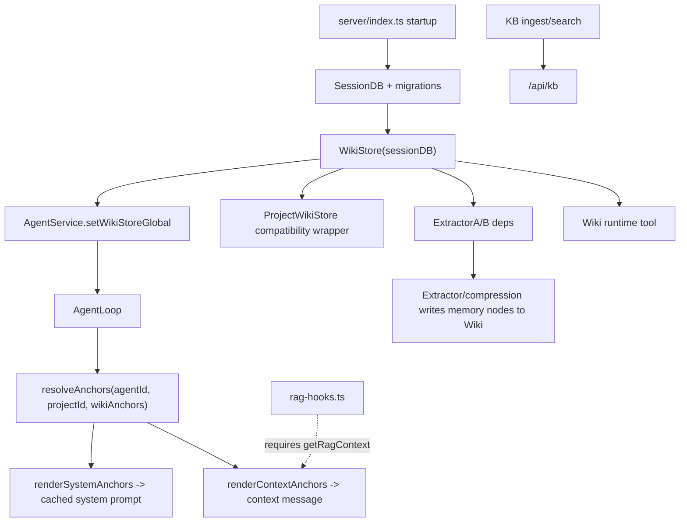
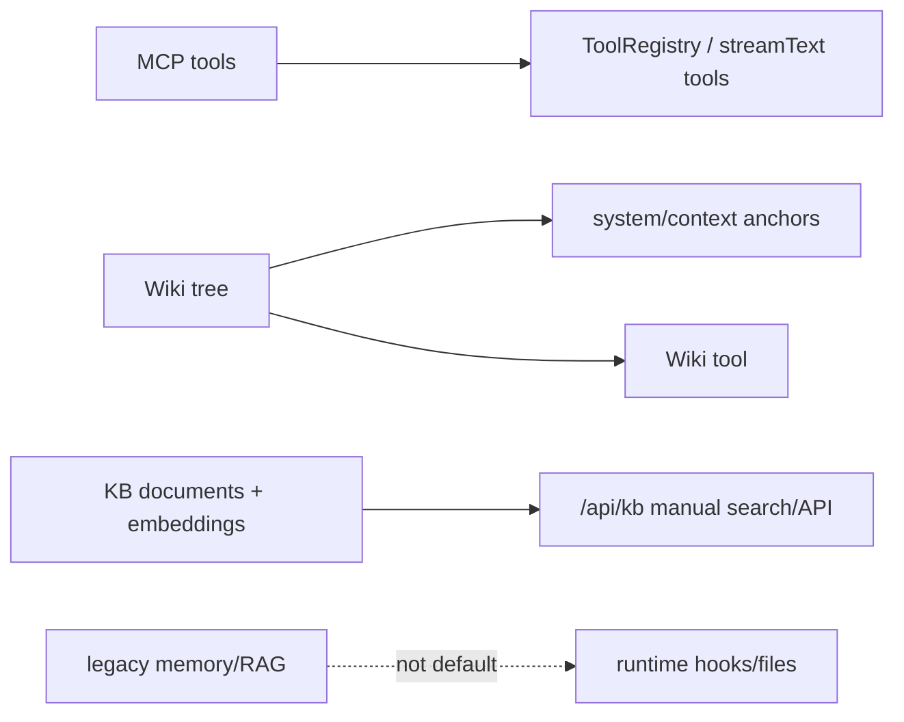

# 06 - 知识子系统

> 本文以当前代码的实际运行路径为准。Zero-Core 现在的记忆主线不是旧的 MemoryRecall/RAG 自动召回，而是全局 Wiki tree：启动时创建 `WikiStore`，AgentLoop 通过 wiki anchors 把项目/Agent 记忆注入 system/context，提取与压缩流程继续向 Wiki 写入长期记忆。

## 1. 当前实际分层

| 子系统 | 当前定位 | 是否在默认 Agent 会话主链路 | 主要入口 |
|------|------|------|------|
| MCP | 外部工具协议接入 | 是，以工具形式暴露 | `MCPManager` + `ToolRegistry` |
| Wiki tree | 项目知识、Agent 记忆、自由锚点 | 是，默认上下文/系统提示注入 | `WikiStore` + `wiki-anchor-injection.ts` + `Wiki` 工具 |
| KB | 本地文档导入、chunk、embedding、检索 | 否，当前主要是手动 API/UI 能力 | `/api/kb` + `kb-search.ts` |
| Legacy memory | 旧实体/节点记忆存储与旧工具文件 | 否，保留兼容/迁移痕迹 | `memory-store.ts`、`memory-node-store.ts`、`runtime/mcp-tools/memory-tools.ts` |
| Legacy RAG hook | 可选的 PreLLMCall RAG 注入点 | 默认不生效 | `runtime/hooks/rag-hooks.ts` |

实际运行图：



## 2. Wiki Tree 是当前记忆主线

### 2.1 启动与依赖注入

`src/server/index.ts` 在启动早期创建全局 `WikiStore`：

```ts
const wikiStoreGlobal = new WikiStore(sessionDB);
```

随后它被注入到三个关键位置：

- `ExtractorAService({ ..., wiki: wikiStoreGlobal })`：后处理提取结果写入 Wiki。
- `new ProjectWikiStore(wikiStoreGlobal)`：保留旧 project-wiki API 的兼容视图。
- `agentService.setWikiStoreGlobal(wikiStoreGlobal)`：每个 AgentLoop 都可以解析 Wiki anchors。

这说明 Wiki 不是附属功能，而是运行时上下文系统的一等依赖。

### 2.2 AgentLoop 中的注入方式

`src/runtime/agent-loop.ts` 构造时从 `config.wikiStoreGlobal ?? config.wikiStore` 解析 Wiki，并调用 `resolveAnchors()` 得到本轮会话的锚点集合。

默认锚点来自 `src/runtime/wiki-anchor-injection.ts`：

| 锚点 | 来源 | 注入位置 | 作用 |
|------|------|------|------|
| Agent memory root | `memoryAgentRootId(agentId)` | context | Agent 私有记忆索引 |
| Project subtree root | `projectSubtreeRootId(projectId)` | system | 项目级知识轮廓 |
| Global root | `WIKI_GLOBAL_ROOT_ID`(无 projectId 时自动) | off(只作 scope,不注入) | zero/全局会话的整树读写授权 |
| Free anchors | `AgentRecord.wikiAnchors` | system/context/tool | 手动绑定的 Wiki 节点或子树 |

`renderSystemAnchors()` 会把 system-channel 的项目/记忆轮廓拼入系统提示词。`renderContextAnchors()` 会在每轮 LLM 调用前生成 `## Wiki Anchors (context)` 段落，再由 `buildContextMessage()` 注入 `<context>`。

#### 权限模型(读写同界 / pure anchor model)

`resolveAnchors()` 解析出的 anchor 节点 id 并集,**既是读边界也是写边界**:

- AgentLoop 把 `anchorNodeIds(wikiAnchors)` 注入 tool context 的 `wikiAnchorNodeIds`。
- `Wiki` 工具([`runtime/tools/wiki-tool.ts`](../../src/runtime/tools/wiki-tool.ts))的 expand/search/docRead 用 `listVisibleFromAnchors` / `getVisibleFromAnchors`;create/update/delete/docWrite/docEdit 用 store 层 `upsertNodeInScope` / `updateNodeInScope` / `deleteNodeInScope` / `writeNodeDetailInScope`,全部经 `assertNodeInAnchorScope` 校验。**能读 = 能写**。
- 项目 Agent 的 anchor 集 = 自己项目子树 + 自己 memory + free,看不到也写不到别项目/全局知识。
- zero / 全局会话(无 projectId)的 anchor 集含全局根 → 整棵树可读可写。
- free wikiAnchors 授予的子树同样可写(不再像旧版「projectId 闸门只读不写」)。
- 旧的 projectId-based 写方法(`upsertProjectNode`/`updateNodeMetadata`/`deleteNode`/`assertNodeInsideProjectScope`)标 `@deprecated`,archivist/extractor 继续用。

权限强制在 store 层([`server/wiki-node-store.ts`](../../src/server/wiki-node-store.ts));工具层只透传 anchor 集。

当前 Agent 记忆默认不是把全文塞入上下文，而是渲染成 MEMORY.md 风格索引：

```md
- title [nodeId]
```

这会给模型一个可导航的记忆目录，具体内容再通过 `Wiki` 工具读取。

### 2.3 写入路径

当前长期记忆写入主要来自两条后台路径：

- `runtime/hooks/extraction-hooks.ts`：PostTurnComplete 后按阈值调度 Extractor A/B，Extractor A 将结构化记忆写入 Wiki。
- `runtime/hooks/compression-hooks.ts`：压缩流程提取的 memory nodes 优先写入 `wikiStoreGlobal`，仅在 Wiki 不可用时回退旧 `MemoryNodeStore`。

这也是为什么“wiki 树作为记忆”不是概念层描述，而是实际写路径。

### 2.4 手动操作路径

运行时工具里当前暴露的是 `Wiki` 工具。`src/runtime/tools/index.ts` 已明确移除 `MemoryRecall` / `MemoryNote`，注释说明记忆现在位于每个 Agent 的 Wiki 子树中，Agent 通过 `Wiki` action 工具读取/搜索/维护。

旧文件 `runtime/mcp-tools/memory-tools.ts` 仍存在，但没有进入 `ALL_TOOLS`，因此普通 Agent 会话不会拿到 `MemoryRead` / `MemoryWrite`。

## 3. KB 子系统的当前位置

KB 仍然是有效的本地知识库能力，但它当前不是默认 Agent 自动 RAG 主链路。

### 3.1 仍在使用的代码

| 文件 | 作用 |
|------|------|
| `server/kb-store.ts` | KB 条目 CRUD |
| `server/kb-db.ts` | `kb_chunks` 与 embedding 存储 |
| `server/kb-ingest.ts` | 文件读取、分块、embedding、写入 |
| `server/kb-search.ts` | cosine 相似度检索 |
| `server/kb-router.ts` | `/api/kb` REST API |

`server/index.ts` 仍挂载 `/api/kb`，所以 KB 的导入、检索、管理路径仍是活跃功能。

### 3.2 默认 Agent 会话没有接入自动 RAG

`runtime/hooks/rag-hooks.ts` 仍被 `registerAllRuntimeHooks()` 注册，但 hook 的第一步是：

```ts
if (!config.getRagContext) return;
```

而 `AgentService.createLoopForSession()` 当前构造 `sessionConfig` 时没有注入 `getRagContext`。因此普通 Agent 会话里这个 hook 会直接返回，不会向 `ctx.ragContext` 写入 KB 内容。

旧文档把这里描述成“自动 RAG 查询没有带上当前问题”。从现在的实际代码看，更准确的描述是：**KB 自动 RAG 是保留的 legacy/可选扩展点，但默认生产路径没有接通**。

如果以后要恢复自动 RAG，应该作为显式产品能力重新设计：明确哪些 Agent 绑定哪些 KB、何时检索、query 从哪来、结果如何与 Wiki anchors 去重，而不是简单恢复 `getRagContext(agentId, query)`。

## 4. Legacy Memory 的状态

当前仓库还保留几套历史记忆代码：

| 模块 | 状态 | 说明 |
|------|------|------|
| `server/memory-store.ts` | legacy | 旧实体-关系图谱式 memory |
| `server/memory-node-store.ts` | legacy/back-compat | 旧节点记忆存储，压缩流程在 Wiki 不可用时回退 |
| `runtime/mcp-tools/memory-tools.ts` | legacy 未注册 | `MemoryRead` / `MemoryWrite` 旧工具 |
| `runtime/memory-recall.ts` | legacy 未接主链路 | FTS5 召回逻辑残留 |
| `runtime/hooks/memory-hooks.ts` | 已退役/不再注册 | 当前 `registerMemoryHooks()` 已移除 |

这批代码不应再被文档称为“当前 Memory 子系统主路径”。更合适的处理方向是迁移确认后删除，或保留但统一标注为兼容层。

## 5. 三类知识能力的边界



| 维度 | MCP | Wiki tree | KB | Legacy memory/RAG |
|------|-----|-----------|----|-------------------|
| 默认会话可见性 | 作为工具可见 | system/context anchors + Wiki 工具 | 不默认注入 | 不默认注入 |
| 写入时机 | 用户配置外部 server | 用户/工具/Extractor/Compression | 用户导入文档 | 历史路径或回退 |
| 数据形态 | 外部工具协议 | 树形节点/子树/锚点 | chunk + embedding | entity/node/FTS |
| 推荐演进 | 增强健康检查与重连 | 强化版本、权限、检索体验 | 保持手动库或显式 RAG 产品化 | 清理或迁移 |

## 6. 架构建议

### 6.1 近期建议

- 把 Wiki tree 明确作为唯一长期记忆主线：文档、UI、工具命名都围绕 Wiki anchors / Wiki memory 组织。
- 将 `rag-hooks.ts` 标注为 legacy optional hook；如果短期没有自动 RAG 计划，可以停止注册或加特性开关，避免误导维护者。
- 清点 `memory-store.ts`、`memory-node-store.ts`、`memory-recall.ts`、`memory-tools.ts` 的真实数据依赖，再决定迁移或删除。
- 为 `Wiki` 工具补足面向 Agent 的操作说明：什么时候读索引、什么时候读节点详情、什么时候写入新节点。

### 6.2 中期建议

- 给 Wiki 节点建立更清晰的作用域模型：global / project / agent / session，避免所有长期知识最终都堆在同一棵树上。
- 引入 Wiki 节点的版本/来源元数据：由用户写入、Extractor 写入、Compression 写入应能区分，便于回滚和信任判断。
- 如果 KB 要重新进入 Agent 自动上下文，应以“显式 KB binding + query planner + 去重预算”的方式接入，而不是复用旧 `ragContext` 空槽。
- 将旧 memory 表迁移成 Wiki 子树后，删除旧工具和旧 hook，降低维护者误判概率。
