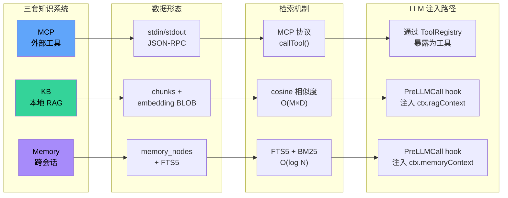

# 06 · 知识子系统

> Zero-Core 有三套"知识"基础设施：**MCP**（外部工具）、**KB**（本地 RAG）、**Memory**（跨会话记忆）。本文从架构师视角剖析它们的职责与互操作。

## 1. 三套系统的定位

| 系统 | 角色 | 范围 | 生命周期 | 谁写入 |
|------|------|------|----------|--------|
| **MCP** | 外部工具接入协议 | 跨进程 stdio/SSE | 应用会话期 | 用户配置 + 自动重连 |
| **KB** | 本地文档检索（RAG） | 当前 KB 配置的所有文件 | 永久（除非删除） | 用户手动导入 |
| **Memory** | 跨会话知识沉淀 | 全局 Wiki | 永久 | LLM 自动提取 + 用户手动 |

它们**互不依赖**但**都通过 ToolRegistry 暴露为工具**给 LLM。

```
                        ┌─────────────────────────┐
                        │      ToolRegistry       │
                        │  ToolDescriptor.source: │
                        │  "mcp" | "runtime" | "agent" │
                        └─────────────────────────┘
                          ▲           ▲           ▲
                          │           │           │
                  ┌───────┴──┐  ┌─────┴────┐  ┌───┴────┐
                  │   MCP    │  │   KB     │  │ Memory │
                  │ Manager  │  │ KbDB     │  │NodeStore│
                  │          │  │ KbStore  │  │ + FTS5 │
                  └──────────┘  └──────────┘  └────────┘
                       │              │              │
                  ~/.mcp-servers   文件读取       SQLite
                  + stdio/SSE      + Embedding     memory_nodes
                  transports       API             memory_subjects
```

## 2. MCP 子系统

### 2.1 模块清单

| 文件 | 行 | 角色 |
|------|----|------|
| `server/mcp-manager.ts` | 241 | MCP 连接池 + 工具缓存 + ToolRegistry 注册 |
| `server/mcp-scanner.ts` | 193 | 从外部应用配置扫描可用 MCP 服务器 |
| `server/mcp-presets.ts` | 112 | 预设服务器（Z.AI 3 个） |
| `server/mcp-store.ts` | n/a | mcp_servers 表 CRUD |
| `server/mcp-router.ts` | 197 | REST API：list/create/update/delete/test/reconnect |
| `runtime/mcp-tool.ts` | 127 | MCP tool → AI SDK tool 适配 |

### 2.2 连接生命周期

```
mcp-manager.connect(config):
  ├─ 若已连接 → disconnect
  ├─ 选择 transport
  │   ├─ stdio: StdioClientTransport({command, args, env})
  │   └─ sse/streamable-http: SSEClientTransport(URL, {headers})
  ├─ client.connect(transport)
  ├─ client.listTools() → McpToolInfo[]
  ├─ 缓存 tools（5 分钟）
  ├─ 注册到 ToolRegistry（source="mcp", mcpServerId）
  └─ 返回 {tools}

mcp-manager.disconnect(serverId):
  ├─ client.close()
  ├─ transport.close() (stdio 还需 kill 子进程)
  ├─ 删除缓存
  └─ ToolRegistry.unregister("mcp", serverId)
```

### 2.3 启动流程

`server/index.ts:158-165` 启动期：

```
const mcp = new MCPManager(registry);
await scanExternalMcpConfigs(workspaceDir);  // 仅返回 DetectedMcpServer[]
mergeDetectedServers();                       // 写入 mcp_servers 表
const configs = mcpStore.list();
await mcp.reconnectEnabled(configs);          // 并行 connect enabled ones
```

**关键**：`scanExternalMcpConfigs` 只探测不连接，真正连接在 `reconnectEnabled`。

### 2.4 路由 API（mcp-router.ts）

| 方法 | 路径 | 作用 |
|------|------|------|
| GET | `/` | 列出所有 |
| POST | `/` | 创建 |
| PUT | `/:id` | 更新 |
| DELETE | `/:id` | 删除 + disconnect |
| POST | `/:id/test` | 一次性连接测试 |
| POST | `/:id/reconnect` | 断开重连 |
| GET | `/presets` | 列出预设 |
| POST | `/presets/:presetId` | 从预设创建 |
| POST | `/scan` | 重新扫描外部配置 |
| POST | `/import` | 合并扫描结果到 mcp_servers |
| GET | `/status` | 连接状态 |

### 2.5 工具调用桥

`runtime/mcp-tool.ts:34-60`：

```
createMcpTool(qualifiedName, description, inputSchema, serverId, serverName, callTool):
  toolName = qualifiedName.split("__").slice(2).join("__")
  zodSchema = inputSchemaToZod(inputSchema)   ← MCP JSONSchema → Zod
  return tool({
    description: description ?? `MCP tool from ${serverName}: ${toolName}`,
    inputSchema: zodSchema,
    execute: async (params) => {
      const { result, error } = await callTool(serverId, toolName, params)
      if error: return `Error: ${error}`
      if typeof result === 'string': return result
      return JSON.stringify(result)
    }
  })
```

**JSONSchema → Zod 转换器**（lines 66-104）支持 string/number/integer/boolean/array/object/unknown 七种类型。复杂嵌套 schema 会降级到 `z.unknown()`。

### 2.6 失败模式

- **stdio 进程崩溃**：`StdioClientTransport` 不会自动重连。`mcp-manager.connect()` 被显式调用才恢复。`reconnectEnabled` 在启动时跑一次。
- **SSE 连接断开**：同样需要重连。
- **callTool 抛错**：被 catch，返回 `Error: ...` 字符串给 LLM。

## 3. KB（Knowledge Base）子系统

### 3.1 模块清单

| 文件 | 行 | 角色 |
|------|----|------|
| `server/kb-store.ts` | n/a | kb_entries 表 CRUD |
| `server/kb-db.ts` | 130 | kb_chunks 表 + 嵌入向量 |
| `server/kb-embeddings.ts` | n/a | EmbeddingProvider 接口 + 工厂 |
| `server/kb-ingest.ts` | 198 | 文件读取 → 分块 → 嵌入 → 存储 |
| `server/kb-search.ts` | n/a | cosine 相似度搜索 |
| `server/kb-router.ts` | 202 | REST API |

### 3.2 摄入管线

```
ingestFile(kbId, filePath, kbDb, embedder):
  ├─ 读文件
  │   ├─ .pdf → pdf-parse
  │   └─ 其他 → fs.readFileSync(utf-8)
  ├─ splitIntoChunks(text, 800 char, 200 overlap)
  │   ├─ 先按段落分割
  │   └─ 超长段落再按行切
  ├─ 删旧 chunks (kbId, filePath)
  ├─ embed batch=20 (并发)
  │   └─ 嵌入失败 → 存 null（仍可关键词搜）
  └─ insertChunksBatch
```

**chunk 大小**：800 字符 ≈ 200 tokens。重叠 200 字符 ≈ 50 tokens。这是经验值，没有根据模型 tokenizer 调整。

### 3.3 嵌入提供器

`kb-embeddings.ts` 抽象三种：
- **OpenAI** 兼容（Ollama 也走这条路）
- **本地**（Ollama /api/embeddings）
- **远程**（通过 ProviderStore 的 baseUrl + apiKey）

`kb-router.ts:41-51` `resolveEmbedder()` 决定 KB 使用哪个 embedding：

```
if kb.embeddingProvider === 'ollama':
  baseUrl = DEFAULT_URLS.ollama  ← localhost:11434
  apiKey  = ''
else:
  baseUrl = firstEnabledNonOllamaProvider.baseUrl
  apiKey  = firstEnabledNonOllamaProvider.apiKey
```

**架构师提醒**：KB embedding 复用 Chat Provider 的 API key。这是个节省配置的设计，但耦合了"对话模型"与"嵌入模型"的 quota。

### 3.4 搜索

```
kbSearch(kbIds, query, embedder, kbDb, topK=5):
  queryEmbedding = await embedder.embed([query])
  chunks = kbDb.getAllChunksForSearch(kbIds)  ← 全量加载
  scores = chunks.map(cosine(queryEmbedding, c.embedding))
  top = scores.sort(desc).slice(0, topK)
  return top.map({chunkId, filePath, content, score})
```

**复杂度 O(M × D)**：M 是 chunks 数量，D 是 embedding 维度（OpenAI 1536 / Ollama 768）。

### 3.5 触发点（RAG）

`runtime/hooks/rag-hooks.ts`：

```
registry.register("PreLLMCall", async (ctx) => {
  const config = ctx.config as SessionConfig;
  if (!config.getRagContext) return;
  const ragContext = await config.getRagContext(config.agentId, "");
  if (ragContext) ctx.ragContext = ragContext;
});
```

**当前实现**：`config.getRagContext(agentId, query)` 只传了 agentId，未传 query。这意味着 KB 检索是"无查询"的——即使用户的消息不同，也会返回**同一个 RAG 上下文**。

**这是一个 bug**（详见 ADR-008）。应该是 `getRagContext(agentId, queryString)`，调用方应该在 PreLLMCall hook 内**先**取得当前用户消息，再传入 query。

## 4. Memory 子系统

### 4.1 两套并行实现

| | `memory-store.ts` | `memory-node-store.ts` |
|---|---|---|
| 模型 | 实体-关系图谱（MCP Memory 风格）| Wiki 节点 + 主题聚合 |
| 表 | `memory_entities` + `memory_relations` | `memory_nodes` + `memory_subjects` + `memory_edges` + `memory_nodes_fts` |
| 工具 | `MemoryRead` / `MemoryWrite` | `MemoryRecall` / `MemoryNote` |
| 检索 | LIKE / 简单正则 | FTS5 + BM25 |
| 提取 | 用户手动 | 自动（CompressionEngine L2） |

**注意**：实际暴露给 LLM 的工具是新版 `MemoryRecall` / `MemoryNote`（来自 `runtime/mcp-tools/memory-node-tools.ts`）。旧版 `MemoryRead` / `MemoryWrite` 仍存在于 `mcp-tools/memory-tools.ts` 但**未被 ALL_TOOLS 注册**（见 `runtime/tools/index.ts:62-83`）。

### 4.2 自动提取管线

`runtime/compression-engine.ts`：

```
CompressionEngine.compressIfNeeded(messages, contextUsage, opts):
  if contextUsage > l1Threshold (default 0.7):
    L1 = 对最旧的 N 个 assistant turn 调 LLM 生成"意图→问题→结果"摘要
  if contextUsage > l2Threshold (default 0.5):
    L2 = 对 L1 摘要调 LLM 提取 memory nodes
        prompt: "输出 [{subject, type, content}] 数组"
    upsertNodes(sessionId, nodes)
  return { messages, memoryNodes, didCompress, didExtract }
```

`compression-hooks.ts`：

```
registry.register("PostTurnComplete", async (ctx) => {
  if (!compression.enabled) return;
  if (contextUsage <= 0.7) return;
  result = engine.compressIfNeeded(...)
  if result.didCompress: session.replaceMessages(result.messages); session.saveToDb();
  if result.memoryNodes.length > 0: upsertNodes(...)
});
```

**设计要点**：压缩是**后台异步**的，不阻塞用户。失败时记录 warn 但不抛出。

### 4.3 自动召回管线

`runtime/memory-recall.ts` + `runtime/hooks/memory-hooks.ts`：

```
PreLLMCall hook:
  if memory.enabled && memory.autoRecall !== false:
    lastUserMessage = messages.filter(role='user').pop()
    recall = store.searchNodes(lastUserMessage.text)
    ctx.memoryContext = formatForContext(recall)
```

随后 `agent-loop.executeStream()` 调用 `prependContext(messages, memoryContext)`，把召回内容**插入到最后一条 user message 之前**。

### 4.4 节点类型与合并策略

```typescript
type NodeType = "event" | "decision" | "discovery" | "status_change" | "preference"

upsertNode(sessionId, {subject, type, content}):
  existing = find by (subject, type)
  if existing:
    evolvedFrom = existing.id
    update content
  else:
    create new
```

**演化链**：`evolvedFrom` 字段形成节点链表，可追溯"同主题节点的历史版本"。

### 4.5 主题聚合

`memory_subjects` 表按 `subject` 聚合：`subject / kind / nodeCount / summary / created_at / updated_at`。

`memory_edges` 表是 `(subject_a, subject_b, relation_type)` 三元组，可构建主题间关系图。

## 5. 三套系统的横向对比



| 维度 | MCP | KB | Memory |
|------|-----|----|--------|
| 写入时机 | 用户配置 | 用户导入 | 自动 + 用户手动 |
| 数据形态 | 进程外工具 | 文档 chunks + 向量 | 节点 + 主题 + FTS |
| 检索方式 | 协议查询 | cosine 相似度 | FTS5 BM25 |
| 上下文注入 | 通过 ToolRegistry | 通过 PreLLMCall hook | 通过 PreLLMCall hook |
| 失败容忍 | disconnect 即可 | 嵌入失败 → 仅关键词 | recall 失败 → silently skip |
| 横向扩展 | 任何 MCP server | 取决于 Provider quota | 受限于 SQLite |

## 6. 架构师视角

### 6.1 做对了的

- **职责清晰**：三套系统面向不同的"知识获取"场景。
- **失败容忍**：嵌入失败、recall 失败、stdio 进程崩溃都被 catch 并降级。
- **FTS5 触发器同步**：memory_nodes 与 FTS 表自动一致。
- **自动记忆提取**：通过 L2 压缩 hook 让 agent 主动积累知识。

### 6.2 可以改进的

- **RAG query 缺失**：`getRagContext(agentId, "")` 没有把当前 query 传进去。需要重构为 `(agentId, query)` 并由 PreLLMCall hook 计算 query 再调用。
- **KB 搜索性能**：100K+ chunks 性能崩塌。需要 HNSW 或外置向量库。
- **Memory 双系统并存**：旧版 `MemoryRead/Write` 与新版 `MemoryRecall/Note` 共存但前者未注册。应该清理或迁移。
- **压缩是 LLM 调用**：每次 PostTurnComplete 都可能调一次 LLM。在低速 Provider 上会让用户感受到"卡顿"。
- **Memory 节点清理策略缺失**：节点无限增长。需要 TTL 或用户主动清理 UI。
- **KB 文件变更不感知**：用户修改磁盘上的 KB 文件后，应用不会自动重新嵌入。需要 fs.watch + debounce 重摄入。
- **MCP stdio 崩溃不自愈**：除非用户手动重连或重启。需要在 mcp-manager 增加 on('exit') handler。

详见 ADR-007, ADR-008, ADR-013。
