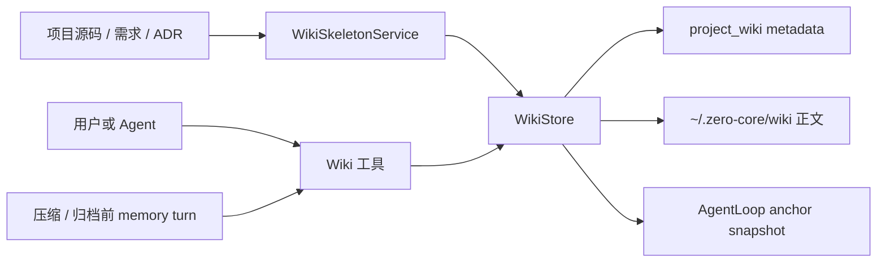
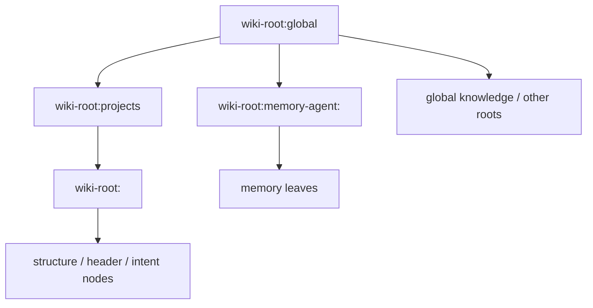

# 06 知识与 Wiki 子系统

> 本文按当前 Wiki Store、anchor 注入、工具和项目扫描路径重建。旧 MemoryNode/FTS、KB 向量 RAG 和 Extractor A 描述均不代表当前运行行为。

## 1. 当前只有一条长期知识主线

长期知识的权威存储是全局 Wiki tree：

当前不存在默认自动 embedding、向量检索或独立 `knowledge.db`。旧 `kb_entries`、`kb_chunks`、memory graph、MemoryNode/FTS 表由迁移删除。

MCP 是外部工具接入协议，不是本地知识持久化层；其工具生命周期见[工具子系统](./04-tools-subsystem.md)。

## 2. Wiki 的物理模型

[`WikiStore`](../../src/server/wiki-node-store.ts) 是唯一全局树的主 Store。节点 metadata 在 `project_wiki` 表中，包括：

- parent、path、title、summary。
- project、requirement、relation、link、flag 和 provenance。
- 内部 `doc_pointer` 与更新时间、更新来源。

节点正文不在 SQLite 行中，而是按树位置派生到 `~/.zero-core/wiki/` 下的 Markdown 文件。读取时重新通过 `diskPathFor(nodeId)` 计算规范路径，不信任外部传入的 doc pointer。

`ProjectWikiStore` 仍存在，但只是把同一棵树投影成旧 `ProjectWikiNode` 形状的兼容层。新代码应直接使用 `WikiStore`。

## 3. Anchor 决定读写边界

每个 loop 通过 [`resolveAnchors()`](../../src/runtime/wiki-anchor-injection.ts) 得到 anchor 并集：

| 来源 | 何时加入 | 默认注入 |
|---|---|---|
| agent memory root | 有 agent id 时 | system |
| project subtree root | session context 含 project id 时 | system |
| global root | 仅 `agentId === "zero"` 且无 project context 时 | system |
| free anchors | agent 配置 `wikiAnchors` | 配置指定的 system/context/off |

普通 agent 的 General session 不会自动获得 global root；它只能看到自己的 memory 与显式 free anchors。旧注释中“无 projectId 就能访问全树”的说法已经不成立，实际代码只给 `zero` 这一权限。

Wiki 的权限模型是读写同界：anchor 子树内既可读也可写，free anchor 也授予写权限。最终检查在 Store 的 `assertNodeInAnchorScope()` 和 `*InScope` 方法中执行。空 anchor 拒绝访问；包含 global root 才能访问整树。

外部调用还可通过 `CallerScope.readOnly` 禁止写操作。它不改变可见 anchor，只把 create/update/delete/docWrite/docEdit 变成拒绝。

## 4. 注入给模型的内容

每个 anchor 只注入有界轮廓：

- 根节点标题、短 id、正文大小。
- 截断后的根正文。
- 一层子节点标题、summary、正文大小和子节点计数。
- 更深内容由模型用 `expand` 或 `docRead` 按需读取。

system 与 context channel 的 anchor 当前被合并到同一个 `wiki-system-anchors` system section。该 section 在 loop 中缓存，是冻结快照：

- agent 的 `wikiAnchors` 配置变化会重新解析并失效缓存。
- force memory turn 结束后会无条件失效缓存，使刚写入的记忆在下一 turn 可见。
- 普通 turn 中的任意 Wiki 写入不会自动使当前 loop 的快照失效。

所以数据库/UI 中已更新的 Wiki 与一个长寿命 loop 当前看到的 system outline 可能暂时不同；模型仍可用 Wiki 工具读取实时 Store。

## 5. Wiki 工具

`Wiki` 工具当前提供这些 action：

- 结构：`expand`、`search`、`create`、`update`、`delete`。
- 记忆：`createMemory`、`updateMemory`。
- 正文：`docRead`、`docWrite`、`docEdit`。

节点通过完整/短 node id 或 title path 寻址。title 在同一 parent 下要求唯一。type 主要由节点在树中的位置推导，不是 agent 可自由指定的持久化标签。

正文写入规则：

- `docWrite` 覆盖非空正文需要显式 `overwrite:true`。
- `docEdit` 做精确字符串替换，不解析 Markdown AST。
- 派生路径必须仍在 Wiki root 内。
- 删除节点时递归删除子树和对应正文文件。

metadata 写和正文文件写之间没有跨资源 transaction。正文写失败时可能留下空 metadata 节点，恢复逻辑需要容忍这一状态。

## 6. 长期记忆怎样产生

### 6.1 Agent 主动写 Wiki

Agent 可以在普通 turn 中用 `createMemory`/`updateMemory` 写自己的 memory subtree。memory 是按 agent 隔离、跨 project 共享的，不是按 session 隔离。

### 6.2 压缩前 memory turn

达到 force compression 条件时，`AgentLoop` 先运行 ephemeral memory turn，让 agent 从当前上下文提取值得保留的事实并调用 Wiki；随后才压缩 session。该 turn 的 steps 不持久化，但 Wiki 副作用持久化。

### 6.3 归档前 memory turn

手动归档或 delegated task 结束时可运行类似的 ephemeral turn。失败是 best-effort：即使 memory 写入失败，archive export 仍继续，并在 JSON 中记录 `memoryTurnRan:false`。

这三条都是模型驱动写入，并不保证每次 turn 自动产生记忆。

## 7. 项目知识怎样产生

[`WikiSkeletonService`](../../src/server/wiki-skeleton-service.ts) 是无 LLM 的项目扫描器：

- 从项目 main 分支扫描代码和文档。
- 用 `(archivistId, projectId)` cursor 做增量扫描。
- 为目录、代码、需求和 ADR 创建 structure/header/intent 节点。
- 写 provenance、requirement relation 和 divergence flag。
- 项目创建、显式 API、合并/验证流程和启动布局修复可触发扫描。

它生成的是可导航骨架和启发式摘要，不等价于语义向量索引。feature worktree 的未合并内容不应进入 main Wiki skeleton。

## 8. 搜索能力

当前搜索分两类：

- Wiki 工具 `search`：在 anchor 可见子树中匹配节点信息。
- `searchMemoryNodes()`：对 memory title/summary 做小写 substring AND 匹配，必要时读取磁盘正文再次匹配，并按更新时间排序。

memory 搜索不是 FTS5，也没有 embedding/reranker。后者会线性扫描候选节点，只有在 title/summary 未匹配时才读正文；memory 规模变大后会成为 backend 主线程上的同步 I/O 热点。

## 9. 已退役或未接线的组件

| 名称 | 当前状态 |
|---|---|
| KB / vector RAG | 运行时与表已移除；没有自动召回 |
| MemoryNodeStore / FTS | 文件与表已移除，memory 迁入 Wiki subtree |
| Extractor A | 实现与 Hook 已删除；由 memory ephemeral turn 替代 |
| Extractor B | 类与测试保留，可写 telemetry；生产启动没有创建或触发它 |
| ExtractionCursorStore / TelemetryStore | SessionDB 中保留 lazy accessor，目前无生产调用方 |

不要因为文件或类型仍存在就把 Extractor B、cursor 或 telemetry 描述成正在运行的后台管线。

## 10. 当前问题与边界

- Wiki system outline 是缓存快照，普通 Wiki 写入没有广播到 loop prompt cache。
- SQLite metadata 与正文文件无法原子提交，缺少统一的双向一致性巡检。
- memory 搜索是同步线性扫描，不适合无限增长。
- `WikiStore` 同时通过依赖注入和进程级 singleton 暴露，测试/多实例隔离较弱。
- `ProjectWikiStore` 兼容层与新路由共存，字段投影仍可能漂移。
- `buildGlobalAnchorWikiCallerCtx()` 等 Extractor A 遗留辅助代码仍在，即使 Extractor A 已被删除。
- 长期记忆质量完全依赖 agent 在 memory turn 中正确选择和写入，没有独立确定性提取兜底。

## 11. 修改知识系统时必须验证

1. 普通 agent、project session、zero 与 free anchor 的可见/可写范围分别正确。
2. 短 id、title path 和完整 id 不会越过 anchor scope。
3. metadata、正文文件和 `data:changed` 在失败情况下可恢复。
4. cache 失效策略能让新知识在预期 turn 可见。
5. 任何“自动召回/提取”声明都有真实生产 caller，而不只是保留文件或测试。
6. 项目扫描只读授权分支，并保持 cursor、Wiki 和 Git 合并顺序一致。
