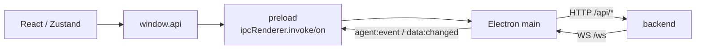
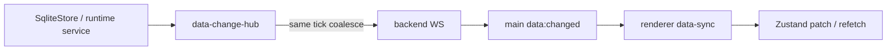

# 07 Renderer 与 IPC 桥

> 本文按当前 Electron main、preload、renderer store、backend router 和契约测试重建。通道数量变化频繁，不再把某次静态计数当成架构契约。

## 1. Renderer 的信任边界

Renderer 是 React 单页应用，不直接导入 Node 文件系统、数据库或 server service。正常调用链是：



BrowserWindow 当前启用 `contextIsolation:true`、`nodeIntegration:false`，并通过 [`preload/index.ts`](../../src/preload/index.ts) 的 `contextBridge` 暴露 `WindowApi`。共享类型在 [`preload-types.ts`](../../src/shared/preload-types.ts)。

## 2. Renderer 结构

[`renderer/main.tsx`](../../src/renderer/main.tsx) 负责：

- 初始化主题和 Shiki。
- 安装全窗口 drag/drop 默认行为拦截。
- 以 React StrictMode 挂载 `App`。

状态按领域拆成多个 Zustand store，例如 chat、agent、provider、project、requirement、wiki、cron、MCP、task、input queue、interaction、notification、theme 和 page。没有统一 Redux 风格 reducer；跨 store 编排通常发生在页面组件或事件 handler 中。

`chat-store` 的核心真值按 session 隔离：

- `messagesBySession` 和 `streamingSessions`。
- `activeSessionId`，active agent 由 session record 派生。
- `sessionsByAgent`、context info 和 volume。
- `lastEventAt` 用于防止 pull 响应覆盖更新的 live stream tail。

Selector 必须返回稳定引用。源码为缺失消息使用共享 `EMPTY_MESSAGES`，避免 `?? []` 在 React/Zustand 订阅中制造无限重渲染。

## 3. 请求链：IPC invoke 到 REST

preload 方法通常是薄包装：

```text
window.api.agentsGet(id)
  → ipcRenderer.invoke("agents:get", id)
  → ipc-proxy RouteMapping.buildReq(id)
  → GET http://localhost:<port>/api/agents/<encoded-id>
  → backend router
```

[`ipc-proxy.ts`](../../src/main/ipc-proxy.ts) 的 route map 为每个代理通道声明：

- HTTP method。
- REST path，可含 `:param`。
- `buildReq(...args)`，生成 params/body/query。

路径参数用 `encodeURIComponent`，query 用 `URLSearchParams`。有 body 时 main 以 JSON 发送。

backend 非 2xx 会在 main 中转成 rejected IPC Promise。错误包含 channel、method、route、HTTP status，以及最多 500 字符的 body 或后端 `{error}`。Renderer 必须用 `try/catch` 处理失败，不能把 resolve 当成唯一结果。

## 4. Main 本地通道

不是所有 invoke 都走 backend。当前 main 本地处理：

- 窗口 minimize/maximize/close。
- 原生目录选择器。
- `webfetch:login` 登录窗口和 Cookie 捕获。
- `app:ready` 通过 backend health check 判断。

本地登录窗口使用独立 `persist:webfetch` partition。它把 Electron Cookie 写到 main 进程的 Cookie jar；该路径与 backend WebFetch 内存 jar 的不同步问题见[持久化层](./05-persistence.md)。

## 5. 三类 push 事件

### 5.1 Agent runtime event

backend 的模型/工具流通过 WebSocket 到 main，再统一转发成 `agent:event`：

- `text_delta`、`thinking_delta`。
- `tool_start`、`tool_end`。
- `message_end`、usage、retry、error、agent_end。
- todo、AskUser、Task 等运行时事件。

`AppLayout` 对 session attribution 使用严格规则：增量内容必须带显式 `sessionId`，且只应用到当前 active session。切走 session 后不再接收它的内容 push；切回时重新 pull baseline。terminal/running 状态可全局更新 `streamingSessions`，防止后台 session 永远显示运行中。

事件缺少 `sessionId` 时不会回退到 active session 或 agent id。这是防止后台事件串入当前聊天的关键约束。

### 5.2 持久数据 `data:changed`

[`data-change-hub.ts`](../../src/server/data-change-hub.ts) 接收 Store 写原语和少数内存服务的变更：



只有白名单 collection 会广播。当前包含主要 UI domain 表、sessions、orchestrate/task/requirement 明细，以及 MCP/metrics/input-queue/orchestrate 等虚拟 collection。高频 step/tool usage 等不在此通道。

同一 tick 中同一 `(collection,id)` 只保留最后一次变更。create/update 通常携带完整 record，delete 只携带 id。

Renderer 有两种同步策略：

- 树形数据收到任意变更后全量 refetch。
- 列表数据按 id patch；新 id 无法安全判断过滤条件时回退 refetch。

该通道是进程内 best-effort event bus，没有持久化、ack 或 replay。

### 5.3 就绪与重连

main 每 500 ms 轮询 `/api/ready`，成功后发 `app:ready`。WS close 后每 2 秒重连；只有“曾成功连接后再次 open”才发 `ws:reconnected`，首次连接不会。

Renderer 收到重连后会重新拉当前 session、被观察的 task/input queue 和几个核心配置 store，以修补断线期间漏掉的 push。

## 6. Pull-on-display 与 push 的组合

聊天没有只依赖 WebSocket 重放历史。切换 session 时调用 `sessionsGetInit(sessionId)` 拉取：

- step 组装出的消息。
- backend authoritative `isRunning`。
- todo、pending AskUser 等交互状态。
- model、context usage 和 session volume。

pull 发出后如果 `lastEventAt` 显示 live event 已更新当前 session，ChatPanel 会保留最新 assistant tail，只用 pull 补历史和 user 消息，避免慢响应覆盖正在流式生成的内容。

这一模式的约束是：

1. push 负责 active 视图低延迟。
2. pull 负责基线、重新进入和断线修复。
3. 后端持久化仍是真值，Zustand 只是可重建缓存。

## 7. 附件与文档显示

附件上传经 preload/IPC/HTTP 发送 base64，backend 返回 `AttachmentMeta`。历史缩略图再通过受保护的 content endpoint 读取字节。聊天 store 和 step 只保存 metadata。

文档面板对 Markdown 使用 React renderer，对 source 使用 `<pre>`/textarea，对 PDF/HTML 使用 Electron `<webview>`。BrowserWindow 因此启用了 `webviewTag:true`。

文件读取和保存必须走 backend 的 workspace/root 校验；renderer 传入的路径不能视为可信路径。

## 8. 通道契约如何验证

主要契约测试在 [`rest-routers.test.ts`](../../tests/unit/rest-routers.test.ts) 和 [`p9-dead-path-removal.test.ts`](../../tests/unit/p9-dead-path-removal.test.ts)：

- preload invoke 应在 proxy map 或明确的本地列表中。
- proxy method/path 合法。
- backend 非 2xx 必须 reject。
- 旧 main IPC 实现不得重新出现。
- WS 首连与重连信号行为不同。

`WindowApi` 的 TypeScript 接口只能检查调用形状，不能证明 main/backend 真有 handler；映射测试必须保持严格，例外列表不能成为长期垃圾桶。

## 9. 已确认的契约缺口

### 9.1 GitHub template invoke 没有 handler

preload 和 `template-store` 仍调用：

- `templates:github-preview`
- `templates:import-github`

当前 `ipc-proxy.ts`、main 本地 handler 中没有这两个通道。测试把它们列在 `INVOKE_BUT_NOT_PROXIED` 例外中，但也没有找到其他注册者；调用会因没有 IPC handler 而拒绝。backend `template-router` 有相关能力，并不等于 Electron invoke 已接线。

### 9.2 只有订阅端的 preload event

当前只找到以下 IPC event 的 preload/renderer 订阅，没有找到 main 的 `webContents.send` 生产者：

- `tools:changed`
- `session:lifecycle`
- `github-import:progress`
- `github-preview:progress`

UI 不能把这些回调当成可靠通知。实际 session 状态主要由 `agent:event` 和 pull baseline 驱动。

### 9.3 重连修复不完整

重连 handler 能实际更新 active chat 与核心 store；Dashboard 的 metrics 和 MCP status 调用结果目前被丢弃，没有写回页面局部 state。因此“重连后所有可见页面都恢复”并不成立。

## 10. 安全与边界

- `contextIsolation:true` 和 `nodeIntegration:false` 是有效的第一层隔离。
- BrowserWindow 未显式启用 `sandbox:true`，同时开放 `webviewTag`。
- 未找到统一 CSP、`will-navigate` 或 `setWindowOpenHandler` 限制；本地/外部 HTML webview 是额外攻击面。
- preload 暴露的是宽 API surface，参数校验主要在 backend/router/store，不能只依赖 TypeScript。
- backend 当前无认证且 listen 未指定 loopback host。若端口能被其他主机访问，50 MB JSON endpoint 和 raw tool dispatcher 都会扩大风险。
- renderer 多处仍使用 `any`，共享事件 payload 缺少可判别 union，契约漂移更难在编译期发现。

## 11. 修改 Renderer/IPC 时必须验证

1. preload、`WindowApi`、proxy/local handler、REST router 四层同时存在。
2. 非 2xx 不被吞掉，UI optimistic update 能回滚。
3. 所有内容事件显式携带 session id，并测试后台/切换 session 场景。
4. push 丢失后 pull 能恢复，慢 pull 不覆盖更新的 live tail。
5. `data:changed` 新 collection 同时更新白名单和 renderer 订阅。
6. 新 event 必须有生产者、消费者和 unsubscribe；不能只加接口声明。
7. webview 或外链能力变更时补导航、CSP、permission 和 sandbox 审计。
