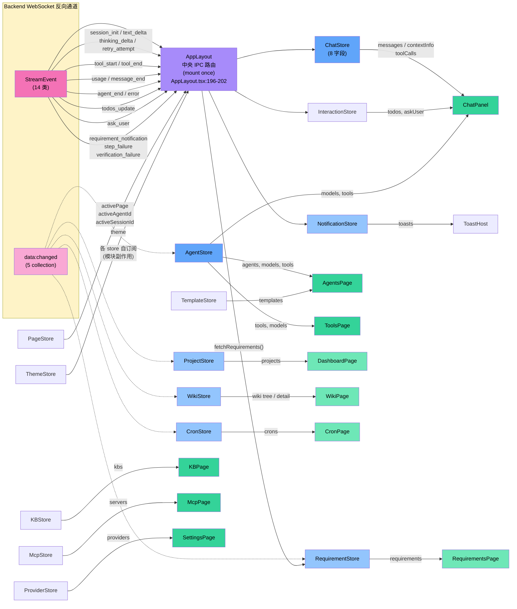
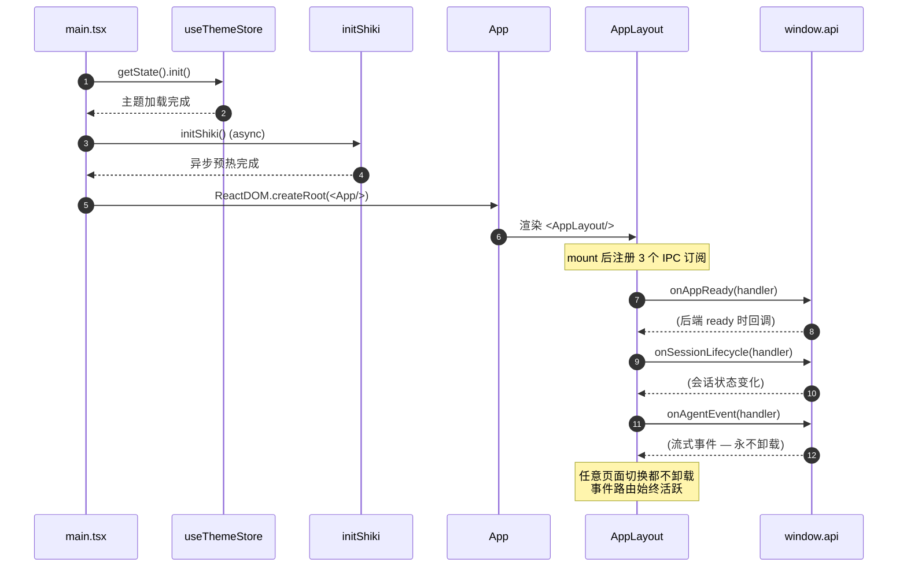

# 07 · 渲染层与 IPC 桥

> 渲染层是一个 React + Zustand 单页应用，通过两道桥与后端对话：contextBridge（同步请求）+ WebSocket（流式事件）。本文剖析两道桥的设计与状态管理。

## 1. 渲染层技术栈

| 维度 | 选型 | 备注 |
|------|------|------|
| 框架 | React 19.2 | 函数组件 + Hooks |
| 状态 | Zustand 5.0 | 16 个 store（`src/renderer/store/`，含 `data-sync.ts` 订阅 helper），每个独立关注点 |
| 构建 | Vite 6.4 | electron-vite 整合 |
| Markdown | react-markdown 10 + remark-gfm 4 + rehype-raw 7 | GFM 表格 / 原始 HTML |
| 代码高亮 | Shiki 4 | 启动时异步预热 |
| 流程图 | Mermaid 11 | 在 Markdown 中渲染 |
| HTML→Markdown | turndown 7 | 用于 WebFetch 工具（后端）|

证据：`package.json` 依赖 + `src/renderer/main.tsx`。

## 2. 三道桥：preload ↔ IPC ↔ HTTP

### 2.1 preload → window.api

`src/preload/index.ts:217`：

```typescript
import { contextBridge, ipcRenderer } from "electron";
const api: WindowApi = { /* 150 左右的方法/通道包装 */ };
contextBridge.exposeInMainWorld("api", api);
```

`WindowApi` 接口在 `src/shared/preload-types.ts`。每个方法基本都是 `ipcRenderer.invoke(channel, ...args)` 的薄包装；当前 preload 暴露约 150 个 invoke 通道。

### 2.2 main → backend（IPC ↔ HTTP 翻译）

`src/main/ipc-proxy.ts` 维护一份映射表 `R: Record<channel, RouteMapping>`，按域分块注释（Config / Agents / Providers / MCP / KB / Templates / Tools / Sessions / Messages / Chat / Files / Logs / Tool-Executions / WebFetch / ask-user / Skills / Memory-Nodes / Memory-Config / Projects / Requirements(+M5) / Wiki(legacy CRUD) / Wiki(v0.8 global-tree) / Lead / Crons / Orchestrate / PM），当前约 120+ 项：

```typescript
{
  "chat:send": {
    method: "POST",
    path: "/api/chat/send",
    buildReq: (text: string, agentId?: string, sessionId?: string) => ({ body: { text, agentId, sessionId } })
  },
  "agents:list": {
    method: "GET",
    path: "/api/agents",
    buildReq: () => ({})
  },
  ...
}
```

`registerProxyHandlers(port)` 对每个通道注册 `ipcMain.handle(channel, async (_e, ...args) => fetch(...))`。每项 `RouteMapping` 含 `method` / `path`（`:param` 占位）/ `buildReq(...args)`（从 IPC 参数抽 `params` / `body` / `query`）；`path` 里的 `:key` 会被 `encodeURIComponent` 后替换，`query` 经 `URLSearchParams` 拼接。

### 2.3 main ← backend（WebSocket 反向）

`src/main/ipc-proxy.ts` `connectEventBridge(win, port)`：

```
连接 ws://localhost:PORT/ws
   ↓
backend 推送 {type:'text_delta', agentId, sessionId, text}
   ↓
main 解析 → win.webContents.send('agent:event', event)  // IPC event
   ↓
renderer: api.onAgentEvent(handler) → chat-store.update*
```

WS 客户端自动 2 秒重连（`on('close') → setTimeout(connect, 2000)`）。`pollReady()` 同时轮询 `/api/ready`，等后端就绪后发 `app:ready` IPC。

#### 2.3.1 `data:changed` —— 持久数据 UI 同步通道

除 `agent:event`(运行时执行流)外,WS 还承载一条**持久数据同步**通道。后端在持久数据被任一突变面(UI REST / agent 工具 / 后台服务 / 启动恢复)改动时广播:

```
SqliteStore insertRow/updateRow/delete  (唯一写出口)
   ↓ emitDataChange(table, id, op, record?)
data-change-hub  (src/server/data-change-hub.ts)
   ├ 白名单 UI_COLLECTIONS = {agents, projects, crons, requirements, project_wiki}
   ├ 非 UI collection 直接 return(messages/turns/tool_usage 等高频表不入)
   └ coalesce: 同 tick 内同 (collection,id) 多次写合并成一条(保留最新 op+record)
   ↓ setTimeout(flush, 0) → onDataChange listeners
server/index.ts: onDataChange → WS broadcast {type:'data:changed', collection, changes:[{id,op,record?}]}
main ipc-proxy.connectEventBridge: eventType==='data:changed' 单独走 win.send('data:changed', ...) (不污染 agent:event 流)
   ↓
renderer preload: api.onDataChanged(callback) → ipcRenderer.on('data:changed', ...)
   ↓
src/renderer/store/data-sync.ts:
   ├ subscribeDataChange(collection, refetchAll)        ← 树形 store 用,任意变更全量 refetch
   └ subscribeListDataChange(collection, {patch, refetchAll})  ← 列表 store 增量 patch
   ↓
zustand store: create/update 推来 record 直接 patch(免 GET /:id);delete 移除;
              新 id 不在(过滤)视图 → patch 返回 false → helper 回退一次 refetchAll 重新套用 filter
```

- **白名单**(`UI_COLLECTIONS`):`agents / projects / crons / requirements / project_wiki`。`messages/turns/tool_usage` 等高频表不入(流式每 chunk 写 messages,会刷屏——这些走 `agent:event`)。
- **推全对象**:create/update 带 `record`,renderer 原地替换,无额外请求;`update` 在 SqliteStore 做 no-op 检测(字段全等于现值 → 不写不发)。
- **实际订阅矩阵**(核对 `src/renderer/store/*.ts`):

  | collection | 订阅 store | 订阅方式 | 增量策略 |
  |------------|-----------|----------|---------|
  | `agents` | `agent-store.ts:136` | `subscribeListDataChange` | append+replace,新 id 直接 push |
  | `projects` | `project-store.ts:90` | `subscribeListDataChange` | append+replace |
  | `crons` | `cron-store.ts:127` | `subscribeListDataChange` | append+replace |
  | `requirements` | `requirement-store.ts:184` | `subscribeListDataChange` | 仅替换已存在项;新 id 返回 false → refetchAll 重套 filter |
  | `project_wiki` | `wiki-store.ts:198` | `subscribeDataChange` | 任意变更全量 refetch(树形结构,增量 patch 复杂度过高) |

- 详细决策见 ADR-021。**新增一个 UI 同步域 = 两处各一行**:① `data-change-hub.ts` 的 `UI_COLLECTIONS` Set 加表名;② 该 renderer store 调 `subscribeDataChange` / `subscribeListDataChange` 订阅。
- 🎮 **可交互演练**:[`docs/visualization/data-sync-flow.html`](../visualization/data-sync-flow.html) —— 把上面五段路径(SqliteStore emit → 白名单 gate → coalesce/flush → WS→IPC 桥 → 各 store 自订阅)做成可点选的主图 + 6 个情景演练(单次写 / 同 tick 多写合并 / burst→refetchAll / 非白名单表静默丢 / delete 不带 record / 过滤列表新 id 不在),每步可单步或自动播放,点主图任一节点查看对应源码片段。

### 2.4 本地保留的 IPC 通道

`src/main/index.ts:96-172` `registerLocalHandlers(win)`：

| 通道 | 处理位置 | 原因 |
|------|----------|------|
| `window:minimize` / `window:maximize` / `window:close` | main | 必须操作 BrowserWindow |
| `dialog:openDirectory` | main | 需要 `dialog.showOpenDialog` 原生对话框 |
| `webfetch:login` | main | 需要打开 BrowserWindow 做 cookie-based 登录 |

这 5 个通道不走 HTTP。另有 `app:ready` 健康检查在 `ipc-proxy.ts` 中直接轮询 `/api/ready`，不属于业务 REST proxy。**架构师评价**：主进程本地能力仍然收敛，边界清晰。


### 2.5 当前契约例外(preload invoke → proxy/local 的强制对齐)

`tests/unit/rest-routers.test.ts` 用三组集合把 preload 中所有 `ipcRenderer.invoke("…")` 通道强制对齐到 `ipc-proxy.ts` 的 `R` 表或本地处理器,**新增通道不改这些集合会让测试红**。

关键:**`ROUTE_MAP` 不是手写常量,而是测试从 `src/main/ipc-proxy.ts` 源码正则派生的**(`rest-routers.test.ts:459`),所以"R 表里有的通道必须出现在源码里、源码里的通道必须 preload 也调用"是同一份事实的两面。三组例外集合:

**① `LOCAL_CHANNELS`** —— 走 `ipcMain.handle` 在主进程内直接处理,不进 `R` 表(共 ~17 项):

| 通道 | 处理位置 | 原因 |
|------|----------|------|
| `window:minimize` / `window:maximize` / `window:close` | `main/index.ts` | 操作 BrowserWindow |
| `dialog:openDirectory` | `main/index.ts` | 原生 `dialog.showOpenDialog` |
| `webfetch:login` | `main/index.ts` | 打开 BrowserWindow 做 cookie 登录 |
| `orchestrate:pending` / `:plan` / `:confirm` / `:reject` | `orchestrate-handlers.ts` (M3) | 持有 main 进程 ConfirmRegistry 单例,不能下放 REST |
| `requirements:doc:read` / `:write` / `:list`、`pm:createRequirement`、`pm:openDiscuss`、`pm:coverageView`、`pm:coverageVerdict` | `pm-handlers.ts` (M4) | 直接操作 PmService + RequirementDocStore,不走 REST |

**② `INVOKE_BUT_NOT_PROXIED`** —— invoke 但本质是事件流/健康检查,不映射 REST(共 3 项):

| 通道 | 原因 |
|------|------|
| `app:ready` | 在 `registerProxyHandlers` 内轮询 `/api/ready`,非直接 proxy |
| `templates:github-preview` | GitHub 流式预览,WS-like 复杂语义 |
| `templates:import-github` | 同上 |

**③ 退役通道** —— `agent-as-tool` 系列在 v0.8 已退役,测试显式断言它们**不得**出现在 `ROUTE_MAP` 或 preload 中(`agent-as-tool channels are retired`)。

> 历史漂移已清理:早期文档提到的 `search-provider:get / set` 已从 preload 删除,不再在例外集合里。

### 2.6 v0.8 关键修复:non-2xx 现在抛 reject(过去静默 resolve)

`registerProxyHandlers` 的代理循环在 v0.8 加了**非 2xx → throw** 分支(`ipc-proxy.ts:324-337`),是 IPC 层近年最重要的行为变更:

```typescript
const resp = await fetch(url, fetchOpts);
const text = await resp.text();
if (!resp.ok) {
  // 优先解 backend { error } 取消息,失败回退 raw excerpt(≤500 字符)
  const excerpt = ...;
  throw new Error(`${channel} → ${route.method} ${route.path} failed: HTTP ${resp.status} ${resp.statusText}: ${detail}`);
}
```

- **过去**:`fetch` 不论状态码都 resolve,renderer 的 `await ipcRenderer.invoke` 永远拿到值(4xx/5xx 的 body 被当 JSON 解析失败时回落成原始文本)。这让乐观调用方(如删除 agent)**在后端失败时仍按成功推进**,错误被吞。
- **现在**:renderer 侧 `try/catch` 能捕到带状态码 + 路径 + body 摘要的 Error。这是 MEMORY 里 `e8e3f99 fix: ipc-proxy 非2xx reject` 的文档化。
- **影响面**:所有走 `R` 表的 invoke 通道;UI 需在删除/保存等关键调用上包 try/catch(否则 reject 冒泡到 React 事件回调,看用户为"无反应")。
## 3. Zustand Store 设计模式

### 3.1 通用原则（从代码反推）

观察 `chat-store.ts:128-141` 的选择器：

```typescript
const EMPTY_MESSAGES: ChatMessage[] = [];
export const selectActiveMessages = (s) =>
  s.activeSessionId ? (s.messagesBySession[s.activeSessionId] ?? EMPTY_MESSAGES) : EMPTY_MESSAGES;
```

**返回稳定引用**是核心原则。`?? []` 会每次创建新数组导致 React 无限重渲染。

### 3.2 单 Store 单关注点

每个 store 持有自己的"领域对象"，不跨域（`src/renderer/store/` 共 16 个文件）：

- `chat-store` 只管消息 + 流式状态 + contextInfo
- `agent-store` 只管 Agent CRUD + models + tools(模块副作用首次拉取)
- `page-store` 只管当前页面 / 活动 Agent / 活动 session
- `interaction-store` 只管 TodoWrite / AskUser 弹窗 + pendingQuestions
- `project-store` / `requirement-store` / `wiki-store` / `cron-store` —— v0.8 工作流域(PM/Lead/Archivist 的 UI 镜像)
- `notification-store` —— 工作流事件(requirement/step/verification)的 toast
- `provider-store` / `template-store` / `kb-store` / `mcp-store` / `theme-store` —— 配置域
- `data-sync.ts` —— 不是 store,是 `data:changed` 订阅 helper(见 §2.3.1)

**优点**：状态边界清晰，可独立卸载。
**代价**：跨域状态需要手动同步（如活动 agentId 同时在 page-store 和 chat-store）。

### 3.3 模块级副作用（auto-fetch）

观察 `agent-store.ts:119-131`：

```typescript
let _fetched = false;
if (!_fetched) {
  _fetched = true;
  useAgentStore.getState().fetchAgents();
  useAgentStore.getState().fetchModels();
  useAgentStore.getState().fetchTools();
  const unsub = api().onToolsChanged(() => useAgentStore.getState().fetchTools());
}
```

**首次导入即触发**首次拉取 + 注册全局事件订阅。这是个简单的"自动初始化"模式，但有副作用：模块副作用是**单次**的（`_fetched` flag），但 store 单例会让多个 store 互相耦合初始化时机。

### 3.4 IPC 订阅模式

```typescript
useEffect(() => {
  const unsub = api().onAgentEvent((data) => {
    handlers[data.type](data);
  });
  return unsub;
}, []);  // 空依赖：mount/unmount 各一次
```

`AppLayout.tsx:80-152` 是中央订阅者，把后端事件映射到 store 更新。这种**"中央 IPC 路由 + 多 store 更新"**模式让事件处理逻辑集中可审计。

### 3.7 Zustand Store 拓扑（graph LR）

> **v0.8 更正**:此前的拓扑图只画了 StreamEvent 经 AppLayout 路由一条边,且漏了 v0.8 工作流域 5 个 store(project / requirement / wiki / cron / notification)。实际**有两条独立的事件路径**同时驱动 store:
> 1. **StreamEvent(WS 反向,见 §2.3)** → 全部走 `AppLayout.onAgentEvent` 中央路由,只更新 chat / interaction / notification / requirement 4 个 store。
> 2. **`data:changed`(WS 反向,见 §2.3.1)** → 各 store **自己**在模块副作用里调 `data-sync.ts` 的 `subscribeDataChange` / `subscribeListDataChange` 订阅,与 AppLayout **完全无关**。这是 v0.8 工作流域 store 的主动同步机制,5 个 collection(`agents` / `projects` / `requirements` / `crons` / `project_wiki`)分别由对应 store 各自订阅。



**关键观察**(核对后修正):
- **两条事件路径并行,互不替代**:`AppLayout` 是 StreamEvent 的**唯一**订阅者(集中路由 chat 流 + 工作流通知);但 `data:changed` **不走** AppLayout,各工作流域 store 自己用 `data-sync.ts` 订阅各自 collection。前者推"事件 + 增量字段"(流式 token、todo 列表、通知),后者推"完整记录"(create/update 推来整条 record,delete 推 id)。
- **`ChatStore` 是最重的 store** —— 8 个状态字段(`messagesBySession` / `activeAgentId` / `activeSessionId` / `activeProjectId` / `streamingSessions` Set / `sessionsByAgent` / `lastError` / `contextInfoBySession`),消费 6+ 种流式事件(`session_init` / `text_delta` / `thinking_delta` / `tool_start` / `tool_end` / `usage` / `message_end` / `agent_end` / `error` / `retry_attempt`)。注:此前的"11 个字段"计数已过时,实际 8 个。
- **v0.8 工作流域 5 个 store 形成独立的"工作流域子网"**:`ProjectStore` / `RequirementStore` / `WikiStore` / `CronStore` 都通过 `data:changed` 自订阅,`NotificationStore` 通过 StreamEvent 收 3 类工作流通知(requirement_notification / step_failure / verification_failure)。它们与 `ChatStore` 唯一的耦合点是 `AppLayout` 在收到 `requirement_notification` 时顺手调一次 `RequirementStore.fetchRequirements()`(冗余刷新,因为 data:changed 也会推)。
- **`WikiStore` 是唯一用 `subscribeDataChange`(全量 refetch)而非 `subscribeListDataChange`(增量 patch)的 store** —— 因为 wiki 是树形结构,局部 patch 不够,收到任意变更就重拉整树(见 §2.3.1 实际订阅矩阵)。
- **`ThemeStore` / `PageStore` / `InteractionStore` 几乎独立** —— 不订阅任何后端事件,纯前端状态。
- **旧图错误**:`AgentToolStore` 是 v0.7 残留(v0.8 工具配置下沉到服务端 `tool_configs` 表 + `agents.tools` JSON 列,前端不再有独立 `AgentToolStore`,工具列表由 `AgentStore.fetchTools()` 从 `agents/{id}/tools` 拉来),拓扑已删除该节点。

## 4. AppLayout — 全局 IPC 中央路由

`src/renderer/components/layout/AppLayout.tsx:~80-205` 注册单一 `api().onAgentEvent` 订阅,把 14 类 StreamEvent 路由到对应 store:

```typescript
const handlers: Record<string, (data, key) => void> = {
  // —— chat 流(写 chat-store)——
  session_init:   (d, key) => initSession(key, {messages: d.messages, contextInfo: {...}}),
  text_delta:     (d, key) => updateAssistantText(key, d.text),
  message_end:    (d, key) => updateContextInfo(key, {...}),  // 注意:不带 usage,走 estimator
  usage:          (d, key) => updateContextInfo(key, {...}),  // 权威 token 用量来自这里
  thinking_delta: (d, key) => updateThinking(key, d.text),
  tool_start:     (d, key) => addToolCall(key, d.toolName, d.args, d.toolCallId),
  tool_end:       (d, key) => updateToolCall(key, d.toolName, d.isError?"error":"done", d.result, d.toolCallId),
  agent_end:      (_d, key) => finishStreaming(key),
  retry_attempt:  (d, key) => updateAssistantText(key, `Retrying (${d.attempt}/${d.maxAttempts})...`),
  error:          (d, key) => { setError(key, d.error); updateAssistantText(key, `\nError: ${d.error}`); finishStreaming(key); },
  // —— 交互态(写 interaction-store)——
  todos_update:   (d) => interactionStore.setTodos(d.agentId, d.todos),
  ask_user:       (d) => interactionStore.setPendingQuestions({requestId, agentId, questions}),  // 阻塞在 backend pendingResponses
  // —— 通知/工作流事件(写 notification-store + requirement-store)——
  requirement_notification: (d) => { notificationStore.addNotification({...}); requirementStore.fetchRequirements(); },
  step_failure:         (d) => notificationStore.addNotification({type:"step_failure", priority:"warning", ...}),
  verification_failure: (d) => notificationStore.addNotification({type:"verification_failure", priority:"critical", ...}),
};
const unsubscribe = api().onAgentEvent((data) => {
  if (!data.agentId) return;                                  // 守卫:无 agentId 直接丢
  const currentSessionId = useChatStore.getState().activeSessionId;
  const key = data.sessionId || currentSessionId || data.agentId;
  handlers[data.type]?.(data, key);
});
```

**亮点**:
- `key = sessionId || currentSessionId || agentId` 的兜底链,让"未指定 session 时也能定位"。
- `streamingSessions.has(sid)` 判断:如果会话正在流式,session_init **不覆盖**——避免实时事件与初始快照冲突。
- **事件分三组写三个 store**:chat 流 → chat-store;交互态(todos/ask_user) → interaction-store;工作流通知(requirement/step/verification) → notification-store(+requirement-store refetch)。`message_end` 不携带 usage 字段(见 `runtime/types.ts` 的 MessageEndEvent),权威 token 用量来自独立的 `usage` 事件——这是一个曾经让 React tree 崩的历史 bug 修复点(直接读 `d.usage.inputTokens` 会 throw)。

## 5. 关键 UI 组件

### 5.1 ChatPanel（聊天主面板）

- 接收 `useChatStore` 状态
- 渲染 messages + 流式文本 + 工具调用卡片
- 输入框 → `api.chat:send(text)` 触发对话

### 5.2 AgentsPage（Agent 管理）

- 列出 agents
- 创建 / 编辑 / 删除
- AgentEditor 含 6 个 section：Basic / Prompt / Tools / Permissions / Subagents / WikiAnchors（详见 [02 §8.3](./02-module-structure.md#83-业务页面)；早期文档写"5 个 + ExposeAsTool"已过时）
- TemplateGallery：GitHub 模板导入

### 5.3 McpSettingsPage

- 列出 MCP 服务器 + 状态
- 添加（手动 / 预设 / 从扫描结果导入）
- 测试连接 / 重连

### 5.4 SettingsPage（设置）

SettingsPage + 7 个 section（与 02 §8.3 一致；早期文档写"9 个 section"是过时计数）：
- Provider（ProviderCard + ProviderEditor：API key + baseUrl + 模型列表）
- Workspace
- Theme
- DeviceContext
- Guidelines
- Memory
- Proxy

### 5.5 ToolsPage

- 列出全部工具
- 编辑配置字段（auto_approve / max_concurrency / 等等）
- 触发"onToolsChanged"事件 → agent-store.fetchTools() 刷新

## 6. 样式系统

观察 `src/renderer/styles/global.css` + 组件 `className`：

- **纯 CSS**（无 CSS-in-JS）
- 全局类名 + 组件类名 + 一些 BEM 风格（`todos-list__item`）
- 主题切换通过 `theme-store` 修改 `body` 的 CSS 变量

**架构师评价**：零依赖的样式系统。优点：构建快 / 调试容易。缺点：大型项目会缺乏组件级封装。

## 7. 类型契约：渲染层看到的"全部世界"

`src/renderer/types/global.d.ts`：

```typescript
import type { WindowApi } from "../../shared/preload-types.js";
declare global {
  interface Window {
    api: WindowApi;
  }
}
```

`WindowApi` 接口当前暴露约 149 个 `ipcRenderer.invoke` 通道(加若干 `ipcRenderer.on` 事件订阅,如 `onAgentEvent` / `onDataChanged` / `onSessionLifecycle` / `onAppReady` / `onGithubPreviewProgress`),每个 invoke 方法都标注了参数和返回类型。**这是渲染层唯一的对外契约**,所有的 store / 组件都通过它与后端对话。

契约对齐**不是手写**:`tests/unit/rest-routers.test.ts` 从 `src/main/ipc-proxy.ts` 源码**正则派生** `ROUTE_MAP`,再断言每个 preload invoke 通道要么在 `ROUTE_MAP`、要么在 `LOCAL_CHANNELS`、要么在 `INVOKE_BUT_NOT_PROXIED`(详见 §2.5)。新增通道漏改任一一处,测试即红。退役通道(agent-as-tool 系列)另有反向断言:不得出现在 ROUTE_MAP 或 preload。

## 8. 渲染层生命周期



注意：**`api.onAgentEvent` 注册在 AppLayout**，全应用生命周期不卸载。任何页面切换都不影响事件路由。

## 9. 流式事件的渲染层时序

```
Backend WS → "text_delta" event
   ↓
Main: connectEventBridge forwards as IPC event 'agent:event'
   ↓
preload: api.onAgentEvent handler triggers
   ↓
AppLayout: handlers['text_delta'](data, key)
   ↓
useChatStore: updateAssistantText(key, data.text)
   ↓
Zustand notifies React subscribers
   ↓
ChatPanel: selectActiveMessages → messagesBySession[activeId]
   ↓
ReactDOM renders new text delta
```

## 10. 性能特征

| 操作 | 时延 | 备注 |
|------|------|------|
| IPC invoke | ~1-5ms | 跨进程，但本地 |
| HTTP proxy | ~2-10ms | IPC → fetch → localhost |
| WS event | ~1-3ms | 推送，零确认 |
| Zustand update | <1ms | 同步、不可变更新 |
| React render | ~5-20ms | 取决于消息量 |
| 渲染 1000 条消息 | ~50ms | 需要虚拟化（当前未实现）|

## 11. 已知限制

- **没有消息虚拟化**：长会话（1000+ 消息）会让 ChatPanel 渲染变慢。
- **没有错误边界**：单个组件崩溃会让整个 AppLayout 崩溃。
- **没有 PWA / 离线**：Electron 是必须的。
- **没有国际化**：UI 全英文（虽然配置可扩展）。
- **IPC 类型是约 150 个 preload 方法 + 约 140 个 proxy 路由的扁平结构**——未来可能需要分组（如 `api.agents.create(...)`）或由 `shared/ipc-api.ts` 生成 wrapper，以改善命名空间并减少漂移。

## 12. 架构师视角

### 12.1 做对了的

- **三道桥职责清晰**：preload 是类型层，main 是协议翻译层，WS 是事件反向。
- **Zustand 选择器返回稳定引用**——避免 React 陷阱。
- **中央事件路由在 AppLayout**——便于审计"后端事件影响了哪些 store"。
- **5 个本地通道的取舍**——窗口控制、目录选择、登录态采集留在主进程，其他能力走后端 HTTP。

### 12.2 可以改进的

- **IPC 调用无重试**：网络抖动或后端重启时 `api.x` 会失败。应统一加 retry-with-backoff。
- **WS 重连后丢失事件**：当前 backend 重启时 WS 重连，但期间事件已丢失。应该本地缓存最近 N 条事件，reconnect 时回放。
- **store 之间无统一协调**：page-store 的 activeAgentId 改变时，chat-store 不会自动重订阅。需要一个"event bus"模式。
- **preload/proxy 契约仍是源码正则派生**:`ROUTE_MAP` 由测试从 `ipc-proxy.ts` 源码解析而来(非独立常量),`WindowApi` 仍是手写接口。真正消除 drift 的下一步是从单一 channel 表(codegen)生成 `WindowApi` 与 `R` 表两边。当前测试显式放行的非 proxy 通道仅 `templates:github-preview/import-github`(WS 流式)+ `app:ready`(轮询),`search-provider:get/set` 已在 v0.8 清理删除。
- **non-2xx reject 已落地**:过去 `await api.x` 永远 resolve、吞掉 4xx/5xx 的问题已在 v0.8 修复(§2.6),但**调用方仍需普遍 try/catch**——目前只有少数关键调用(删除/保存)包了,普通 invoke 失败会冒泡成"按钮无反应"。
- **ChatPanel 未虚拟化**：长会话性能问题。
- **组件无错误边界**：crash 时整个应用白屏。
