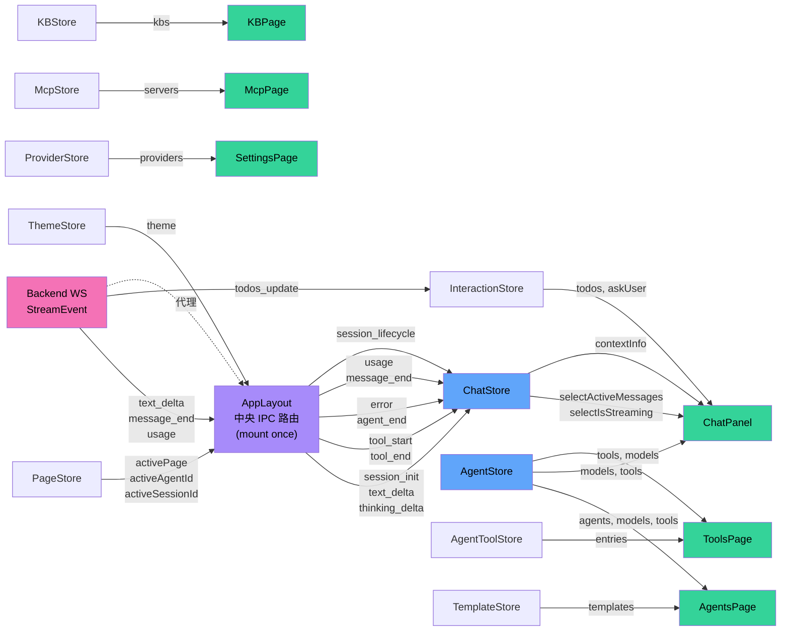
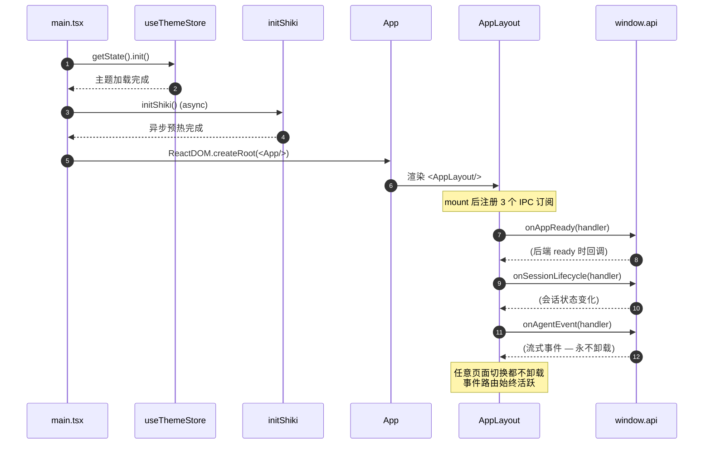

# 07 · 渲染层与 IPC 桥

> 渲染层是一个 React + Zustand 单页应用，通过两道桥与后端对话：contextBridge（同步请求）+ WebSocket（流式事件）。本文剖析两道桥的设计与状态管理。

## 1. 渲染层技术栈

| 维度 | 选型 | 备注 |
|------|------|------|
| 框架 | React 19.2 | 函数组件 + Hooks |
| 状态 | Zustand 5.0 | 10 个 store，每个独立关注点 |
| 构建 | Vite 6.4 | electron-vite 整合 |
| Markdown | react-markdown 10 + remark-gfm 4 + rehype-raw 7 | GFM 表格 / 原始 HTML |
| 代码高亮 | Shiki 4 | 启动时异步预热 |
| 流程图 | Mermaid 11 | 在 Markdown 中渲染 |
| HTML→Markdown | turndown 7 | 用于 WebFetch 工具（后端）|

证据：`package.json` 依赖 + `src/renderer/main.tsx`。

## 2. 三道桥：preload ↔ IPC ↔ HTTP

### 2.1 preload → window.api

`src/preload/index.ts:217`：

```typescript
import { contextBridge, ipcRenderer } from "electron";
const api: WindowApi = { /* 150 左右的方法/通道包装 */ };
contextBridge.exposeInMainWorld("api", api);
```

`WindowApi` 接口在 `src/shared/preload-types.ts`。每个方法基本都是 `ipcRenderer.invoke(channel, ...args)` 的薄包装；当前 preload 暴露约 150 个 invoke 通道。

### 2.2 main → backend（IPC ↔ HTTP 翻译）

`src/main/ipc-proxy.ts` 维护一个约 140 项的映射表 `R: Record<channel, RouteMapping>`：

```typescript
{
  "chat:send": {
    method: "POST",
    path: "/api/chat/send",
    buildReq: (text: string, agentId?: string, sessionId?: string) => ({ body: { text, agentId, sessionId } })
  },
  "agents:list": {
    method: "GET",
    path: "/api/agents",
    buildReq: () => ({})
  },
  ...
}
```

`registerProxyHandlers(port)` 对每个通道注册 `ipcMain.handle(channel, async (_e, ...args) => fetch(...))`。

### 2.3 main ← backend（WebSocket 反向）

`src/main/ipc-proxy.ts` `connectEventBridge(win, port)`：

```
连接 ws://localhost:PORT/ws
   ↓
backend 推送 {type:'text_delta', agentId, sessionId, text}
   ↓
main 解析 → win.webContents.send('agent:event', event)  // IPC event
   ↓
renderer: api.onAgentEvent(handler) → chat-store.update*
```

WS 客户端自动 2 秒重连（`on('close') → setTimeout(connect, 2000)`）。`pollReady()` 同时轮询 `/api/ready`，等后端就绪后发 `app:ready` IPC。

#### 2.3.1 `data:changed` —— 持久数据 UI 同步通道

除 `agent:event`(运行时执行流)外,WS 还承载一条**持久数据同步**通道。后端在持久数据被任一突变面(UI REST / agent 工具 / 后台服务 / 启动恢复)改动时广播:

```
SqliteStore insertRow/updateRow/delete  (唯一写出口)
   ↓ emitDataChange(table, id, op, record?)
data-change-hub  (白名单 UI_COLLECTIONS + coalesce 同 tick 按 (collection,id) 去重)
   ↓ onDataChange → WS broadcast {type:'data:changed', collection, changes:[{id,op,record?}]}
main ipc-proxy → win.webContents.send('data:changed', {collection, changes})
   ↓
renderer: api.onDataChanged → data-sync.subscribeDataChange / subscribeListDataChange
   ↓
zustand store: create/update 推来 record 直接 patch(免 GET /:id);delete 移除;
              新 id 不在(过滤)视图 → 回退一次 refetchAll 重新套用 filter
```

- **白名单**:`agents/projects/crons/requirements/project_wiki`。`messages/turns/tool_usage` 等高频表不入(流式每 chunk 写 messages,会刷屏——这些走 `agent:event`)。
- **推全对象**:create/update 带 `record`,renderer 原地替换,无额外请求;`update` 在 SqliteStore 做 no-op 检测(字段全等于现值 → 不写不发)。
- 详细决策见 ADR-021。新增 UI 同步域 = hub 白名单加表名 + store 一行订阅。

### 2.4 本地保留的 IPC 通道

`src/main/index.ts:96-172` `registerLocalHandlers(win)`：

| 通道 | 处理位置 | 原因 |
|------|----------|------|
| `window:minimize` / `window:maximize` / `window:close` | main | 必须操作 BrowserWindow |
| `dialog:openDirectory` | main | 需要 `dialog.showOpenDialog` 原生对话框 |
| `webfetch:login` | main | 需要打开 BrowserWindow 做 cookie-based 登录 |

这 5 个通道不走 HTTP。另有 `app:ready` 健康检查在 `ipc-proxy.ts` 中直接轮询 `/api/ready`，不属于业务 REST proxy。**架构师评价**：主进程本地能力仍然收敛，边界清晰。


### 2.5 当前契约例外

`tests/unit/rest-routers.test.ts` 已经把 preload → proxy 的契约检查写成测试，但当前仍显式放行 4 个 invoke 通道：

| 通道 | 当前状态 | 建议 |
|------|----------|------|
| `templates:github-preview` | preload 与 shared 类型存在；后端 `/api/templates/github-preview` 存在；`R` 表未映射 | 补齐 `ipc-proxy.ts` 映射，或说明为何必须走非 proxy 路径 |
| `templates:import-github` | preload 与 shared 类型存在；后端 `/api/templates/import-github` 存在；`R` 表未映射 | 同上 |
| `search-provider:get` | 只在 preload 中出现 | 确认是否废弃；废弃则删除 preload 方法，保留则补后端与 proxy |
| `search-provider:set` | 只在 preload 中出现 | 同上 |

这组例外是当前 IPC 层最实际的漂移风险。
## 3. Zustand Store 设计模式

### 3.1 通用原则（从代码反推）

观察 `chat-store.ts:128-141` 的选择器：

```typescript
const EMPTY_MESSAGES: ChatMessage[] = [];
export const selectActiveMessages = (s) =>
  s.activeSessionId ? (s.messagesBySession[s.activeSessionId] ?? EMPTY_MESSAGES) : EMPTY_MESSAGES;
```

**返回稳定引用**是核心原则。`?? []` 会每次创建新数组导致 React 无限重渲染。

### 3.2 单 Store 单关注点

每个 store 持有自己的"领域对象"，不跨域：

- `chat-store` 只管消息 + 流式状态
- `agent-store` 只管 Agent CRUD
- `page-store` 只管当前页面/活动 Agent
- `interaction-store` 只管 TodoWrite / AskUser 弹窗
- ...

**优点**：状态边界清晰，可独立卸载。
**代价**：跨域状态需要手动同步（如活动 agentId 同时在 page-store 和 chat-store）。

### 3.3 模块级副作用（auto-fetch）

观察 `agent-store.ts:119-131`：

```typescript
let _fetched = false;
if (!_fetched) {
  _fetched = true;
  useAgentStore.getState().fetchAgents();
  useAgentStore.getState().fetchModels();
  useAgentStore.getState().fetchTools();
  const unsub = api().onToolsChanged(() => useAgentStore.getState().fetchTools());
}
```

**首次导入即触发**首次拉取 + 注册全局事件订阅。这是个简单的"自动初始化"模式，但有副作用：模块副作用是**单次**的（`_fetched` flag），但 store 单例会让多个 store 互相耦合初始化时机。

### 3.4 IPC 订阅模式

```typescript
useEffect(() => {
  const unsub = api().onAgentEvent((data) => {
    handlers[data.type](data);
  });
  return unsub;
}, []);  // 空依赖：mount/unmount 各一次
```

`AppLayout.tsx:80-152` 是中央订阅者，把后端事件映射到 store 更新。这种**"中央 IPC 路由 + 多 store 更新"**模式让事件处理逻辑集中可审计。

### 3.7 Zustand Store 拓扑（graph LR）



**关键观察**：
- **`AppLayout` 是唯一的事件订阅者**，所有 StreamEvent 集中路由
- **`ChatStore` 是最重的 store**（11 个字段，6 种流式事件）
- **`AgentStore` 与其他 5 个 store 并列**，但被多个页面共用
- **`ThemeStore` / `PageStore` / `InteractionStore` 几乎独立**，与其他 store 零耦合

## 4. AppLayout — 全局 IPC 中央路由

`src/renderer/components/layout/AppLayout.tsx:80-152`：

```typescript
const handlers: Record<string, (data, key) => void> = {
  session_init:   (d, key) => initSession(key, {messages: d.messages}),
  text_delta:     (d, key) => updateAssistantText(key, d.text),
  message_end:    (d, key) => updateContextInfo(key, {...}),
  usage:          (d, key) => updateContextInfo(key, {...}),
  thinking_delta: (d, key) => updateThinking(key, d.text),
  tool_start:     (d, key) => addToolCall(key, d.toolName, ...),
  tool_end:       (d, key) => updateToolCall(key, d.toolName, ...),
  agent_end:      (_d, key) => finishStreaming(key),
  retry_attempt:  (d, key) => updateAssistantText(key, `Retrying (${d.attempt}/${d.maxAttempts})...`),
  todos_update:   (d) => interactionStore.setTodos(d.agentId, d.todos),
  error:          (d, key) => { setError(key, d.error); finishStreaming(key); },
};
const unsubscribe = api().onAgentEvent((data) => {
  const key = data.sessionId || currentSessionId || data.agentId;
  handlers[data.type]?.(data, key);
});
```

**亮点**：
- `key = sessionId || currentSessionId || agentId` 的兜底链，让"未指定 session 时也能定位"。
- `streamingSessions.has(sid)` 判断：如果会话正在流式，session_init **不覆盖**——避免实时事件与初始快照冲突。

## 5. 关键 UI 组件

### 5.1 ChatPanel（聊天主面板）

- 接收 `useChatStore` 状态
- 渲染 messages + 流式文本 + 工具调用卡片
- 输入框 → `api.chat:send(text)` 触发对话

### 5.2 AgentsPage（Agent 管理）

- 列出 agents
- 创建 / 编辑 / 删除
- AgentEditor 含 5 个 section：Basic / Prompt / Tools / Permissions / ExposeAsTool
- TemplateGallery：GitHub 模板导入

### 5.3 McpSettingsPage

- 列出 MCP 服务器 + 状态
- 添加（手动 / 预设 / 从扫描结果导入）
- 测试连接 / 重连

### 5.4 SettingsPage（设置）

9 个 section：
- Provider（API key + baseUrl + 模型列表）
- Workspace
- Theme
- DeviceContext
- Guidelines
- MemorySettings
- ProxySettings
- ThemeSettings / DeviceContextSettings 等

### 5.5 ToolsPage

- 列出全部工具
- 编辑配置字段（auto_approve / max_concurrency / 等等）
- 触发"onToolsChanged"事件 → agent-store.fetchTools() 刷新

## 6. 样式系统

观察 `src/renderer/styles/global.css` + 组件 `className`：

- **纯 CSS**（无 CSS-in-JS）
- 全局类名 + 组件类名 + 一些 BEM 风格（`todos-list__item`）
- 主题切换通过 `theme-store` 修改 `body` 的 CSS 变量

**架构师评价**：零依赖的样式系统。优点：构建快 / 调试容易。缺点：大型项目会缺乏组件级封装。

## 7. 类型契约：渲染层看到的"全部世界"

`src/renderer/types/global.d.ts`：

```typescript
import type { WindowApi } from "../../shared/preload-types.js";
declare global {
  interface Window {
    api: WindowApi;
  }
}
```

`WindowApi` 接口有约 150 个方法，每个方法都标注了参数和返回类型。**这是渲染层唯一的对外契约**，所有的 store / 组件都通过它与后端对话。当前契约仍是手写维护，`tests/unit/rest-routers.test.ts` 会校验大多数 preload invoke 通道必须存在 proxy/local 映射。

## 8. 渲染层生命周期



注意：**`api.onAgentEvent` 注册在 AppLayout**，全应用生命周期不卸载。任何页面切换都不影响事件路由。

## 9. 流式事件的渲染层时序

```
Backend WS → "text_delta" event
   ↓
Main: connectEventBridge forwards as IPC event 'agent:event'
   ↓
preload: api.onAgentEvent handler triggers
   ↓
AppLayout: handlers['text_delta'](data, key)
   ↓
useChatStore: updateAssistantText(key, data.text)
   ↓
Zustand notifies React subscribers
   ↓
ChatPanel: selectActiveMessages → messagesBySession[activeId]
   ↓
ReactDOM renders new text delta
```

## 10. 性能特征

| 操作 | 时延 | 备注 |
|------|------|------|
| IPC invoke | ~1-5ms | 跨进程，但本地 |
| HTTP proxy | ~2-10ms | IPC → fetch → localhost |
| WS event | ~1-3ms | 推送，零确认 |
| Zustand update | <1ms | 同步、不可变更新 |
| React render | ~5-20ms | 取决于消息量 |
| 渲染 1000 条消息 | ~50ms | 需要虚拟化（当前未实现）|

## 11. 已知限制

- **没有消息虚拟化**：长会话（1000+ 消息）会让 ChatPanel 渲染变慢。
- **没有错误边界**：单个组件崩溃会让整个 AppLayout 崩溃。
- **没有 PWA / 离线**：Electron 是必须的。
- **没有国际化**：UI 全英文（虽然配置可扩展）。
- **IPC 类型是约 150 个 preload 方法 + 约 140 个 proxy 路由的扁平结构**——未来可能需要分组（如 `api.agents.create(...)`）或由 `shared/ipc-api.ts` 生成 wrapper，以改善命名空间并减少漂移。

## 12. 架构师视角

### 12.1 做对了的

- **三道桥职责清晰**：preload 是类型层，main 是协议翻译层，WS 是事件反向。
- **Zustand 选择器返回稳定引用**——避免 React 陷阱。
- **中央事件路由在 AppLayout**——便于审计"后端事件影响了哪些 store"。
- **5 个本地通道的取舍**——窗口控制、目录选择、登录态采集留在主进程，其他能力走后端 HTTP。

### 12.2 可以改进的

- **IPC 调用无重试**：网络抖动或后端重启时 `api.x` 会失败。应统一加 retry-with-backoff。
- **WS 重连后丢失事件**：当前 backend 重启时 WS 重连，但期间事件已丢失。应该本地缓存最近 N 条事件，reconnect 时回放。
- **store 之间无统一协调**：page-store 的 activeAgentId 改变时，chat-store 不会自动重订阅。需要一个"event bus"模式。
- **preload/proxy 契约仍是手写**：从 `shared/ipc-api.ts` 的 channel 表自动生成 `WindowApi` 与 `R` 表校验会减少 drift。当前测试显式放行了 `templates:github-preview/import-github` 与 `search-provider:get/set` 4 个例外。
- **ChatPanel 未虚拟化**：长会话性能问题。
- **组件无错误边界**：crash 时整个应用白屏。
