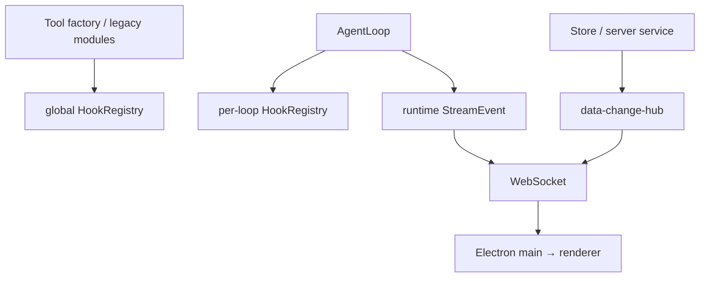

# 08 横切机制

> 本文按当前日志、事件、并发、代理、恢复和安全实现重建。AgentLoop 的详细 Hook 时序见[运行时引擎](./03-runtime-engine.md)，工具包装见[工具子系统](./04-tools-subsystem.md)。

## 1. 系统中有四种事件平面

它们不是同一个 event bus：

| 平面 | 目的 | 可靠性/隔离 |
|---|---|---|
| per-loop Hook | 执行编排、持久化、压缩和 loop 级扩展 | loop 隔离；handler 错误被吞并记录 |
| global Hook | 遗留工具包装和部分全局观察点 | 进程级，可能与 per-loop 重复 |
| data-change hub | 持久数据和少数内存 collection 的 UI/工作流通知 | 同 tick 合并、无 replay |
| runtime StreamEvent | 模型、工具、session/task 实时状态 | 经 WS best-effort push |

新增横切功能前必须选择正确平面。把持久化放到无 replay 的 UI hub，或把 UI patch 放进 per-loop Hook，都会造成错误的生命周期耦合。

## 2. Hook 执行模型

每个 `AgentLoop` 有自己的 [`HookRegistry`](../../src/core/hook-registry.ts)。`registerHooksForLoop()` 按 main/delegated 注册 turn、durable、tool execution、provider options、todo、force-wait、compression，以及 main-only input/metrics 或 delegated-only task control。

关键语义：

- 数组字段合并，标量后写覆盖。
- `blocked` 短路后续 handler。
- handler 异常被 log 后吞掉。
- `SessionStart/Close` 由 `AgentService` 负责主 loop 生命周期。
- `PostLLCall` 已定义但没有执行触发点。

吞掉异常能保护主 loop，但也意味着关键持久化 Hook 失败时 turn 仍可能继续。需要强一致性的 handler 不能只依赖“出错会自然终止执行”，应有显式状态、监控和恢复测试。

全局 `triggerHooks()` 仍被工具工厂使用，因此工具一次调用可能先经过全局 Hook，再由 AgentLoop 流事件经过 per-loop Hook。新增审计、阻断或遥测逻辑必须明确是否需要两处接入及如何去重。

## 3. 日志

[`logger.ts`](../../src/core/logger.ts) 把 payload 同时送到 console 和文件 sink：

- `ZERO_CORE_DEBUG=1` 或 `--debug` 才允许 debug。
- agent/loop/ipc/db/tool/mcp/provider/session shortcut 是 info，在非 debug 模式仍输出。
- warn/error 始终输出。
- 文件默认启用，global level 为 debug，保留 7 天。

文件位于 `~/.zero-core/logs/YYYY-MM-DD.log`，使用同步 `appendFileSync`。首次写入新日期时按 mtime 清理过期 `.log` 文件。配置保存在 `kv_store[log_config]` 并可运行时更新。

日志 router 只允许 logs 目录内的简单文件名，最多返回 500 行；解析依赖固定文本正则。

当前限制：

- 没有统一结构化 JSON、request/session correlation id 或采样。
- 没有通用 secret redaction；调用方如果把 API key、Cookie 或 prompt 传入日志会原样落盘。
- 同步文件写在高频路径上会阻塞 backend event loop。
- `applyProxy()` 会把完整代理 URL打印到 console，URL 中若含用户名/密码会泄露凭据。

## 4. 并发控制分层

### 4.1 单 loop busy guard 与输入队列

同一个 `AgentLoop` 不允许并发 `run()`。主 chat 忙时，新输入进入 `InputQueueStore`：

- `queued` 在当前 turn 结束后成为下一用户 turn。
- `insert_now` 在下一个 step 注入，只有成功 `StepEnd` 才从队列提交删除；失败重试会重新注入。

InputQueueStore 是内存态，重启后清空。它表达即时用户意图，不是 durable message queue。

### 4.2 Provider 并发队列

每个启用限制的 provider 有一个 semaphore，max concurrency 被限制在 1–10。优先级通过 AsyncLocalStorage 从 turn source 传到 provider middleware：

| Tier | Source | 调度 |
|---|---|---|
| P1 | user | 最高 |
| P2 | work、cron | 中 |
| P3 | background/未指定 | 最低 |

同 tier FIFO，不同 tier 严格优先，因此持续用户流量可能让 P3 饥饿。stream 调用直到流被完整消费才释放 slot；generate 在 promise 完成时释放。

`ConcurrencyQueue.acquire()` 支持 AbortSignal，但 provider factory 当前没有把 AgentLoop 的 abort signal 传进去。已经排队的请求在用户 abort 后仍会等到获得 slot，这是已确认的取消传播缺口。

### 4.3 Tool rate limiter

`ToolRateLimiter` 按工具名同时支持 `maxConcurrent` 与 `minInterval`，waiter 为 FIFO。工具包装层在成功和异常路径释放 slot。

limiter 的 `acquire()` 没有 AbortSignal。一个已在 limiter 中等待的工具调用无法因 session abort 被移出队列，可能在稍后继续执行有副作用的工具。

### 4.4 其他锁

- archive 使用进程内 per-session lock，TTL 30 秒。
- SQLite 通过单 backend 进程和 better-sqlite3 transaction 串行执行同步写。
- delegated task 的 Promise/TaskRegistry 与数据库状态共同工作，不能只看内存 resolver。

## 5. 网络代理

[`proxy-manager.ts`](../../src/runtime/proxy-manager.ts) 用 undici `setGlobalDispatcher()` 在 backend 进程设置 `ProxyAgent`。关闭代理时替换为新的默认 `Agent`。

它主要影响该进程中使用 undici/fetch 的 HTTP 请求。不会自动配置：

- Electron Chromium/webview/login window。
- MCP stdio 子进程自己的网络栈。
- 其他不使用 undici global dispatcher 的库。
- Electron main 进程，因为它与 backend 是独立进程。

`getProxyUrl()` 当前固定返回 `undefined`，只能用 `isProxyActive()` 判断开关。配置更新会重新应用 proxy，但没有 connectivity probe 或按域 bypass。

## 6. 恢复矩阵

启动恢复不是一个函数完成的：

| 状态 | 当前恢复行为 |
|---|---|
| `delegated_tasks` 为 running/finishing | 标记 interrupted；不自动继续，由人或 parent 重触发 |
| session phase 非 completed/failed | 等 providers、agentStore、pmService ready 后构建 loop 并 `resume()` |
| `archived=1` 且 row 仍在 | 重新 export JSON，再删除 DB row |
| 陈旧非主孤儿 session | 14 天阈值后 export-before-delete |
| requirement build | running task step 标 failed；缺失 lead session 时写系统消息 |
| requirement plan | lead session 丢失时退回 ready |
| requirement verify | 写入“需重新触发验证”消息 |
| cron | 启动时恢复 schedules |

普通 completed chat session 使用 lazy loop rebuild：只有打开/激活时才创建运行时对象。未完成 session 才在启动恢复阶段提前构建。

恢复依赖 step 即时持久化和 `last_completed_step_seq`。输入队列与 pending AskUser 是进程内状态，重启不恢复。

## 7. 进程生命周期与错误边界

Electron main 管理 backend：ready stdout 握手、30 秒启动 timeout、优雅 stdin shutdown、必要时 SIGTERM/SIGKILL，以及 60 秒内最多 5 次的重启退避。

backend 在启动时依次迁移、修正 task/archive、构造服务、恢复 session/workflow，最后 listen。部分清理任务 fire-and-forget，服务可能在清理完全结束前已经继续初始化。

main 和 backend 都注册 `unhandledRejection`/`uncaughtException` logger。`uncaughtException` handler 只记录而不退出；Node 在未捕获异常后继续运行可能处于不一致状态，这是可用性风险，不应把“有日志”理解成安全恢复。

## 8. 可观测性

当前可观察数据分散在：

- `tool_executions`：每次工具执行审计预览和时长。
- `provider_usage`：按 provider/model/hour/source 聚合，启动时清理 30 天以前数据。
- SessionManager 的进程内 lifecycle/metrics。
- provider queue active/waiting 快照。
- `tool_telemetry`：Store 存在，但 Extractor B 没有生产触发器。
- 文本日志与 renderer Dashboard。

metrics、usage 和 telemetry 不是同一口径。尤其 `sessions.token_usage` 是最近一次 provider 调用快照，session 累计指标和 provider hour rollup 是另外的值。

## 9. 安全边界

已有保护：

- Electron context isolation、禁用 renderer node integration。
- attachment、Wiki、skill、tool-output 等专用路径 containment。
- IPC proxy 对 path params 编码并传播后端错误。
- Wiki anchor scope 在 Store 层强制。
- tool policy 与 `blockedTools` 决定模型可见工具。

当前薄弱点：

- backend 没有认证 middleware，`server.listen(port)` 没指定 loopback host。
- Express JSON 上限 50 MB，暴露到非本机时可被用于内存/CPU 压力攻击。
- provider key、Cookie 和 archive 均为本地明文。
- UI raw tool dispatcher 对可信 renderer 暴露全部内置工具，不使用 agent policy。
- BrowserWindow 开放 webviewTag，未找到统一 CSP/导航/permission handler。
- 文件工具默认 read scope 可能是 `filesystem`，不是强制 workspace。

该安全模型实际假设“单用户、可信本机、backend 只被桌面应用访问”。如果加入远程访问或多用户，必须先重新设计认证、authorization、secret storage 和 sandbox，而不是只复用当前 HTTP API。

## 10. 已确认的问题与技术债

- per-loop/global Hook 双轨，容易遗漏或重复。
- 关键 Hook 异常被吞，持久化失败可能不阻止后续执行。
- Provider 和工具 limiter 的等待队列没有完整 abort 传播。
- P3 provider queue 可能无限饥饿，没有 aging。
- proxy URL 会被完整打印，且 proxy 只覆盖 backend undici。
- data-change 与 StreamEvent 无 replay，重连恢复依赖页面主动 pull。
- `uncaughtException` 后继续运行，缺少 crash-only restart 策略。
- 日志无敏感字段统一清理，且同步写盘。
- 多个 process singleton 和 module-level Map 增加测试隔离、热重载和多实例难度。

## 11. 修改横切机制时必须验证

1. 明确事件属于 Hook、data-change 还是 StreamEvent，并测试丢失/重复。
2. 所有 queue/lock 在 success、error、abort、timeout 和 shutdown 时释放。
3. 恢复不会重放已经成功的外部副作用。
4. 日志不包含 secret，并能关联 session/agent/tool。
5. proxy 开关真正覆盖声称支持的网络 client。
6. 新的持久运行状态有启动扫描或明确声明不可恢复。
7. 远程暴露 backend 前先加入 loopback bind/auth，而不是依赖 Electron 隔离。
