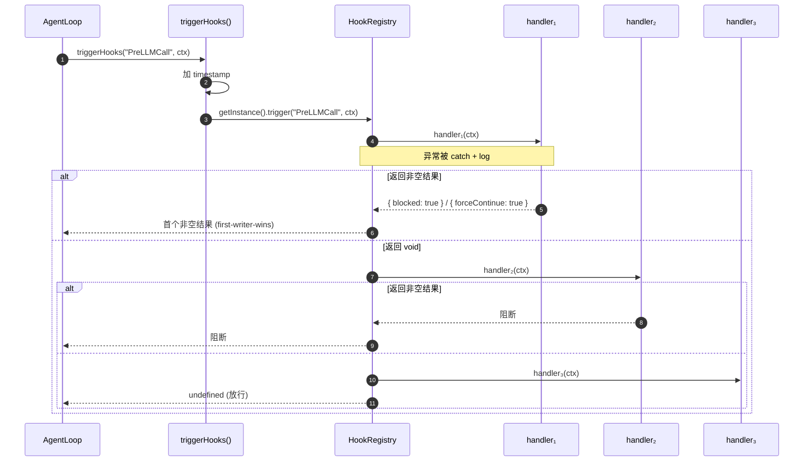

# 08 · 横切关注点

> 本文聚焦**贯穿多个模块**的关注点：日志、Hooks、并发、代理、恢复、安全。这些是"基础设施之基础设施"。

## 1. 日志系统

### 1.1 双 Sink 设计

`src/core/logger.ts` + `src/core/file-log-sink.ts`：

```
emit(level, module, message, args):
  if level === 'debug' && !DEBUG: return
  logSink({level, module, message, args})

logSink = (payload) => {
  consoleSink(payload)    // 控制台
  fileLog.sink(payload)   // 文件
}
```

### 1.2 Debug 模式开关

```
DEBUG = process.env.ZERO_CORE_DEBUG === '1' || process.argv.includes('--debug')
```

非 debug 模式下，`debug` 级别被丢弃；`info` / `warn` / `error` 永远输出。

### 1.3 文件输出

`file-log-sink.ts:67-132`：

- 路径：`~/.zero-core/logs/<YYYY-MM-DD>.log`
- 格式：`2026-06-11T15:00:57.123Z [INFO ] [module] message args`
- 保留：`retentionDays`（默认 7，可在 Settings 配置）
- **启动时清理过期文件**

### 1.4 模块化快捷方法

```typescript
log.agent("Sending prompt:", text)        // → module='agent'
log.loop("Stream event:", event.type)     // → module='loop'
log.ipc("handler:", channel)
log.db("Migrated X rows")
log.tool("Executed:", toolName)
log.mcp("Connected:", serverId)
log.provider("Loaded:", providerName)
log.session("Created:", sessionId)
log.debug("module", ...)   // 仅 debug 模式
log.warn("module", ...)    // 永远输出
log.error("module", ...)   // 永远输出 + console.error
```

### 1.5 架构师评价

- **简单有效**。零依赖，跨平台文件 IO。
- **无结构化日志**：是 plain text，正则解析（见 `log-router.ts:10` `LOG_LINE_RE`）。
- **无日志聚合**：单机本地。
- **无日志采样 / 限流**：高频 log（如每条 tool-call）会全量写盘。

**改进方向**：考虑 pino + pretty-print（结构化 + 高性能）。但当前规模下 logger 完全够用。

### 1.5 日志流转（flowchart）

```mermaid
flowchart LR
    App["App Code<br/>(agent / loop / ipc / db / tool ...)"]
    Logger["logger.ts<br/>log.agent / log.loop / ..."]
    Env{"DEBUG=1?"}
    File["file-log-sink.ts<br/>logs/YYYY-MM-DD.log"]
    Console["console.log/error"]
    Router["log-router.ts<br/>/api/logs/read"]
    UI["LogViewer<br/>(前端组件)"]

    App -->|emit(level, module, msg, args)| Logger
    Logger --> Env
    Env -->|level=debug| Filter1[丢弃]
    Env -->|level=info/warn/error 或 DEBUG=1| Console
    Env -->|level=info/warn/error 或 DEBUG=1| File
    File -->|readFile| Router
    Router -->|HTTP GET /api/logs/read| UI
    UI -->|parseLogLine| Render["渲染带<br/>时间/级别/模块的表格"]

    style Logger fill:#a78bfa,color:#000
    style File fill:#34d399,color:#000
    style UI fill:#60a5fa,color:#000
```

## 2. Hook 系统

### 2.1 三层抽象

```
HookEventName (30 个事件)
   ↓
HookContext (BaseHookContext + 事件特定字段)
   ↓
HookHandler ((ctx) => HookResult | Promise<HookResult>)
   ↓
HookResult = void | { blocked: true, reason } | { forceContinue: true, message }
```

### 2.2 单例注册表

```typescript
class HookRegistry {
  private handlers = new Map<HookEventName, HookHandler[]>();
  static getInstance(): HookRegistry  ← 单例
  register(event, handler): () => void  ← 返回 unsubscribe
  trigger(event, ctx): Promise<HookResult>
    ├─ for each handler:
    │   try { result = await handler(ctx) }
    │   catch { log.error(...) }     ← 永不抛出
    │   if result: return result      ← first-writer-wins
    └─ return undefined
}
```

### 2.3 触发点

`triggerHooks(event, ctx)` 会在 ctx 自动加 `timestamp: Date.now()` 后调用 `HookRegistry.getInstance().trigger()`。



### 2.4 30 个事件分类

| 类别 | 事件 | 触发位置 |
|------|------|----------|
| Session 生命周期 | SessionStart / SessionEnd / Stop / StopFailure / Setup | agent-loop.run / .finalizeStream |
| 用户输入 | UserPromptSubmit | run 开始 |
| 工具 | PreToolUse / PostToolUse / PostToolUseFailure | tool.execute 前/后 |
| 权限 | PermissionRequest / PermissionDenied | （未装载）|
| 子 agent | SubagentStart / SubagentStop | subagent-delegation |
| 压缩 | PreCompact / PostCompact | session.pruneIfNeeded |
| LLM | PreLLMCall / PostTurnComplete | executeStream / turn 收尾 |
| 任务 | TeammateIdle / TaskCreated / TaskCompleted | （未装载）|
| 询问 | Elicitation / ElicitationResult | AskUser 工具 |
| 配置变更 | ConfigChange / CwdChanged / FileChanged | （未装载）|
| Worktree | WorktreeCreate / WorktreeRemove | （未装载）|
| 通知 | Notification | TaskRegistry |
| 提示 | InstructionsLoaded | （未装载）|

**装载状态**：
- ✅ 活跃：`SessionStart / Stop / StopFailure / PostToolUse / PostTurnComplete / PreLLMCall / SubagentStart / SubagentStop`
- ⚠️ 定义但未装载：`PermissionRequest / TeammateIdle / ConfigChange` 等 23 个

### 2.5 已注册的 Handler

| Handler 文件 | 事件 | 副作用 |
|--------------|------|--------|
| `turn-hooks.ts` | SessionStart / Stop / StopFailure | 写入 turns 表 |
| `compression-hooks.ts` | PostTurnComplete | L1 摘要 + L2 记忆节点 |
| `memory-hooks.ts` | PreLLMCall | FTS5 召回，注入 ctx.memoryContext |
| `rag-hooks.ts` | PreLLMCall | KB 检索，注入 ctx.ragContext |
| `durable-hooks.ts` | SessionStart / PostToolUse / Stop / StopFailure | turn_state 检查点 |

**Hook 注册入口**：

- `agent-service.ts:388` `registerDurableHooks(this.db)`
- `runtime/hooks/index.ts:13` `registerAllRuntimeHooks(db)` —— 4 个 runtime hook
- `agent-service.ts` 创建 AgentLoop 时，会通过 hook 系统**间接**触发以上 handler

### 2.6 架构师评价

#### 做对了的

- **first-writer-wins 语义**：适合"PreToolUse 阻断"这类决策。
- **永不抛出**：handler 异常被 catch + log，不影响主流程。
- **timestamp 自动注入**：让 handler 不需要重复获取时间。
- **turn 持久化完全在 hook 中**：`turn-hooks.ts` 是 AgentLoop 与 DB 之间的唯一桥梁。

#### 可以改进的

- **23 个 hook 定义但未实现**：`PermissionRequest`、`Elicitation`、`ConfigChange` 等看起来是规划中的扩展点，但当前没有 UI/handler。需要清理"幽灵 hook"或补充实现。
- **注册时机耦合**：`registerDurableHooks` 在 agent-service 构造时调一次，`registerAllRuntimeHooks` 在 backend 启动时调一次。如果之后想支持"插件式 hook"，需要更通用的注册机制。
- **缺乏优先级**：`handlers.get(event)` 是数组，但调用按注册顺序，无优先级字段。如果两个 handler 都想"阻断 PreToolUse"，第二个永远得不到机会。
- **无异步编排**：`trigger()` 是顺序 await。如果某个 handler 慢，会阻塞后续 handler。对于"PostToolUse 写日志"这种"应该 fire-and-forget"的场景，应该有 `triggerAsync()`。

## 3. 并发与限流

### 3.1 Provider 并发

`runtime/provider-concurrency-manager.ts` + `runtime/concurrency-queue.ts`：

```
ProviderConcurrencyManager
   queues: Map<providerName, ConcurrencyQueue>

ConcurrencyQueue
   active: number
   max: number
   waiters: Waiter[]

acquire(signal?): Promise<void>
   if active < max: ++active; return
   else: enqueue Waiter, listen to AbortSignal
```

**关键设计**：`signal` 让"用户点停止"时可以立即 reject 等待中的请求，而不是排队等。

### 3.2 工具限流

`runtime/tool-rate-limiter.ts:122`（**已在生产路径运行**）：

```
acquire(toolName, {minInterval, maxConcurrent}):
   if both 0: return (zero overhead)
   if canProceed: ++active; return
   else: enqueue Waiter, schedule timer

canProceed = (active < maxConcurrent) AND (now - lastRelease >= minInterval)
```

**设计**：每个工具有独立的"信号量 + 间隔门控"。已在 `agent-loop.ts:53` 导入、`line 117` 实例化，并在 `tool-factory.ts:121-156` 中调用 acquire/release。

### 3.3 Session 状态机

`src/server/session-lifecycle.ts` 定义状态转换：

```
created ──────▶ idle ──────▶ queued
                ▲ │            │
                │ ▼            ▼
              disposed     streaming ─────▶ executing_tools
                ▲ │ ▲                       │
                │ ▼ │                       ▼
              error ◀───────────────────── idle
```

`session-manager.ts:400-411` `transition()` 在每次状态变化时检查 `isValidTransition()`。无效转换会被拒绝并 log。

### 3.4 Session 并发

`AgentService` 支持多会话并发：
- 每个 sessionId 一个 AgentLoop
- 互不阻塞
- 全局 `subscribers: Set<callback>` 用于事件广播

**架构师评价**：并发模型清晰。状态机检查让并发 bug 提早暴露。

## 4. 网络代理

`src/runtime/proxy-manager.ts:30-50`：

```
applyProxy(config):
   if currentAgent: close()
   if enabled && url:
     currentAgent = new ProxyAgent({uri, requestTls: {timeout: 30s}})
     setGlobalDispatcher(currentAgent)  ← undici 全局生效
   else:
     if !defaultAgent: defaultAgent = new Agent()
     setGlobalDispatcher(defaultAgent)
```

**重要细节**：使用 undici 而非 Node.js `globalProxy`。AI SDK (Vercel) 内部使用 fetch → undici，所以代理**对所有 LLM 调用**生效。但对 `node:child_process.execFile` 不生效（这是 `Shell` 工具的限制——需要 `HTTPS_PROXY` 环境变量）。

**架构师评价**：简洁有效。但文档缺失，用户可能困惑"为什么 Shell 工具不走代理"。

## 5. 启动恢复

`src/server/recovery.ts:32-43`：

```
scanIncompleteTurns(sessionDB):
   sessionDb.cleanOldTurnState(24h)     ← 清理过期
   incomplete = sessionDb.getIncompleteTurns()
   log count
   return incomplete
```

调用方：`agent-service.ts` 启动后调用 `recoverIncompleteSessions()`，对每个未完成的 session：

```
recover(sessionId, turnSeq, phase):
   log "Recovering..."
   session.activateSession(...)
   if phase === 'tools_executing': agentService.sendPrompt("", agent, sessionId)
```

**目标**：用户启动应用时，能"接着上次中断的对话"继续。

## 6. 输入预处理

`src/core/input-handler.ts:39-53`：

```
processInput(config, input):
   for [prefix, def] of commands:
     if input === prefix || startsWith(prefix + " "):
       text = def.template.replace('{args}', args)
       return { text, matched: true }
   return { text: input }
```

**用途**：用户输入 `/review foo` 自动展开为 `Please review the following code: foo` 这样的模板（具体模板在配置里）。

**架构师评价**：简洁的"自定义命令"机制，类似 Claude Code 的 slash command。但当前没有 UI 暴露命令列表。

## 7. Provider 适配

`src/core/provider-adapter.ts:39-46`：

```typescript
getProviderAdapter(config, provider): { systemPromptAppend?, maxSystemPromptTokens?, stripThinkingTags? }
```

读 `config.providerAdapter.compatibility[provider]`。**当前似乎未被使用**（grep 不到调用方）。可能是规划中的扩展点。

## 8. 模型元数据注册

`src/core/model-registry.ts`：

- `KNOWN_MODELS`：本地正则回退库（覆盖 30+ 个国内模型）
- `OPENROUTER_URL`：远程查询 OpenRouter `/api/v1/models`
- `CACHE_TTL_MS`：缓存 1 小时
- `enrichModels()`：填充 `contextWindow / maxTokens / multimodal`
- `enrichInBackground()`：异步版，完成后回调保存

**架构师评价**：国内模型覆盖度不错（GLM / Qwen / DeepSeek / Doubao / Hunyuan 等）。但正则匹配是脆的，新模型发布时需手动加。

## 9. 错误分类

`src/runtime/agent-utils.ts:36-48` 8 类错误：
- `timeout` (AbortError / timeout / abort)
- `rate_limit` (429 / too many requests)
- `auth` (401 / 403 / unauthorized)
- `prompt_too_long` (context length / too long)
- `server_error` (5xx)
- `network` (ECONNREFUSED / ENOTFOUND / fetch failed)
- `unknown` (其他)

`isTransientError()` 仅前 4 类（除 auth, prompt_too_long）触发重试。

## 10. Persona 系统

`src/core/persona.ts:28-50` 定义 `CommunicationStyle` 枚举：
- `concise / detailed / friendly / professional / casual / formal / technical / creative / educational / persuasive / humorous / empathetic`

`PERSONA_TEMPLATES`（lines 56-102）：6 个预设角色（Code Helper / Research Analyst / Writing Coach / ...）。

`buildPersonaPrompt(persona)`：根据 style 拼装 system prompt 片段。

**架构师评价**：轻量级的"角色系统"。当前是 inline 配置而非独立存储——`persona` 字段是 `AgentRecord.systemPrompt` 的额外修饰器。

## 11. 安全现状

| 维度 | 当前实现 | 评价 |
|------|----------|------|
| Renderer ↔ Backend | contextBridge + 约 140 个代理通道 + 5 个本地通道 | ✅ 主进程能力仍保持最小暴露；需关注 preload/proxy 契约漂移 |
| 文件路径 | `resolvePath()` 前缀检查 | ⚠️ 默认不限制 workspace |
| Shell | Git Bash 检测 / cmd.exe 翻译 | ❌ 不构成黑名单 |
| WebFetch Cookie | 持久化到 `~/.zero-core/webfetch/cookies.json` | ⚠️ 路径权限需确认 |
| 工具策略 | `blockedTools` / `allowedTools` | ✅ 配置可强制 |
| 工具确认 | `meta.requiresConfirmation` 字段 | ⚠️ 未实现弹窗 |
| 权限请求 | `PermissionRequest` hook | ⚠️ 未注册 handler |
| 代理 | undici ProxyAgent 全局 | ✅ 标准做法 |
| 日志 | 控制台 + 文件，无敏感字段过滤 | ⚠️ 可能泄露 API key |

**架构师建议**：
1. `log-router.ts` 的"redact sensitive"已经在 `assistant-tools.ts:52` 实现，搬到 logger.ts
2. 把 `meta.requiresConfirmation` 真正接通（前端弹窗 + PreToolUse 阻断）
3. 文件路径默认限制 workspace，但允许用户配置"绝对路径白名单"

## 12. 全局横切点清单

| 横切点 | 模块 | 状态 |
|--------|------|------|
| Logging | `core/logger.ts` + `core/file-log-sink.ts` | ✅ 良好 |
| Hooks | `core/hook-registry.ts` + `core/hook-types.ts` | ✅ 良好，23 个 hook 未装载 |
| 并发（Provider） | `runtime/provider-concurrency-manager.ts` | ✅ 良好 |
| 并发（Tool） | `runtime/tool-rate-limiter.ts` | ✅ 已装载运行 |
| 并发（Session） | `server/session-manager.ts` + `session-lifecycle.ts` | ✅ 良好 |
| 代理 | `runtime/proxy-manager.ts` | ✅ 简洁 |
| 恢复 | `server/recovery.ts` | ✅ 良好 |
| 输入命令 | `core/input-handler.ts` | ⚠️ 无 UI 暴露 |
| Provider 适配 | `core/provider-adapter.ts` | ⚠️ 未装载 |
| Persona | `core/persona.ts` | ⚠️ 半成品 |
| 模型元数据 | `core/model-registry.ts` | ✅ 国内模型覆盖好 |
| 错误分类 | `runtime/agent-utils.ts` | ✅ 8 类 |
| 安全 | 分散在多个文件 | ⚠️ 缺统一策略 |
