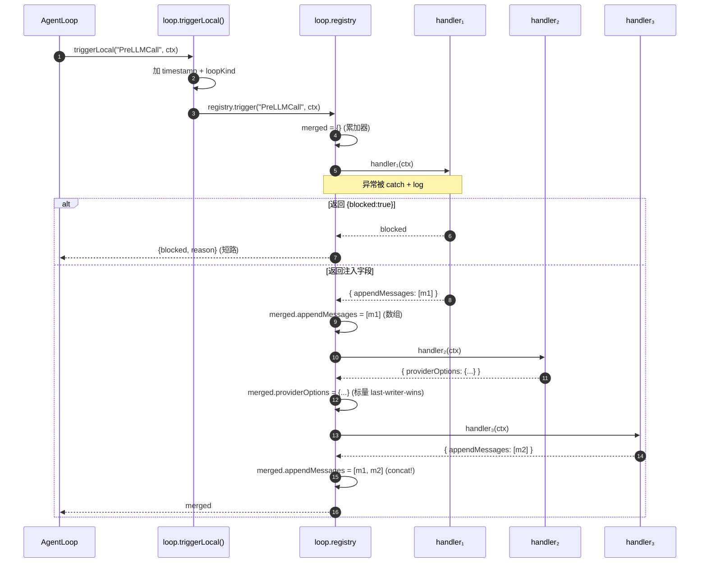
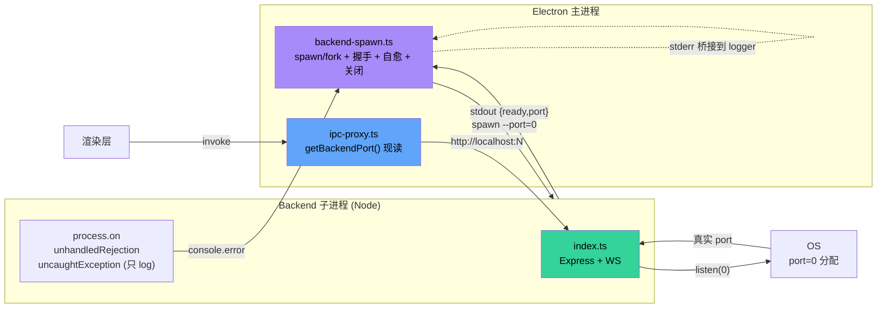

# 08 · 横切关注点

> **⚠ plan-08 cutover 后此文档部分过时** —— Wiki 相关横切关注点已重设计:
>
> - **FS guard**:plan-08 §2 新增 `core/protected-paths.ts` + 重写 `tools/wiki-path-guard.ts`,
>   保护 db/{core,wiki}.db{,-wal,-shm} + backups/{core,wiki} + wiki/.runtime + wiki/。
>   Agent 的 Read/Write/Edit/Grep/Glob/Shell 统一断言;唯一例外是管理备份服务。
> - **备份/恢复**:plan-08 §3 新增 `BackupService` + `/api/wiki-maintain` 路由;
>   SQLite Backup API 在线 snapshot Core/Wiki 各自独立 + manifest sidecar;不复制活跃 DB。
>   readonly 诊断绝不对活跃 DB checkpoint/VACUUM/migration。
> - **Wiki 权限**:从 v0.8 anchor 集合(读写同界)改为 `wikiGrants` + `wikiContext`(plan-05/07);
>   CallerCtx 每次 tool call 快照;Agent Editor 显式编辑 grants/context;publish CAS + audit + 热同步。
> - **Wiki 生命周期**:独立 wiki.db(独立 WAL/checkpoint/backup),与 core.db 解耦。
>   写 Wiki 不触发 Core checkpoint/mtime/WAL 变化。
>
> 下文凡是描述旧 anchor-scope 权限模型 / `wiki-anchor-injection` / `wikiAnchors` /
> `project_wiki` data subscriber 的部分都需对照 [plan-08](../archive/wiki-system-redesign/plan-08-cutover-hardening.md)
> + [plan-05](../archive/wiki-system-redesign/plan-05-agent-runtime-prompt.md) 阅读新实现。
>
> 本文聚焦**贯穿多个模块**的关注点：日志、Hooks、并发、代理、恢复、安全。这些是"基础设施之基础设施"。

## 1. 日志系统

### 1.1 双 Sink 设计

`src/core/logger.ts` + `src/core/file-log-sink.ts`：

```
emit(level, module, message, args):
  if level === 'debug' && !DEBUG: return
  logSink({level, module, message, args})

logSink = (payload) => {
  consoleSink(payload)    // 控制台
  fileLog.sink(payload)   // 文件
}
```

### 1.2 Debug 模式开关

```
DEBUG = process.env.ZERO_CORE_DEBUG === '1' || process.argv.includes('--debug')
```

非 debug 模式下，`debug` 级别被丢弃；`info` / `warn` / `error` 永远输出。

### 1.3 文件输出

`file-log-sink.ts:67-132`：

- 路径：`~/.zero-core/logs/<YYYY-MM-DD>.log`
- 格式：`2026-06-11T15:00:57.123Z [INFO ] [module] message args`
- 保留：`retentionDays`（默认 7，可在 Settings 配置）
- **启动时清理过期文件**

### 1.4 模块化快捷方法

```typescript
log.agent("Sending prompt:", text)        // → module='agent'
log.loop("Stream event:", event.type)     // → module='loop'
log.ipc("handler:", channel)
log.db("Migrated X rows")
log.tool("Executed:", toolName)
log.mcp("Connected:", serverId)
log.provider("Loaded:", providerName)
log.session("Created:", sessionId)
log.debug("module", ...)   // 仅 debug 模式
log.warn("module", ...)    // 永远输出
log.error("module", ...)   // 永远输出 + console.error
```

### 1.5 架构师评价

- **简单有效**。零依赖，跨平台文件 IO。
- **无结构化日志**：是 plain text，正则解析（见 `log-router.ts:10` `LOG_LINE_RE`）。
- **无日志聚合**：单机本地。
- **无日志采样 / 限流**：高频 log（如每条 tool-call）会全量写盘。

**改进方向**：考虑 pino + pretty-print（结构化 + 高性能）。但当前规模下 logger 完全够用。

### 1.5 日志流转（flowchart）

```mermaid
flowchart LR
    App["App Code<br/>(agent / loop / ipc / db / tool ...)"]
    Logger["logger.ts<br/>log.agent / log.loop / ..."]
    Env{"DEBUG=1?"}
    File["file-log-sink.ts<br/>logs/YYYY-MM-DD.log"]
    Console["console.log/error"]
    Router["log-router.ts<br/>/api/logs/read"]
    UI["LogViewer<br/>(前端组件)"]

    App -->|emit(level, module, msg, args)| Logger
    Logger --> Env
    Env -->|level=debug| Filter1[丢弃]
    Env -->|level=info/warn/error 或 DEBUG=1| Console
    Env -->|level=info/warn/error 或 DEBUG=1| File
    File -->|readFile| Router
    Router -->|HTTP GET /api/logs/read| UI
    UI -->|parseLogLine| Render["渲染带<br/>时间/级别/模块的表格"]

    style Logger fill:#a78bfa,color:#000
    style File fill:#34d399,color:#000
    style UI fill:#60a5fa,color:#000
```

## 2. Hook 系统

> step-centric 重命名 + per-loop registry(Step 1A-1C)后,本节是横切视角的简版;**事件全景、
> 触发点、时序图以 [03 §Hook 系统](03-runtime-engine.md#hook-系统) 为权威**。本节聚焦横切关注点:
> registry 的执行模型、observability/workflow 事件的装载状态、注册时机。

### 2.1 三层抽象

```
HookEventName (30 个事件 = 14 agent-execution[step-centric] + 16 observability/workflow)
   ↓
HookContext (BaseHookContext[+loopKind] + 事件特定字段)
   ↓
HookHandler ((ctx) => HookResult | Promise<HookResult>)
   ↓
HookResult = void | { blocked: true, reason } | { forceContinue: true, message }
             | 各事件的数据修改结果(appendMessages / ragContext / providerOptions / ...)
```

### 2.2 per-loop registry(Step 1B)

```typescript
class HookRegistry {
  private handlers = new Map<HookEventName, HookHandler[]>();
  // 可实例化:每个 AgentLoop 持 this.registry = new HookRegistry()
  static getInstance(): HookRegistry  // @deprecated 过渡默认,新代码用 per-loop 实例
  register(event, handler): () => void  ← 返回 unsubscribe
  trigger(event, ctx): Promise<AggregatedHookResult>
    ├─ for each handler (按注册顺序):
    │   try { result = await handler(ctx) }
    │   catch { log.error(...) }     ← 永不抛出
    │   if result?.blocked: return { blocked:true, reason }   ← blocked 短路
    │   for [k,v] of result:
    │     if Array.isArray(v): merged[k] = [...prev, ...v]    ← 数组 concat(Step 1A)
    │     else:               merged[k] = v                   ← 标量 last-writer-wins
    └─ return merged
}
```

> **merge 语义(Step 1A,关键)**:**数组字段跨 handler concat**(`appendMessages`),**标量字段 last-writer-wins**(`ragContext` / `providerOptions` / `memoryContext`)。blocked 短路在任何 handler 返回 `{blocked:true}` 时立即终止。这与 03 §Hook 系统、`hook-registry.ts:101-111` 一致。

### 2.3 触发点

每个 AgentLoop 用 `loop.triggerLocal(event, ctx)` 在**自己的 registry** 上触发(自动加 `timestamp` + `loopKind`)。agent-service 的 `fireSessionStart` / `fireSessionClose` 在 loop build/destroy 时触发 Session 级事件。全局 `triggerHooks()` wrapper 仍存在(走 `getInstance()`),仅供未迁移代码/测试用。



### 2.4 事件装载状态(step-centric 14 + observability/workflow 16)

agent-execution 的 14 个事件(step-centric 命名,Step 1C)的触发点 + handler 见 [03 §Hook 系统](03-runtime-engine.md#事件--触发点--主要-handler-映射step-centric-14-hook)。本表只列**observability/workflow 16 个事件**的装载状态(这些未在 Step 1C 重命名范围内,代码触发点未变):

| 类别 | 事件 | 是否实际触发 | 备注 |
|------|------|--------------|------|
| 压缩 | `PreCompact` / `PostCompact` | ✅ | `session.ts`(压缩引擎内部) |
| 子 agent | `SubagentStart` / `SubagentStop` | ✅ | `subagent-delegator.ts`(同步/后台委派) |
| 任务 | `TaskCreated` / `TaskCompleted` | ✅ | `subagent-delegator.ts`(**活跃**,非占位) |
| 任务 | `TeammateIdle` | ⚠️ **仅定义,零触发** | 占位 |
| 询问 | `Elicitation` / `ElicitationResult` | ✅ | `tools/ask-user.ts` |
| 通知 | `Notification` | ✅ | `notification-hooks.ts`(main-only)内部触发 |
| 权限 | `PermissionRequest` / `PermissionDenied` | ⚠️ **仅定义,零触发** | 占位 |
| 配置变更 | `ConfigChange` / `CwdChanged` / `FileChanged` | ⚠️ **仅定义,零触发** | 占位 |
| Worktree | `WorktreeCreate` / `WorktreeRemove` | ⚠️ **仅定义,零触发** | 占位 |
| 提示 | `InstructionsLoaded` | ⚠️ **仅定义,零触发** | 占位 |

> **同名陷阱**:`TaskCreated` / `TaskCompleted` 是 v0.8 子 Agent 委派的活跃事件,**不是** `TeammateIdle` 同类的占位。

### 2.5 已注册的 Handler(per-loop,registerHooksForLoop)

> v0.8 同步:`memory-hooks.ts` / `requirement-hooks.ts` 已退役(见 03 §5.5)。下表是
> `src/runtime/hooks/` + `src/server/*-hooks.ts` 现存 handler 的**全量**清单,由
> `registerHooksForLoop(registry, loopKind, deps)` 注册到**本 loop 的 registry**。

**Shared(main + delegated)**:

| Handler 文件 | 事件 | 副作用 |
|--------------|------|--------|
| `turn-hooks.ts` | TurnStart / StepEnd / PostToolUse / PostToolUseFailure / TurnEnd / TurnError | 写 turns 表 step 行(TurnStart user / StepEnd assistant / PostToolUse 即时落库 / TurnEnd safety-net + 闭合) |
| `rag-hooks.ts` | PreLLMCall | KB 检索,注入 ctx.ragContext |
| `provider-options-hooks.ts` | PreLLMCall | 按 provider 注入 ctx.providerOptions |
| `compression-hooks.ts` | StepEnd | L1 摘要 + L2 记忆节点(从 PostTurnComplete 迁来,Step 3A) |
| `todo-cleanup-hooks.ts` | StepEnd | 清理已完成 todo(从 PostTurnComplete 迁来,Step 3B) |
| `extraction-hooks.ts` | StepEnd(等) | v0.8 M5:双提取者增量写 wiki(从 PostTurnComplete 迁来) |
| `workflow-context-hook.ts` | PreLLMCall | work session 的 T2 项目上下文注入 |
| `durable-hooks.ts`(server/) | PostToolUse / TurnEnd / TurnError 等 | turn_state 检查点(phase + last_completed_step_seq) |
| `tool-execution-hooks.ts`(server/) | PostToolUse 等 | 工具执行持久化追踪 |

**main only**:

| Handler 文件 | 事件 | 副作用 |
|--------------|------|--------|
| `notification-hooks.ts` | PreLLMCall | 后台任务结果回灌为 user 消息(注册优先,避免被覆盖) |
| `input-queue-hooks.ts` | StepStart | insert_now 排队输入注入下一 step |
| `metrics-hooks.ts`(server/) | usage 流事件 | token/成本 metrics(粗估;真实 usage 走 metrics-events.ts 流事件) |

**delegated only**:

| Handler 文件 | 事件 | 副作用 |
|--------------|------|--------|
| `task-control-hooks.ts` | StepStart | request_finish 控制消息投递(查 delegated_tasks 行) |

**注册入口**(agent-service 构造 main loop / subagent-delegator 构造 delegated loop 时):

```typescript
// agent-service.ts:createLoopForSession / subagent-delegator.ts
const loop = new AgentLoop(...);
registerHooksForLoop(loop.registry, "main" /* 或 "delegated" */, this.buildHookDeps());
void this.fireSessionStart(loop, agentId, sessionId, "main");  // 实例生命周期
```

注册顺序:`turn → tool-execution → durable → rag → providerOptions → compression → todoCleanup → extraction → workflow-context → [main] notification → input-queue → metrics → [delegated] task-control`。
PreLLMCall 之间标量字段 last-writer-wins / 数组 concat(见 03 §Hook 系统)—— 改顺序前要评估 merge 影响。

### 2.6 架构师评价

#### 做对了的

- **per-loop registry(Step 1B)**:handler 只在本 loop 触发,不再跨 loop(含子 agent loop)。消除了旧版"靠 sessionId 自行过滤"的隐式契约。`loopKind` 仍作自省字段保留。
- **数组 concat + 标量 last-writer-wins(Step 1A)**:让 appendMessages 类注入可叠加(控制消息 + 排队输入 + RAG),标量字段仍按注册顺序隐式协调。
- **blocked 短路**:PreToolUse 阻断的唯一机制,立即终止。
- **永不抛出**:handler 异常被 catch + log,不影响主流程。
- **step-only 持久化 + per-tool 即时落库**:turn-hooks 是 AgentLoop 与 turns 表之间的唯一桥梁;Step 2B 的即时落库让 case2 恢复(副作用已提交但 StepEnd 未到)可行。

#### 可以改进的

- **9 个 observability/workflow hook 在类型里定义但代码零触发**(§2.4):`TeammateIdle / PermissionRequest/Denied / ConfigChange / CwdChanged / FileChanged / WorktreeCreate/Remove / InstructionsLoaded`。这些是参考 Claude Code 27 事件点提前占位的扩展点,既无触发也无 handler。要么清理,要么补实现 —— 留着会让读者以为已经在跑。
- **`PostLLCall` 是预留空缝**:模型返回与工具执行之间的观测点,骨架已就位但 Step 2C 未接线 —— 接与否需明确用例。
- **缺乏优先级**:`handlers.get(event)` 是数组,调用按注册顺序,无优先级字段。如果两个 handler 都想"阻断 PreToolUse",第二个永远得不到机会。
- **无异步编排**:`trigger()` 是顺序 await。如果某个 handler 慢,会阻塞后续 handler。对于"PostToolUse 写日志"这种"应该 fire-and-forget"的场景,应该有 `triggerAsync()`。

## 3. 并发与限流

### 3.1 Provider 并发

`runtime/provider-concurrency-manager.ts` + `runtime/concurrency-queue.ts`：

```
ProviderConcurrencyManager
   queues: Map<providerName, ConcurrencyQueue>

ConcurrencyQueue
   active: number
   max: number
   waiters: Waiter[]

acquire(signal?): Promise<void>
   if active < max: ++active; return
   else: enqueue Waiter, listen to AbortSignal
```

**关键设计**：`signal` 让"用户点停止"时可以立即 reject 等待中的请求，而不是排队等。

### 3.2 工具限流

`runtime/tool-rate-limiter.ts:122`（**已在生产路径运行**）：

```
acquire(toolName, {minInterval, maxConcurrent}):
   if both 0: return (zero overhead)
   if canProceed: ++active; return
   else: enqueue Waiter, schedule timer

canProceed = (active < maxConcurrent) AND (now - lastRelease >= minInterval)
```

**设计**：每个工具有独立的"信号量 + 间隔门控"。已在 `agent-loop.ts:53` 导入、`line 117` 实例化，并在 `tool-factory.ts:121-156` 中调用 acquire/release。

### 3.3 Session 状态机

`src/server/session-lifecycle.ts` 定义状态转换：

```
created ──────▶ idle ──────▶ queued
                ▲ │            │
                │ ▼            ▼
              disposed     streaming ─────▶ executing_tools
                ▲ │ ▲                       │
                │ ▼ │                       ▼
              error ◀───────────────────── idle
```

`session-manager.ts:400-411` `transition()` 在每次状态变化时检查 `isValidTransition()`。无效转换会被拒绝并 log。

### 3.4 Session 并发

`AgentService` 支持多会话并发：
- 每个 sessionId 一个 AgentLoop
- 互不阻塞
- 全局 `subscribers: Set<callback>` 用于事件广播

**架构师评价**：并发模型清晰。状态机检查让并发 bug 提早暴露。

## 4. 网络代理

`src/runtime/proxy-manager.ts:30-50`：

```
applyProxy(config):
   if currentAgent: close()
   if enabled && url:
     currentAgent = new ProxyAgent({uri, requestTls: {timeout: 30s}})
     setGlobalDispatcher(currentAgent)  ← undici 全局生效
   else:
     if !defaultAgent: defaultAgent = new Agent()
     setGlobalDispatcher(defaultAgent)
```

**重要细节**：使用 undici 而非 Node.js `globalProxy`。AI SDK (Vercel) 内部使用 fetch → undici，所以代理**对所有 LLM 调用**生效。但对 `node:child_process.execFile` 不生效（这是 `Shell` 工具的限制——需要 `HTTPS_PROXY` 环境变量）。

**架构师评价**：简洁有效。但文档缺失，用户可能困惑"为什么 Shell 工具不走代理"。

## 5. 启动恢复

`src/server/recovery.ts:32-43`：

```
scanIncompleteTurns(sessionDB):
   sessionDb.cleanOldTurnState(24h)     ← 清理过期
   incomplete = sessionDb.getIncompleteTurns()
   log count
   return incomplete
```

调用方：`agent-service.ts` 启动后调用 `recoverIncompleteSessions()`，对每个未完成的 session：

```
recover(sessionId, turnSeq, phase):
   log "Recovering..."
   session.activateSession(...)
   if phase === 'tools_executing': agentService.sendPrompt("", agent, sessionId)
```

**目标**：用户启动应用时，能"接着上次中断的对话"继续。

## 6. 输入预处理

`src/core/input-handler.ts:39-53`：

```
processInput(config, input):
   for [prefix, def] of commands:
     if input === prefix || startsWith(prefix + " "):
       text = def.template.replace('{args}', args)
       return { text, matched: true }
   return { text: input }
```

**用途**：用户输入 `/review foo` 自动展开为 `Please review the following code: foo` 这样的模板（具体模板在配置里）。

**架构师评价**：简洁的"自定义命令"机制，类似 Claude Code 的 slash command。但当前没有 UI 暴露命令列表。

## 7. Provider 适配

`src/core/provider-adapter.ts:39-46`：

```typescript
getProviderAdapter(config, provider): { systemPromptAppend?, maxSystemPromptTokens?, stripThinkingTags? }
```

读 `config.providerAdapter.compatibility[provider]`。**当前似乎未被使用**（grep 不到调用方）。可能是规划中的扩展点。

## 8. 模型元数据注册

`src/core/model-registry.ts`：

- `KNOWN_MODELS`：本地正则回退库（覆盖 30+ 个国内模型）
- `OPENROUTER_URL`：远程查询 OpenRouter `/api/v1/models`
- `CACHE_TTL_MS`：缓存 1 小时
- `enrichModels()`：填充 `contextWindow / maxTokens / multimodal`
- `enrichInBackground()`：异步版，完成后回调保存

**架构师评价**：国内模型覆盖度不错（GLM / Qwen / DeepSeek / Doubao / Hunyuan 等）。但正则匹配是脆的，新模型发布时需手动加。

## 9. 错误分类

`src/runtime/agent-utils.ts:36-48` 8 类错误：
- `timeout` (AbortError / timeout / abort)
- `rate_limit` (429 / too many requests)
- `auth` (401 / 403 / unauthorized)
- `prompt_too_long` (context length / too long)
- `server_error` (5xx)
- `network` (ECONNREFUSED / ENOTFOUND / fetch failed)
- `unknown` (其他)

`isTransientError()` 仅前 4 类（除 auth, prompt_too_long）触发重试。

## 10. Persona 系统

`src/core/persona.ts:28-50` 定义 `CommunicationStyle` 枚举：
- `concise / detailed / friendly / professional / casual / formal / technical / creative / educational / persuasive / humorous / empathetic`

`PERSONA_TEMPLATES`（lines 56-102）：6 个预设角色（Code Helper / Research Analyst / Writing Coach / ...）。

`buildPersonaPrompt(persona)`：根据 style 拼装 system prompt 片段。

**架构师评价**：轻量级的"角色系统"。当前是 inline 配置而非独立存储——`persona` 字段是 `AgentRecord.systemPrompt` 的额外修饰器。

## 11. 安全现状

| 维度 | 当前实现 | 评价 |
|------|----------|------|
| Renderer ↔ Backend | contextBridge + 约 120+ 个代理通道(按 26 域分块,见 07 §2.2) + 17 个 LOCAL_CHANNELS + 3 个 INVOKE_BUT_NOT_PROXIED | ✅ 主进程能力仍保持最小暴露;ROUTE_MAP 从 ipc-proxy.ts 源码正则派生(非手写),契约漂移有测试护栏 |
| 文件路径 | `resolvePath()` 前缀检查 | ⚠️ 默认不限制 workspace |
| Shell | Git Bash 检测 / cmd.exe 翻译 | ❌ 不构成黑名单 |
| WebFetch Cookie | 持久化到 `~/.zero-core/webfetch/cookies.json` | ⚠️ 路径权限需确认 |
| 工具策略 | `blockedTools` / `allowedTools` | ✅ 配置可强制 |
| 权限请求 | `PermissionRequest` hook | ⚠️ 未注册 handler |
| 代理 | undici ProxyAgent 全局 | ✅ 标准做法 |
| 日志 | 控制台 + 文件，无敏感字段过滤 | ⚠️ 可能泄露 API key |
| Wiki 读写 | anchor 集合 = 读边界 = 写边界(store 层 `assertNodeInAnchorScope` 强制) | ✅ 读写同界;zero/全局会话锚全局根→整树可写 |
| 子进程输出编码 | `decodeShellBuffer` 先 fatal-UTF-8 校验、失败回退 GBK(iconv-lite) | ✅ 修 Windows 原生命令中文乱码 |

**架构师建议**：
1. `log-router.ts` 的"redact sensitive"已经在 `assistant-tools.ts:52` 实现，搬到 logger.ts
2. 文件路径默认限制 workspace，但允许用户配置"绝对路径白名单"

## 12. 后端子进程生命周期与全局错误兜底(v0.8)

> v0.8 新增。zero-core 的 Express 后端不是跑在 Electron 主进程里,而是由主进程
> (`src/main/index.ts`)通过 `src/main/backend-spawn.ts` 拉起的**独立 Node 子进程**
> (开发态 `spawn(node)` / 打包态 `fork()`)。本节讲清这条进程边界的握手、自愈、优雅关闭,
> 以及 backend 进程内部的两个 `process.on` 全局兜底 —— 这些是 v0.8 之前散落在源码、
> 文档里没集中讲过的横切关注点。

### 12.1 为什么后端是子进程

better-sqlite3 是 native 模块,**ABI 必须与宿主 Node 匹配**。Electron 主进程跑在
Electron ABI 上,而后端依赖的 better-sqlite3 在两种环境各有一份编译产物:

- **开发态**:`npm install` 编译给**系统 Node** → 必须用系统 `node` spawn 后端
  (`backend-spawn.ts:72`),否则 ABI 不匹配直接崩。
- **打包态**:electron-builder `npmRebuild=true` 把 better-sqlite3 重编给 **Electron ABI**
  → 用 `fork()`(`backend-spawn.ts:66`),用户机器无需装 Node。

这条边界决定了:**主进程不能直接 `import` 后端代码**(会触发 ABI 冲突),所有后端调用必须走
HTTP/WS(`http://localhost:<backendPort>`),这也是 `ipc-proxy.ts` 存在的根本原因
(见 07 §2.5 ①)。

### 12.2 启动握手协议

```
主进程                       backend 子进程
   │
   │  spawn/fork(dist/backend.js --port=0)
   │───────────────────────────────────────▶│
   │                                         │  bind 0 → OS 分配真实 port
   │  ◀──────────────── stdout: JSON ────────│  {"type":"ready","port":34567}
   │  解析 port,记入 _handle                  │
   │  resolve(BackendHandle)                 │
   │                                         │
   │  30s 未收到 ready → child.kill() + reject │
```

要点(`backend-spawn.ts:56-132`):

- `--port=0` 让 OS 分配空闲端口,backend 在 `server.listen(0)` 后把**真实 port** 通过 stdout
  以 **JSON 行** `{"type":"ready","port":N}` 回传 —— 主进程不预设端口,避免冲突。
- **stdout 是协议通道**:backend 任何非 JSON 的 stdout 输出都会被握手解析器忽略
  (`catch { /* not JSON, ignore */ }`),所以 backend 的日志必须走 stderr 或 logger,
  不能直接 `console.log`(否则握手解析噪音)。这正是 backend 用 `console.error`/logger 的原因。
- **30s 就绪超时**:`backend-spawn.ts:81-86`,冷启动慢机器的兜底;超时杀进程并 reject,
  主进程的 `app.whenReady` 链会拿到错误。
- backend 的 **stderr 被主进程转投到共享 logger**(`backend-spawn.ts:105-115`):因为 backend
  硬崩溃时自己的 logger 可能来不及 flush,只有把 stderr 也写进 `~/.zero-core/logs/<date>.log`
  才能在 detached 启动(无 terminal)时留下尸检信息。

### 12.3 自愈:意外退出自动重启

```typescript
// backend-spawn.ts:117-130
child.on("exit", (code) => {
  if (!_shuttingDown && !ready) {
    // 启动期崩 → reject,让主进程知道
    reject(new Error(`Backend exited with code ${code} before becoming ready`));
  } else if (!_shuttingDown) {
    // 运行期意外退出 → 自动 spawnBackend() 重启
    logger.warn("backend", `process exited unexpectedly with code ${code}, restarting...`);
    _handle = null;
    spawnBackend().catch(...);
  }
});
```

设计要点:

- **`_shuttingDown` flag 防竞争**:正常 `shutdownBackend()` 期间子进程也会 exit,但此时
  `_shuttingDown=true`,不会触发重启 —— 避免关闭与自愈打架。
- **重启计数 + 指数退避**(master commit 843e28a 已实现):60s 滑动窗口内最多重启 5 次;
  每次重启前等待指数退避(1s → 30s 上限,翻倍增长)。超过阈值后 `dialog.showErrorBox`
  通知用户"backend 反复崩溃,已停止自动重启",并停止自愈 —— 不再静默、不再无限重启。
- **端口会变**:重启后 OS 重新分配端口,`getBackendPort()` 读的是新 `_handle.port`,
  `ipc-proxy.ts` 每次都现读,所以前端无感 —— 但任何缓存了端口的代码都会失效(目前没有这种缓存)。

### 12.4 优雅关闭三段式

`shutdownBackend()`(`backend-spawn.ts:134-164`)按"越往后越暴力"的顺序:

1. **stdin 写 `{"type":"shutdown"}`** —— 让 backend 自己 `server.close()` 干净收尾
   (关 WS 连接、flush WAL、跑 onClose)。
2. **等 5s,超时发 `SIGTERM`** —— POSIX 软终止信号,backend 还能 catch 做最后清理。
3. **再等 3s,发 `SIGKILL`** —— 不可 catch,内核直接回收。

这套兜底是因为 backend 有 **better-sqlite3 WAL**:粗暴 kill 可能留下未 checkpoint 的 WAL
(见 `feedback-sessions-db-readonly.md` 的数据丢失陷阱),所以优先给 backend 自己关闭的机会。
但 Windows 上 **`SIGTERM`/`SIGKILL` 等价于 `TerminateProcess`**(无信号语义),所以 Windows
用户实际上只有"stdin shutdown → 5s → 强杀"两段有效。

### 12.5 Backend 进程内的全局错误兜底

`src/server/index.ts:86-96` 顶层挂了两个 `process.on`:

```typescript
process.on("unhandledRejection", (reason) => {
  const msg = reason instanceof Error ? reason.message : String(reason);
  console.error(`[server] Unhandled rejection: ${msg}`);
  if (stack) console.error(stack);
});

process.on("uncaughtException", (err) => {
  console.error(`[server] Uncaught exception: ${err.message}`);
  if (err.stack) console.error(err.stack);
});
```

**重要语义**:`unhandledRejection` handler **只 log**(让 Node 默认的 rejection 警告降级为可控 log);
`uncaughtException` handler 是 **log + `process.exit(1)`**。Node 默认行为是 uncaughtException
触发进程退出 —— 这里保留 log 然后显式 `exit(1)`,把退出动作交给 §12.3 的自愈路径接管。

设计取舍:

- ✅ **可用性优先**:unhandledRejection 不致命,吞掉后继续服务不打断并发 session。
- ✅ **脏状态兜底**:uncaughtException 意味着 JS 运行时状态不可预测,继续跑可能产生脏数据;
  退出后由 §12.3 的自愈重启路径接管(60s 内 5 次 + 指数退避,见 master commit 843e28a),
  短暂中断后恢复干净进程。之前 "**open question**: 是否应在 uncaughtException 后主动 exit
  让自愈接管" **已解决**(早已实现 exit,文档此前误写为"只 log")。

由于这两个 handler 写的是 `console.error` 而非 logger,在 detached 启动时这些兜底日志
**只到 backend 自己的 stderr** —— 但 §12.2 已把 backend stderr 桥接到主进程 logger,所以
最终还是会进 `~/.zero-core/logs/<date>.log`,链路是通的。

### 12.6 端口暴露与 ipc-proxy 的关系

`getBackendPort()`(`backend-spawn.ts:166-168`)是主进程持有 backend 端口的唯一出口,
`ipc-proxy.ts` 每次代理渲染层 invoke 时现读:

```
渲染层 invoke("agent:list")
  → preload 透传
  → 主进程 ipc-proxy
  → http://localhost:<getBackendPort()>/api/agents
  → backend Express router
```

所以从渲染层看,backend 是"一个永远在 localhost 上、端口透明"的服务;从主进程看,backend 是
"一个可重启的子进程";从 backend 自己看,它就是一个普通 Express app,完全不感知自己被 spawn。
这种**进程边界对 backend 透明**的设计让 backend 代码可以在不 spawn 的测试环境里直接跑
(`ZERO_CORE_TEST_FIXTURE` 模式,见 E2E 测试基础设施)。



### 12.7 架构师评价

**做对了的**:

- **ABI 隔离**:dev/packaged 两套 spawn 策略正确解决了 better-sqlite3 的 ABI 痛点(见
  `feedback-native-module-rebuild.md` 的历史教训)。
- **握手用 stdout JSON 行**:简单、无额外依赖、跨 fork/spawn 都工作。
- **stderr 桥接到 logger**:detached 启动也能留尸检信息,这是 v0.8 补的关键细节。
- **端口现读**:无缓存 → 自愈重启换端口前端无感。
- **自愈退避**(master commit 843e28a):60s 窗口 + 5 次上限 + 指数退避(1s→30s) + 超阈值
  `dialog.showErrorBox` 通知用户并停止自愈 —— 解决了"无限静默重启"的开放问题。
- **uncaughtException 触发自愈**:backend 内部 `process.exit(1)` 让 §12.3 路径接管,
  避免脏状态续跑;§12.5 的 open question 已解决。

**可以改进的**:

- **Windows 上 SIGTERM/SIGKILL 无语义**:三段式关闭在 Windows 退化成两段,文档应明确标注
  (避免开发者误以为 SIGTERM handler 能在 Windows 上跑)。
- **stdout 协议通道与日志冲突**:虽然 backend 现在用 stderr/logger,但没有强制约束 ——
  任何人不小心 `console.log` JSON 行就会被握手解析器吞掉。建议在 backend 入口 redirect stdout
  或加 lint 规则。

## 13. 全局横切点清单

| 横切点 | 模块 | 状态 |
|--------|------|------|
| Logging | `core/logger.ts` + `core/file-log-sink.ts` | ✅ 良好 |
| Hooks | `core/hook-registry.ts` + `core/hook-types.ts` | ✅ 良好(step-centric 14 + observability/workflow 16;9 个 observability/workflow 事件零触发占位,见 §2.4) |
| 并发（Provider） | `runtime/provider-concurrency-manager.ts` | ✅ 良好 |
| 并发（Tool） | `runtime/tool-rate-limiter.ts` | ✅ 已装载运行 |
| 并发（Session） | `server/session-manager.ts` + `session-lifecycle.ts` | ✅ 良好 |
| 代理 | `runtime/proxy-manager.ts` | ✅ 简洁 |
| 恢复 | `server/recovery.ts` | ✅ 良好 |
| 输入命令 | `core/input-handler.ts` | ⚠️ 无 UI 暴露 |
| Provider 适配 | `core/provider-adapter.ts` | ⚠️ 未装载 |
| Persona | `core/persona.ts` | ⚠️ 半成品 |
| 模型元数据 | `core/model-registry.ts` | ✅ 国内模型覆盖好 |
| 错误分类 | `runtime/agent-utils.ts` | ✅ 8 类 |
| 安全 | 分散在多个文件 | ⚠️ 缺统一策略 |
| 后端子进程生命周期 | `main/backend-spawn.ts` | ✅ v0.8:握手 + 自愈(60s/5次+指数退避) + 三段式关闭(见 §12) |
| 全局错误兜底 | `server/index.ts:86-96` process.on | ✅ uncaughtException log + exit(1) 触发自愈;unhandledRejection 只 log(见 §12.5) |
