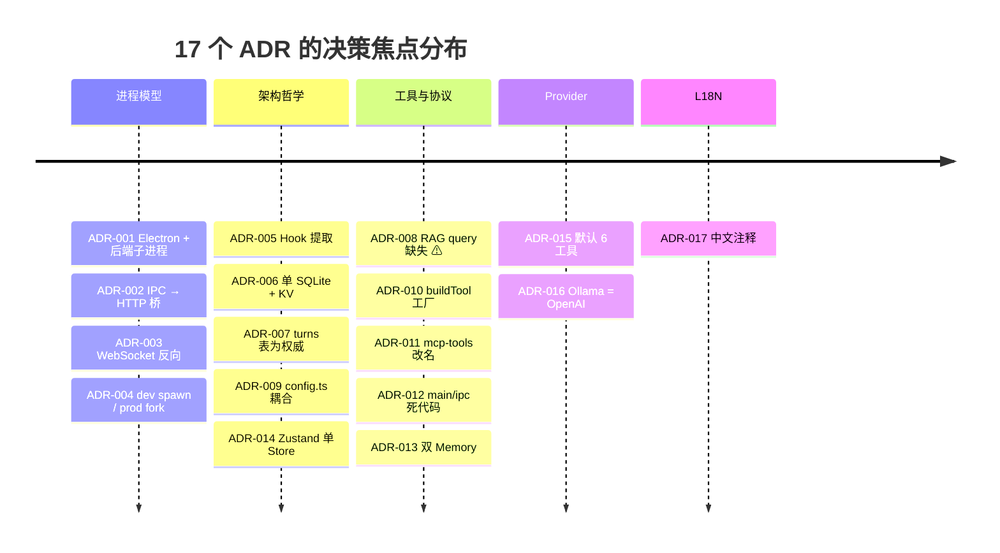
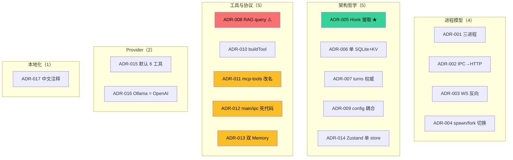

# 09 · 扩展点与架构决策记录（ADR）

> 本文给出 Zero-Core 的显式扩展点 + 关键架构决策（ADR）。每个 ADR 都是从代码反向推导，包含 Context / Decision / Alternatives / Consequences 四要素。

## 1. 显式扩展点

### 1.1 Hook 系统（最丰富）

30 个 `HookEventName` 事件点（详见 `core/hook-types.ts`）。要扩展行为，最自然的方式是注册一个 hook handler：

```typescript
HookRegistry.getInstance().register("PreToolUse", async (ctx) => {
  if (ctx.toolName === "Shell" && ctx.args.command?.includes("rm -rf /")) {
    return { blocked: true, reason: "Destructive command blocked" };
  }
});
```

**当前活跃 hook 装载点**：

| 文件 | 装载时机 | 注册的事件 |
|------|----------|------------|
| `server/durable-hooks.ts` | `agent-service.ts` 构造时 | SessionStart / PostToolUse / Stop / StopFailure |
| `runtime/hooks/turn-hooks.ts` | `registerAllRuntimeHooks(db)` | SessionStart / Stop / StopFailure |
| `runtime/hooks/compression-hooks.ts` | 同上 | PostTurnComplete |
| `runtime/hooks/memory-hooks.ts` | 同上 | PreLLMCall |
| `runtime/hooks/rag-hooks.ts` | 同上 | PreLLMCall |

### 1.2 工具（最直接）

新增一个工具 = 在 `runtime/tools/` 加一个 `.ts` 文件 + 在 `runtime/tools/index.ts` 的 `ALL_TOOLS` 中注册：

```typescript
export const myTool = buildTool({
  name: "MyTool",
  description: "...",
  prompt: "...",
  meta: { category: "assistant", isReadOnly: true },
  inputSchema: z.object({ ... }),
  execute: async (args, ctx) => { ... },
});

// 在 ALL_TOOLS 里加： MyTool: myTool,
```

前端自动从 `ToolRegistry` 拉取，无需改前端代码。

### 1.3 LLM Provider

`runtime/provider-factory.ts:120-160` `getOrCreateProvider()`：

```typescript
case "my-provider":
  const { createMyProvider } = await import("@my-provider/sdk");
  factory = createMyProvider({ apiKey: config.apiKey, baseURL: config.baseUrl });
  break;
```

加一个 case + 加一个依赖。

### 1.4 嵌入 Provider

`server/kb-embeddings.ts` `createEmbeddingProvider(provider, {baseUrl, apiKey, model})`。

### 1.5 搜索 Provider

`runtime/tools/web-search.ts:250-269` `createSearchProvider(config)`：
- DuckDuckGo（默认）
- SearXNG（自托管）
- SerpAPI（商业）
- BraveSearch

新增搜索后端 = 实现 `SearchProvider` 接口 + 注册。

### 1.6 IPC Channel

新增 IPC channel = 三处改动：
1. `src/shared/preload-types.ts` `WindowApi` 接口加方法
2. `src/main/ipc-proxy.ts` `R` 映射表加一行
3. 后端 `src/server/<x>-router.ts` 加 Express 路由

### 1.7 SQLite 表

`src/server/sqlite-store.ts` 通用 CRUD 已经支持任意表。新增表：
1. 定义 `COLUMNS: ColumnDef[]`
2. `new SqliteStore<T>(db, "table_name", COLUMNS)`
3. 包一层 domain-specific store（如 `agent-store.ts` 的模式）

### 1.8 Persona / 角色

`src/core/persona.ts:56-102` `PERSONA_TEMPLATES`：增删模板即可。

### 1.9 KB / RAG

注册 KB → KB 配置 Provider/Model → 启动 ingest → tool `getRagContext` 自动接入。

---

## 2. 架构决策记录（ADR）

### 2.0 17 个 ADR 总览（timeline + 分类）





**关键标记**：
- 🟢 **ADR-005 Hook 提取** — 项目**最成功**的架构改进
- 🔴 **ADR-008 RAG query 缺失** — 当前**最严重**的设计 bug
- 🟠 **ADR-011/012/013** — 三个"清理债"决策待落地

### ADR-001 · 进程模型：Electron + 后端子进程

### ADR-001 · 进程模型：Electron + 后端子进程

**Context**：LLM 调用是长连接 + 流式；UI 需要快速响应；SQLite 是同步阻塞。

**Decision**：Electron 三进程（Main / Renderer / Backend），后端用独立 Node.js 子进程承载 LLM 与数据库。

**Alternatives**：
- 单一 Node.js 进程：UI 渲染阻塞数据库 IO。
- 单一 Electron Renderer 进程承担后端：chromium 进程崩溃 = 全部崩溃。
- Web service 后端：网络抖动、多机部署复杂度。

**Consequences**：
- ✅ 进程隔离：UI 崩溃不影响后端；后端崩溃可自动重启。
- ✅ 多 LLM 流式并行互不阻塞 UI。
- ❌ 进程间通信成本：IPC + HTTP + WebSocket 三层桥。
- ❌ 部署复杂：必须打包 electron-builder。

**Code evidence**：`main/index.ts:191-212`、`backend-spawn.ts:27-91`。

---

### ADR-002 · IPC 通道通过 HTTP 桥接到后端

**Context**：Electron 的 IPC 是同步请求-响应模式，与后端的 REST 风格一致。

**Decision**：所有 49 个 IPC 通道（除 3 个本地）通过 `ipc-proxy.ts` 翻译为对 `http://localhost:<port>/api/...` 的 HTTP 请求。

**Alternatives**：
- 直接在 main 进程跑后端逻辑：把 main 进程变成上帝对象。
- 用 MessagePort + JSON 序列化：不利于调试。

**Consequences**：
- ✅ 后端可以独立测试（用 curl 直接打）。
- ✅ 后端逻辑与 main 进程解耦，可单独部署。
- ✅ 47 个通道走统一路径。
- ❌ 进程间多一跳，约 2-10ms 延迟。
- ❌ 需要起 HTTP server + 端口管理。

**Code evidence**：`main/ipc-proxy.ts:11-153`、`main/index.ts:202-207`。

---

### ADR-003 · 后端用 WebSocket 反向推送流式事件

**Context**：LLM 流式输出需要长连接推送；HTTP 短轮询低效。

**Decision**：后端启动 WebSocketServer 在 `/ws`，main 通过 `ws://localhost:<port>/ws` 订阅，事件转发为 IPC 事件到 renderer。

**Alternatives**：
- SSE（Server-Sent Events）：单向，但浏览器侧可用。
- Long Polling：老式但可靠。
- 仅 IPC 主动拉：流式体验差。

**Consequences**：
- ✅ 双向 + 低延迟 + 自动重连。
- ✅ 事件类型复用 IPC envelope。
- ❌ 浏览器端不能用（Electron 不受限）。
- ❌ 重连期间事件丢失（无缓存）。

**Code evidence**：`main/ipc-proxy.ts:214-261`、`server/index.ts` (startServer)。

---

### ADR-004 · 子进程启动策略：dev spawn node / prod fork electron

**Context**：`better-sqlite3` 是 native binding，需要 ABI 匹配 Electron 的 Node.js。

**Decision**：
- **开发模式**：`spawn("node", ...)` 用系统 Node.js，避免 Electron ABI 与 better-sqlite3 不匹配。
- **打包模式**：`fork(...)` Electron 子进程；electron-builder `npmRebuild: true` 已重新编译 native modules。

**Alternatives**：
- 统一 fork Electron：dev 模式跑不通。
- 统一 spawn node：打包后用户机器可能没 Node.js。

**Consequences**：
- ✅ 两边都能跑。
- ⚠️ 双路径测试覆盖成本高。

**Code evidence**：`backend-spawn.ts:32-46`、`electron-builder.yml`。

---

### ADR-005 · Hook 系统从 AgentLoop 提取副作用

**Context**：AgentLoop 原本承担 turn 持久化、压缩、记忆召回、RAG 注入等多重职责，体积膨胀。

**Decision**：把上述副作用全部抽出到 `runtime/hooks/*-hooks.ts`，AgentLoop 仅触发 `triggerHooks(event, ctx)`。

**Alternatives**：
- 保留在 AgentLoop：违反单一职责。
- 用 AOP / decorator：TS 生态不成熟。

**Consequences**：
- ✅ AgentLoop 从 800+ 行降至 646 行。
- ✅ 每个 hook 可独立测试。
- ✅ 扩展点明确。
- ❌ 23 个 hook 事件定义但未装载（幽灵 hook）。
- ❌ 调用顺序依赖注册时机。

**Code evidence**：`runtime/hooks/index.ts`、`core/hook-registry.ts`。

---

### ADR-006 · 数据驻留：单 SQLite 文件 + KV store

**Context**：用户场景是单机本地，无分布式需求；但配置项多（主题 / 设备 / 工具配置 / 全局配置 / workspace）。

**Decision**：
- 业务实体表（agents / providers / mcp_servers / kb_entries / memory_nodes / ...）：SQLite 表。
- 软状态配置（workspace / theme / device / tool-config / global-config / ...）：KV 表 `kv_store`。
- 持久化文档 chunks：同库 `kb_chunks` 表（embedding 作为 BLOB）。

**Alternatives**：
- 每个对象一个 JSON 文件：早期版本的问题（`agents.json` / `providers.json` 等），查询 O(N)。
- PostgreSQL：单机过度。
- LevelDB / RocksDB：需要额外依赖。

**Consequences**：
- ✅ 单文件备份 / 迁移简单。
- ✅ KV 灵活补丁 + 业务表结构化并存。
- ❌ `session-db.ts` 类持有 4 个独立存储后端，类太大（812 行）。
- ❌ KB 向量搜索 O(M×D) 是性能瓶颈。

**Code evidence**：`server/sqlite-store.ts:43-273`、`server/key-value-store.ts:32-116`。

---

### ADR-007 · turns 表为 source of truth

**Context**：UI 需要渲染"原始块"（text / thinking / tool），而 streamText API 需要"标准 messages"。

**Decision**：`turns` 表存原始 blocks JSON（append-only），`messages` 表是 write-through 缓存，AgentSession 构造时从 turns **重建** messages。

**Alternatives**：
- 单一 messages 表，存完整 AI SDK 格式：失去 UI 的灵活性。
- 双写双源：可能不一致。

**Consequences**：
- ✅ UI 与运行时共享同一数据源。
- ✅ 添加新 block 类型只改 rebuildFromTurns()。
- ❌ 写入时双写（turns + messages），事务成本。
- ❌ rebuildFromTurns() 的 tc-id 重生成可能影响 provider 兼容性（已通过 `tc-N` 重映射规避）。

**Code evidence**：`runtime/session.ts:159-178`、`server/session-db.ts:251-275`。

---

### ADR-008 · RAG 上下文注入 PreLLMCall 但 query 缺失

**Context**：KB 检索需要"查询文本"才能返回相关 chunks。

**Decision**：`rag-hooks.ts` 调用 `config.getRagContext(agentId, "")`（空 query）。

**Alternatives**：
- 注入"agent 配置时的固定 query"：KB 是预加载而非实时检索。
- 在 hook 中取 last user message 后调用：正确的做法。

**Decision 的现实**：
- ❌ **当前实现有 bug**。`config.getRagContext` 的签名是 `(agentId, query)`，但实际实现似乎只用 agentId，没用 query。
- 后果：所有 turn 拿到相同的 RAG 上下文（要么 KB 太大被截断，要么没有意义）。
- **修复方向**：让 `getRagContext(agentId, query)` 从 ctx 中读取当前 user message 作为 query。

**Code evidence**：`runtime/hooks/rag-hooks.ts:13-25`、`agent-service.ts` 中 `getRagContext` 的实现。

**Severity**：Medium（功能不正确，但不是崩溃 bug）。

---

### ADR-009 · config.ts 三件套耦合

**Context**：单一文件同时承担 schema、默认、加载逻辑。

**Decision**：保留现状（一个文件 324 行）。

**Alternatives**：
- 拆分为 `config-schema.ts` + `config-defaults.ts` + `config-loader.ts`：粒度过细。
- 把 schema 用 codegen 生成：从 schema 自动生成 TS 类型。

**Consequences**：
- ✅ 单文件易查找。
- ❌ schema 改动时需要在 DEFAULT_CONFIG 同步手动改。
- ❌ 不支持"运行时热更新 schema"。

**Code evidence**：`core/config.ts:38-178`。

---

### ADR-010 · Tool 抽象：buildTool 工厂 + meta 反射

**Context**：21 个工具异构（fs / shell / web / db / mcp），但需要统一的元数据（category / isReadOnly / configSchema / prompt）。

**Decision**：`buildTool()` 工厂接受 `{name, description, prompt, meta, configSchema, inputSchema, execute}`，把 `meta` / `configSchema` / `prompt` 挂在 AI SDK `tool()` 对象的私有符号上。

**Alternatives**：
- 每个工具手写 TS 接口：样板代码爆炸。
- 用 class 继承：与 AI SDK 的函数式风格不兼容。
- 装饰器：TS 装饰器语义弱。

**Consequences**：
- ✅ 工具声明 1 行起，schema 自动反射到前端表单。
- ✅ meta 字段驱动 UI（红/绿/灰按钮 + 工具分类树）。
- ✅ 工具配置值自动注入 prompt（prompt-as-config）。
- ❌ 元数据存在私有符号上，类型签名看不到，需要 `getToolMeta(def)` 等反射函数。
- ❌ meta 字段（如 `requiresConfirmation`）未完全接通。

**Code evidence**：`runtime/tools/tool-factory.ts:92-211`、`core/tool-registry.ts:50-67`。

---

### ADR-011 · `runtime/mcp-tools/` 目录名误导

**Context**：目录名暗示"通过 MCP 接入的工具"，但实际是 6 个 built-in 高级工具（WebFetch / Memory / SequentialThinking / Assistant / Cookie）。

**Decision**：保留目录名（**已建议改名**）。

**Alternatives**：
- 改名 `runtime/advanced-tools/`：破坏 import 路径。
- 拆为 `runtime/web-tools/` + `runtime/memory-tools/` + ...：粒度过细。

**Consequences**：
- ⚠️ 当前新工程师会被"目录名 ≠ 内容"误导。
- ⚠️ IDE 搜索 `mcp-tools` 会混入 built-in。

**Code evidence**：`runtime/mcp-tools/{fetch,memory,node,seq,assistant,cookie,browser-render}.ts`。

---

### ADR-012 · `main/ipc/*-handlers.ts` 文件未装载

**Context**：`src/main/ipc/` 下有 18 个 `*-handlers.ts` 文件，似乎是设计来"在主进程处理 IPC handler"的。

**Decision**：**当前未装载**（`registerProxyHandlers` 走 HTTP 路径）。

**可能意图**：
- 早期版本设计：在 main 直接调后端函数而非 HTTP。
- 测试 fixture：被 E2E 复用。
- 历史遗留：被 ipc-proxy.ts 取代后忘记清理。

**Consequences**：
- ❌ 死代码：~2,246 行未用代码。
- ❌ 误导：让新工程师困惑。

**Code evidence**：`main/index.ts` 仅 `registerProxyHandlers(port)` + `registerLocalHandlers(mainWindow!)`，未引用 `main/ipc/*`。

---

### ADR-013 · 双 Memory 系统并存

**Context**：项目同时存在 `memory-store.ts`（旧版 实体-关系图谱）和 `memory-node-store.ts`（新版 Wiki）。

**Decision**：保留两者，**新版**默认装载（`runtime/mcp-tools/memory-node-tools.ts` 注册到 ALL_TOOLS）。旧版的工具 `MemoryRead / MemoryWrite` **未注册**。

**Consequences**：
- ⚠️ DB 写入路径分裂：用户工具调用新版，但旧版数据可能在 DB 中。
- ⚠️ 工具 UI 显示不一致。
- ✅ 迁移路径安全：旧数据不会被新版破坏。

**Code evidence**：`runtime/tools/index.ts:62-83`（无 MemoryRead/Write）vs `runtime/mcp-tools/memory-tools.ts`（旧版存在）。

---

### ADR-014 · Zustand 单 Store 单关注点

**Context**：渲染层有多个交互域（聊天 / Agent / MCP / KB / 设置 / 主题 / 页面 / 交互）。

**Decision**：每域一个 Zustand store，无中央 store。

**Alternatives**：
- Redux Toolkit：过度。
- React Context：性能差。
- MobX：违反 React 模式。

**Consequences**：
- ✅ 边界清晰，可独立卸载。
- ✅ 性能：选择器返回稳定引用。
- ❌ 跨域状态需要手动同步（activeAgentId 在 page-store 和 chat-store 各有一份）。

**Code evidence**：`renderer/store/*.ts` 共 10 个。

---

### ADR-015 · Ollama 走 OpenAI 兼容协议

**Context**：Ollama 提供 `/v1/chat/completions` 等 OpenAI 兼容端点。

**Decision**：`provider-factory.ts` 对 `type === "ollama"` 走 `createOpenAI(...)`，URL 指向 `localhost:11434`。

**Alternatives**：
- 单独写 Ollama SDK：依赖增加。
- 走 Anthropic SDK：不兼容。

**Consequences**：
- ✅ 零额外依赖。
- ❌ 如果 Ollama 改了兼容端点，需要改代码。

**Code evidence**：`provider-factory.ts:127-156`。

---

### ADR-016 · 默认开启 6 个核心工具（保守默认）

**Context**：LLM 工具有副作用，可能破坏数据。

**Decision**：`buildToolsSet()` 在未配置时仅暴露 Shell / Read / Write / Edit / Grep / Glob，其他工具必须显式 `policy.tools[name] = {enabled: true}`。

**Alternatives**：
- 默认全开：风险大。
- 默认全关：用户体验差。

**Consequences**：
- ✅ "默认安全"。
- ⚠️ 用户首次使用 WebSearch / AskUser 等需要去 Settings 启用。

**Code evidence**：`runtime/tools/index.ts:148-164`。

---

### ADR-017 · 中文注释 + 中文文件名说明书

**Context**：所有源码文件顶部有中文"文件说明书"块（功能 / 输入 / 输出 / 定位 / 依赖 / 维护规则）。

**Decision**：保留中文注释规范。

**Alternatives**：
- 全英文：国际化友好。
- 双语：冗余。

**Consequences**：
- ✅ 新工程师快速理解模块职责。
- ❌ 国际化时需要翻译所有注释。

**Code evidence**：每个 `src/<file>.ts` 第 1-25 行。

---

## 3. 总结

- 17 个 ADR，集中在数据驻留、并发控制、扩展点。
- 4 个 ADR 标记为"建议修改"：008 (RAG query)、011 (mcp-tools 改名)、012 (main/ipc/* 清理)、013 (memory 双系统清理)。
- 整个架构遵循"interfaces up, implementations down" 的依赖倒置；`ISessionStore` / `IKVStore` 是教科书级示范。
- "Hook 提取"是**最大的**架构改进（ADR-005），把 AgentLoop 从膨胀中拯救出来。
- 单 SQLite 文件 + KV store 的双重存储（ADR-006）是项目**最勇敢**的决定。
