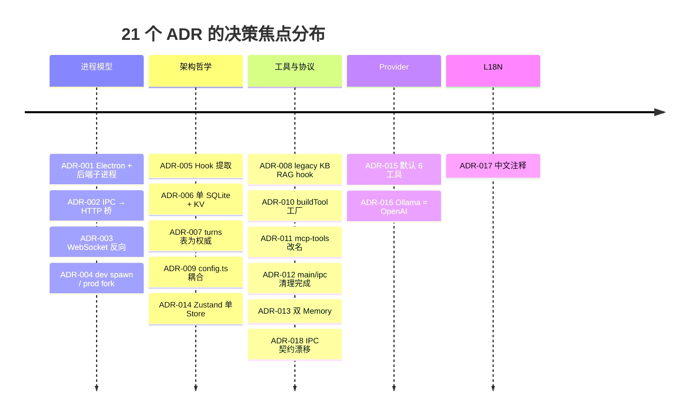
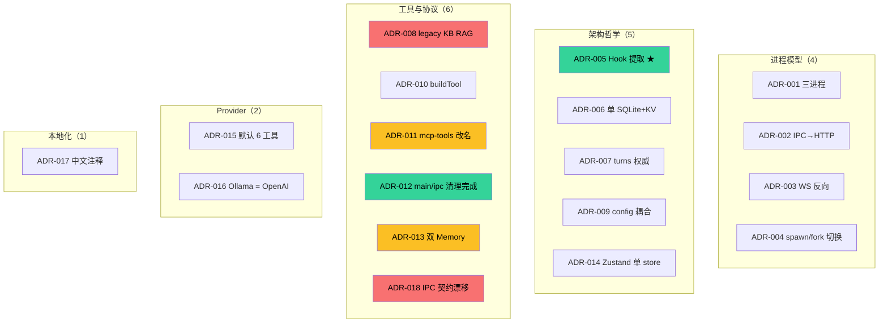

# 09 · 扩展点与架构决策记录（ADR）

> 本文给出 Zero-Core 的显式扩展点 + 关键架构决策（ADR）。每个 ADR 都是从代码反向推导，包含 Context / Decision / Alternatives / Consequences 四要素。

## 1. 显式扩展点

### 1.1 Hook 系统（最丰富）

30 个 `HookEventName` 事件点 = **14 个 agent-execution(step-centric 命名,Step 1C)** + 16 个 observability/workflow(详见 `core/hook-types.ts`)。要扩展行为,最自然的方式是注册一个 hook handler:

```typescript
// 注册到 per-loop registry(Step 1B);新代码不要用 HookRegistry.getInstance()
loop.registry.register("PreToolUse", async (ctx) => {
  if (ctx.toolName === "Shell" && ctx.args.command?.includes("rm -rf /")) {
    return { blocked: true, reason: "Destructive command blocked" };
  }
});
```

agent-execution 14 hook 的完整触发点 + handler 映射见 [03 §Hook 系统](03-runtime-engine.md#事件--触发点--主要-handler-映射step-centric-14-hook)。注册通过 `registerHooksForLoop(registry, loopKind, deps)` 按 main/delegated 分组(见 [08 §2.5](08-cross-cutting.md#25-已注册的-handlerper-loopregisterhooksforloop))。

**当前活跃 hook 装载点**(per-loop,`registerHooksForLoop` 内):

| 文件 | 装载范围 | 注册的事件 |
|------|----------|------------|
| `runtime/hooks/turn-hooks.ts` | shared | TurnStart / StepEnd / PostToolUse / PostToolUseFailure / TurnEnd / TurnError |
| `runtime/hooks/compression-hooks.ts` | shared | StepEnd(从 PostTurnComplete 迁来,Step 3A) |
| `runtime/hooks/extraction-hooks.ts` | shared(注入 deps 时) | StepEnd(M5,从 PostTurnComplete 迁来) |
| `runtime/hooks/rag-hooks.ts` | shared | PreLLMCall |
| `runtime/hooks/provider-options-hooks.ts` | shared | PreLLMCall |
| `runtime/hooks/todo-cleanup-hooks.ts` | shared | StepEnd(从 PostTurnComplete 迁来,Step 3B) |
| `runtime/hooks/notification-hooks.ts` | **main only** | PreLLMCall |
| `runtime/hooks/input-queue-hooks.ts` | **main only** | StepStart(insert_now 注入) |
| `runtime/hooks/task-control-hooks.ts` | **delegated only** | StepStart(request_finish 控制消息) |
| `server/workflow-context-hook.ts` | shared(work session) | PreLLMCall(T2 项目上下文) |
| `server/durable-hooks.ts` | shared | PostToolUse / TurnEnd / TurnError 等(turn_state 检查点) |
| `server/tool-execution-hooks.ts` | shared | PostToolUse 等(工具执行审计) |
| `server/metrics-hooks.ts` | **main only** | usage 流事件(metrics) |

> Session 级 `SessionStart` / `SessionClose` 由 **agent-service** 在 loop build/destroy 时 fire(实例生命周期),不在 `registerHooksForLoop` 注册。
>
> v0.8 后续(Step 1C):`memory-hooks.ts` / `requirement-hooks.ts` 已退役(见 §5.5 原则,ADR-025)。memory 合并进 per-agent wiki 子树,召回改由 `wiki-anchor-injection` 注入;requirement 工作流改走 project-work hook(订阅 data-change-hub)。

### 1.2 工具（最直接）

新增一个工具 = 在 `runtime/tools/` 加一个 `.ts` 文件 + 在 `runtime/tools/index.ts` 的 `ALL_TOOLS` 中注册：

```typescript
export const myTool = buildTool({
  name: "MyTool",
  description: "...",
  prompt: "...",
  meta: { category: "assistant", isReadOnly: true },
  inputSchema: z.object({ ... }),
  execute: async (args, ctx) => { ... },
});

// 在 ALL_TOOLS 里加： MyTool: myTool,
```

前端自动从 `ToolRegistry` 拉取，无需改前端代码。

### 1.3 LLM Provider

`runtime/provider-factory.ts:120-160` `getOrCreateProvider()`：

```typescript
case "my-provider":
  const { createMyProvider } = await import("@my-provider/sdk");
  factory = createMyProvider({ apiKey: config.apiKey, baseURL: config.baseUrl });
  break;
```

加一个 case + 加一个依赖。

### 1.4 嵌入 Provider

`server/kb-embeddings.ts` `createEmbeddingProvider(provider, {baseUrl, apiKey, model})`。

### 1.5 搜索 Provider

`runtime/tools/web-search.ts:250-269` `createSearchProvider(config)`：
- DuckDuckGo（默认）
- SearXNG（自托管）
- SerpAPI（商业）
- BraveSearch

新增搜索后端 = 实现 `SearchProvider` 接口 + 注册。

### 1.6 IPC Channel

新增 IPC channel = 至少三处改动：
1. `src/shared/preload-types.ts` `WindowApi` 接口加方法
2. `src/main/ipc-proxy.ts` `R` 映射表加一行，除非该通道必须留在 main 本地
3. 后端 `src/server/<x>-router.ts` 加 Express 路由
4. 必要时更新 `src/shared/ipc-api.ts` 与 `tests/unit/rest-routers.test.ts` 的契约校验

当前 `preload/index.ts` 暴露 155 个 preload API（131 个 `invoke` + 7 个 `on` receive + 余下为同步属性/常量），`ipc-proxy.ts` 的 `R` 表代理 141 个通道；main 本地保留 6 个 `ipcMain.handle`（window/dialog/webfetch/app:ready，必须用 Electron 原生能力）。新增通道时应优先让测试捕获遗漏，而不是把例外加入白名单。

### 1.7 SQLite 表

`src/server/sqlite-store.ts` 通用 CRUD 已经支持任意表。新增表：
1. 定义 `COLUMNS: ColumnDef[]`
2. `new SqliteStore<T>(db, "table_name", COLUMNS)`
3. 包一层 domain-specific store（如 `agent-store.ts` 的模式）

### 1.8 Persona / 角色

`src/core/persona.ts:56-102` `PERSONA_TEMPLATES`：增删模板即可。

### 1.9 KB / RAG

注册 KB → KB 配置 Provider/Model → 启动 ingest → 通过 `/api/kb` 手动检索/管理。当前默认 Agent 会话不会自动接入 `getRagContext`；如需自动 RAG，应作为显式 KB binding 能力重新设计。

---

## 2. 架构决策记录（ADR）

### 2.0 21 个 ADR 总览（timeline + 分类）

> 实际 21 个 ADR（ADR-018 无独立章节，并入 ADR-012 / D-016 的契约漂移讨论）。





**关键标记**：
- 🟢 **ADR-005 Hook 提取** — 项目**最成功**的架构改进
- 🟡 **ADR-008 legacy KB RAG hook** — 默认运行路径未接通，建议退役或产品化重接
- 🟢 **ADR-012** — main/ipc 死代码已清理并由测试固化
- 🟠 **ADR-011/013** — 两个"清理债"决策待落地
- 🔴 **ADR-018** — 当前最实际的 IPC 契约漂移风险

### ADR-001 · 进程模型：Electron + 后端子进程

### ADR-001 · 进程模型：Electron + 后端子进程

**Context**：LLM 调用是长连接 + 流式；UI 需要快速响应；SQLite 是同步阻塞。

**Decision**：Electron 三进程（Main / Renderer / Backend），后端用独立 Node.js 子进程承载 LLM 与数据库。

**Alternatives**：
- 单一 Node.js 进程：UI 渲染阻塞数据库 IO。
- 单一 Electron Renderer 进程承担后端：chromium 进程崩溃 = 全部崩溃。
- Web service 后端：网络抖动、多机部署复杂度。

**Consequences**：
- ✅ 进程隔离：UI 崩溃不影响后端；后端崩溃可自动重启。
- ✅ 多 LLM 流式并行互不阻塞 UI。
- ❌ 进程间通信成本：IPC + HTTP + WebSocket 三层桥。
- ❌ 部署复杂：必须打包 electron-builder。

**Code evidence**：`main/index.ts:191-212`、`backend-spawn.ts:27-91`。

---

### ADR-002 · IPC 通道通过 HTTP 桥接到后端

**Context**：Electron 的 IPC 是同步请求-响应模式，与后端的 REST 风格一致。

**Decision**：绝大多数业务 IPC 通道通过 `ipc-proxy.ts` 的 `R` 表翻译为对 `http://localhost:<port>/api/...` 的 HTTP 请求。当前 `R` 表代理 141 个通道；main 本地保留 6 个 `ipcMain.handle`（必须使用 Electron 原生能力）。

**Alternatives**：
- 直接在 main 进程跑后端逻辑：把 main 进程变成上帝对象。
- 用 MessagePort + JSON 序列化：不利于调试。

**Consequences**：
- ✅ 后端可以独立测试（用 curl 直接打）。
- ✅ 后端逻辑与 main 进程解耦，可单独部署。
- ✅ 大多数业务通道走统一路径，并由 `tests/unit/rest-routers.test.ts` 做契约校验。
- ❌ 进程间多一跳，约 2-10ms 延迟。
- ❌ 需要起 HTTP server + 端口管理。

**Code evidence**：`main/ipc-proxy.ts:11-153`、`main/index.ts:202-207`。

---

### ADR-003 · 后端用 WebSocket 反向推送流式事件

**Context**：LLM 流式输出需要长连接推送；HTTP 短轮询低效。

**Decision**：后端启动 WebSocketServer 在 `/ws`，main 通过 `ws://localhost:<port>/ws` 订阅，事件转发为 IPC 事件到 renderer。

**Alternatives**：
- SSE（Server-Sent Events）：单向，但浏览器侧可用。
- Long Polling：老式但可靠。
- 仅 IPC 主动拉：流式体验差。

**Consequences**：
- ✅ 双向 + 低延迟 + 自动重连。
- ✅ 事件类型复用 IPC envelope。
- ❌ 浏览器端不能用（Electron 不受限）。
- ❌ 重连期间事件丢失（无缓存）。

**Code evidence**：`main/ipc-proxy.ts:214-261`、`server/index.ts` (startServer)。

---

### ADR-004 · 子进程启动策略：dev spawn node / prod fork electron

**Context**：`better-sqlite3` 是 native binding，需要 ABI 匹配 Electron 的 Node.js。

**Decision**：
- **开发模式**：`spawn("node", ...)` 用系统 Node.js，避免 Electron ABI 与 better-sqlite3 不匹配。
- **打包模式**：`fork(...)` Electron 子进程；electron-builder `npmRebuild: true` 已重新编译 native modules。

**Alternatives**：
- 统一 fork Electron：dev 模式跑不通。
- 统一 spawn node：打包后用户机器可能没 Node.js。

**Consequences**：
- ✅ 两边都能跑。
- ⚠️ 双路径测试覆盖成本高。

**Code evidence**：`backend-spawn.ts:32-46`、`electron-builder.yml`。

---

### ADR-005 · Hook 系统从 AgentLoop 提取副作用

**Context**：AgentLoop 原本承担 turn 持久化、压缩、记忆召回、RAG 注入等多重职责，体积膨胀。

**Decision**：把上述副作用全部抽出到 `runtime/hooks/*-hooks.ts`，AgentLoop 仅触发 `triggerHooks(event, ctx)`。

**Alternatives**：
- 保留在 AgentLoop：违反单一职责。
- 用 AOP / decorator：TS 生态不成熟。

**Consequences**：
- ✅ Hook 提取仍然有效，但 AgentLoop 当前又增长到约 700 行，需要继续控制流式事件翻译和工具执行分支。
- ✅ 每个 hook 可独立测试。
- ✅ 扩展点明确。
- ❌ ~~23 个 hook 事件定义但未装载(幽灵 hook)~~ —— **ADR-025 已重做**:agent-execution 改为 step-centric 14 hook(全部装载触发),observability/workflow 16 个里只剩 9 个零触发占位(`TeammateIdle` / `PermissionRequest/Denied` / `ConfigChange` / `CwdChanged` / `FileChanged` / `WorktreeCreate/Remove` / `InstructionsLoaded`),见 [08 §2.4](08-cross-cutting.md#24-事件装载状态step-centric-14--observabilityworkflow-16)。
- ❌ 调用顺序依赖注册时机(per-loop registry 后隔离问题已缓解,但同 loop 内顺序仍敏感)。

**Code evidence**：`runtime/hooks/index.ts`、`core/hook-registry.ts`。

---

### ADR-006 · 数据驻留：单 SQLite 文件 + KV store

**Context**：用户场景是单机本地，无分布式需求；但配置项多（主题 / 设备 / 工具配置 / 全局配置 / workspace）。

**Decision**：
- 业务实体表（agents / providers / mcp_servers / kb_entries / memory_nodes / ...）：SQLite 表。
- 软状态配置（workspace / theme / device / tool-config / global-config / ...）：KV 表 `kv_store`。
- 持久化文档 chunks：同库 `kb_chunks` 表（embedding 作为 BLOB）。

**Alternatives**：
- 每个对象一个 JSON 文件：早期版本的问题（`agents.json` / `providers.json` 等），查询 O(N)。
- PostgreSQL：单机过度。
- LevelDB / RocksDB：需要额外依赖。

**Consequences**：
- ✅ 单文件备份 / 迁移简单。
- ✅ KV 灵活补丁 + 业务表结构化并存。
- ❌ `session-db.ts` 类持有多个独立存储后端，类太大（当前约 960 行；v0.8 仅聚合 5 个内核 store，9 个工作流域 store 已在 `server/index.ts` 独立 `new`）。
- ❌ KB 向量搜索 O(M×D) 是性能瓶颈。

**Code evidence**：`server/sqlite-store.ts:43-273`、`server/key-value-store.ts:32-116`。

---

### ADR-007 · turns 表为 source of truth

**Context**：UI 需要渲染"原始块"（text / thinking / tool），而 streamText API 需要"标准 messages"。

**Decision**：`turns` 表存原始 blocks JSON（append-only），`messages` 表是 write-through 缓存，AgentSession 构造时从 turns **重建** messages。

**Alternatives**：
- 单一 messages 表，存完整 AI SDK 格式：失去 UI 的灵活性。
- 双写双源：可能不一致。

**Consequences**：
- ✅ UI 与运行时共享同一数据源。
- ✅ 添加新 block 类型只改 rebuildFromTurns()。
- ❌ 写入时双写（turns + messages），事务成本。
- ❌ rebuildFromTurns() 的 tc-id 重生成可能影响 provider 兼容性（已通过 `tc-N` 重映射规避）。

**Code evidence**：`runtime/session.ts:159-178`、`server/session-db.ts:251-275`。

---

### ADR-008 · KB RAG hook 保留但默认运行路径未接通

**Status**：accepted as legacy cleanup。

**Context**：`runtime/hooks/rag-hooks.ts` 仍注册在 PreLLMCall，但它只有在 `SessionConfig.getRagContext` 存在时才会工作。当前 `AgentService.createLoopForSession()` 构造普通 Agent 会话时没有注入 `getRagContext`，所以 KB 内容不会默认进入 `ctx.ragContext`。

**Decision**：把该路径视为 legacy optional hook，而不是当前主记忆/RAG 链路。当前长期记忆主线是 Wiki tree + wiki anchors；KB 仍保留导入、chunk、embedding、手动检索能力。

**Consequences**：
- ✅ 避免维护者误以为 KB 会自动参与每轮 Agent 上下文。
- ✅ Wiki memory 与 KB document search 的边界更清晰。
- ⚠️ 如果产品需要自动 RAG，需要重新设计 KB binding、query planner、上下文预算与 Wiki 去重策略。

**Code evidence**：`runtime/hooks/rag-hooks.ts:13-25`、`server/agent-service.ts:createLoopForSession()`、`runtime/wiki-anchor-injection.ts`。
### ADR-009 · config.ts 三件套耦合

**Context**：单一文件同时承担 schema、默认、加载逻辑。

**Decision**：保留现状（一个文件 324 行）。

**Alternatives**：
- 拆分为 `config-schema.ts` + `config-defaults.ts` + `config-loader.ts`：粒度过细。
- 把 schema 用 codegen 生成：从 schema 自动生成 TS 类型。

**Consequences**：
- ✅ 单文件易查找。
- ❌ schema 改动时需要在 DEFAULT_CONFIG 同步手动改。
- ❌ 不支持"运行时热更新 schema"。

**Code evidence**：`core/config.ts:38-178`。

---

### ADR-010 · Tool 抽象：buildTool 工厂 + meta 反射

**Context**：25 个工具（9 categories：fs / shell / web / db / mcp / task / agent / orchestration / project-management）异构，但需要统一的元数据（category / isReadOnly / configSchema / prompt）。

**Decision**：`buildTool()` 工厂接受 `{name, description, prompt, meta, configSchema, inputSchema, execute}`，把 `meta` / `configSchema` / `prompt` 挂在 AI SDK `tool()` 对象的私有符号上。

**Alternatives**：
- 每个工具手写 TS 接口：样板代码爆炸。
- 用 class 继承：与 AI SDK 的函数式风格不兼容。
- 装饰器：TS 装饰器语义弱。

**Consequences**：
- ✅ 工具声明 1 行起，schema 自动反射到前端表单。
- ✅ meta 字段驱动 UI（红/绿/灰按钮 + 工具分类树）。
- ✅ 工具配置值自动注入 prompt（prompt-as-config）。
- ❌ 元数据存在私有符号上，类型签名看不到，需要 `getToolMeta(def)` 等反射函数。

**Code evidence**：`runtime/tools/tool-factory.ts:92-211`、`core/tool-registry.ts:50-67`。

---

### ADR-011 · `runtime/mcp-tools/` 目录名误导

**Context**：目录名暗示"通过 MCP 接入的工具"，但实际是 5 个 built-in 高级工具（WebFetch / SequentialThinking / Platform / Cookie / BrowserRender）。原 6 个里的 `memory-tools.ts`(Memory) 本批清理僵尸已删(零 importer)。

**Decision**：保留目录名（**已建议改名**）。

**Alternatives**：
- 改名 `runtime/advanced-tools/`：破坏 import 路径。
- 拆为 `runtime/web-tools/` + `runtime/memory-tools/` + ...：粒度过细。

**Consequences**：
- ⚠️ 当前新工程师会被"目录名 ≠ 内容"误导。
- ⚠️ IDE 搜索 `mcp-tools` 会混入 built-in。

**Code evidence**：`runtime/mcp-tools/{fetch,seq,platform,cookie,browser-render}.ts`(`memory` / `node` / `assistant` 已删/改名;`memory-tools.ts` 本批清理僵尸)。

---

### ADR-012 · `main/ipc*` 死代码已清理

**Context**：早期文档记录过 `src/main/ipc/` 下存在一组未装载 handler，生产路径实际由 `ipc-proxy.ts` 接管。

**Decision**：P9 已删除这组遗留路径。当前 `src/main/ipc.ts` 与 `src/main/ipc/` 均不存在。

**Consequences**：
- ✅ main 进程 IPC 入口更清晰：批量业务通道只走 `registerProxyHandlers()`，少量本地能力走 `registerLocalHandlers()`。
- ✅ `tests/unit/p9-dead-path-removal.test.ts` 固化了删除结果，避免死代码回流。
- ⚠️ 清理死代码不等于 IPC 契约完全一致；preload/proxy 的例外见 ADR-018。

**Code evidence**：`main/index.ts`、`main/ipc-proxy.ts`、`tests/unit/p9-dead-path-removal.test.ts`。

---

### ADR-013 · Legacy Memory 与 Wiki Tree 迁移残留

**Status**：accepted, cleanup needed。

**Context**：项目曾存在 `memory-store.ts`(MemoryStore)、`memory-node-store.ts` 和旧 `runtime/mcp-tools/memory-tools.ts`(memoryReadTool/memoryWriteTool)。本批清理僵尸:`memory-store.ts` 与 `memory-tools.ts` 已删除(零 importer / 零运行时写入者);`memory-node-store.ts`(MemoryNodeStore)保留(wiki 不可用时压缩流程回退)。当前 `runtime/tools/index.ts` 已移除 `MemoryRecall` / `MemoryNote`,普通 Agent 的记忆读写走 `Wiki` 工具与 Wiki anchors。(历史 ADR 曾引用 `runtime/memory-recall.ts`,该文件已不存在;记忆召回由 `wiki-anchor-injection` 取代。)

**Decision**：把旧 memory 代码标注为兼容/迁移残留。当前默认长期记忆路径是全局 Wiki tree：Extractor 与 compression 优先写入 Wiki，AgentLoop 通过 `wiki-anchor-injection.ts` 注入项目/Agent 锚点。

**Consequences**：
- ✅ 文档和运行路径一致，避免把旧 FTS5 recall 当成主路径。
- ⚠️ 仍需确认旧表中是否有用户数据，再决定迁移或删除。
- ⚠️ `SessionDB` 仍持有旧 store，会继续增加认知负担。

**Code evidence**：`runtime/tools/index.ts`、`runtime/wiki-anchor-injection.ts`、`runtime/hooks/extraction-hooks.ts`。`runtime/mcp-tools/memory-tools.ts`(memoryReadTool/memoryWriteTool)+ `server/memory-store.ts`(MemoryStore) 本批已删除(零 importer / 零运行时写入者,僵尸清理)。`memory-node-store.ts`(MemoryNodeStore) 保留。
### ADR-014 · Zustand 单 Store 单关注点

**Context**：渲染层有多个交互域（聊天 / Agent / MCP / KB / 设置 / 主题 / 页面 / 交互）。

**Decision**：每域一个 Zustand store，无中央 store。

**Alternatives**：
- Redux Toolkit：过度。
- React Context：性能差。
- MobX：违反 React 模式。

**Consequences**：
- ✅ 边界清晰，可独立卸载。
- ✅ 性能：选择器返回稳定引用。
- ❌ 跨域状态需要手动同步（activeAgentId 在 page-store 和 chat-store 各有一份）。

**Code evidence**：`renderer/store/*.ts` 共 14 个 store + `data-sync.ts`（DB→store 增量同步 helper，见 ADR-021）。

---

### ADR-015 · Ollama 走 OpenAI 兼容协议

**Context**：Ollama 提供 `/v1/chat/completions` 等 OpenAI 兼容端点。

**Decision**：`provider-factory.ts` 对 `type === "ollama"` 走 `createOpenAI(...)`，URL 指向 `localhost:11434`。

**Alternatives**：
- 单独写 Ollama SDK：依赖增加。
- 走 Anthropic SDK：不兼容。

**Consequences**：
- ✅ 零额外依赖。
- ❌ 如果 Ollama 改了兼容端点，需要改代码。

**Code evidence**：`provider-factory.ts:127-156`。

---

### ADR-016 · 默认开启 6 个核心工具（保守默认）

**Context**：LLM 工具有副作用，可能破坏数据。

**Decision**：`buildToolsSet()` 在未配置时仅暴露 Shell / Read / Write / Edit / Grep / Glob，其他工具必须显式 `policy.tools[name] = {enabled: true}`。

**Alternatives**：
- 默认全开：风险大。
- 默认全关：用户体验差。

**Consequences**：
- ✅ "默认安全"。
- ⚠️ 用户首次使用 WebSearch / AskUser 等需要去 Settings 启用。

**Code evidence**：`runtime/tools/index.ts:148-164`。

---

### ADR-017 · 中文注释 + 中文文件名说明书

**Context**：所有源码文件顶部有中文"文件说明书"块（功能 / 输入 / 输出 / 定位 / 依赖 / 维护规则）。

**Decision**：保留中文注释规范。

**Alternatives**：
- 全英文：国际化友好。
- 双语：冗余。

**Consequences**：
- ✅ 新工程师快速理解模块职责。
- ❌ 国际化时需要翻译所有注释。

**Code evidence**：每个 `src/<file>.ts` 第 1-25 行。

---

### ADR-019 · 模板与工作流角色分离(模板按能力取向)

**Context**:历史上存在两套并行、互不感知的「模板」系统:
- **role template**(`runtime/role-templates.ts` `ROLE_TEMPLATES`,15 条硬编码 lead/pm/...):带 `toolPolicy` + `whitelistedRoleTags`(委派图),被 `AgentRegistry` 工具 + REST `/api/role-templates` + IPC `role-templates:*` 消费。**（`runtime/role-templates.ts` 已删除，见 ADR-020；本段为历史背景描述。）**
- **prompt template**(`server/template-store.ts`,DB `templates` 表,`PromptTemplate`):12 条内置 + 用户自建/GitHub 导入,被 UI Templates 页面消费(REST `/api/templates` + IPC `templates:*`)。

两者都用作 agent 身份种子,只是入口不同 → `AgentRegistry.listTemplates` 列出的模板与 UI Templates 页面**对不上**。

**Decision 演进**:先尝试「完全合并为一套」(把 role 塞进 PromptTemplate 画廊,27 条),但很快发现违背一条更根本的原则——**模板按能力/知识领域取向,与工作流角色无关**。最终改为**两个概念彻底分离**:

- **能力模板**(PromptTemplate 画廊,TemplateStore):按能力/领域专长取向,用户面向。**16 条** = 12 通用(Coder/Writer/Translator/Reviewer/Analyst/Tutor/Creative/Researcher/Collector/DevOps/Product Manager/Architect)+ 4 领域专家(Security/UI-UX/Performance Expert + QA Engineer,由原 analyzer lens / qa 重构为「懂什么」的领域专家,能分析也能设计,不绑死动作)。UI 画廊 + `AgentRegistry.listTemplates` 共看 → 对齐。
- **工作流角色注册表**(`server/builtin-role-templates.ts` `BUILTIN_WORKFLOW_ROLES`):交付工作流的位置,**与模板无关,不进画廊**。当时保留 `zero/lead/archivist` 3 个无能力等价物的纯工作流位置。`developer/reviewer/pm/qa` 不再单独定义——工作流里直接用同名能力模板建 agent(Coder/Reviewer/Product Manager/QA Engineer),其工作流专属工具(如 PM 的 CreateRequirementWithDoc)由 zero 在 setup 时配 toolPolicy。（后续 ADR-020 进一步精简：**代码角色注册表只剩 `zero`**，lead/archivist/pm/developer 改为 software-dev playbook 的 wiki 知识，由 zero 读出后实例化。）

**丢弃**:`whitelistedRoleTags` 委派自动装配(依赖失效的 `role_tag` 物理列,fresh DB 上是 no-op);`analyzer×4`(→ 3 领域专家 + 架构并入通用 Architect);`planner×4`(Feature/Bugfix/Refactor/Research 是工作类型,不是能力/领域,丢弃)。

**入口拆分**:`management.instantiateTemplate(id)`(能力画廊,AgentRegistry `create template=` 用)/ `instantiateRole(id)`(角色注册表,fresh-db seed 的 zero 用)。

**移除的并行通道**:`role-template-router.ts`、IPC `role-templates:list/get/instantiate`、preload `roleTemplatesList/Get/Instantiate`(renderer 从未使用)。

**Alternatives**:
- 完全合并为一套(27 条):违背「模板与角色无关」,画廊混入工作流角色。
- 角色也当模板留在画廊:同上,概念混乱。

**Consequences**:
- ✅ 画廊纯能力取向(16 条),UI 与 LLM 工具天然一致。
- ✅ 工作流角色与模板解耦,各自演进。
- ⚠️ 工作流专属工具(如 CreateRequirementWithDoc)不再由 role 模板声明,改由 zero setup 时配 toolPolicy(声明式 → 配置式)。
- ⚠️ lead 委派对象从 role 名(developer/reviewer/qa)改为能力模板名(Coder/Reviewer/QA Engineer)。

**Code evidence**:`server/builtin-role-templates.ts`(BUILTIN_WORKFLOW_ROLES)、`server/template-store.ts:mergeBuiltInTemplates`(只合并能力 builtin)、`server/management-service.ts:instantiateTemplate/instantiateRole`、`runtime/tools/agent-tool.ts`、`server/fresh-db-seed.ts:instantiateRole("zero")`。

---

### ADR-020 · 工作流知识只在 wiki,代码是通用工作流平台

**Context**:ADR-019 把模板与工作流角色分离后,代码里(`builtin-role-templates.ts`)仍硬编码了 lead/archivist/zero 的**工作流程序性 prompt**——lead 的交付管线(pickup→plan→build→verify)、archivist 的 wiki/git 程序、verify 门、角色清单、subagents 图。这些都是「软件开发」这个**具体工作流**的知识,混在通用平台代码里,违背定位。

**Decision**:**项目代码是通用工作流平台,只提供机制**(agents / tools / cron / wiki 知识树 / Orchestrate / 委派)。具体工作流的**知识**——角色清单、各角色身份与程序、管线、门、合作图——**只在 wiki `knowledge/workflow/` 里**。软件开发是**默认自带的示例工作流**,其知识 seed 进 `knowledge/workflow/software-dev` playbook;要别的工作流照此另写一份 playbook。

- **代码角色注册表只剩 `zero`**(平台管家 / 用户入口,通用基础设施,不属于任何具体工作流)。lead/archivist/pm/developer/... 是 software-dev 工作流的角色,**不在代码**,在 playbook 里。
- **zero 通过读 wiki 知道怎么搭某个工作流**:用户要搭 software-dev 时,zero 读 `knowledge/workflow/software-dev` playbook,按其中描述的角色身份/程序/图,用 AgentRegistry 建成 agent(systemPrompt 由 zero 基于 playbook 撰写,能力底座优先用能力画廊模板 Coder/Reviewer/QA Engineer/Product Manager)。
- **SOFTWARE_DEV_PLAYBOOK**(`fresh-db-seed.ts`)是该工作流的**唯一知识源**:已迁入 lead 的四步管线、archivist 的渐进扫描+合并程序、PM 的发现/建需求/覆盖判断、角色清单(含能力底座映射)、subagents 图、cron 建议、两道门、状态机。
- **机制(非知识)仍在代码**:Orchestrate 引擎、verify/requirement 工具、cron、wiki、委派——这些是任何工作流都用的通用机制。

**Alternatives**:
- 代码里保留各工作流的角色 prompt:违背「通用平台」定位,每加一个工作流都要改代码。
- zero 不读 wiki、工作流知识硬编码在 zero prompt:同上,且 zero 无法支持多工作流。

**Consequences**:
- ✅ 平台通用,新工作流=新 playbook(wiki 内容),不改代码。
- ✅ 工作流知识单一源(playbook),用户/zero 可在 wiki 里 refine。
- ⚠️ zero 搭工作流的质量依赖 playbook 写得多详细(以及 zero 的综合能力)——playbook 越完整,zero 建的角色越准。
- ⚠️ lead/archivist 等不再有代码里的固定 systemPrompt;同一工作流不同安装可能产出略有差异的 agent prompt(zero 综合),失去「逐字一致」的可重现性。

**Code evidence**:`server/builtin-role-templates.ts`(只剩 zero)、`server/fresh-db-seed.ts:SOFTWARE_DEV_PLAYBOOK`(software-dev 工作流唯一知识源)、`server/management-service.ts:instantiateRole`(仅 zero)。

---

### ADR-021 · UI 数据同步:SqliteStore 写出口统一捕获 + 推全对象

**Context**:四个突变面会改同一份持久数据——UI(REST router)、agent 工具(ManagementService)、后台服务(archivist/提取者/cron)、启动恢复。早期每个域(agent/project/cron/requirement/wiki)各自手写 `onChange/notifyChanged` + 各自一条事件通道(`agents:changed`/`projects:changed`...)+ 各自 renderer 订阅,**逐模块改、易漏入口**(writeNodeDetail / transitionStatus / upsertProjectNode 等非标准突变)。且 agent 工具改的数据 UI 不刷新(要重启)。

**Decision**:**DB 是唯一真源,所有突变面收敛到 `SqliteStore` 三个写原语(`insertRow`/`updateRow`/`delete`);在这唯一的写出口统一发 `data:changed` 事件,renderer 增量订阅。**

- **`data-change-hub`**(`server/data-change-hub.ts`):
  - **白名单** `UI_COLLECTIONS`(agents/projects/crons/requirements/project_wiki)——`messages`/`turns`/`tool_usage` 等高频表(流式每 chunk 写)不广播,避免刷屏。
  - **coalesce**——同 tick 内按 `(collection,id)` 去重(保留最新 op+record),批量写(archivist 扫数百节点)只触发一次 flush。
  - **推全对象**——create/update emit 时带 `record`(store 本就返回记录),renderer 收到直接 patch,**免 `GET /:id` 那一跳**;delete 只带 id。
- **`SqliteStore`**:`insertRow/updateRow/delete` 调 `emitDataChange(table, id, op, record?)`;`update` 做 **no-op 检测**(patch 字段全等于现值 → 跳过写+不发通知,标量按数值比以兼容"数字存 TEXT 读回 `'2.0'`"的 round-trip 怪癖)。
- **单通道** `data:changed`:server WS broadcast → `main/ipc-proxy` 桥接到 IPC → `preload.onDataChanged`。取代原每域一条通道。
- **renderer `data-sync.ts`**:
  - `subscribeDataChange(collection, refetchAll)`——树形 store(wiki)用,任意变更全量 refetch。
  - `subscribeListDataChange(collection, {patch, refetchAll})`——列表 store 用。`patch(id, record|null): boolean` 原地替换/移除;非过滤 store(agents/projects/crons)新 id 直接 append;过滤 store(requirements)仅替换已存在、不在则返回 false→helper 回退一次 `refetchAll` 重新套用 filter。delete 在就移除、不在 no-op。

**运行时执行态 vs 持久数据(两条通道,职责分离)**:
- `data:changed` = 持久域数据变更(低频、按记录),消费方 = list/tree stores。
- `agent:event` = 运行时执行事件(text_delta / tool_start / session_init / ask_user / todos / error / usage,高频流式),消费方 = chat-store。messages/turns **故意不在** `data:changed` 白名单——流式每 chunk 都写,会刷屏;改走 `agent:event` 实时推 + 切 session 时 `session_init` 批量灌。

**Alternatives**:
- 运行时内存数据权威 + DB 落盘/恢复(`{ui,工具} ↔ 内存 → DB`):对**单写者 + 无后台**的应用更简单;但本应用有自主 agent + 后台服务和并发写,内存权威要自管持久化/恢复/并发冲突,等于重造 SQLite 的事务,DB 权威更稳。且服务端 store 不缓存(每次 read DB,better-sqlite3 自带页缓存),DB 权威没额外对账成本。Electron 双进程逼出 renderer 缓存 + 同步通道,这部分复杂度两边都逃不掉。
- 每 store 手写 onChange + 每域一条通道:逐模块改、易漏入口,已被取代(见 Context)。
- refetch 模式(发 `{id,op}` → renderer 再 `GET /:id`):多一跳,已改成推全对象。

**Consequences**:
- ✅ 新增 UI 同步域 = hub 白名单加表名 + store 调一次 `subscribeDataChange/subscribeListDataChange`,两处各一行,四个突变面自动覆盖。
- ✅ agent 工具改数据 → UI 实时刷新(与 UI 自改同一条回流);单条更新零额外请求(no-op 不发,create/update 推全对象)。
- ✅ 多写者并发收敛(谁先提交谁赢,SQLite 事务保证);崩溃/重启 DB 始终一致。
- ⚠️ renderer 缓存(DB 之外第二份副本)是 Electron 双进程的必然,需 hub 同步——这是固有成本,非 DB 权威选择带来。
- ⚠️ wiki 树全量刷新(结构变更需重算);archivist 后台批量扫描由 coalesce 合并成每 tick 一次刷新,但跨 tick 的长扫描仍会多次刷新(可接受)。

**Code evidence**:`server/data-change-hub.ts`(白名单+coalesce+推全对象)、`server/sqlite-store.ts`(写出口 emit + no-op 检测)、`server/index.ts`(`onDataChange→broadcast`)、`main/ipc-proxy.ts`(WS→IPC 桥)、`preload/index.ts:onDataChanged`、`renderer/store/data-sync.ts`(订阅 helper)、各 renderer store 的 `subscribeListDataChange`。

---

### ADR-022 · Archivist 率先去工作流角色 + 长期绑定(画廊例外)

**Context**:工作流角色(WORKFLOW_ROLES / sendRolePrompt)是 lead/pm/analyst/archivist 共用的运行时枢纽(身份 prompt + toolPolicy + 上下文注入)。ADR-019 把模板与角色分离(工作流角色不进画廊),ADR-020 把工作流知识下沉到 playbook。但 archivist 的 wiki 维护是 project 级长期任务,需要:(1) 从画廊创建带 Wiki 工具的 agent;(2) 操作 prompt 绑操作不绑角色;(3) 长期绑定 + 双触发(定时 cron + git 变更)。

**Decision**:**archivist 率先完全脱离 WORKFLOW_ROLES**(推动弃用工作流角色的第一步),lead/pm/analyst 保留(后续 epic)。去-role 的支点 = 注入键从 role 转 `session.projectId`:
- 新触发器 `AgentService.sendProjectPrompt`(sendRolePrompt 的去-role 版):身份/toolPolicy 全用 agent 自带(来自模板),不调 getRoleConfig;保留 wikiStore/projectContext 注入(按 session.projectId)。
- enrichment/cron 触发改走 sendProjectPrompt。**无 fallback**:必须选已存在、配了 Wiki 工具的 agent(入口校验 `agentHasWikiTool`,无则拒绝)。
- **画廊例外**:Archivist 破例进 template-store(ADR-019 的例外),systemPrompt = Researcher base + ARCHIVIST_CONFIG.promptAppend(从 WORKFLOW_ROLES 取避免漂移)。作用 = 方便用户一键创建预配好 Wiki 工具的 agent,不是自动 fallback 源。
- 操作 prompt 绑操作(`wiki-operations.ts`: doc重建/git更新/wiki充实 三操作),不绑角色。多操作拆分,各自可按键或 cron。
- 长期绑定 = 该 project 的 archivist cron 集合(每操作一条,共用 agentId),不新建 project 字段;识别靠 `cron.source`(=`archivist-bind:<operationId>`,稳定,不依赖 prompt 文本)。
- 双触发:定时 cron(alarm) + git-aware cron(interval,prompt 带 sentinel,fireAgent 检查 git ref 变化才跑,无变化跳过;`last_git_ref` 列记录上次 ref)。

**Consequences**:
- ✅ archivist 全链路(创建+触发)不依赖 WORKFLOW_ROLES,为全面弃用铺路。
- ✅ 注入键 session.projectId 比 role 更自然(session 本带 projectId)。
- ✅ 无 fallback 避免幽灵角色 agent;用户显式选 agent + 校验 Wiki 工具。
- ⚠️ WORKFLOW_ROLES.archivist 配置保留(m2 测试断言),但运行时不再读 —— 待全面弃用 epic 时清理。
- ⚠️ git-aware 是轮询(默认 10min)非真事件;真 post-commit hook 标后续(侵入 .git/hooks)。
- ⚠️ cronOperationId 靠 prompt 反查,custom prompt 的 cron 不归入绑定(可接受)。**已修复**:改用 `cron.source` 列(=`archivist-bind:<opId>`)标记绑定 cron,稳定 —— prompt 改/自定义都不影响识别。

**Code evidence**:`server/agent-service.ts:sendProjectPrompt`、`server/enrichment-runner.ts`(去-role+无 fallback)、`server/template-store.ts:mergeBuiltInTemplates`(Archivist 画廊例外)、`server/wiki-operations.ts`(WIKI_OPERATIONS + agentHasWikiTool + git-aware sentinel)、`server/cron-analysis.ts:fireAgent`(project-scoped 走 sendProjectPrompt + git-aware 检查)、`server/management-service.ts`(bind/unbind/switch/enabled/binding)。

---

### ADR-023 · project-work 系统:取代工作流角色(身份/行为分离 + 工位化)

**Status**:Accepted(3 阶段全部落地:基座 + lead/analyst 去-role + WORKFLOW_ROLES 退役)

**Context**:ADR-022 让 archivist 率先脱离 WORKFLOW_ROLES,证明了"把做什么工作从 agent 身份剥离、绑到 project 级可触发单元"的模式。本 ADR 把该模式**推广到全部工作流角色**,一次性解决历史问题:agentRole 同时承载身份(T1 systemPrompt)+ 场景(T2 上下文注入)+ 任务(T3 prompt)三件事,散落在 agent/role/template/binding 四处。

**Decision**:**身份在 agent,行为在 project-work**。两者平行、自由搭配。
- Agent systemPrompt = 身份(角色/特长/规则偏好);project-work actionPrompt = 行为(做什么、按什么顺序)。
- **一个 project-work = 一个动作**(扁平,不套"工位→多操作"两层)。动作 prompt 在触发时作 **user message** 发送(不动 systemPrompt)。
- project-work **inline 在 project**(单表 `project_work`,projectId 外键),不跨项目复用;可**空岗**(无 agent)。同 project 同 work 单占,一个 agent 可兼多 work。
- 触发源:**cron**(复用 `crons` 表加 `work_id`)/ **项目 hook**(订阅 `data-change-hub` 的 requirements/projects/... 事件,**非净新增基础设施**)/ **手动**(运行时按钮 + 配置时"立刻执行一次")。三源共用 `ProjectWorkRunner.fireProjectWork`(resolveSessionByRoleProject + requiredTools 校验 + sendProjectPrompt)。
- **没有"委派类"**:developer/reviewer/qa 不是独立类别,就是 lead 运行时拉起的 subagent(delegation 路径**已经是 agent-based**,orchestrate-tool 用目标 agent 自己的 toolPolicy)。
- 默认 work 按具体职责命名(需求管理/技术调研/文档充实/文档重建/git 同步),不用抽象角色头衔。dev/reviewer/qa 不进 work 集(画廊已有 Coder/Reviewer 模板)。

**阶段1 落地范围**:project_work 表 + store + ProjectWorkRunner + ProjectWorkHookManager + cron fireAgent 的 workId 分支(agent/prompt 从 work 解析)+ management-service work CRUD/分配/触发 + 默认 work 种子 + REST/IPC 四层 + 前端 ProjectWorkCard + 把存量 archivist-bind cron 迁移回填到 work。

**阶段2 落地范围**:workflow-context-hook 改按 config.workId → work.contextPolicy 注入(linchpin,agentRole 从运行时逻辑消失);LeadService/AnalystService 瘦身(resolveLeadWork/resolveAnalystWork 取代 ensureLeadAgent/ensureAnalystAgent,pickup 走 sendProjectPrompt+workId,状态机 plumbing 保留);sendProjectPrompt 扩展接受可选 stores + workId。

**阶段3 落地范围**(WORKFLOW_ROLES 彻底退役):删除 `src/runtime/agent-roles.ts`(WORKFLOW_ROLES/getRoleConfig/buildWorkflowSystemPrompt/isRoleInteractive + 6 个 *_CONFIG);删 `agentService.sendRolePrompt`;删 SessionConfig/ToolExecutionContext.agentRole + agent-loop 透传 + wiki-tool lastUpdatedBy;Archivist 画廊种子 prompt/toolPolicy 内联到 template-store(不再 import WORKFLOW_ROLES)。

**Consequences**:
- ✅ T2 上下文注入的 linchpin(workflow-context-hook)改按 work.contextPolicy 注入,agentRole 从运行时逻辑消失。
- ✅ archivist 长期绑定(ADR-022)被 project-work **泛化吸收**——文档充实/重建/git 同步各成一个 work,不再有"archivist 专属"绑定概念。`source=archivist-bind:*` cron 由 db-migration 回填 `work_id`。
- ⚠️ **roleTag 物理列 + listByRoleTag + seedAgentWithRoleTag 测试 helper 暂留**(legacy,已与运行时解耦,无害)——后续单独清扫。
- ✅ BUILTIN_WORKFLOW_ROLES(zero 平台角色)**不动**——平台管家与软件开发工作流角色是两套。
- ✅ dev/reviewer/qa 不留 work(画廊 Coder/Reviewer 模板供委派),delegation 本就 agent-based。

**Code evidence**:`server/project-work-store.ts`、`server/project-work-runner.ts`(fireProjectWork)、`server/project-work-hook-manager.ts`(订阅 data-change-hub)、`server/cron-analysis.ts:fireAgent`(cron.workId 分支)、`server/management-service.ts`(createProjectWork/assignProjectWork/triggerProjectWork/getProjectWorks/seedDefaultProjectWorks)、`server/builtin-work-templates.ts`(默认 work 种子)、`server/db-migration.ts`(project_work 表 + crons.work_id 5 处同步 + migrateArchivistBindToProjectWork 回填)、`renderer/components/requirements/ProjectPage.tsx:ProjectWorkCard`。

---

### ADR-024 · 委派任务持久化 + per-step 注入 + 输入队列(Phase C)

**Context**:subagent 委派有三个缺口 —— 后台任务不落盘(重启丢)、只有硬 kill、运行中不能通信/chat 输入被锁。

**Decision**:
1. **持久化** —— 每次委派建 hidden delegated session(`session_kind='delegated'`)+ `delegated_tasks` 行。sub-loop 跑真实 sessionId,turns 自动落盘。delegated 会话从聊天列表查询过滤(隔离)。启动 `markRunningDelegatedTasksInterrupted` 把残留标 interrupted(只标记,人工重启,不自动恢复)。
2. **优雅停止** —— `request_finish`(advisory controlMessage + 可选 maxTurns turn 预算 force-stop)+ 硬 `stop`。turn 预算纯在 delegator(数 usage turn → abort);controlMessage 投递走 hook(见下)。修了 kill/自然完成竞态。
3. **per-step 注入点** —— AI SDK 6 `streamText` 的 `prepareStep` 回调暴露 per-step 注入(SDK 仍拥有多 step 循环),触发新 `PrepareStep` hook。补全原 PreLLMCall(per-turn)缺失的 per-step 点位。**注入功能全在 `src/runtime/hooks/`,AgentLoop 只暴露点位**(符合 [[feedback-agent-loop-hooks-only]]):
   - `task-control-hooks.ts`:request_finish 的 controlMessage 投递(查 delegated_tasks 行)。
   - `input-queue-hooks.ts`:运行中输入的"立即插入"(注入下一 step)。
4. **输入队列** —— session 运行时输入不阻塞,进按 sessionId 的 `InputQueueStore`。`queued` 项 run 结束后 drain 为下一 turn;`insert_now` 由 PrepareStep hook 注入下一 step。
5. **task ≠ work 语义** —— task = 会话级运行实例(delegated_tasks 表,TaskTreePanel);work = 项目级定义(project_work 表,ProjectPage)。绝不混用。

**agentId 归属**:delegated session 的 `agent_id` 写裸 targetAgentId(归属到目标 agent)。sub-loop 不走 agent-service、不写 activeSessions,故无碰撞。

**Phase A 限制(已记)`:AgentLoop.requestFinish` 曾误放在 AgentLoop,后移除 —— 控制消息归 task 管理,hook 投递,AgentLoop 不持有功能/控制状态。

**Code evidence**:`runtime/subagent-delegator.ts`(持久化 + turn 预算 + 竞态修复)、`runtime/task-registry.ts`(requestFinish/finishing)、`runtime/agent-loop.ts`(prepareStep 点位)、`runtime/hooks/task-control-hooks.ts` + `input-queue-hooks.ts`、`server/session-db.ts`(delegated_tasks 表 + session 列 + 隔离查询 + markRunningDelegatedTasksInterrupted)、`server/input-queue-store.ts`、`server/delegated-task-router.ts` + `input-queue-router.ts`、`renderer/components/layout/TaskTreePanel.tsx` + `chat/InputQueueStrip.tsx`、`renderer/store/task-store.ts` + `input-queue-store.ts`。

**已知技术债**:**已解决(见 [ADR-025](#adr-025--hook-重做per-loop-registry--step-中心--去-turn-表--外置重试与-resume--所有权归位))**。原债有三:① HookRegistry 是全局单例,handler 触发跨所有 loop(含子 agent loop),靠 sessionId 自行过滤;② PrepareStep 多 handler 的 appendMessages merge 是 last-writer-wins(不 concat);③ 注册分散(`registerAllRuntimeHooks` / `registerDurableHooks` / `registerToolExecutionHooks` 三处)。ADR-025 用 per-loop registry(①)+ 数组 concat(②)+ `registerHooksForLoop` 归一(③)全部解决。

> **事件名演进(历史记录)**:本 ADR 写于 Phase C,用的是当时的 8 事件名(`SessionStart` per-run / `Stop` / `StopFailure` / `PostStep` / `PrepareStep` / `PostTurnComplete` / `UserPromptSubmit` / `SessionEnd` 空)。Step 1C 把它们重命名为 step-centric 的 14 hook 集(`TurnStart` / `TurnEnd` / `TurnError` / `StepStart` / `StepEnd` / `SessionStart`+`SessionClose` 实例生命周期 / `PreLLMCall`+`PostLLCall`+`OnLLMError` / `PreToolUse`+`PostToolUse`+`PostToolUseFailure`)。本 ADR 下文保留原名作历史记录;当前权威命名见 [03 §Hook 系统](03-runtime-engine.md#hook-系统)。

---

### ADR-025 · hook 重做(per-loop registry + step 中心 + 去 turn 表 + 外置重试与 resume + 所有权归位)

**Status**:Accepted(Phase 1-4 全部合入 refactor/hook-step-centric;5A 文档同步本步)

**Context**:ADR-024(Phase C)给 AgentLoop 加了 `PrepareStep` per-step 注入点,但把三类技术债留了下来:
1. **HookRegistry 是全局单例** —— handler 触发**跨所有 loop**(含子 agent loop),靠 handler 自行用 ctx 里的 sessionId 过滤。task-control-hooks / input-queue-hooks 都得自己写 session 级过滤,隐式且易漏。
2. **appendMessages merge 是 last-writer-wins(不 concat)** —— 多个 per-step 注入器(控制消息 + 排队输入)同时返回 `appendMessages` 时,后注册的覆盖前面的,而不是叠加。
3. **注册分散** —— `registerAllRuntimeHooks` / `registerDurableHooks` / `registerToolExecutionHooks` 三处在不同时机各调一次,没有按 loop kind 分组。

同时 hook 命名与所有权有一层更根本的错位:
- **命名把"实例生命周期"与"per-run 启动"混在一起**。旧 `SessionStart` 在 AgentLoop.run() 里每 run 触发,但名字暗示"session 实例开始"。`Stop` / `StopFailure` 是 per-run 收尾,却与实例生命周期混在 Session 类。`PostTurnComplete` 同时承载压缩/抽取/todo 三类 turn 级副作用,无法支持 step 级触发。
- **SDK 拥有多 step 循环**(`streamText({ stopWhen: stepCountIs(200) })` + `prepareStep` 回调),AgentLoop 无法做 step 级重试 / resume / OnLLMError —— 这些都要求循环在 AgentLoop 手里。
- **turn 表语义模糊**:同一逻辑 turn 的多 step 写多行,但没有 `turn_group` 分组键,重建与聚合都靠 seq 推断,脆弱。

**Decision**:hook-redesign(Phase 1-4),六条主线:

1. **per-loop registry(Step 1A/1B)** —— `HookRegistry` 改为**可实例化**;每个 AgentLoop 持 `this.registry = new HookRegistry()`。handler 注册到本 loop 的 registry,触发**只在本 loop**,不再跨 loop。`registerHooksForLoop(registry, loopKind, deps)` 按 **main / delegated** 分组注册(shared / main-only / delegated-only)。`getInstance()` 保留作过渡默认。`loopKind` 作 ctx 自省字段保留(handler 可按 main/delegated 分支),但不再是跨 loop 隔离的承载点。

2. **数组 concat + 标量 last-writer-wins(Step 1A)** —— registry 的 merge 改为:**数组类型字段跨 handler concat**(`appendMessages` 即如此),**标量字段 last-writer-wins**(`ragContext` / `providerOptions` / `memoryContext`)。这让多个 per-step 注入器(控制消息 + 排队输入 + RAG)的 appendMessages 互不覆盖。

3. **step-centric 14 hook 重命名 + 所有权归位(Step 1C)** —— agent-execution hook 改名为以 step 为中心的 5 级 14 事件:
   - **Session**(实例生命周期):`SessionStart` / `SessionClose` —— 由 **agent-service** 在 loop build/destroy 时 fire(不是 AgentLoop 在 run() 里 fire)。
   - **Turn**(一次 user 输入):`TurnStart` / `TurnEnd` / `TurnError` —— AgentLoop.run() 触发。
   - **Step**(turn 内单步):`StepStart` / `StepEnd` —— 外置 step 循环触发。
   - **LLMCall**(step 内单次模型调用):`PreLLMCall` / `PostLLCall` / `OnLLMError`。
   - **Tool**(step 内工具调用):`PreToolUse` / `PostToolUse` / `PostToolUseFailure`。

   **退役/改名对照**:`UserPromptSubmit` 删(无消费者);per-run `SessionStart`→`TurnStart`;`Stop`→`TurnEnd`;`StopFailure`→`TurnError`;`PostStep`→`StepEnd`;`PrepareStep`→`StepStart`;空触发 `SessionEnd` 删;`PostTurnComplete` 删(Step 3B,其副作用拆到 StepEnd 压缩/抽取/todo + TurnEnd 闭合);新增 `SessionStart`/`SessionClose`(实例生命周期,agent-service fire)。

4. **去 turn 表(step 唯一存储,Step 4A)** —— 物理 `turns` 表只存 **step 行**,`turn_group` 是逻辑 turn 分组键(`NOT NULL DEFAULT -1`,迁移期 `migrateTurnsToSteps` 回填:user → 自身 seq,assistant → 最近前置 user seq)。`appendStep` / `upsertStep` / `getSteps` 是当前 API;`appendTurn`(单行写)退役。重建走 `AgentSession.rebuildFromSteps`。

5. **外置 step 循环 + step 级重试/resume(Step 2C/2D)** —— 把 SDK 内部的 `streamText({ stopWhen: stepCountIs(200) })` 循环**外置**到 AgentLoop:显式 `for (stepNumber = 1..MAX_STEPS=200)` 每步一次 `streamText({ stopWhen: stepCountIs(1) })`。这让三件事成为可能:
   - **per-step 重试**:瞬时错误 / `prompt_too_long` 只重试失败 step(messages 不变),最多 `MAX_RETRIES=3`。
   - **OnLLMError hook**:handler 可请求"只重试失败 step"+ 对 `prompt_too_long` 触发激进 prune。
   - **step 级 resume**:从已持久化 step 行续跑,已完成 step 不重跑(`turn_state.last_completed_step_seq` 检查点,case1 重跑 step / case2 工具恢复,dangling 在 rebuildFromSteps 合成 `[interrupted]`)。
   - per-tool 即时落库(Step 2B):PostToolUse/Failure 即时 upsert 同一 step 行带 result/failure,case2 恢复的前提。

6. **§5.5 session-hook 原则 + requirement-hooks 退役** —— session 级 hook(`SessionStart`/`SessionClose`)**只载 session 实例生命周期**(build/destroy),不承载 turn/step 级注入。per-run "会话开始"归 TurnStart,per-step 注入归 StepStart + PreLLMCall。`requirement-hooks`(把 workflow 域的需求状态机塞进 agent-execution hook)按此原则退役,workflow 域改走 project-work hook(订阅 data-change-hub,非 agent-execution hook)。

**Alternatives**:
- 保留全局单例 + sessionId 过滤:不解决跨 loop 隐式契约,handler 作者负担重。
- 保留 SDK 拥有 step 循环:无法做 step 级重试/resume/OnLLMError。
- 保留 `PostTurnComplete` 单一 turn 级触发点:无法在 step 边界触发压缩/抽取(Step 3A 需要)。

**Consequences**:
- ✅ handler 不再跨 loop,删了一类隐式过滤契约;per-loop registry 隔离干净。
- ✅ appendMessages 可叠加,per-step 控制消息 + 排队输入 + RAG 共存。
- ✅ step 级重试/resume 让失败 turn 不必从头跑;case2 工具恢复让副作用不丢。
- ✅ 命名诚实:Session=实例生命周期、Turn=user 输入、Step=LLM call、Tool=工具调用,各归其位。
- ✅ turn 表语义清晰:step 行 + turn_group 分组,重建/聚合都靠显式键。
- ⚠️ `HookRegistry.getInstance()` 仍保留(过渡),新代码不应依赖,但旧测试/未迁移调用方仍在用。
- ⚠️ `PostLLCall` 是预留空缝(模型返回与工具执行之间的观测点),Step 2C 未接线 —— 接与否需明确用例。
- ⚠️ tool-call ↔ task 链接(父侧 Agent tool-call ↔ 子侧 delegated task,经 `parentToolCallId`)的**父侧 scan-backfill 仍是 TODO**;子侧 `resumeTask` 原语已就位。
- ⚠️ 9 个 observability/workflow hook(`TeammateIdle` / `PermissionRequest/Denied` / `ConfigChange` / `CwdChanged` / `FileChanged` / `WorktreeCreate/Remove` / `InstructionsLoaded`)仍在类型里定义但零触发(占位),未在本 ADR 清理。

**Code evidence**:`core/hook-registry.ts`(可实例化 + 数组 concat + 标量 last-writer-wins)、`core/hook-types.ts`(step-centric 14 hook + 5 级注释)、`runtime/hooks/index.ts`(`registerHooksForLoop` 按 loopKind 分组)、`server/agent-service.ts`(`fireSessionStart`/`fireSessionClose` + `registerHooksForLoop(main)`)、`runtime/subagent-delegator.ts`(`registerHooksForLoop(delegated)`)、`runtime/agent-loop.ts`(`this.registry` + 外置 step 循环 + `runOneStepWithRetry` + `finalizeOneStep` + `resume(lastCompletedStepSeq)` + `triggerLocal`)、`runtime/hooks/turn-hooks.ts`(TurnStart/StepEnd/PostToolUse 即时落库/TurnEnd safety-net+闭合/TurnError)、`runtime/session.ts`(`rebuildFromSteps` + dangling `[interrupted]` 合成)、`server/session-db.ts`(turns step-only + turn_group + last_completed_step_seq + appendStep/upsertStep/getSteps)、`server/db-migration.ts`(`migrateTurnsToSteps` 回填)、`runtime/hooks/compression-hooks.ts` + `extraction-hooks.ts` + `todo-cleanup-hooks.ts`(迁到 StepEnd)、`server/requirement-hooks.ts`(退役,标 legacy)。详见 [03 §Hook 系统](03-runtime-engine.md#hook-系统) 与 [05 §8.1 step 级恢复](05-persistence.md#81-step-级恢复step-2d2e)。

---

## 3. 总结

- 25 个 ADR(ADR-024 技术债已由 ADR-025 解决),集中在数据驻留、并发控制、扩展点、UI 同步、角色演进、hook 重做。
- 当前建议优先处理:018 (IPC 契约漂移)、011 (mcp-tools 改名)、013 (legacy memory 清理)、008 (legacy KB RAG hook 标注/退役)。ADR-012 / ADR-024 技术债已解决。
- 整个架构遵循"interfaces up, implementations down" 的依赖倒置；`ISessionStore` / `IKVStore` 是教科书级示范。
- "Hook 提取"是**最大的**架构改进（ADR-005），把 AgentLoop 从膨胀中拯救出来。
- 单 SQLite 文件 + KV store 的双重存储（ADR-006）是项目**最勇敢**的决定。
