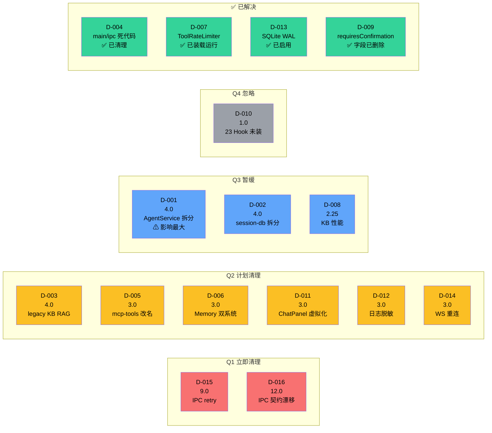
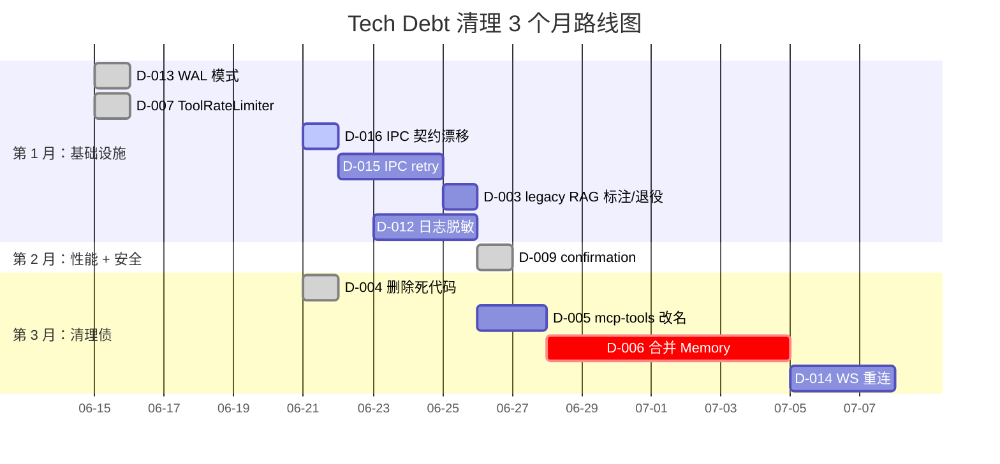

# 10 · 架构级 Tech Debt

> 从架构师视角看，技术债不仅是"丑代码"，更是"未来 6-18 个月内会让改动变贵的设计选择"。本文列出当前最影响演进能力的架构级债务，并标注已被代码或测试契约解决的旧债。

## 1. 评估方法

每条债务按三个维度打分：

- **影响面**：1（局部）- 5（系统级）
- **修复成本**：1（小时）- 5（周级）
- **紧迫度**：1（可推迟）- 5（阻碍演进）

最终优先级 = 影响面 × 紧迫度 / 修复成本。

## 2. 债务清单

### D-001 · AgentService 上帝对象（影响 5 / 成本 4 / 紧迫 4）

**位置**：`server/agent-service.ts`，当前约 1,200 行。

**症状**：
- 同时管理 AgentLoop 生命周期、会话状态、Provider 配置、并发控制、ready 协调、事件广播、状态查询。
- 字段 25 个：`loops / runStates / activeSessions / subscribers / config / workspaceDir / providerConfigs / defaultModel / defaultProvider / db / kbStore / kbDb / registry / mcp / concurrencyManager / agentStore / sessionManager / metricsAdapter / management / pmService / requirementStore / wikiStore / wikiStoreGlobal / extractorsConfig / toolUsageStore / readyModules / deferredActions`（v0.8 注入 7 个工作流域服务：`management / pmService / requirementStore / wikiStore / wikiStoreGlobal / extractorsConfig / toolUsageStore`）。

**风险**：任何 Agent 相关改动都要碰这个文件，merge conflict 概率高。

**建议拆分**：

```
agent-service.ts (orchestrator, 200 行)
├─ loop-supervisor.ts     (loops Map + createLoop/recreateLoop)
├─ agent-registry.ts      (agentStore 代理)
├─ provider-throttle.ts   (concurrencyManager 注入)
├─ readiness-coordinator.ts (notifyReady / whenReady)
└─ event-broadcaster.ts   (subscribers Set + emit)
```

**优先级**：4 × 4 / 4 = **4.0**。

---

### D-002 · session-db.ts 巨型 Store（影响 4 / 成本 3 / 紧迫 3）

**位置**：`server/session-db.ts`，当前约 960 行。

**症状**：一张表一个类本应 < 200 行，这里塞了：
- sessions CRUD
- messages CRUD
- turns CRUD
- turn_state CRUD
- tool_executions CRUD
- KeyValueStore 持有
- ~~MemoryStore 持有（旧）~~ ✅ **v0.8 已删**(僵尸清理,见 D-006)
- MemoryNodeStore 持有（新,**当前唯一 memory 后端**)

**风险**：业务表增长后单文件不可维护。

**建议拆分**：

```
session-db.ts (orchestrator, 100 行)
├─ sessions-store.ts    (sessions + main session)
├─ messages-store.ts    (messages)
├─ turns-store.ts       (turns + turn_state)
├─ tool-executions-store.ts
├─ key-value-store.ts   (已独立)
├─ ~~memory-store.ts~~      (~~旧版~~ v0.8 已删,见 D-006;SessionDB 不再持有)
└─ memory-node-store.ts (已拆为独立文件但仍由 SessionDB 实例化（`session-db.ts:70-71`），新版,**唯一 memory 后端**)
```

**优先级**：4 × 3 / 3 = **4.0**。

---

### D-003 · Legacy KB RAG hook 未接通/待退役（影响 2 / 成本 1 / 紧迫 2）

**位置**：`runtime/hooks/rag-hooks.ts:13-25`、`server/agent-service.ts:createLoopForSession()`。

**症状**：`rag-hooks.ts` 仍被注册，但普通 Agent 会话的 `SessionConfig` 没有注入 `getRagContext`，所以 hook 默认直接返回，不会把 KB 内容注入 `ctx.ragContext`。旧文档曾把它描述为“自动 RAG 查询未带当前问题”，但从当前实际运行路径看，它更像是迁移后留下的可选扩展点。

**风险**：维护者会误以为 KB 自动 RAG 仍在生产路径中，进而在错误的位置修功能；产品层也容易混淆“KB 手动检索”和“Wiki 记忆注入”。

**修复**：
1. 若短期不做自动 RAG：停止注册 `rag-hooks.ts` 或加 feature flag，并在代码注释中标明 legacy optional。
2. 若要恢复自动 RAG：重新设计 KB binding、query planner、上下文预算、与 Wiki anchors 的去重策略，而不是只补 `getRagContext(agentId, query)`。

**优先级**：2 × 2 / 1 = **4.0**。

---

### D-004 · main/ipc/* 死代码 ✅ **已解决**

**原位置**：`src/main/ipc.ts` 与 `src/main/ipc/`。

**当前状态**：P9 已清理。当前工作树中 `src/main/ipc.ts` 与 `src/main/ipc/` 均不存在，`tests/unit/p9-dead-path-removal.test.ts` 明确校验这一点，并校验 `ipc-proxy.ts` 是 main 进程唯一批量 IPC 注册路径。

**剩余风险**：死代码本身已解决，但 IPC 契约仍有漂移风险，见 D-016。

**原优先级**：2 × 3 / 1 = **6.0**。→ ✅ 已解决。

---

### D-005 · runtime/mcp-tools/ 目录名误导（影响 2 / 成本 2 / 紧迫 3）

**位置**：`runtime/mcp-tools/` 6 个文件 + 1 个 cookie-jar。

**症状**：不是 MCP 客户端，是 built-in 高级工具。

**修复**：改名为 `runtime/advanced-tools/`，更新所有 import。

**优先级**：2 × 3 / 2 = **3.0**。

---

### D-006 · 双 Memory 系统 ✅ **已清理**

**原位置**：~~`server/memory-store.ts` (266)~~ + `server/memory-node-store.ts` (352)。

**当前状态**：master 本批已清理僵尸 `MemoryStore`。具体删除:
- `src/server/memory-store.ts`(`MemoryStore` 类)文件已删
- `src/runtime/mcp-tools/memory-tools.ts`(唯一消费者,零 importer)文件已删
- `db-migration.ts` 加 `DROP TABLE IF EXISTS memory_entities` + `DROP TABLE IF EXISTS memory_relations`

`MemoryNodeStore`(4 张表:`memory_nodes` / `memory_subjects` / `memory_edges` / `memory_nodes_fts`)
**保留**,仍是 `wiki-anchor-injection` / `wiki-search` 间接读取的唯一 memory 后端。
05-persistence.md §2 / §4.0.2 / §5 已同步更正表计数(sessions.db 总表 ≈31,memory_* 只剩 4 张)。

**剩余风险**:无新风险。若旧 DB 残留 `memory_entities` / `memory_relations` 行数据,
`db-migration.ts` 的 `DROP TABLE IF EXISTS` 会直接丢弃(僵尸零运行时写入者,数据无业务价值)。

**原描述**（保留供参考）:
- **症状**：两套并存。`MemoryStore` 是**僵尸**——零运行时写入者,且其唯一消费者
  `runtime/mcp-tools/memory-tools.ts` 零 importer(已从工具注册表移除)。`MemoryNodeStore`
  仍被 `wiki-anchor-injection` / `wiki-search` 间接读取。旧表数据可能在 DB 中。
- **修复方案**:删除旧版 + `mcp-tools/memory-tools.ts`(已执行)。

**原优先级**：3 × 3 / 3 = **3.0**。→ ✅ 已清理(master 本批删除 memory-store.ts + memory-tools.ts + DROP 2 表)。

---

### D-007 · ToolRateLimiter 已装载运行 ✅ **已解决**

**位置**：`runtime/tool-rate-limiter.ts` 122 行。

**解决说明**：已在 `agent-loop.ts:53` 导入、`line 117` 实例化，并在 `tool-factory.ts:121-156` 中调用 acquire/release。工具限流已在生产路径运行。

**原描述**（保留供参考）：
- 完整实现，每个工具有独立的"信号量 + 间隔门控"。
- 高频工具（WebSearch / WebFetch）不会被 LLM 滥用。

**原优先级**：3 × 3 / 2 = **4.5**。→ ✅ 已解决。

---

### D-008 · KB 搜索性能瓶颈（影响 3 / 成本 4 / 紧迫 3）

**位置**：`server/kb-search.ts` cosine 计算在客户端循环。

**症状**：`getAllChunksForSearch()` 全量加载 + 循环计算。10K+ chunks 时秒级延迟。

**修复路径**：
- 短期：限制 KB 大小 + 显示"性能警告"。
- 中期：sqlite-vss（SQLite 原生向量搜索）。
- 长期：外置向量库（lancedb / qdrant）。

**优先级**：3 × 3 / 4 = **2.25**。

---

### D-009 · `meta.requiresConfirmation` 字段已删除 ✅ **已解决**

**原位置**：所有 `buildTool({meta:{requiresConfirmation: true}})`。

**当前状态**：字段已从 `src` 删除（v0.8 hook-first）。工具确认 UX 改走 `PreToolUse` hook + permission 机制，不需要工具 meta 的 boolean 字段。原描述的"meta 字段未完全接通"已不成立——根本就不该有这个 meta。

**原描述**（保留供参考）：
- 字段已定义，无 UI 弹窗，无 hook 阻断。

**原优先级**：3 × 3 / 2 = **4.5**。→ ✅ 已解决（字段删除，无需"接通"）。

---

### D-010 · 23 个 Hook 未装载（影响 2 / 成本 4 / 紧迫 2）

**位置**：`core/hook-types.ts:28-39` 30 个事件，实际注册 7 个事件类型（剩余 19 个 emit 点无 handler）。

**症状**：`PermissionRequest / TeammateIdle / TaskCreated / TaskCompleted / Elicitation / ElicitationResult / ConfigChange / CwdChanged / FileChanged / WorktreeCreate / WorktreeRemove / InstructionsLoaded / Notification` 等未注册。

**修复**：
- 删除无用定义；或
- 实现这些事件的具体 handler（取决于产品方向）。

**优先级**：2 × 2 / 4 = **1.0**。

---

### D-011 · ChatPanel 未虚拟化（影响 3 / 成本 2 / 紧迫 2）

**位置**：`renderer/components/layout/ChatPanel.tsx`。

**症状**：长会话（1000+ 消息）渲染慢。

**修复**：用 `react-virtuoso` 或 `react-window`。

**优先级**：3 × 2 / 2 = **3.0**。

---

### D-012 · 日志无脱敏（影响 3 / 成本 2 / 紧迫 2）

**位置**：`core/logger.ts`、`server/provider-store.ts`。

**症状**：API key 可能被 log 出来（虽然 assistant-tools 已有 `redactSensitive`）。

**修复**：在 logger 层加 `redact(obj)` 自动脱敏（key/secret/token/password 字段 → ***）。

**优先级**：3 × 2 / 2 = **3.0**。

---

### D-013 · SQLite 未启用 WAL ✅ **已解决**

**位置**：`server/session-db.ts:59-75` `constructor`。

**解决说明**：`session-db.ts:66` 和 `kb-db.ts:52` 已执行 `db.pragma('journal_mode = WAL')`。WAL 模式已启用，读写不再互斥。

**原描述**（保留供参考）：
- `better-sqlite3` 默认 `journal_mode=DELETE`。崩溃可能丢失最后一笔。
- 修复方法：构造函数加 `db.pragma('journal_mode = WAL')`。

**原优先级**：3 × 2 / 1 = **6.0**。→ ✅ 已解决。

---

### D-014 · WebSocket 重连丢事件（影响 3 / 成本 2 / 紧迫 2）

**位置**：`main/ipc-proxy.ts:214-261`。

**症状**：后端重启时，前端 WS 重连，但期间事件丢失。

**修复**：后端在 `/ws` 重连握手时回放最近 N 秒的事件缓存；前端在 WS 重连后请求 `GET /api/sessions/<id>/since=<seq>` 拉取未读消息。

**优先级**：3 × 2 / 2 = **3.0**。

---

### D-015 · IPC 调用无 retry（影响 3 / 成本 1 / 紧迫 3）

**位置**：`preload/index.ts` 所有 `invoke()` 调用。

**症状**：网络抖动或后端重启时 `api.x()` 直接失败。

**修复**：在 `preload/index.ts` 包装一层 retry-with-backoff（最多 3 次）。

**优先级**：3 × 3 / 1 = **9.0**。

---

### D-016 · preload/proxy IPC 契约漂移（影响 3 / 成本 1 / 紧迫 4）

**位置**：`preload/index.ts`、`main/ipc-proxy.ts`、`shared/ipc-api.ts`、`tests/unit/rest-routers.test.ts`。

**症状**：`preload/index.ts` 暴露 155 个 preload API（138 个唯一通道），`ipc-proxy.ts` 的 `R` 表代理 141 个通道。测试已检查大多数通道必须有映射，但当前显式放行了 4 个例外：
- `templates:github-preview`
- `templates:import-github`
- `search-provider:get`
- `search-provider:set`

其中 GitHub template 后端路由已经存在于 `server/template-router.ts`，但 `R` 表未映射；search provider 通道只在 preload 出现，后端入口待确认。

**风险**：UI 调用这些 API 时可能挂起/失败；新通道继续靠手写同步，容易再次漂移。

**修复**：
1. 对 template GitHub 两个通道补齐 `ipc-proxy.ts` 映射，或明确改成非 proxy 路径并在测试中说明原因。
2. 对 search provider 两个通道做产品决策：删除废弃 preload 方法，或补后端路由与 proxy 映射。
3. 中期从 `shared/ipc-api.ts` 生成 preload wrapper / proxy 校验，减少三处手写漂移。

**优先级**：3 × 4 / 1 = **12.0**。

---
## 3. 优先级矩阵

| 优先级 | 债务 | 影响 × 紧迫 / 成本 |
|--------|------|-------------------|
| 🔴 12.0 | D-016 preload/proxy IPC 契约漂移 | 3 × 4 / 1 |
| 🔴 9.0 | D-015 IPC 无 retry | 3 × 3 / 1 |
| ~~🔴 6.0~~ | ~~D-004 main/ipc 死代码~~ | ~~2 × 3 / 1~~ ✅ 已解决 |
| ~~🔴 6.0~~ | ~~D-013 SQLite 未启用 WAL~~ | ~~3 × 2 / 1~~ ✅ 已解决 |
| ~~🟠 4.5~~ | ~~D-007 ToolRateLimiter 未装~~ | ~~3 × 3 / 2~~ ✅ 已解决 |
| ~~🟠 4.5~~ | ~~D-009 requiresConfirmation 未通~~ | ~~3 × 3 / 2~~ ✅ 已解决（字段删除） |
| 🟠 4.0 | D-001 AgentService 上帝对象 | 5 × 4 / 4 |
| 🟠 4.0 | D-002 session-db 巨型 | 4 × 3 / 3 |
| 🟠 4.0 | D-003 legacy KB RAG hook | 2 × 2 / 1 |
| 🟡 3.0 | D-005 mcp-tools 改名 | 2 × 3 / 2 |
| 🟡 3.0 | D-006 双 Memory 系统 | 3 × 3 / 3 |
| 🟡 3.0 | D-011 ChatPanel 虚拟化 | 3 × 2 / 2 |
| 🟡 3.0 | D-012 日志脱敏 | 3 × 2 / 2 |
| 🟡 3.0 | D-014 WS 重连丢事件 | 3 × 2 / 2 |
| 🟢 2.25 | D-008 KB 搜索性能 | 3 × 3 / 4 |
| 🟢 1.0 | D-010 23 个 Hook 未装 | 2 × 2 / 4 |

### 3.1 象限图（quadrantChart）

```mermaid
quadrantChart
    title Tech Debt 优先级象限图
    x-axis "低成本 --> 高成本" 修复代价
    y-axis "低紧迫 --> 高紧迫" 紧迫度
    quadrant-1 暂缓<br/>(高成本 + 高紧迫)
    quadrant-2 立即清理<br/>(低成本 + 高紧迫)
    quadrant-3 忽略<br/>(低成本 + 低紧迫)
    quadrant-4 计划清理<br/>(高成本 + 低紧迫)
    D-003 legacy KB RAG: [0.10, 0.35]
    D-015 IPC retry: [0.10, 0.65]
    D-016 IPC 契约漂移: [0.10, 0.80]
    D-001 AgentService: [0.85, 0.75]
    D-002 session-db: [0.70, 0.55]
    D-005 mcp-tools 改名: [0.40, 0.55]
    D-006 Memory 双系统: [0.60, 0.50]
    D-011 ChatPanel 虚拟化: [0.40, 0.40]
    D-012 日志脱敏: [0.40, 0.40]
    D-014 WS 重连: [0.40, 0.40]
    D-008 KB 性能: [0.80, 0.55]
    D-010 23 Hook 未装: [0.85, 0.30]
```

**解读**：
- ~~D-013 SQLite WAL~~、~~D-007 ToolRateLimiter~~、~~D-009 requiresConfirmation~~ 已解决，从活跃债务中移除
- **第二象限（立即清理）**：2 条 — D-016 与 D-015 都是低成本且会影响前后端调用可靠性的基础设施债，建议 1 个月内处理
- **第一象限（暂缓）**：D-001（影响最大但成本 4 周）+ D-002（拆分巨型类）— 需要稳定期才能动
- **第四象限（计划清理）**：D-003 / D-005 / D-011 / D-012 / D-014 — 1 个月内分批
- **第三象限（忽略）**：D-010（23 个 hook 未装）— 视产品方向决定

### 3.2 风险-影响气泡图



## 4. 推荐的 3 个月路线图

### 4.1 甘特图



### 4.2 详细执行

#### 第 1 个月：基础设施债

1. ~~**D-013 WAL 模式**：1 小时，零风险。~~ ✅ 已完成
2. ~~**D-007 ToolRateLimiter 装载**：已在 agent-loop.ts 导入并实例化，tool-factory.ts 中调用 acquire/release。~~ ✅ 已完成
3. **D-015 IPC retry**：半天，需要小心不破坏已有调用语义。
4. **D-003 legacy RAG 标注/退役**：1 天，降低文档与运行路径误判。

#### 第 2 个月：性能 + 安全债

5. ~~**D-009 requiresConfirmation 接通**：~~ ✅ 已完成（v0.8 改为 hook-first，字段已从 `src` 删除，工具确认 UX 走 PreToolUse hook + permission，无需 meta boolean）。
6. **D-012 日志脱敏**：1 天，避免泄漏 API key。

#### 第 3 个月：清理债

7. ~~**D-004 删除 main/ipc 死代码**：1 天。~~ ✅ 已完成
8. **D-005 mcp-tools 改名**：半天，全局 rename。
9. **D-006 合并 Memory 系统**：1 周（迁移 + 测试）。
10. **D-014 WS 重连事件回放**：2 天。

#### 暂缓（视业务需要）

- **D-001 AgentService 拆分**：高价值但需要稳定期再动。
- **D-002 session-db 拆分**：同上。
- **D-008 KB 性能**：KB 用户量小，暂不急。
- **D-010 23 个 Hook**：视产品方向决定。
- **D-011 ChatPanel 虚拟化**：等用户反馈。

## 5. 架构师视角的元判断

**最严重的不是代码债，而是"文档债"**：
- 没有架构图（本文档是补救）。
- 没有模块依赖图（见 02-module-structure.md 末尾）。
- 没有"测试哪些"清单（85 unit + 8 e2e 不算文档）。
- 没有"性能预算"或"SLO"。

**次严重的是"未完成的扩展点"**：
- 23 个 hook 等待 handler（其中 10 个连 emit 都没有，纯死定义）。
- `src/main/ipc*` 死代码已清理；当前剩余的是 preload/proxy 契约漂移。
- ~~tool meta `requiresConfirmation` 等待 UI 闭环。~~ ✅ 已删除（v0.8 hook-first，确认 UX 走 PreToolUse hook + permission）
- ~~ToolRateLimiter 等待装载。~~ ✅ 已装载运行

**第三严重的是"安全债"**：
- 无确认弹窗。
- 无日志脱敏。
- 无文件路径默认限制。

修复这些会让项目在**未来 18 个月**内保持演进能力。
