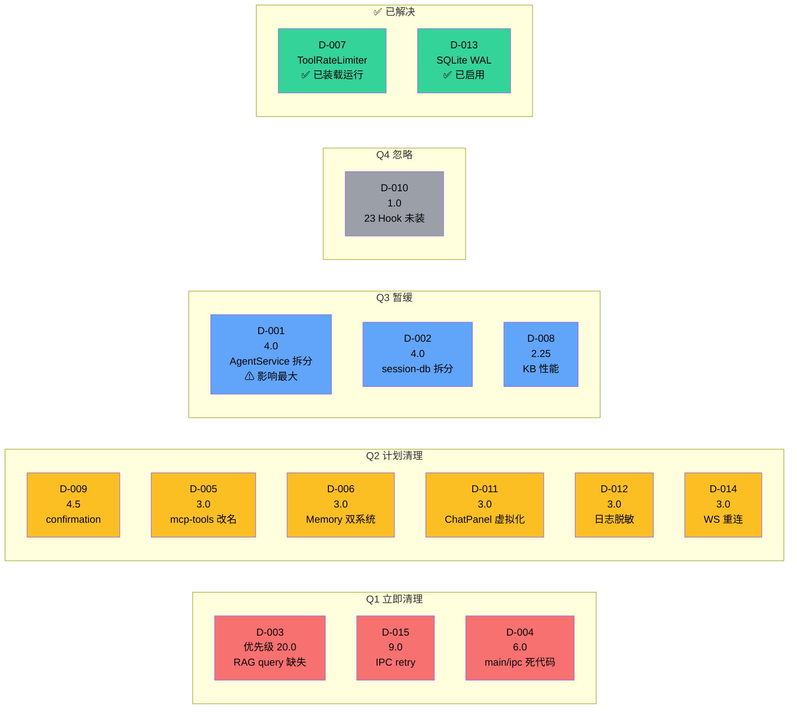
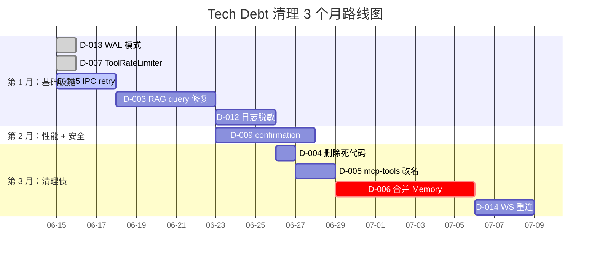

# 10 · 架构级 Tech Debt

> 从架构师视角看，技术债不仅是"丑代码"，更是"未来 6-18 个月内会让改动变贵的设计选择"。本文列出当前最影响演进能力的 12 个架构级债务。

## 1. 评估方法

每条债务按三个维度打分：

- **影响面**：1（局部）- 5（系统级）
- **修复成本**：1（小时）- 5（周级）
- **紧迫度**：1（可推迟）- 5（阻碍演进）

最终优先级 = 影响面 × 紧迫度 / 修复成本。

## 2. 债务清单

### D-001 · AgentService 上帝对象（影响 5 / 成本 4 / 紧迫 4）

**位置**：`server/agent-service.ts` 773 行。

**症状**：
- 同时管理 AgentLoop 生命周期、会话状态、Provider 配置、并发控制、ready 协调、事件广播、状态查询。
- 字段 14 个：`loops / runStates / activeSessions / subscribers / config / workspaceDir / providerConfigs / defaultModel / defaultProvider / db / kbStore / kbDb / registry / mcp / concurrencyManager / agentStore / agentToolStore / sessionManager / metricsAdapter / readyModules / deferredActions`。

**风险**：任何 Agent 相关改动都要碰这个文件，merge conflict 概率高。

**建议拆分**：

```
agent-service.ts (orchestrator, 200 行)
├─ loop-supervisor.ts     (loops Map + createLoop/recreateLoop)
├─ agent-registry.ts      (agentStore + agentToolStore 代理)
├─ provider-throttle.ts   (concurrencyManager 注入)
├─ readiness-coordinator.ts (notifyReady / whenReady)
└─ event-broadcaster.ts   (subscribers Set + emit)
```

**优先级**：4 × 4 / 4 = **4.0**。

---

### D-002 · session-db.ts 巨型 Store（影响 4 / 成本 3 / 紧迫 3）

**位置**：`server/session-db.ts` 812 行。

**症状**：一张表一个类本应 < 200 行，这里塞了：
- sessions CRUD
- messages CRUD
- turns CRUD
- turn_state CRUD
- tool_executions CRUD
- KeyValueStore 持有
- MemoryStore 持有（旧）
- MemoryNodeStore 持有（新）

**风险**：业务表增长后单文件不可维护。

**建议拆分**：

```
session-db.ts (orchestrator, 100 行)
├─ sessions-store.ts    (sessions + main session)
├─ messages-store.ts    (messages)
├─ turns-store.ts       (turns + turn_state)
├─ tool-executions-store.ts
├─ key-value-store.ts   (已独立)
├─ memory-store.ts      (已独立，旧版)
└─ memory-node-store.ts (已独立，新版)
```

**优先级**：4 × 3 / 3 = **4.0**。

---

### D-003 · RAG query 缺失（影响 4 / 成本 1 / 紧迫 5）

**位置**：`runtime/hooks/rag-hooks.ts:13-25`、`agent-service.ts` 中的 `getRagContext` 实现。

**症状**：`getRagContext(agentId, "")` 传空 query，导致 KB 检索不针对当前问题。

**风险**：RAG 功能形同虚设。

**修复**：
1. 让 `getRagContext(agentId, query)` 在 `rag-hooks.ts` 中先取 `session.getMessages().filter(user).pop()` 作为 query。
2. 在 `agent-loop.executeStream()` 里把 ctx.ragContext 注入到 messages。

**优先级**：4 × 5 / 1 = **20.0**（最高）。

---

### D-004 · main/ipc/* 死代码（影响 2 / 成本 1 / 紧迫 3）

**位置**：`src/main/ipc/` 下 20 个 `*-handlers.ts` 文件。

**症状**：未被 `main/index.ts` 装载，似乎是早期版本遗留。

**风险**：新工程师困惑；维护成本。

**修复决策**：删除 / 移入 `tests/fixtures/` / 重新启用。**建议删除**。

**优先级**：2 × 3 / 1 = **6.0**。

---

### D-005 · runtime/mcp-tools/ 目录名误导（影响 2 / 成本 2 / 紧迫 3）

**位置**：`runtime/mcp-tools/` 6 个文件 + 1 个 cookie-jar。

**症状**：不是 MCP 客户端，是 built-in 高级工具。

**修复**：改名为 `runtime/advanced-tools/`，更新所有 import。

**优先级**：2 × 3 / 2 = **3.0**。

---

### D-006 · 双 Memory 系统（影响 3 / 成本 3 / 紧迫 3）

**位置**：`server/memory-store.ts` (266) + `server/memory-node-store.ts` (324)。

**症状**：两套并存，旧版 tools 不装载，但数据可能在 DB 中。

**修复**：
- 把旧版数据 migrate 到新版
- 删除旧版 + `mcp-tools/memory-tools.ts`
- 或反之：删除新版

**优先级**：3 × 3 / 3 = **3.0**。

---

### D-007 · ToolRateLimiter 已装载运行 ✅ **已解决**

**位置**：`runtime/tool-rate-limiter.ts` 122 行。

**解决说明**：已在 `agent-loop.ts:53` 导入、`line 117` 实例化，并在 `tool-factory.ts:121-156` 中调用 acquire/release。工具限流已在生产路径运行。

**原描述**（保留供参考）：
- 完整实现，每个工具有独立的"信号量 + 间隔门控"。
- 高频工具（WebSearch / WebFetch）不会被 LLM 滥用。

**原优先级**：3 × 3 / 2 = **4.5**。→ ✅ 已解决。

---

### D-008 · KB 搜索性能瓶颈（影响 3 / 成本 4 / 紧迫 3）

**位置**：`server/kb-search.ts` cosine 计算在客户端循环。

**症状**：`getAllChunksForSearch()` 全量加载 + 循环计算。10K+ chunks 时秒级延迟。

**修复路径**：
- 短期：限制 KB 大小 + 显示"性能警告"。
- 中期：sqlite-vss（SQLite 原生向量搜索）。
- 长期：外置向量库（lancedb / qdrant）。

**优先级**：3 × 3 / 4 = **2.25**。

---

### D-009 · `meta.requiresConfirmation` 未接通（影响 3 / 成本 2 / 紧迫 3）

**位置**：所有 `buildTool({meta:{requiresConfirmation: true}})`。

**症状**：字段已定义，无 UI 弹窗，无 hook 阻断。

**修复**：
1. 前端渲染时根据 `requiresConfirmation` 显示"确认"按钮。
2. 后端 PreToolUse hook 检查 tool meta，弹出确认。
3. 用户拒绝 → return blocked。

**优先级**：3 × 3 / 2 = **4.5**。

---

### D-010 · 23 个 Hook 未装载（影响 2 / 成本 4 / 紧迫 2）

**位置**：`core/hook-types.ts:28-39` 30 个事件，实际只用了 7 个。

**症状**：`PermissionRequest / TeammateIdle / TaskCreated / TaskCompleted / Elicitation / ElicitationResult / ConfigChange / CwdChanged / FileChanged / WorktreeCreate / WorktreeRemove / InstructionsLoaded / Notification` 等未注册。

**修复**：
- 删除无用定义；或
- 实现这些事件的具体 handler（取决于产品方向）。

**优先级**：2 × 2 / 4 = **1.0**。

---

### D-011 · ChatPanel 未虚拟化（影响 3 / 成本 2 / 紧迫 2）

**位置**：`renderer/components/layout/ChatPanel.tsx`。

**症状**：长会话（1000+ 消息）渲染慢。

**修复**：用 `react-virtuoso` 或 `react-window`。

**优先级**：3 × 2 / 2 = **3.0**。

---

### D-012 · 日志无脱敏（影响 3 / 成本 2 / 紧迫 2）

**位置**：`core/logger.ts`、`server/provider-store.ts`。

**症状**：API key 可能被 log 出来（虽然 assistant-tools 已有 `redactSensitive`）。

**修复**：在 logger 层加 `redact(obj)` 自动脱敏（key/secret/token/password 字段 → ***）。

**优先级**：3 × 2 / 2 = **3.0**。

---

### D-013 · SQLite 未启用 WAL ✅ **已解决**

**位置**：`server/session-db.ts:49-65` `constructor`。

**解决说明**：`session-db.ts:56` 和 `kb-db.ts:52` 已执行 `db.pragma('journal_mode = WAL')`。WAL 模式已启用，读写不再互斥。

**原描述**（保留供参考）：
- `better-sqlite3` 默认 `journal_mode=DELETE`。崩溃可能丢失最后一笔。
- 修复方法：构造函数加 `db.pragma('journal_mode = WAL')`。

**原优先级**：3 × 2 / 1 = **6.0**。→ ✅ 已解决。

---

### D-014 · WebSocket 重连丢事件（影响 3 / 成本 2 / 紧迫 2）

**位置**：`main/ipc-proxy.ts:214-261`。

**症状**：后端重启时，前端 WS 重连，但期间事件丢失。

**修复**：后端在 `/ws` 重连握手时回放最近 N 秒的事件缓存；前端在 WS 重连后请求 `GET /api/sessions/<id>/since=<seq>` 拉取未读消息。

**优先级**：3 × 2 / 2 = **3.0**。

---

### D-015 · IPC 调用无 retry（影响 3 / 成本 1 / 紧迫 3）

**位置**：`preload/index.ts` 所有 `invoke()` 调用。

**症状**：网络抖动或后端重启时 `api.x()` 直接失败。

**修复**：在 `preload/index.ts` 包装一层 retry-with-backoff（最多 3 次）。

**优先级**：3 × 3 / 1 = **9.0**。

---

## 3. 优先级矩阵

| 优先级 | 债务 | 影响 × 紧迫 / 成本 |
|--------|------|-------------------|
| 🔴 20.0 | D-003 RAG query 缺失 | 4 × 5 / 1 |
| 🔴 9.0 | D-015 IPC 无 retry | 3 × 3 / 1 |
| 🔴 6.0 | D-004 main/ipc 死代码 | 2 × 3 / 1 |
| ~~🔴 6.0~~ | ~~D-013 SQLite 未启用 WAL~~ | ~~3 × 2 / 1~~ ✅ 已解决 |
| ~~🟠 4.5~~ | ~~D-007 ToolRateLimiter 未装~~ | ~~3 × 3 / 2~~ ✅ 已解决 |
| 🟠 4.5 | D-009 requiresConfirmation 未通 | 3 × 3 / 2 |
| 🟠 4.0 | D-001 AgentService 上帝对象 | 5 × 4 / 4 |
| 🟠 4.0 | D-002 session-db 巨型 | 4 × 3 / 3 |
| 🟡 3.0 | D-005 mcp-tools 改名 | 2 × 3 / 2 |
| 🟡 3.0 | D-006 双 Memory 系统 | 3 × 3 / 3 |
| 🟡 3.0 | D-011 ChatPanel 虚拟化 | 3 × 2 / 2 |
| 🟡 3.0 | D-012 日志脱敏 | 3 × 2 / 2 |
| 🟡 3.0 | D-014 WS 重连丢事件 | 3 × 2 / 2 |
| 🟢 2.25 | D-008 KB 搜索性能 | 3 × 3 / 4 |
| 🟢 1.0 | D-010 23 个 Hook 未装 | 2 × 2 / 4 |

### 3.1 象限图（quadrantChart）

```mermaid
quadrantChart
    title Tech Debt 优先级象限图
    x-axis "低成本 --> 高成本" 修复代价
    y-axis "低紧迫 --> 高紧迫" 紧迫度
    quadrant-1 暂缓<br/>(高成本 + 高紧迫)
    quadrant-2 立即清理<br/>(低成本 + 高紧迫)
    quadrant-3 忽略<br/>(低成本 + 低紧迫)
    quadrant-4 计划清理<br/>(高成本 + 低紧迫)
    D-003 RAG query: [0.10, 0.95]
    D-015 IPC retry: [0.10, 0.65]
    D-004 main/ipc 死代码: [0.10, 0.60]
    D-009 confirmation: [0.45, 0.60]
    D-001 AgentService: [0.85, 0.75]
    D-002 session-db: [0.70, 0.55]
    D-005 mcp-tools 改名: [0.40, 0.55]
    D-006 Memory 双系统: [0.60, 0.50]
    D-011 ChatPanel 虚拟化: [0.40, 0.40]
    D-012 日志脱敏: [0.40, 0.40]
    D-014 WS 重连: [0.40, 0.40]
    D-008 KB 性能: [0.80, 0.55]
    D-010 23 Hook 未装: [0.85, 0.30]
```

**解读**：
- ~~D-013 SQLite WAL~~ 和 ~~D-007 ToolRateLimiter~~ 已解决，从活跃债务中移除
- **第二象限（立即清理）**：3 条 — 低成本高紧迫的"零成本 bug 修复"，建议 1 个月内全部处理
- **第一象限（暂缓）**：D-001（影响最大但成本 4 周）+ D-002（拆分巨型类）— 需要稳定期才能动
- **第四象限（计划清理）**：D-005 / D-009 / D-011-014 — 1 个月内分批
- **第三象限（忽略）**：D-010（23 个 hook 未装）— 视产品方向决定

### 3.2 风险-影响气泡图



## 4. 推荐的 3 个月路线图

### 4.1 甘特图



### 4.2 详细执行

#### 第 1 个月：基础设施债

1. ~~**D-013 WAL 模式**：1 小时，零风险。~~ ✅ 已完成
2. ~~**D-007 ToolRateLimiter 装载**：已在 agent-loop.ts 导入并实例化，tool-factory.ts 中调用 acquire/release。~~ ✅ 已完成
3. **D-015 IPC retry**：半天，需要小心不破坏已有调用语义。
4. **D-003 RAG query 修复**：1 天，影响产品功能。

#### 第 2 个月：性能 + 安全债

5. **D-009 requiresConfirmation 接通**：2-3 天，提升安全 UX。
6. **D-012 日志脱敏**：1 天，避免泄漏 API key。

#### 第 3 个月：清理债

7. **D-004 删除 main/ipc 死代码**：1 天。
8. **D-005 mcp-tools 改名**：半天，全局 rename。
9. **D-006 合并 Memory 系统**：1 周（迁移 + 测试）。
10. **D-014 WS 重连事件回放**：2 天。

#### 暂缓（视业务需要）

- **D-001 AgentService 拆分**：高价值但需要稳定期再动。
- **D-002 session-db 拆分**：同上。
- **D-008 KB 性能**：KB 用户量小，暂不急。
- **D-010 23 个 Hook**：视产品方向决定。
- **D-011 ChatPanel 虚拟化**：等用户反馈。

## 5. 架构师视角的元判断

**最严重的不是代码债，而是"文档债"**：
- 没有架构图（本文档是补救）。
- 没有模块依赖图（见 02-module-structure.md 末尾）。
- 没有"测试哪些"清单（85 unit + 8 e2e 不算文档）。
- 没有"性能预算"或"SLO"。

**次严重的是"未完成的扩展点"**：
- 23 个 hook 等待 handler。
- 3 个 IPC handler 文件等待启用决策。
- tool meta `requiresConfirmation` 等待 UI 闭环。
- ~~ToolRateLimiter 等待装载。~~ ✅ 已装载运行

**第三严重的是"安全债"**：
- 无确认弹窗。
- 无日志脱敏。
- 无文件路径默认限制。

修复这些会让项目在**未来 18 个月**内保持演进能力。
