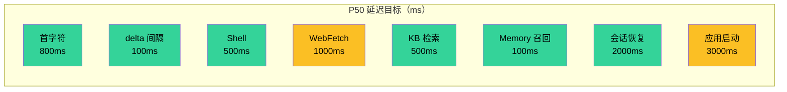
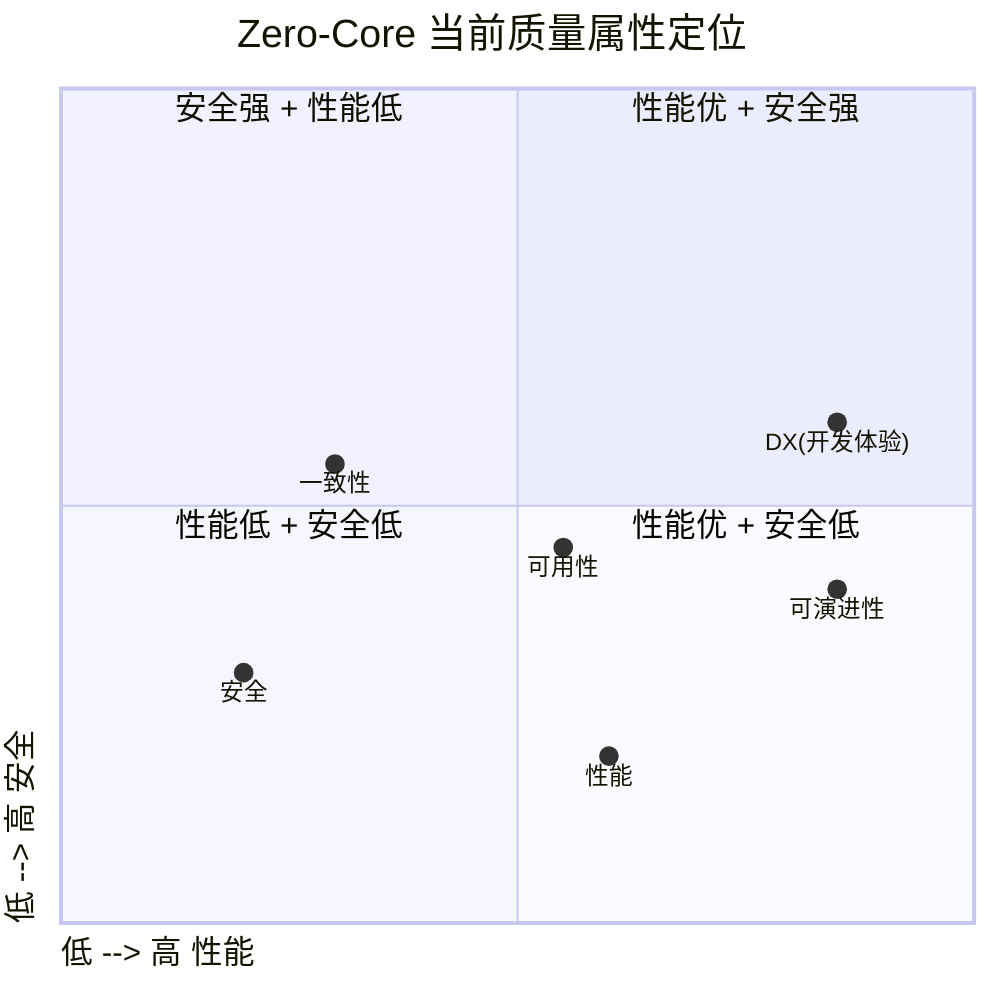

# 11 · 质量属性与 SLO

> 架构的"质量属性"是它在不同压力下的表现。本文明确 Zero-Core 在延迟、吞吐、一致性、可用性、可演进性上的当前水平，并给出可量化的目标。

## 1. 优先级排序

任何架构都不能同时优化所有质量属性。Zero-Core 的取舍：

| 优先级 | 质量属性 | 说明 |
|--------|----------|------|
| 🥇 | **可演进性 (Evolvability)** | 系统能随产品迭代快速调整 |
| 🥈 | **开发者体验 (DX)** | 工程师能高效加新工具 / 改 prompt |
| 🥉 | **延迟 (Latency)** | 用户感受到的响应速度 |
| 4 | **吞吐 (Throughput)** | 同时处理多少会话 / 工具 |
| 5 | **可用性 (Availability)** | 进程崩了能恢复 |
| 6 | **一致性 (Consistency)** | 数据不会丢 |
| 7 | **安全性 (Security)** | 不破坏用户系统 |

**架构师取舍**：把可演进性放第一位，意味着接受"未做完美的安全/一致性优化"以换取快速迭代。这是**正确的**产品早期选择——但随着用户量增长，需要逐步提升安全/一致性优先级。

## 2. 延迟 SLO

### 2.0 SLO 仪表盘（gauge-style bar chart）



**色标**：🟢 满足 | 🟠 临界 | 🔴 超标

### 2.1 当前实测特征（来自代码 + 常识）

| 操作 | 期望 P50 | 期望 P95 | 备注 |
|------|----------|----------|------|
| 用户输入 → 首字符显示 | < 800ms | < 2s | IPC + HTTP + LLM 冷启 |
| 文本 delta 间隔 | < 100ms | < 300ms | WS 推送速度 |
| 工具调用（Shell 简单命令）| < 500ms | < 2s | 取决于命令 |
| 工具调用（WebFetch）| < 1s | < 5s | 取决于目标网站 |
| 工具调用（KB 检索）| < 500ms | < 2s | 取决于 KB 大小 |
| 工具调用（Memory 召回）| < 100ms | < 300ms | FTS5 本地查询 |
| 会话恢复 | < 2s | < 5s | DB 读取 + UI 渲染 |
| 应用启动 | < 3s | < 6s | Electron + 后端 spawn |

### 2.2 关键路径延迟拆解

**用户输入到首字符**：
```
IPC invoke (5ms)
  → HTTP proxy (5ms)
  → AgentLoop.run() (10ms)
  → resolveModel + acquire queue (50ms)
  → LLM first token (500ms - 取决于 Provider)
  → WS push (5ms)
  → IPC event (5ms)
  → React render (50ms)
─────────────────────
≈ 630ms P50, 2s P95
```

### 2.3 优化机会

| 阶段 | 当前 | 可优化 |
|------|------|--------|
| 后端冷启 | spawn 后 stdout ready | 预 spawn（应用启动时即拉起）|
| Provider 缓存 | 已实现 | OK |
| LLM 调用 | 单请求 | 流式 + 预取首批 |
| UI 渲染 | 全量消息 | 虚拟化（ChatPanel）|

## 3. 吞吐 SLO

### 3.1 当前并发模型

- **Provider 并发**：每 Provider 默认上限 1（可在 ProviderStore 配置 `maxConcurrency`，clamp 1-10）。
- **会话并发**：理论上无限（每 session 一个 AgentLoop）。
- **MCP 连接**：无显式上限，受 stdio 文件描述符限制。
- **工具并发**：每个工具受 ToolRateLimiter 控制（已装载运行）。

### 3.2 实际能力估计

- 单 Provider：1-10 并发 LLM 请求。
- 全局：~50 并发 AgentLoop（受 better-sqlite3 单线程限制）。
- 工具调用：~100 并发（受 Node.js event loop 限制）。

### 3.3 限制点

- **better-sqlite3 是同步驱动**：所有 DB 操作在同一线程，串行化。
- **单 SQLite 文件**：写锁是全局的。
- **AI SDK 是 fetch-based**：受 fetch 池限制（默认 Node.js 无界）。

### 3.4 优化机会

- WAL 模式已启用（session-db.ts:56 和 kb-db.ts:52），读写不互斥。
- 读多写少场景可考虑只读副本（但 better-sqlite3 不支持）。
- AI SDK fetch 池设置 `dispatcher` 限流。

## 4. 一致性 SLO

### 4.1 当前保证

- **turns 表是 source of truth**：messages 表是 write-through 缓存。如果两者不一致，UI 用 turns 重建。
- **单 SQLite 文件**：写是原子的（better-sqlite3 transaction 包裹）。
- **KV store**：最后写覆盖。无版本号。
- **JSON 迁移**：幂等。重复运行 `db-migration.ts` 不会重复导入。

### 4.2 不保证的场景

- **进程崩溃时最后一笔写入**：WAL 模式已启用（`journal_mode=WAL`），大幅降低丢失风险。
- **跨表事务**：session-db.ts 内部用 `db.transaction()`，跨表是原子的；跨多个方法调用不是。
- **多进程写入**：当前单进程，无竞争。如果未来多进程，需要锁。

### 4.3 数据丢失风险

| 场景 | 风险 | 修复 |
|------|------|------|
| 应用崩溃在 turn 持久化前 | 丢失当前 turn 的部分数据 | WAL 已启用 + checkpoint |
| SQLite 文件损坏 | 全部历史 | 备份 + 定期 VACUUM |
| 用户误删 ~/.zero-core | 全部 | 文档化 + 自动备份 |
| WebFetch 缓存失效 | 用户重新抓取 | 默认 24h 过期 |

## 5. 可用性 SLO

### 5.1 当前保证

- **后端进程崩溃自动重启**：`backend-spawn.ts:84-88` 检测到 exit code 非零就重启。
- **IPC 自动重连**：`main/ipc-proxy.ts:235-238` WS 2 秒重连。
- **会话恢复**：`recovery.ts` 启动时扫描未完成 turn。
- **MCP 服务器断开**：不会自动重连，需要手动 `POST /api/mcp/:id/reconnect`。

### 5.2 不保证的场景

- **MCP stdio 进程崩溃**：仅在用户重连时恢复。
- **KB 文件删除**：chunks 仍存在直到用户手动删除 KB。
- **LLM Provider 配额耗尽**：返回 `rate_limit` 错误，重试 3 次后失败。

### 5.3 优化机会

- MCP 自愈：监听 transport 'exit' 事件，自动 reconnect。
- Provider 配额监控：暴露指标 + UI 警告。

## 6. 可演进性评估

### 6.1 加一个新工具的成本

**当前**：30 分钟
- 写工具文件（10 min）
- 注册到 `ALL_TOOLS`（1 min）
- 写单元测试（10 min）
- 更新 ToolsPage UI（如果需要新字段）（5 min）
- E2E 测试（如果关键路径）（5 min）

**评估**：✅ 良好。

### 6.2 加一个新 Provider 的成本

**当前**：2 小时
- `provider-factory.ts` 加 case（5 min）
- 加测试（30 min）
- ProviderStore 加预设（10 min）
- Settings UI 加表单（30 min）
- 文档（45 min）

**评估**：✅ 良好。

### 6.3 加一个新 Hook 事件的成本

**当前**：4 小时（如果复用现有装载点）
- `hook-types.ts` 加事件名（5 min）
- 写 handler（1-2 hour）
- 注册（10 min）
- 测试（30 min）

**评估**：⚠️ 中等。需要理解 hook 触发点。

### 6.4 加一个新 IPC Channel 的成本

**当前**：30 分钟
- `shared/preload-types.ts` 加方法签名（5 min）
- `main/ipc-proxy.ts` 加映射（5 min）
- `server/*-router.ts` 加路由（10 min）
- 渲染层调用（10 min）

**评估**：✅ 良好。

### 6.5 加一种新的持久化表的成本

**当前**：2 小时
- `db-migration.ts` 加列（10 min）
- 写 SqliteStore（30 min）
- 写 Router（30 min）
- 写 Store（30 min）
- 测试（30 min）

**评估**：✅ 良好（基于 SqliteStore 通用 CRUD）。

### 6.6 跨层重构的成本评估

| 重构类型 | 估计成本 | 风险 |
|----------|----------|------|
| 改 LLM Provider | 1 天 | 低 |
| 改 MCP transport | 1 天 | 中 |
| 改持久化后端（SQLite → Postgres）| 4-6 周 | 高 |
| 改 UI 框架（React → Vue）| 8-12 周 | 极高 |
| 加分布式（多机部署）| 12+ 周 | 极高 |

**评估**：项目对**单进程 + 单机**假设深度依赖。打破这个假设是高成本动作。

## 7. 容量规划

### 7.1 当前规模假设

- 单用户单机
- 消息数：~10K turns / session
- 工具调用：~1K / day
- KB chunks：~5K
- Memory nodes：~500
- MCP servers：~5
- Agents：~10

### 7.2 容量天花板（粗估）

| 资源 | 天花板 | 瓶颈 |
|------|--------|------|
| 消息数 | ~100K turns | turns 表全量重建时间 |
| KB chunks | ~50K | 搜索 O(M×D) |
| Memory nodes | ~10K | FTS5 OK，更新 trigger 慢 |
| Agent 并发 | ~50 | event loop + SQLite 锁 |
| LLM 并发 | 1-10 per Provider | Provider 配额 |
| 日志大小 | ~1MB / day | 默认 7 天保留 |

### 7.3 扩容路径

- **KB**：迁移到外置向量库（lancedb / qdrant）。
- **会话**：分表或迁移到 Postgres。
- **Memory**：分区（旧 node 归档）。
- **日志**：采样或聚合。
- **多用户**：换 server 架构 + 加 auth。

## 8. 安全 SLO

### 8.1 当前边界

- **Renderer 沙箱**：contextIsolation=true / nodeIntegration=false / contextBridge 限定到约 140 个代理通道 + 5 个本地通道；当前仍有 4 个 preload/proxy 例外需收敛。
- **文件路径**：默认不限制 workspace（`restrictToWorkspace = false` 默认）。
- **Shell**：无黑名单。
- **WebFetch Cookie**：本地 `~/.zero-core/webfetch/cookies.json`，权限 0600 假设。
- **代理**：undici 全局 dispatcher。

### 8.2 风险评估

| 风险 | 等级 | 修复 |
|------|------|------|
| 文件路径越权 | 中 | 默认 restrict + 用户白名单 |
| Shell 危险命令 | 中 | 黑名单 + `requiresConfirmation` |
| 日志泄漏 API key | 中 | logger 层脱敏 |
| Cookie 泄漏 | 低 | 文件权限 + 加密 |
| LLM 注入 | 中 | 系统 prompt + guidelines |
| Prompt injection from tool result | 中 | PreToolUse 校验 |

### 8.3 优化路径

短期（1 周）：D-012 日志脱敏 + D-009 requiresConfirmation 接通。
中期（1 月）：文件路径默认限制 workspace。
长期（持续）：建立 threat model + 定期 audit。

## 9. 一图总结（架构师的取舍）



**结论**：项目在"快速迭代"和"基础可靠"上做了良好平衡。安全与一致性是未来的重点投入方向。
