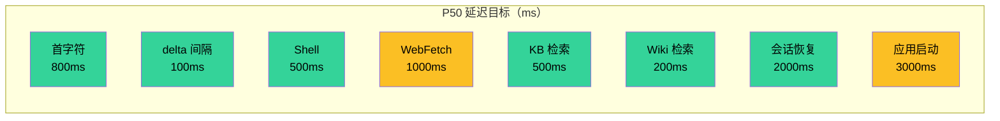

# 11 · 质量属性与 SLO

> 架构的"质量属性"是它在不同压力下的表现。本文明确 Zero-Core 在延迟、吞吐、一致性、可用性、可演进性上的当前水平，并给出可量化的目标。

## 1. 优先级排序

任何架构都不能同时优化所有质量属性。Zero-Core 的取舍：

| 优先级 | 质量属性 | 说明 |
|--------|----------|------|
| 🥇 | **可演进性 (Evolvability)** | 系统能随产品迭代快速调整 |
| 🥈 | **开发者体验 (DX)** | 工程师能高效加新工具 / 改 prompt |
| 🥉 | **延迟 (Latency)** | 用户感受到的响应速度 |
| 4 | **吞吐 (Throughput)** | 同时处理多少会话 / 工具 |
| 5 | **可用性 (Availability)** | 进程崩了能恢复 |
| 6 | **一致性 (Consistency)** | 数据不会丢 |
| 7 | **安全性 (Security)** | 不破坏用户系统 |

**架构师取舍**：把可演进性放第一位，意味着接受"未做完美的安全/一致性优化"以换取快速迭代。这是**正确的**产品早期选择——但随着用户量增长，需要逐步提升安全/一致性优先级。

## 2. 延迟 SLO

### 2.0 SLO 仪表盘（gauge-style bar chart）

> **v0.8 更正**：旧表第 6 行 "Memory 召回 100ms" 已废 —— MemoryRecall / MemoryNote 工具在 v0.8 P2 §11.6 从 `ALL_TOOLS` 取消注册（`src/runtime/tools/index.ts:79-83` 注释明示，"memory is now a wiki per-agent subtree"），对应后端 `MemoryStore` 变成**僵尸**（构造但零运行时写入者，见 12-glossary + 06 §2.7 矩阵）。当前主线知识检索走 **Wiki**（每 agent 一个 wiki 子树，`WikiStore` + Wiki action 工具的 expand/read/search），其延迟特性与旧的 Memory 召回（FTS5 MATCH）完全不同 —— 见下表第 6 行。KB 检索路径不变（独立 `knowledge.db`，余弦相似度）。



**色标**：🟢 满足 | 🟠 临界 | 🔴 超标

### 2.1 当前实测特征（来自代码 + 常识）

| 操作 | 期望 P50 | 期望 P95 | 备注 |
|------|----------|----------|------|
| 用户输入 → 首字符显示 | < 800ms | < 2s | IPC + HTTP + LLM 冷启 |
| 文本 delta 间隔 | < 100ms | < 300ms | WS 推送速度 |
| 工具调用（Shell 简单命令）| < 500ms | < 2s | 取决于命令 |
| 工具调用（WebFetch）| < 1s | < 5s | 取决于目标网站 |
| ~~工具调用（KB 检索）~~ | — | — | **RETIRED (plan-00 §5)**：`knowledge.db` / `kb_chunks` / `KbDB` 全部删除；KB 向量检索路径已不在运行时。 |
| 工具调用（Wiki 检索）| < 200ms | < 1s | `WikiStore` 树遍历 + FTS5 MATCH（`memory_nodes_fts`），live 路径仅在会话压缩 wiki 写失败时回退写入 |
| 会话恢复 | < 2s | < 5s | DB 读取 + UI 渲染 |
| 应用启动 | < 3s | < 6s | Electron + 后端 spawn |

### 2.2 关键路径延迟拆解

**用户输入到首字符**：
```
IPC invoke (5ms)
  → HTTP proxy (5ms)
  → AgentLoop.run() (10ms)
  → resolveModel + acquire queue (50ms)
  → LLM first token (500ms - 取决于 Provider)
  → WS push (5ms)
  → IPC event (5ms)
  → React render (50ms)
─────────────────────
≈ 630ms P50, 2s P95
```

### 2.3 优化机会

| 阶段 | 当前 | 可优化 |
|------|------|--------|
| 后端冷启 | spawn 后 stdout ready | 预 spawn（应用启动时即拉起）|
| Provider 缓存 | 已实现 | OK |
| LLM 调用 | 单请求 | 流式 + 预取首批 |
| UI 渲染 | 全量消息 | 虚拟化（ChatPanel）|

## 3. 吞吐 SLO

### 3.1 当前并发模型

- **Provider 并发**：每 Provider 默认上限 1（可在 ProviderStore 配置 `maxConcurrency`，clamp 1-10）。
- **会话并发**：理论上无限（每 session 一个 AgentLoop）。
- **MCP 连接**：无显式上限，受 stdio 文件描述符限制。
- **工具并发**：每个工具受 ToolRateLimiter 控制（已装载运行）。

### 3.2 实际能力估计

- 单 Provider：1-10 并发 LLM 请求。
- 全局：~50 并发 AgentLoop（受 better-sqlite3 单线程限制）。
- 工具调用：~100 并发（受 Node.js event loop 限制）。

### 3.3 限制点

- **better-sqlite3 是同步驱动**：所有 DB 操作在同一线程，串行化。
- **单 SQLite 文件**：写锁是全局的。
- **AI SDK 是 fetch-based**：受 fetch 池限制（默认 Node.js 无界）。

### 3.4 优化机会

- WAL 模式已启用（core-database.ts:56 / kb-db.ts:52），读写不互斥。
- v0.8 引入 14 张工作流域表 + 9 个独立 `new` 的 store（05 §2.2b + 02 §4.1.1）—— 单 `db/core.db` 写锁仍是全局串行点，但工作流域写入分散在不同 store / 路由，热点表竞争压力小于 v0.7（单一 AgentToolStore）。
- 读多写少场景可考虑只读副本（但 better-sqlite3 不支持）。
- AI SDK fetch 池设置 `dispatcher` 限流。

## 4. 一致性 SLO

### 4.1 当前保证

- **turns 表是 source of truth**：messages 表是 write-through 缓存。如果两者不一致，UI 用 turns 重建。
- **单 SQLite 文件**：写是原子的（better-sqlite3 transaction 包裹）。
- **KV store**：最后写覆盖。无版本号。
- **JSON 迁移**：幂等。重复运行 `db-migration.ts` 不会重复导入。

### 4.2 不保证的场景

- **进程崩溃时最后一笔写入**：WAL 模式已启用（`journal_mode=WAL`），大幅降低丢失风险。
- **跨表事务**：core-database.ts 内部用 `db.transaction()`，跨表是原子的；跨多个方法调用不是。
- **多进程写入**：当前单进程，无竞争。如果未来多进程，需要锁。

### 4.3 数据丢失风险

| 场景 | 风险 | 修复 |
|------|------|------|
| 应用崩溃在 turn 持久化前 | 丢失当前 turn 的部分数据 | WAL 已启用 + checkpoint |
| SQLite 文件损坏 | 全部历史 | 备份 + 定期 VACUUM |
| 用户误删 ~/.zero-core | 全部 | 文档化 + 自动备份 |
| WebFetch 缓存失效 | 用户重新抓取 | 默认 24h 过期 |

## 5. 可用性 SLO

### 5.1 当前保证

- **后端进程崩溃自动重启**：`backend-spawn.ts:117-130`（`_shuttingDown` flag 防 shutdown 竞争 + fire-and-forget 重启；详见 08 §12.3 自愈机制）。⚠️ 当前**无重启计数 / 无退避**，连续崩溃会无限静默重启（见 open questions）。
- **IPC 自动重连**：`main/ipc-proxy.ts:380-382` WS 关闭后 2 秒重连（`setTimeout(connect, 2000)`）。
- **会话恢复**：在 `server/agent-service.ts`（不是独立 `recovery.ts` 文件）的恢复路径 —— 启动时扫描 `turn_state` 表找未完成 turn，逐个 `loop.resume(turnSeq)`（`agent-service.ts:729-775`）。`turn_state` 的 durable handler 在 `src/server/durable-hooks.ts` 写入。
- **MCP 服务器断开**：不会自动重连，需要手动 `POST /api/mcp/:id/reconnect`。

### 5.2 不保证的场景

- **MCP stdio 进程崩溃**：仅在用户重连时恢复。
- **KB 文件删除**：chunks 仍存在直到用户手动删除 KB。
- **LLM Provider 配额耗尽**：返回 `rate_limit` 错误，`agent-loop.ts:427-454` 仅对 transient 错误重试，最多 `MAX_RETRIES=3`（`agent-utils.ts:29`），指数退避 base 1000ms。耗尽后 turn 标记为失败。

### 5.3 优化机会

- MCP 自愈：监听 transport 'exit' 事件，自动 reconnect。
- Provider 配额监控：暴露指标 + UI 警告。

## 6. 可演进性评估

### 6.1 加一个新工具的成本

**当前**：30 分钟
- 写工具文件（10 min）—— v0.8 后 `buildTool`（04 §2.0）自动注入 PreToolUse 阻断 hook + rateLimiter + recordToolUsage 遥测 + truncateResult，新工具无需手写这些横切关注点。
- 注册到 `ALL_TOOLS`（1 min）+ 若需 ctx 能力门控，加 `CONDITIONAL_TOOLS` 谓词（5 min）。
- 写单元测试（10 min）
- 更新 ToolsPage UI（如果需要新字段）（5 min）
- E2E 测试（如果关键路径）（5 min）

**评估**：✅ 良好。当前 25 entries / 9 categories（04 §3 矩阵）。

### 6.2 加一个新 Provider 的成本

**当前**：2 小时
- `provider-factory.ts` 加 case（5 min）
- 加测试（30 min）
- ProviderStore 加预设（10 min）
- Settings UI 加表单（30 min）
- 文档（45 min）

**评估**：✅ 良好。

### 6.3 加一个新 Hook 事件的成本

**当前**：4 小时（如果复用现有装载点）
- `hook-types.ts` 加事件名（5 min）
- 写 handler（1-2 hour）
- 注册（10 min）
- 测试（30 min）

**评估**：⚠️ 中等。需要理解 hook 触发点。

### 6.4 加一个新 IPC Channel 的成本

**当前**：30 分钟
- `main/ipc-proxy.ts` 的 `R: Record<string, RouteMapping>` 表加一行（5 min）—— 这是单一真值源，preload 方法的类型从 ROUTE_MAP 派生（07 §2.5）。
- `server/*-router.ts` 加路由（10 min）—— 自动进 `ROUTE_MAP` 派生。
- 渲染层调用（10 min）
- 若是 LOCAL 通道（不经 HTTP proxy，目前 7 个：`window:minimize/maximize/close` + `dialog:openDirectory` + `webfetch:login` + `templates:github-preview/import-github`），需在 main 进程单独 `ipcMain.handle` 注册（5 min）。

**评估**：✅ 良好。

### 6.5 加一种新的持久化表的成本

**当前**：2 小时
- `db-migration.ts` 阶段 2 加 `CREATE TABLE` DDL（10 min）—— v0.8 工作流域表（projects / requirements / project_wiki / crons / orchestrate_* / tool_configs / tool_usage 等 14 张）走批 A 阶段 2 显式 DDL，不是简单的"加列"（详见 05 §4.2 + §2.2b）。两个例外 `ToolConfigStore` + `ToolUsageStore` 手写 SQL 不基于 SqliteStore。
- 写 SqliteStore（30 min）—— 复用通用 CRUD，`server/index.ts:148-171` 独立 `new`（不挂 CoreDatabase，详见 05 §4.0.3 + 02 §4.1.1）。
- 写 Router（30 min）—— `*-router.ts` 挂到 `server/index.ts:475+`，自动进 `ROUTE_MAP` 派生（07 §2.5）。
- 写前端 Store + 5 个 store 之一订阅 `data:changed`（30 min）—— 走 `subscribeListDataChange`（增量 patch）或 `subscribeDataChange`（全量 refetch，树形数据用）。
- 测试（30 min）

**评估**：✅ 良好（基于 SqliteStore 通用 CRUD + ROUTE_MAP 自动派生）。

### 6.6 跨层重构的成本评估

| 重构类型 | 估计成本 | 风险 |
|----------|----------|------|
| 改 LLM Provider | 1 天 | 低 |
| 改 MCP transport | 1 天 | 中 |
| 改持久化后端（SQLite → Postgres）| 4-6 周 | 高 |
| 改 UI 框架（React → Vue）| 8-12 周 | 极高 |
| 加分布式（多机部署）| 12+ 周 | 极高 |

**评估**：项目对**单进程 + 单机**假设深度依赖。打破这个假设是高成本动作。

## 7. 容量规划

### 7.1 当前规模假设

- 单用户单机
- 消息数：~10K turns / session
- 工具调用：~1K / day
- ~~KB chunks~~：**RETIRED (plan-00 §5)** —— `knowledge.db` 已删除，不再列入规模假设。
- Memory nodes：~500（v0.8 后写入路径仅会话压缩 wiki 写失败时回退，正常情况增长极慢；主线知识走 `project_wiki` 磁盘镜像树，按项目维度独立增长）
- MCP servers：~5
- Agents：~10
- 项目（v0.8 工作流域）：~5 个活跃项目，每个项目下 requirements / wiki 节点 / crons / orchestrate plans 按需增长

### 7.2 容量天花板（粗估）

| 资源 | 天花板 | 瓶颈 |
|------|--------|------|
| 消息数 | ~100K turns | turns 表全量重建时间 |
| ~~KB chunks~~ | — | **RETIRED (plan-00 §5)**：`knowledge.db` / `kb_chunks` 删除，不再列入天花板矩阵。 |
| Wiki / Memory nodes | ~10K | FTS5 MATCH OK；**注意**：FTS5 同步**没有 DB trigger**，由 `memory-node-store.ts:128/131/134` 的 prepared statement 在 store 方法里手动 upsert/delete（详见 05 §2.5 + 06 §2.7）—— 高频写时同步成本在 store 层不在 DB 层 |
| Agent 并发 | ~50 | event loop + SQLite 锁 |
| LLM 并发 | 1-10 per Provider | Provider 配额（`provider-concurrency-manager.ts` clamp 1-10） |
| 日志大小 | ~1MB / day | 默认 7 天保留 |

### 7.3 扩容路径

- **KB**：迁移到外置向量库（lancedb / qdrant）。
- **会话**：分表或迁移到 Postgres。
- **Memory**：分区（旧 node 归档）。
- **日志**：采样或聚合。
- **多用户**：换 server 架构 + 加 auth。

## 8. 安全 SLO

### 8.1 当前边界

- **Renderer 沙箱**：contextIsolation=true / nodeIntegration=false / contextBridge 暴露的通道分三类（口径：**invoke 请求-响应 / receive 推送**，详见 07 §2.5 ROUTE_MAP 派生 + 三组例外集合）：
  - **141 个 HTTP 代理通道**（`main/ipc-proxy.ts` 的 `R: Record<string, RouteMapping>` 表项数）—— renderer `invoke` → preload → HTTP `fetch` 到后端 → 返回值经 IPC 回传。preload 方法类型从 `ROUTE_MAP` 自动派生。
  - **7 个 LOCAL invoke 通道**（不经 HTTP proxy，主进程直接 `ipcMain.handle`）：
    1. `window:minimize`
    2. `window:maximize`
    3. `window:close`
    4. `dialog:openDirectory`
    5. `webfetch:login`
    6. `templates:github-preview`
    7. `templates:import-github`
  - **7 个 receive-only event 通道**（主进程 → renderer 单向推送，renderer 仅 `ipcRenderer.on` 订阅，无 invoke）：
    1. `agent:event`（chat 流 + turn lifecycle）
    2. `data:changed`（工作流域 store 增量/全量刷新，独立通道避免淹没 chat 流，见下文 + 07 §2.3.1）
    3. `app:ready` —— **双重身份**：既是 LOCAL invoke 健康检查（renderer 启动时 invoke 询问主进程就绪状态），又是 receive 推送（主进程就绪后主动 emit 给所有 renderer）
    4. `tools:changed`（工具清单热更新）
    5. `session:lifecycle`（session 创建/销毁/切换）
    6. `templates:github-preview` 进度推送（与同名 LOCAL invoke 配对，invoke 触发拉取、receive 推送进度）
    7. `templates:import-github` 进度推送（同上）
- **文件路径**：v0.8 后由 `ctx.readScope === "workspace"` 控制（`file-read.ts:101` / `glob.ts:91` / `grep.ts:225`）—— 当 `readScope=workspace` 时硬限制在 `workingDir` 子树，否则放开。不是简单的 "默认 false" 布尔。
- **Shell**：无黑名单。
- **WebFetch Cookie**：本地 `~/.zero-core/webfetch/cookies.json`，权限 0600 假设。
- **代理**：undici 全局 dispatcher。
- **数据通道隔离**：`data:changed` 走独立 IPC 通道（不污染 `agent:event` 流，07 §2.3.1），避免工作流域高频 store 刷新淹没 chat 流。

### 8.2 风险评估

| 风险 | 等级 | 修复 |
|------|------|------|
| 文件路径越权 | 中 | 默认 restrict + 用户白名单（v0.8 已部分落地：`readScope=workspace` 门控） |
| Shell 危险命令 | 中 | 黑名单 + PreToolUse 阻断 hook（v0.8 `buildTool` 内置，04 §2.0）|
| 日志泄漏 API key | 中 | logger 层脱敏 |
| Cookie 泄漏 | 低 | 文件权限 + 加密 |
| LLM 注入 | 中 | 系统 prompt + guidelines |
| Prompt injection from tool result | 中 | PreToolUse 校验 |

> **注意**：旧的 "`requiresConfirmation` 接通" 修复项已下线 —— `meta.requiresConfirmation` 字段在 buildTool / tool-registry / registerRuntimeTools 三处都已贯穿，但 `agent-loop.ts` **不读它**，是死字段（见 04 §12.2 + open questions）。要真正接通需要一个 PreToolUse handler 在执行前弹 AskUser，但这会改变工具"自动执行"的默认体感，需用户拍板。

### 8.3 优化路径

短期（1 周）：日志脱敏（D-012）。
中期（1 月）：文件路径默认限制 workspace（v0.8 已部分落地）。
长期（持续）：建立 threat model + 定期 audit。

## 9. 一图总结（架构师的取舍）


**坐标说明**：上图为 v0.8 后重评坐标。**DX(开发体验)** 由 v0.7 的 [0.85, 0.60] 右上移至 [0.92, 0.65] —— x 轴（性能/抽象杠杆）右移，因为 v0.8 引入 14 张工作流域表 + 25 工具 + `ROUTE_MAP` 自动派生 preload/路由类型 + `buildTool` 横切注入 PreToolUse 阻断 / rateLimiter / recordToolUsage / truncateResult 后，**加一个新工具 / 加一张新表的边际成本显著下降**（见 §6.1 / §6.4 / §6.5）；y 轴（安全）轻微上移，因为新工具默认获得 rate-limit + 危险命令阻断。**可演进性** 由 [0.85, 0.40] 移至 [0.88, 0.55] —— 主因是工作流域表 + STORE 独立化让"加一种新业务对象"从"改 AgentToolStore 单表"变成"独立 store + 独立路由"，扩展点更分散、耦合更低。

**结论**：项目在"快速迭代"和"基础可靠"上做了良好平衡。安全与一致性是未来的重点投入方向。**v0.8 后 DX 评估应上调**（buildTool 横切 + ROUTE_MAP 派生 + 工作流域表独立化三件套，让加工具/加表的工程师边际成本接近"复制模板 + 改业务字段"）。
