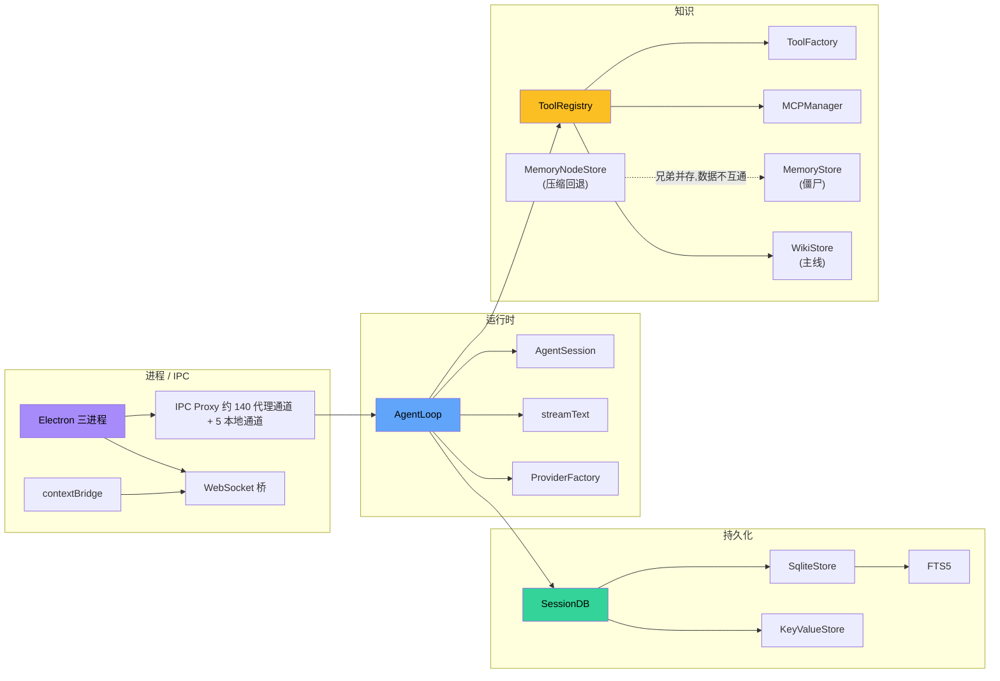
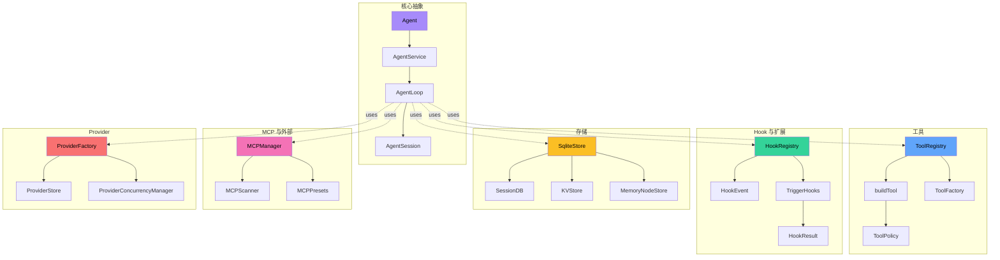

# 12 · 术语表

> 本文列出 Zero-Core 中使用的术语、缩写、内部命名。

## 0. 术语主题关联图

**6 大主题**：核心抽象 / 工具 / Hook / 存储 / MCP / Provider。AgentLoop 是 6 个主题的**唯一交汇点**。

## A

- **AI SDK**：Vercel AI SDK (`ai` 包)，统一多 LLM Provider 的流式接口。核心 API `streamText()`。
- **Agent**：一个独立配置的 AI 实体，包含 system prompt / model / provider / tool policy / workspace。存储在 `agents` 表。
- **AgentLoop**：单个会话的执行循环，驱动 `streamText()`，处理流式事件。`runtime/agent-loop.ts`。
- **AgentService**：服务层的多 Agent 生命周期管理。`server/agent-service.ts`。
- **AgentSession**：单个会话的内存状态（messages / tokens / pruning）。`runtime/session.ts`。
- **AgentTool**：把另一个 Agent 暴露为工具的能力。`runtime/tools/agent-tool.ts`。
- **ALL_TOOLS**：所有内置工具的字典。`runtime/tools/index.ts:62`。

## B

- **Backend**：后端子进程，承载 Express + WebSocket + SQLite + Agent 逻辑。
- **better-sqlite3**：Node.js 的同步 SQLite 驱动，被整个持久化层使用。
- **buildTool**：工具声明工厂，所有 21 个内置工具都通过它创建。`runtime/tools/tool-factory.ts`。
- **bm25**：FTS5 默认的排序算法，用于 MemoryNodeStore 检索。

## C

- **CIDR / cacheTtl**：cache 过期时间，常用 5 分钟（MCP tool cache）/ 1 小时（model registry）。
- **Checkpoint**：turn_state 表的执行检查点，由 durable-hooks.ts 维护。
- **CompressionEngine**：渐进式压缩引擎，L1 摘要 + L2 记忆提取。`runtime/compression-engine.ts`。
- **ConcurrencyQueue**：FIFO 信号量，每 Provider 一个实例。`runtime/concurrency-queue.ts`。
- **CONDITIONAL_TOOLS**：依赖 ToolExecutionContext 能力的工具（Agent / TaskStatus / TaskList / TaskStop / Wait）。
- **contextBridge**：Electron 在 preload 中安全暴露 API 到 renderer 的机制。
- **ContextManager**：token 估算 + 三种修剪策略。`core/context-manager.ts`。

## D

- **Database**：better-sqlite3 的 Database 实例。
- **db-migration**：启动期迁移，从 JSON 文件 + 列添加 → SQLite。`server/db-migration.ts`。
- **DEFAULT_ENABLED**：未配置时默认启用的 6 个工具（Shell / Read / Write / Edit / Grep / Glob）。
- **delegateTask**：阻塞模式委派子 Agent 的工具。
- **delegateTaskBackground**：非阻塞委派，返回 task_id。
- **device-context**：设备环境信息（OS / shell / path），注入 system prompt。

## E

- **EMBEDDING_PROVIDER**：KB 嵌入使用的 Provider（Ollama / OpenAI 兼容）。
- **ErrorClass**：8 类错误分类（timeout / rate_limit / auth / prompt_too_long / server_error / network / unknown）。
- **Elicitation**：hook 事件类型（"问用户"），当前未注册 handler。

## F

- **fetch-tools**：WebFetch 工具的实现。`runtime/mcp-tools/fetch-tools.ts`。
- **first-writer-wins**：⚠️ **旧叙事已废**。v0.7 文档用这个词描述 hook 触发语义,但源码核对(`hook-registry.ts:78-91`)实际是 **last-writer-wins merge + blocked 短路**:多个 handler 的同名字段**逐个 merge**(后写覆盖先写),任一 handler 返回 `{blocked: true}` 立即短路停止后续 handler。详见 [03 §3 hook 执行模型](./03-runtime-engine.md) 与 [02 §3.2](./02-module-structure.md)。保留本条仅为反向澄清,避免读者看到旧文档以为 hook 是"先到先得"。
- **fs-watcher**：当前**未实现**。应该监听 workspace 文件变化。
- **FTS5**：SQLite 全文搜索扩展，被 memory_nodes_fts 用。

## G

- **GlobalConfig**：用户的全局配置，存储在 `kv_store[global_config]`。
- **Guidelines**：注入 system prompt 的行为准则。
- **GIT_BASH_PATHS**：Windows 下 Git Bash 检测路径列表。

## H

- **Hook**：生命周期事件订阅机制，30 个事件点。
- **HookContext**：hook handler 接收的上下文（含 agentId / sessionId / timestamp）。
- **HookEventName**：30 个事件名的 TypeScript 联合类型。
- **HookHandler**：hook 处理函数签名 `(ctx) => HookResult | Promise<HookResult>`。
- **HookRegistry**：单例注册表，`core/hook-registry.ts`。
- **HookResult**：handler 返回值，void / blocked / forceContinue。

## I

- **IKVStore**：键值存储抽象接口。`core/kv-store-interface.ts`。
- **input-handler**：用户输入预处理，自定义 `/command` 扩展。`core/input-handler.ts`。
- **IPC channel**：Electron IPC 通道名称；大多数业务通道通过 `ipc-proxy` 桥接到 HTTP，少量窗口/对话框/登录态能力保留在 main 本地。
- **isEnabled**：工具启用判断函数，定义在 `runtime/tools/index.ts:154-165`。

## J

- **JSON Schema → Zod**：MCP 工具描述到 AI SDK inputSchema 的转换器。`runtime/mcp-tool.ts:66`。

## K

- **KB (Knowledge Base)**：本地文档导入与检索系统，由文件 → chunks → embedding → SQLite；当前默认 Agent 会话不会自动注入 KB RAG。
- **KbDB**：kb_chunks 表的存储层。`server/kb-db.ts`。
- **KeyValueStore**：通用 KV 存储，替换散落的 JSON 配置文件。`server/key-value-store.ts`。

## L

- **L1 摘要 / L2 记忆**：渐进式压缩的两阶段。L1 把旧 turn 压缩为简短摘要；L2 从摘要提取 memory nodes。
- **ListTools**：MCP 协议调用，获取服务器的工具列表。
- **log**：双 sink logger（console + file）。`core/logger.ts`。

## M

- **Main**：Electron 主进程（spawns Backend, hosts BrowserWindow, IPC proxy）。
- **MAX_RETRIES**：错误重试次数，默认 3。
- **MCP**：Model Context Protocol，外部工具接入协议。
- **MCPManager**：MCP 连接池 + 工具缓存。`server/mcp-manager.ts`。
- **MCPScanner**：扫描外部应用配置（Claude Desktop / Cursor / ...）。
- **MemoryRecall / MemoryNote**：已退役的旧记忆工具名；当前 `ALL_TOOLS` 不再注册，记忆操作走 `Wiki` 工具。
- **MemoryStore**：⚠️ **僵尸 store**(zombie)。`server/memory-store.ts`,持有 `memory_entities` / `memory_relations` 两张构造自建表(见 [05 §2.2](./05-persistence.md#22-业务实体表10-张存活--1-张已退役) 末"批 B 构造自建表全清单")。**构造时 eager new**(`session-db.ts:70`)+ v0.7 `memory.json` 一次性迁移(`db-migration.ts:586`)是**唯一写入路径**;**运行时零写入者** —— 唯一消费者 `runtime/mcp-tools/memory-tools.ts` 的 `memoryReadTool`/`memoryWriteTool` 自 v0.8 P2 §11.6 起从 `tools/index.ts` **取消注册**(`grep "memory-tools" src/runtime/tools/` 零命中),所以 `getMemoryStore()` 在生产环境永远不会被 Agent 工具调到。这是删除候选(清理顺序:删 `memory-tools.ts` → 删 `MemoryStore` 类 + 两表 + `memory.json` 迁移分支 + SessionDB getter)。**不要**把它当活跃系统,也不要与 MemoryNodeStore 混为一谈 —— 二者数据不互通、互不引用、互不依赖。详见 [06 §2.7](./06-knowledge-subsystems.md) "三套数据库知识系统的对比矩阵"。
- **MemoryNodeStore**：`server/memory-node-store.ts`,持有 `memory_nodes` / `memory_subjects` / `memory_edges` / `memory_nodes_fts`(FTS5) 四张构造自建表(`init()` 自建,不进 db-migration)。与 MemoryStore **是兄弟而非父子** —— 二者各自 eager new、各自 `init()`、表结构无任何关联。MemoryNodeStore **仍在运行时被调用**(`runtime/hooks/compression-hooks.ts:153` 在 wiki 写失败时回退写它 + `server/memory-node-router.ts` 暴露 `/api/memory-nodes` REST),所以是 legacy 但**活**;MemoryStore 是 legacy 且**僵尸**(构造但永不写)。两个 store 都**不进** db-migration.ts 的 `*_COLUMNS` 数组,改 schema 要去各自 `init()`。
- **MockLanguageModel**：测试用 mock LLM。`runtime/mock-language-model.ts`。
- **ModelRegistry**：模型元数据（context window / max tokens），OpenRouter + 本地正则回填。

## N

- **NetworkAdapter**：AI SDK 的网络适配（fetch / undici）。
- **nextThoughtNeeded**：SequentialThinking 工具的状态字段。

## O

- **OLLAMA_URL**：`http://localhost:11434`，Ollama 默认端点。
- **OPENROUTER_URL**：远程模型元数据查询。

## P

- **Persona**：角色定义（CommunicationStyle + PERSONA_TEMPLATES）。
- **Preload**：Electron 预加载脚本，contextBridge 暴露 `window.api`。
- **PretoolUse**：hook 事件，工具执行前触发（可阻断）。
- **ProcessStreamEvents**：AgentLoop 处理 streamText 输出事件的函数。
- **ProviderAdapter**：每 Provider 的兼容性适配（stripThinkingTags 等）。
- **ProviderConcurrencyManager**：每 Provider 一个 FIFO semaphore。
- **ProviderFactory**：根据配置创建 AI SDK LanguageModel 实例 + 缓存。
- **ProviderStore**：providers 表的 CRUD 包装。

## Q

- **Question / Elicitation**：向用户提问的 hook 事件。
- **Quick mode**：默认压缩策略（`auto`）。

## R

- **RAG**：Retrieval-Augmented Generation，由 KB 检索结果注入 LLM context。
- **RAG hooks**：PreLLMCall hook，把 KB 检索结果注入。
- **Recovery**：启动期扫描未完成 turn 的机制。`server/recovery.ts`。
- **Renderer**：Electron 渲染进程（React + Zustand）。
- **RENAMED_TOOLS**：旧 lowercase 工具名到 PascalCase 的映射，用于兼容。
- **requiresConfirmation**：tool meta 字段，标识需要用户确认（**未接通 UI**）。
- **ResolveModel**：把 providerName + modelId 解析为 AI SDK LanguageModel。
- **RetryStrategy**：3 次重试 + 指数退避。
- **RunState**：会话运行时状态（busy / streamingText / toolCalls）。

## S

- **SessionConfig**：单个会话的完整配置。`runtime/types.ts`。
- **SessionDB**：业务核心表（sessions / messages / turns / turn_state / tool_executions） + KV + Memory 持有的 DB 门面，当前约 850 行。
- **SessionLifecycleState**：状态机枚举（created / idle / queued / streaming / executing_tools / error / disposed）。
- **SessionManager**：会话生命周期状态管理 + 指标聚合 + TTL 清理。`server/session-manager.ts`。
- **SessionStoreInterface**：运行时对 DB 的抽象接口。
- **SSE**：Server-Sent Events，MCP transport 之一。
- **StreamEvent**：运行时事件契约（text_delta / thinking_delta / tool_start / tool_end / ...）。
- **subagent-delegator**：`SubagentDelegator` 类(`src/runtime/subagent-delegator.ts`),v0.8 当前的子 Agent 委派调度器,由 `AgentLoop` 在构造期实例化,被 `Agent` action 工具(`action="delegate"`)调用;持自己的 `TaskRegistry`,跑同步/后台子任务并触发 `SubagentStart`/`SubagentStop`/`TaskCreated`/`TaskCompleted` hook。
- **subagent-delegation**(历史):`createSubagentDelegation()` 闭包工厂(`src/runtime/subagent-delegation.ts`),v0.8 委派重构前 API,**死代码(零 importer)**,保留作历史参考,删除候选。不要与 `subagent-delegator` 混淆。

## T

- **TaskInfo**：后台任务信息（id / type / status / step / startedAt / completedAt / error）。
- **TaskRegistry**：后台任务表 + wake 回调。
- **TerminalAdapter**：CLI 模式 ANSI 渲染。
- **TextDeltaEvent / ThinkingDeltaEvent / ToolStartEvent / ToolEndEvent / MessageEndEvent / AgentEndEvent**：6 个核心流事件。
- **TodoWrite**：LLM 跟踪进度的工具。
- **ToolCategory**：runtime / task / web / memory / thinking / assistant / interaction / mcp / agent。
- **ToolConfigField**：用户可配置的字段（key / type / label / default / options）。
- **ToolDescriptor**：注册表里的工具元数据。
- **tool-factory**：buildTool 工厂 + 反射函数（getToolMeta / getToolConfigSchema / ...）。
- **ToolPolicy**：策略（autoApprove / blockedTools / allowedTools / toolCategories / executionMode / resultMaxTokens）。
- **ToolRateLimiter**：每工具并发 + 间隔门控（**已装载运行**）。
- **ToolRegistry**：工具目录 + 配置持久化。`core/tool-registry.ts`。
- **Turn**：一个完整的 user → assistant 交互单位。
- **TurnRecorder**：流式 block 累积 → turns 表 JSON。
- **TurnState**：执行检查点表。

## U

- **Undici**：Node.js 的 HTTP 客户端，被 ProxyAgent 使用。
- **updateTurnContent / upsertAssistantTurn**：turns 表的写入路径。

## V

- **VALID_TRANSITIONS**：会话状态机的合法转换。
- **Vite**：构建工具，electron-vite 整合。
- **Vitest**：单元测试框架。

## W

- **Wait**：事件驱动等待工具。
- **WebFetch**：抓取网页 + 转 Markdown + Cookie + 浏览器渲染。
- **WebSearch**：4 个搜索后端（DDG / SearXNG / SerpAPI / Brave）。
- **WindowApi**：preload 暴露给 renderer 的接口。
- **WorkspaceConfig**：当前工作区 + 默认 Model / Provider。
- **WS**：WebSocket，`/ws` 路径用于事件推送。

## Z

- **ZERO_CORE_DIR**：`~/.zero-core`（可被 `ZERO_CORE_DIR` 环境变量覆盖）。
- **Zod**：TypeScript 优先的 schema 验证库，用于工具 inputSchema + IPC 类型。
- **Zustand**：React 状态管理库，10 个 store。

- **Wiki Anchors**：当前 Agent 记忆与项目知识的实际注入机制，由 wiki-anchor-injection.ts 渲染到 system/context。
- **RAG hooks**：legacy optional KB 注入 hook；默认 Agent 会话未注入 getRagContext 时不生效。
